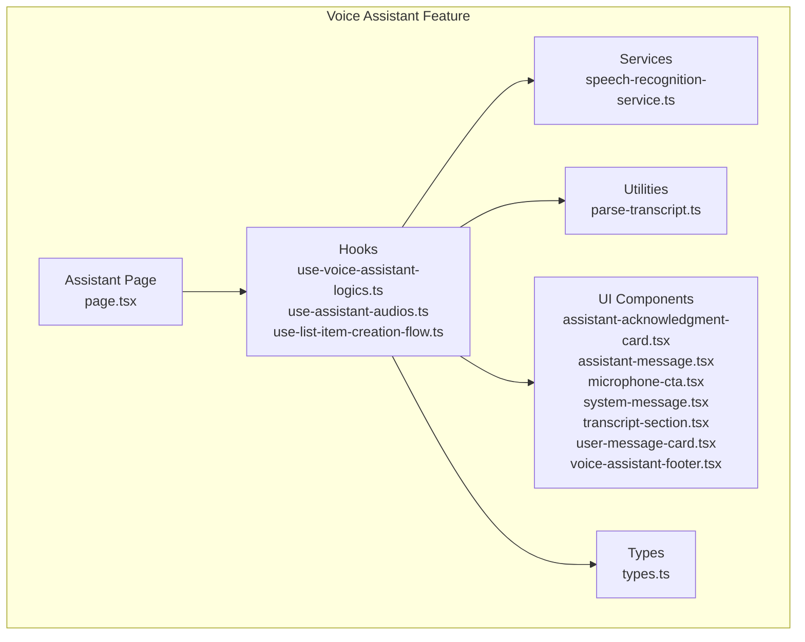
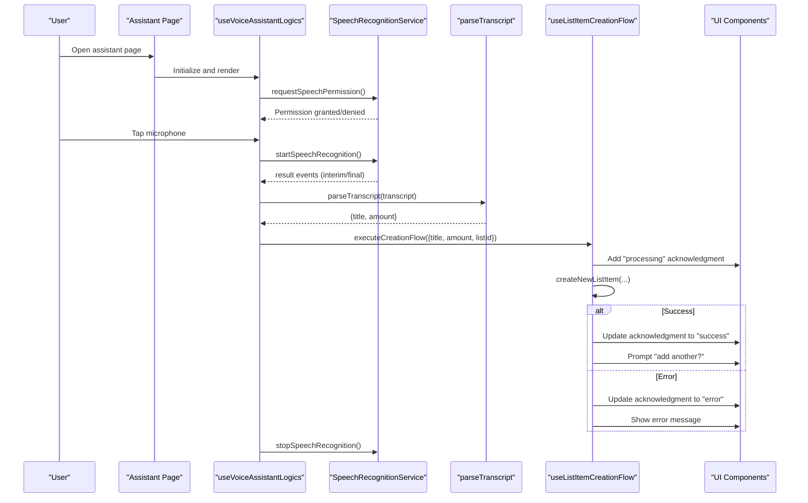
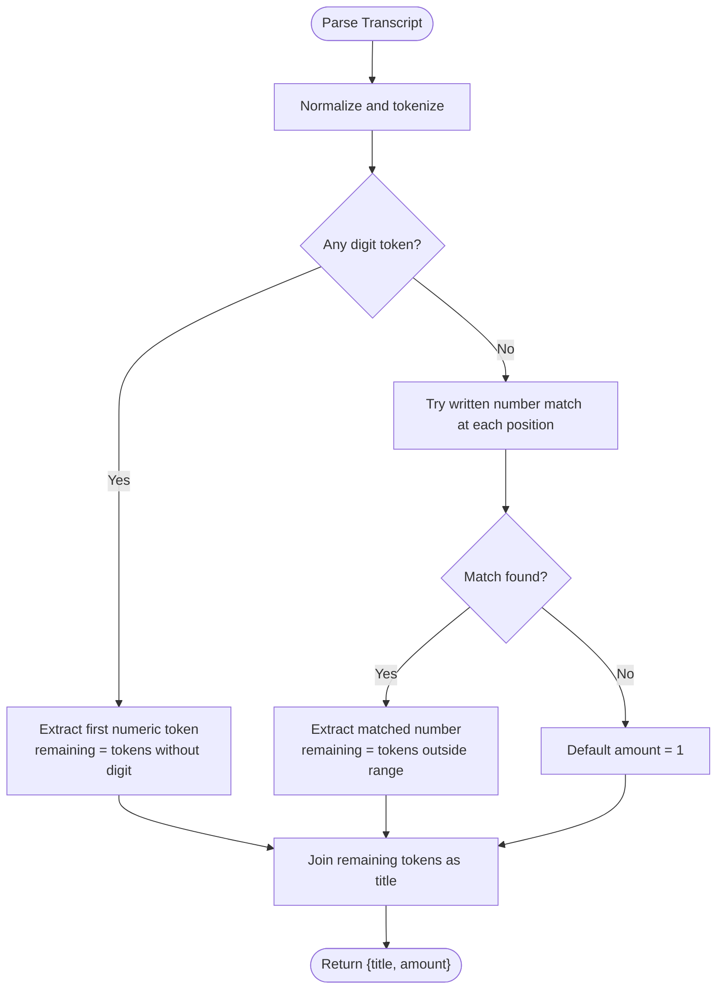
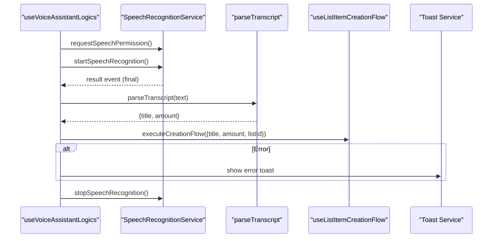
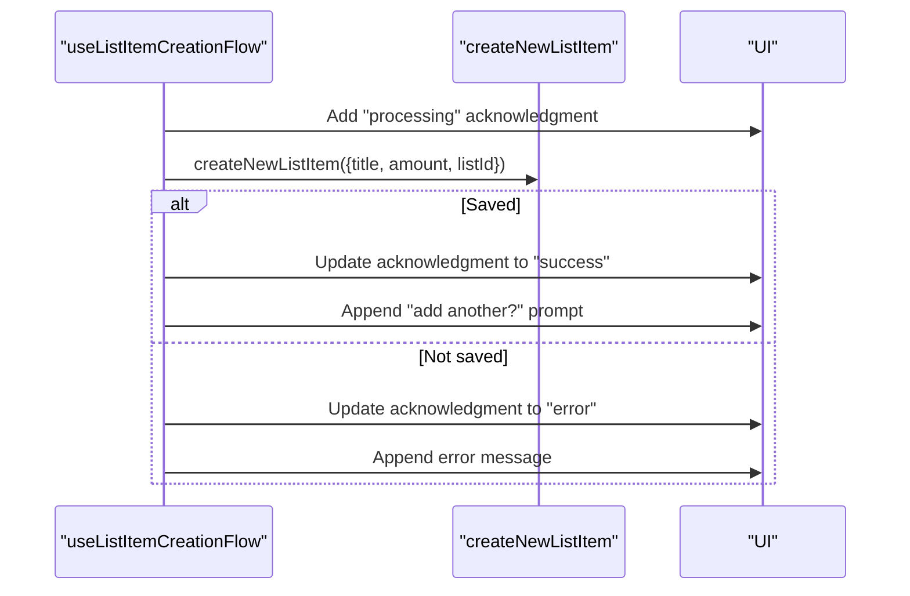
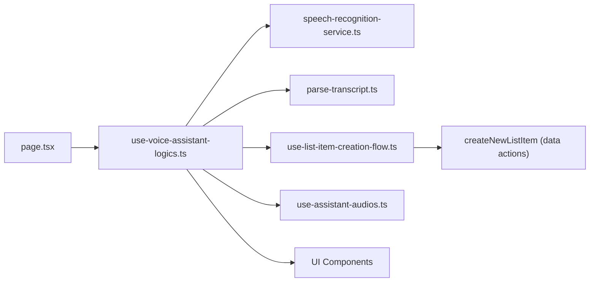

# Voice Integration for List Management

<cite>
**Referenced Files in This Document**
- [index.ts](file://src/features/voice-assistant/index.ts)
- [page.tsx](file://src/features/voice-assistant/page.tsx)
- [types.ts](file://src/features/voice-assistant/types.ts)
- [speech-recognition-service.ts](file://src/features/voice-assistant/services/speech-recognition-service.ts)
- [parse-transcript.ts](file://src/features/voice-assistant/utils/parse-transcript.ts)
- [use-voice-assistant-logics.ts](file://src/features/voice-assistant/hooks/use-voice-assistant-logics.ts)
- [use-assistant-audios.ts](file://src/features/voice-assistant/hooks/use-assistant-audios.ts)
- [use-list-item-creation-flow.ts](file://src/features/voice-assistant/hooks/use-list-item-creation-flow.ts)
- [assistant-acknowledgment-card.tsx](file://src/features/voice-assistant/components/assistant-acknowledgment-card.tsx)
- [assistant-message.tsx](file://src/features/voice-assistant/components/asistant-message.tsx)
- [microphone-cta.tsx](file://src/features/voice-assistant/components/microphone-cta.tsx)
- [system-message.tsx](file://src/features/voice-assistant/components/system-message.tsx)
- [transcript-section.tsx](file://src/features/voice-assistant/components/transcript-section.tsx)
- [user-message-card.tsx](file://src/features/voice-assistant/components/user-message-card.tsx)
- [voice-assistant-footer.tsx](file://src/features/voice-assistant/components/voice-assistant-footer.tsx)
</cite>

## Table of Contents
1. [Introduction](#introduction)
2. [Project Structure](#project-structure)
3. [Core Components](#core-components)
4. [Architecture Overview](#architecture-overview)
5. [Detailed Component Analysis](#detailed-component-analysis)
6. [Dependency Analysis](#dependency-analysis)
7. [Performance Considerations](#performance-considerations)
8. [Troubleshooting Guide](#troubleshooting-guide)
9. [Conclusion](#conclusion)
10. [Appendices](#appendices)

## Introduction
This document explains the voice integration system for list management operations. It covers how voice commands are captured, parsed, and transformed into actionable list items, including natural language processing for item names, quantities, and categories. It also documents the speech recognition service integration, audio feedback mechanisms, conversation flow management, microphone activation controls, voice prompt sequences, error handling for unrecognized commands, and the integration between the voice assistant and list management components with real-time updates and confirmation workflows.

## Project Structure
The voice assistant feature is organized into pages, hooks, services, utilities, and UI components. The main entry is the assistant page, which orchestrates speech recognition, parsing, and UI rendering. Supporting hooks manage audio queues, permissions, and the item creation flow. Services encapsulate speech recognition APIs and error translation. Utilities parse transcripts into structured item data.

**Diagram sources**
- [page.tsx:1-60](file://src/features/voice-assistant/page.tsx#L1-L60)
- [use-voice-assistant-logics.ts:1-213](file://src/features/voice-assistant/hooks/use-voice-assistant-logics.ts#L1-L213)
- [speech-recognition-service.ts:1-54](file://src/features/voice-assistant/services/speech-recognition-service.ts#L1-L54)
- [parse-transcript.ts:1-225](file://src/features/voice-assistant/utils/parse-transcript.ts#L1-L225)
- [types.ts:1-45](file://src/features/voice-assistant/types.ts#L1-L45)
- [assistant-acknowledgment-card.tsx:1-94](file://src/features/voice-assistant/components/assistant-acknowledgment-card.tsx#L1-L94)
- [assistant-message.tsx:1-19](file://src/features/voice-assistant/components/asistant-message.tsx#L1-L19)
- [microphone-cta.tsx:1-97](file://src/features/voice-assistant/components/microphone-cta.tsx#L1-L97)
- [system-message.tsx:1-11](file://src/features/voice-assistant/components/system-message.tsx#L1-L11)
- [transcript-section.tsx:1-21](file://src/features/voice-assistant/components/transcript-section.tsx#L1-L21)
- [user-message-card.tsx:1-12](file://src/features/voice-assistant/components/user-message-card.tsx#L1-L12)
- [voice-assistant-footer.tsx:1-75](file://src/features/voice-assistant/components/voice-assistant-footer.tsx#L1-L75)

**Section sources**
- [index.ts:1-6](file://src/features/voice-assistant/index.ts#L1-L6)
- [page.tsx:1-60](file://src/features/voice-assistant/page.tsx#L1-L60)

## Core Components
- Assistant Page: Renders the chat UI, manages navigation, and passes props to footer controls.
- Voice Assistant Logics Hook: Orchestrates speech recognition lifecycle, permission checks, transcript parsing, and flow execution.
- Speech Recognition Service: Wraps platform speech recognition APIs, handles permissions, starts/stops recognition, and translates errors.
- Transcript Parser: Converts Portuguese speech transcripts into structured item data (title, amount).
- Audio Queue and Assistant Audios Hook: Manages audio feedback for prompts, acknowledgments, success, and errors.
- List Item Creation Flow Hook: Executes item creation, updates acknowledgment statuses, and triggers follow-up prompts.
- UI Components: Render assistant messages, user messages, acknowledgment cards, microphone CTA, and footer controls.

**Section sources**
- [page.tsx:9-59](file://src/features/voice-assistant/page.tsx#L9-L59)
- [use-voice-assistant-logics.ts:19-212](file://src/features/voice-assistant/hooks/use-voice-assistant-logics.ts#L19-L212)
- [speech-recognition-service.ts:19-54](file://src/features/voice-assistant/services/speech-recognition-service.ts#L19-L54)
- [parse-transcript.ts:194-224](file://src/features/voice-assistant/utils/parse-transcript.ts#L194-L224)
- [use-assistant-audios.ts:3-36](file://src/features/voice-assistant/hooks/use-assistant-audios.ts#L3-L36)
- [use-list-item-creation-flow.ts:22-95](file://src/features/voice-assistant/hooks/use-list-item-creation-flow.ts#L22-L95)
- [assistant-acknowledgment-card.tsx:23-93](file://src/features/voice-assistant/components/assistant-acknowledgment-card.tsx#L23-L93)
- [assistant-message.tsx:6-18](file://src/features/voice-assistant/components/asistant-message.tsx#L6-L18)
- [microphone-cta.tsx:24-96](file://src/features/voice-assistant/components/microphone-cta.tsx#L24-L96)
- [system-message.tsx:4-10](file://src/features/voice-assistant/components/system-message.tsx#L4-L10)
- [transcript-section.tsx:10-20](file://src/features/voice-assistant/components/transcript-section.tsx#L10-L20)
- [user-message-card.tsx:5-11](file://src/features/voice-assistant/components/user-message-card.tsx#L5-L11)
- [voice-assistant-footer.tsx:34-74](file://src/features/voice-assistant/components/voice-assistant-footer.tsx#L34-L74)

## Architecture Overview
The voice assistant integrates speech recognition, NLP parsing, and list item creation with a conversational UI and audio feedback loop.

**Diagram sources**
- [page.tsx:9-59](file://src/features/voice-assistant/page.tsx#L9-L59)
- [use-voice-assistant-logics.ts:69-111](file://src/features/voice-assistant/hooks/use-voice-assistant-logics.ts#L69-L111)
- [speech-recognition-service.ts:19-33](file://src/features/voice-assistant/services/speech-recognition-service.ts#L19-L33)
- [parse-transcript.ts:194-224](file://src/features/voice-assistant/utils/parse-transcript.ts#L194-L224)
- [use-list-item-creation-flow.ts:27-90](file://src/features/voice-assistant/hooks/use-list-item-creation-flow.ts#L27-L90)
- [assistant-acknowledgment-card.tsx:23-93](file://src/features/voice-assistant/components/assistant-acknowledgment-card.tsx#L23-L93)

## Detailed Component Analysis

### Speech Recognition Service
- Responsibilities:
  - Request and check speech recognition permissions.
  - Start/stop speech recognition with configurable options (language, interim results, continuous).
  - Extract final transcripts from result events.
  - Translate platform-specific error codes/messages into user-friendly strings.
- Key behaviors:
  - Default language is configured for Brazilian Portuguese.
  - Interim results are enabled for responsive UI updates.
  - Error messages are mapped to localized, actionable feedback.

**Section sources**
- [speech-recognition-service.ts:4-8](file://src/features/voice-assistant/services/speech-recognition-service.ts#L4-L8)
- [speech-recognition-service.ts:19-22](file://src/features/voice-assistant/services/speech-recognition-service.ts#L19-L22)
- [speech-recognition-service.ts:24-33](file://src/features/voice-assistant/services/speech-recognition-service.ts#L24-L33)
- [speech-recognition-service.ts:35-38](file://src/features/voice-assistant/services/speech-recognition-service.ts#L35-L38)
- [speech-recognition-service.ts:40-53](file://src/features/voice-assistant/services/speech-recognition-service.ts#L40-L53)

### Transcript Parsing Utility
- Purpose: Convert spoken Portuguese text into structured item data.
- Processing logic:
  - Tokenizes input and normalizes to lowercase.
  - Attempts to extract a numeric quantity (digits or written numbers).
  - Supports compound numbers (e.g., "vinte e um", "mil e duzentos").
  - Defaults to amount 1 if none found.
  - Everything else becomes the item title.
- Complexity:
  - Time: O(n) for tokenization and scanning.
  - Space: O(n) for token array.

**Diagram sources**
- [parse-transcript.ts:194-224](file://src/features/voice-assistant/utils/parse-transcript.ts#L194-L224)
- [parse-transcript.ts:100-176](file://src/features/voice-assistant/utils/parse-transcript.ts#L100-L176)

**Section sources**
- [parse-transcript.ts:194-224](file://src/features/voice-assistant/utils/parse-transcript.ts#L194-L224)
- [parse-transcript.ts:100-176](file://src/features/voice-assistant/utils/parse-transcript.ts#L100-L176)

### Voice Assistant Logics Hook
- Responsibilities:
  - Manage recognition state, error messages, and direct/manual mode.
  - Initialize welcome message and play audio cue.
  - Subscribe to speech recognition events (start, end, result, error).
  - Parse transcripts and trigger item creation flow.
  - Handle permission requests and user-initiated start/stop.
  - Auto/manual mode cycling with debounced restarts.
- Conversation flow:
  - On first load, plays a courtesy greeting and sets initial assistant message.
  - On result events, stops recognition, appends user message, parses transcript, and executes creation flow.
  - On error, displays user-friendly message and shows toast.

**Diagram sources**
- [use-voice-assistant-logics.ts:54-111](file://src/features/voice-assistant/hooks/use-voice-assistant-logics.ts#L54-L111)
- [speech-recognition-service.ts:19-33](file://src/features/voice-assistant/services/speech-recognition-service.ts#L19-L33)
- [parse-transcript.ts:194-224](file://src/features/voice-assistant/utils/parse-transcript.ts#L194-L224)
- [use-list-item-creation-flow.ts:27-90](file://src/features/voice-assistant/hooks/use-list-item-creation-flow.ts#L27-L90)

**Section sources**
- [use-voice-assistant-logics.ts:19-212](file://src/features/voice-assistant/hooks/use-voice-assistant-logics.ts#L19-L212)

### List Item Creation Flow Hook
- Responsibilities:
  - Append an acknowledgment message with "processing" status.
  - Attempt to create the list item via backend action.
  - Update acknowledgment to "success" or "error" accordingly.
  - Play appropriate audio cues and append follow-up prompts.
- Real-time updates:
  - Acknowledgment card reflects current status with animated icons.
  - Success triggers a follow-up prompt to add another item.
  - Error triggers an error notification and instructs reactivation.

**Diagram sources**
- [use-list-item-creation-flow.ts:27-90](file://src/features/voice-assistant/hooks/use-list-item-creation-flow.ts#L27-L90)

**Section sources**
- [use-list-item-creation-flow.ts:22-95](file://src/features/voice-assistant/hooks/use-list-item-creation-flow.ts#L22-L95)

### Audio Feedback and Microphone Controls
- Audio queue and players:
  - Courtesy greeting, first item prompt, subsequent item prompt, adding item, success, error, and error notification sounds.
  - Audio playback is queued to avoid overlapping sounds.
- Microphone CTA:
  - Animated ring effect indicates listening/auto modes.
  - Accessibility labels differentiate start/stop actions.
- Footer controls:
  - Manual/Auto mode toggles.
  - Dynamic footer text based on state.

**Section sources**
- [use-assistant-audios.ts:3-36](file://src/features/voice-assistant/hooks/use-assistant-audios.ts#L3-L36)
- [microphone-cta.tsx:24-96](file://src/features/voice-assistant/components/microphone-cta.tsx#L24-L96)
- [voice-assistant-footer.tsx:34-74](file://src/features/voice-assistant/components/voice-assistant-footer.tsx#L34-L74)

### UI Message Rendering
- Assistant message bubble for general instructions.
- User message card for transcribed input.
- Acknowledgment card with animated status indicators and item details.
- System message bubble for error notifications.

**Section sources**
- [assistant-message.tsx:6-18](file://src/features/voice-assistant/components/asistant-message.tsx#L6-L18)
- [user-message-card.tsx:5-11](file://src/features/voice-assistant/components/user-message-card.tsx#L5-L11)
- [assistant-acknowledgment-card.tsx:23-93](file://src/features/voice-assistant/components/assistant-acknowledgment-card.tsx#L23-L93)
- [system-message.tsx:4-10](file://src/features/voice-assistant/components/system-message.tsx#L4-L10)
- [transcript-section.tsx:10-20](file://src/features/voice-assistant/components/transcript-section.tsx#L10-L20)

## Dependency Analysis
The voice assistant feature exhibits clear separation of concerns:
- Page depends on hooks for state and logic.
- Hooks depend on services for speech recognition and on utilities for parsing.
- Hooks orchestrate UI components and audio players.
- Creation flow depends on data actions for persistence.

**Diagram sources**
- [page.tsx:9-59](file://src/features/voice-assistant/page.tsx#L9-L59)
- [use-voice-assistant-logics.ts:19-48](file://src/features/voice-assistant/hooks/use-voice-assistant-logics.ts#L19-L48)
- [speech-recognition-service.ts:19-54](file://src/features/voice-assistant/services/speech-recognition-service.ts#L19-L54)
- [parse-transcript.ts:194-224](file://src/features/voice-assistant/utils/parse-transcript.ts#L194-L224)
- [use-list-item-creation-flow.ts:27-90](file://src/features/voice-assistant/hooks/use-list-item-creation-flow.ts#L27-L90)
- [use-assistant-audios.ts:3-36](file://src/features/voice-assistant/hooks/use-assistant-audios.ts#L3-L36)

**Section sources**
- [use-voice-assistant-logics.ts:19-48](file://src/features/voice-assistant/hooks/use-voice-assistant-logics.ts#L19-L48)

## Performance Considerations
- Event-driven updates: Listening state and UI updates occur only on speech events, minimizing unnecessary renders.
- Debouncing auto-mode restarts: A ref-based mechanism prevents race conditions during rapid mode switches.
- Efficient parsing: Single-pass scanning for numeric tokens and greedy written-number matching keeps parsing linear in input length.
- Audio queuing: Ensures audio cues do not overlap, improving clarity and perceived responsiveness.

[No sources needed since this section provides general guidance]

## Troubleshooting Guide
Common issues and resolutions:
- Permission denied:
  - Symptom: Immediate error message and warning toast.
  - Resolution: Guide user to enable microphone permissions in device settings and retry.
- No speech detected:
  - Symptom: Error message indicating silence and suggestion to retry.
  - Resolution: Ensure quiet environment and speak clearly toward the device.
- Network failure during recognition:
  - Symptom: Network-related error message.
  - Resolution: Retry after reconnecting to the internet.
- Unrecognized commands:
  - Symptom: No item added; acknowledgment remains processing.
  - Resolution: Rephrase using quantities and item names; ensure clear pronunciation.
- Auto mode glitches:
  - Symptom: Unexpected restarts or missed prompts.
  - Resolution: Switch to manual mode temporarily; confirm state and retry.

**Section sources**
- [speech-recognition-service.ts:10-17](file://src/features/voice-assistant/services/speech-recognition-service.ts#L10-L17)
- [speech-recognition-service.ts:40-53](file://src/features/voice-assistant/services/speech-recognition-service.ts#L40-L53)
- [use-voice-assistant-logics.ts:113-139](file://src/features/voice-assistant/hooks/use-voice-assistant-logics.ts#L113-L139)
- [use-voice-assistant-logics.ts:101-111](file://src/features/voice-assistant/hooks/use-voice-assistant-logics.ts#L101-L111)

## Conclusion
The voice integration for list management provides a robust, conversational experience. It combines reliable speech recognition, accurate Portuguese transcript parsing, and a responsive UI with audio feedback. The modular design enables easy maintenance and extension, while safeguards address common error scenarios and support both manual and automatic interaction modes.

[No sources needed since this section summarizes without analyzing specific files]

## Appendices

### Voice Command Examples
- Adding items:
  - "Dois arroz"
  - "10 massa de tomate"
  - "Pão de forma"
- Checking items off lists:
  - Not supported in current implementation; use list UI for check/uncheck operations.
- Creating new lists:
  - Not supported in current implementation; use list creation UI for new lists.

[No sources needed since this section provides general guidance]