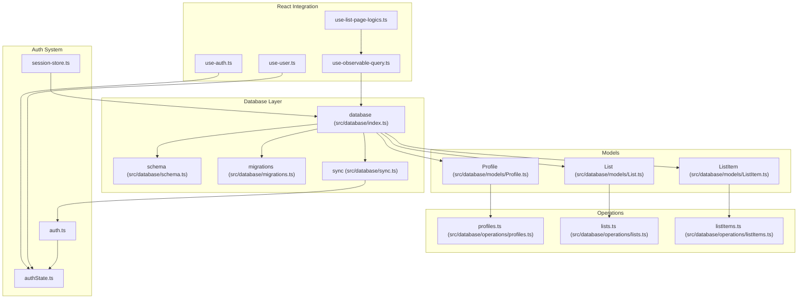
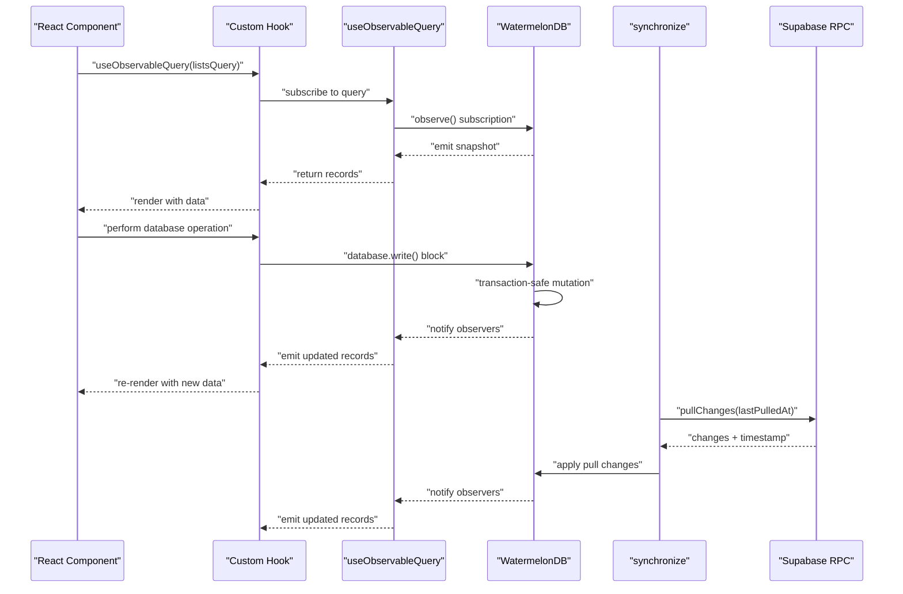
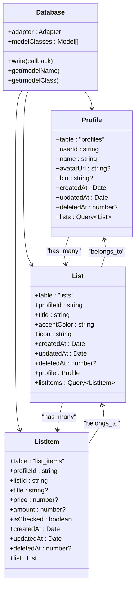
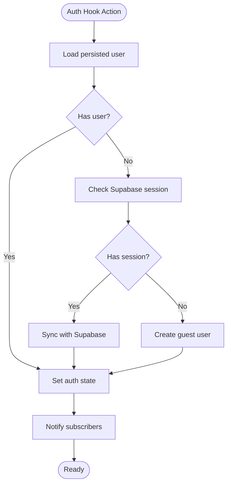
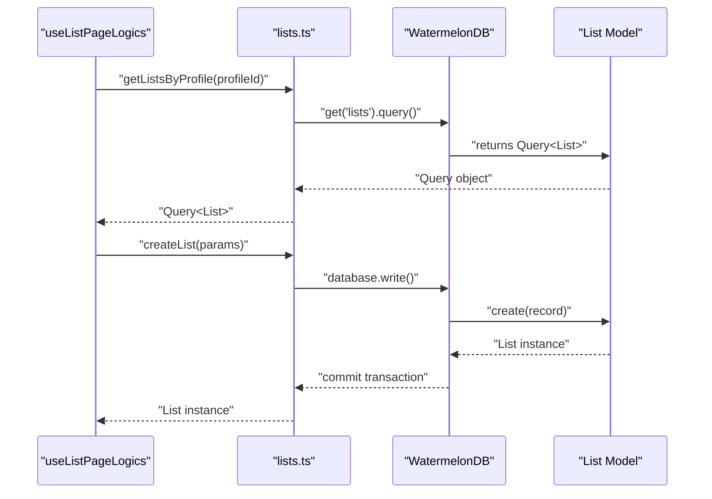
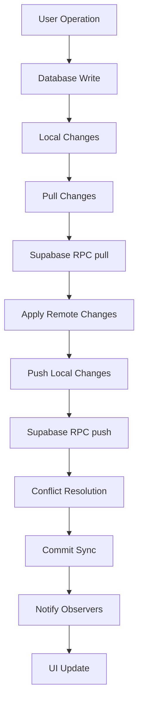
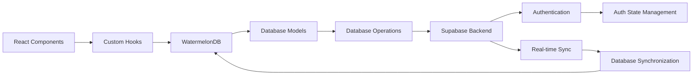

# LegendAppState Core System

<cite>
**Referenced Files in This Document**
- [index.ts](file://src/database/index.ts)
- [schema.ts](file://src/database/schema.ts)
- [migrations.ts](file://src/database/migrations.ts)
- [sync.ts](file://src/database/sync.ts)
- [Profile.ts](file://src/database/models/Profile.ts)
- [List.ts](file://src/database/models/List.ts)
- [ListItem.ts](file://src/database/models/ListItem.ts)
- [profiles.ts](file://src/database/operations/profiles.ts)
- [lists.ts](file://src/database/operations/lists.ts)
- [listItems.ts](file://src/database/operations/listItems.ts)
- [use-observable-query.ts](file://src/hooks/use-observable-query.ts)
- [use-auth.ts](file://src/hooks/use-auth.ts)
- [use-user.ts](file://src/hooks/use-user.ts)
- [authState.ts](file://src/features/auth/authState.ts)
- [auth.ts](file://src/data/actions/auth.ts)
- [session-store.ts](file://src/data/session-store.ts)
- [use-list-page-logics.ts](file://src/features/lists/hooks/use-list-page-logics.ts)
- [RULES.md](file://__docs__/RULES.md)
</cite>

## Update Summary
**Changes Made**
- Complete replacement of LegendAppState with WatermelonDB integration
- Replaced reactive observables with WatermelonDB model-based architecture
- Updated synchronization approach from Supabase synced transport to WatermelonDB sync
- Replaced state management patterns with database-driven operations
- Updated hooks to use WatermelonDB queries and model observables

## Table of Contents
1. [Introduction](#introduction)
2. [Project Structure](#project-structure)
3. [Core Components](#core-components)
4. [Architecture Overview](#architecture-overview)
5. [Detailed Component Analysis](#detailed-component-analysis)
6. [Dependency Analysis](#dependency-analysis)
7. [Performance Considerations](#performance-considerations)
8. [Troubleshooting Guide](#troubleshooting-guide)
9. [Conclusion](#conclusion)
10. [Appendices](#appendices)

## Introduction
This document explains the LegendAppState core system powered by WatermelonDB integration in PowerLists. The system has been completely replaced from the previous reactive state architecture to a database-first approach using WatermelonDB's model-driven patterns. It covers the WatermelonDB architecture, model relationships, database operations, synchronization approach, and integration with React components through custom hooks.

## Project Structure
The state system is now built around WatermelonDB models and database operations. Each domain (authentication, lists, list items, profiles) is represented by database models with associated operations and React hooks for UI integration. The database module configures WatermelonDB adapters for different platforms and enables real-time synchronization with Supabase.

**Diagram sources**
- [index.ts:12-32](file://src/database/index.ts#L12-L32)
- [schema.ts:3-45](file://src/database/schema.ts#L3-L45)
- [sync.ts:15-34](file://src/database/sync.ts#L15-L34)
- [Profile.ts:6-20](file://src/database/models/Profile.ts#L6-L20)
- [List.ts:7-22](file://src/database/models/List.ts#L7-L22)
- [ListItem.ts:6-19](file://src/database/models/ListItem.ts#L6-L19)
- [profiles.ts:6-62](file://src/database/operations/profiles.ts#L6-L62)
- [lists.ts:6-65](file://src/database/operations/lists.ts#L6-L65)
- [listItems.ts:6-79](file://src/database/operations/listItems.ts#L6-L79)
- [use-observable-query.ts:4-13](file://src/hooks/use-observable-query.ts#L4-L13)
- [use-auth.ts:24-47](file://src/hooks/use-auth.ts#L24-L47)
- [use-user.ts:8-40](file://src/hooks/use-user.ts#L8-L40)
- [authState.ts:23-67](file://src/features/auth/authState.ts#L23-L67)
- [auth.ts:14-108](file://src/data/actions/auth.ts#L14-L108)
- [session-store.ts:7-25](file://src/data/session-store.ts#L7-L25)

**Section sources**
- [index.ts:1-33](file://src/database/index.ts#L1-L33)
- [schema.ts:1-46](file://src/database/schema.ts#L1-L46)
- [migrations.ts:1-17](file://src/database/migrations.ts#L1-L17)
- [sync.ts:1-56](file://src/database/sync.ts#L1-L56)
- [Profile.ts:1-21](file://src/database/models/Profile.ts#L1-L21)
- [List.ts:1-23](file://src/database/models/List.ts#L1-L23)
- [ListItem.ts:1-20](file://src/database/models/ListItem.ts#L1-L20)
- [profiles.ts:1-62](file://src/database/operations/profiles.ts#L1-L62)
- [lists.ts:1-65](file://src/database/operations/lists.ts#L1-L65)
- [listItems.ts:1-79](file://src/database/operations/listItems.ts#L1-L79)
- [use-observable-query.ts:1-13](file://src/hooks/use-observable-query.ts#L1-L13)
- [use-auth.ts:1-47](file://src/hooks/use-auth.ts#L1-L47)
- [use-user.ts:1-40](file://src/hooks/use-user.ts#L1-L40)
- [authState.ts:1-67](file://src/features/auth/authState.ts#L1-L67)
- [auth.ts:1-108](file://src/data/actions/auth.ts#L1-L108)
- [session-store.ts:1-25](file://src/data/session-store.ts#L1-L25)

## Core Components
- **WatermelonDB Models**: Typed database models (Profile, List, ListItem) with decorators defining table schemas and relationships
- **Database Configuration**: Platform-specific adapters (SQLite for mobile, LokiJS for web) with schema and migration support
- **Database Operations**: CRUD operations for each model with transaction-safe write operations
- **Real-time Synchronization**: WatermelonDB sync with Supabase using custom RPC functions for bidirectional data sync
- **React Integration**: Custom hooks for database queries and model observables with automatic UI updates

Key implementation patterns:
- **Model Definition**: Using decorators (@text, @field, @date, @children, @relation) to define table schemas
- **Database Queries**: Using Query builder (Q.where, Q.eq) for filtering and fetching data
- **Write Operations**: Using database.write() blocks for transaction-safe mutations
- **Observables**: Using useObservableQuery hook to subscribe to database changes
- **Synchronization**: Using synchronize() function with pull/push handlers for real-time sync

**Section sources**
- [Profile.ts:6-20](file://src/database/models/Profile.ts#L6-L20)
- [List.ts:7-22](file://src/database/models/List.ts#L7-L22)
- [ListItem.ts:6-19](file://src/database/models/ListItem.ts#L6-L19)
- [index.ts:12-32](file://src/database/index.ts#L12-L32)
- [lists.ts:27-36](file://src/database/operations/lists.ts#L27-L36)
- [use-observable-query.ts:4-13](file://src/hooks/use-observable-query.ts#L4-L13)
- [sync.ts:15-34](file://src/database/sync.ts#L15-L34)

## Architecture Overview
The LegendAppState architecture now follows WatermelonDB's database-first approach with three main pillars:
- **Database Models**: Typed models with decorators defining schema and relationships
- **Database Operations**: Transaction-safe CRUD operations with query builders
- **Real-time Synchronization**: WatermelonDB sync with Supabase for bidirectional data synchronization

**Diagram sources**
- [use-observable-query.ts:7-10](file://src/hooks/use-observable-query.ts#L7-L10)
- [lists.ts:27-36](file://src/database/operations/lists.ts#L27-L36)
- [sync.ts:17-24](file://src/database/sync.ts#L17-L24)

## Detailed Component Analysis

### Database Configuration and Models
- **Platform Adapters**: SQLiteAdapter for mobile devices with JSI enabled, LokiJSAdapter for web with IndexedDB support
- **Model Schemas**: Typed decorators define column types, indexes, and relationships between models
- **Associations**: Models define has_many and belongs_to relationships for complex queries

**Diagram sources**
- [index.ts:12-32](file://src/database/index.ts#L12-L32)
- [Profile.ts:6-20](file://src/database/models/Profile.ts#L6-L20)
- [List.ts:7-22](file://src/database/models/List.ts#L7-L22)
- [ListItem.ts:6-19](file://src/database/models/ListItem.ts#L6-L19)

**Section sources**
- [index.ts:12-32](file://src/database/index.ts#L12-L32)
- [schema.ts:3-45](file://src/database/schema.ts#L3-L45)
- [Profile.ts:6-20](file://src/database/models/Profile.ts#L6-L20)
- [List.ts:7-22](file://src/database/models/List.ts#L7-L22)
- [ListItem.ts:6-19](file://src/database/models/ListItem.ts#L6-L19)

### Authentication State (authState.ts)
- **Purpose**: Manages user authentication state with secure storage and subscription pattern
- **Persistence**: Uses SecureStore for encrypted user data storage
- **Real-time Updates**: Subscriptions notify components when auth state changes
- **Integration**: Works alongside WatermelonDB for user-scoped data operations

**Diagram sources**
- [authState.ts:44-54](file://src/features/auth/authState.ts#L44-L54)
- [auth.ts:14-28](file://src/data/actions/auth.ts#L14-L28)

**Section sources**
- [authState.ts:19-67](file://src/features/auth/authState.ts#L19-L67)
- [auth.ts:14-108](file://src/data/actions/auth.ts#L14-L108)

### Lists Operations (lists.ts)
- **Purpose**: Provides CRUD operations for shopping lists with transaction safety
- **Query Builder**: Uses Q.where for filtering by profile_id and deleted_at status
- **Transaction Safety**: All operations wrapped in database.write() blocks
- **Relationships**: Supports nested queries through model associations

**Diagram sources**
- [lists.ts:6-10](file://src/database/operations/lists.ts#L6-L10)
- [lists.ts:27-36](file://src/database/operations/lists.ts#L27-L36)

**Section sources**
- [lists.ts:6-65](file://src/database/operations/lists.ts#L6-L65)
- [use-list-page-logics.ts:22-24](file://src/features/lists/hooks/use-list-page-logics.ts#L22-L24)

### List Items Operations (listItems.ts)
- **Purpose**: Handles individual list item operations with comprehensive CRUD support
- **Toggle Operations**: Specialized toggleCheckListItem for quick state changes
- **Partial Updates**: Supports selective field updates with validation
- **Price Calculations**: Integrates with utility functions for total calculations

**Section sources**
- [listItems.ts:6-79](file://src/database/operations/listItems.ts#L6-L79)
- [use-list-page-logics.ts:35-43](file://src/features/lists/hooks/use-list-page-logics.ts#L35-L43)

### Profiles Operations (profiles.ts)
- **Purpose**: Manages user profile data with soft deletion support
- **User Mapping**: Maps Supabase user_id to local profile records
- **CRUD Operations**: Full lifecycle management with transaction safety
- **Association Support**: Enables profile-scoped queries across related models

**Section sources**
- [profiles.ts:6-62](file://src/database/operations/profiles.ts#L6-L62)

### Database Synchronization (sync.ts)
- **Purpose**: Implements bidirectional synchronization between WatermelonDB and Supabase
- **Custom RPC**: Uses pull/push RPC functions for change tracking
- **Real-time Events**: Subscribes to Supabase postgres_changes channel
- **Conflict Resolution**: Handles concurrent modifications with WatermelonDB sync

**Diagram sources**
- [sync.ts:15-34](file://src/database/sync.ts#L15-L34)
- [sync.ts:36-49](file://src/database/sync.ts#L36-L49)

**Section sources**
- [sync.ts:1-56](file://src/database/sync.ts#L1-L56)

### React Integration (use-observable-query.ts)
- **Purpose**: Provides React hooks for subscribing to database queries
- **Automatic Updates**: Subscribes to query.observe() and updates component state
- **Cleanup**: Properly unsubscribes from database changes on component unmount
- **Type Safety**: Generic typing ensures type-safe database operations

**Section sources**
- [use-observable-query.ts:1-13](file://src/hooks/use-observable-query.ts#L1-L13)

## Dependency Analysis
LegendAppState now depends on:
- **WatermelonDB**: Core database framework with platform adapters
- **Supabase**: Backend-as-a-Service for authentication and real-time synchronization
- **React Hooks**: Custom hooks for database integration and state management
- **Secure Storage**: Expo SecureStore for encrypted user data persistence

**Diagram sources**
- [use-observable-query.ts:4-13](file://src/hooks/use-observable-query.ts#L4-L13)
- [authState.ts:23-67](file://src/features/auth/authState.ts#L23-L67)
- [sync.ts:15-34](file://src/database/sync.ts#L15-L34)

**Section sources**
- [index.ts:12-32](file://src/database/index.ts#L12-L32)
- [authState.ts:19-67](file://src/features/auth/authState.ts#L19-L67)
- [sync.ts:15-34](file://src/database/sync.ts#L15-L34)

## Performance Considerations
- **Query Optimization**: Use indexed columns (profile_id, list_id) for faster filtering
- **Batch Operations**: Group related operations within database.write() blocks
- **Lazy Loading**: Use model associations to load related data on-demand
- **Memory Management**: Proper cleanup of database subscriptions in useEffect
- **Offline-First**: Leverage WatermelonDB's local-first architecture for responsive UI
- **Real-time Filtering**: Use server-side filtering with Supabase for large datasets

## Troubleshooting Guide
Common issues and remedies:
- **Database Not Initialized**: Ensure database is initialized before use and adapters are properly configured
- **Query Subscription Issues**: Verify useObservableQuery receives proper Query objects and subscriptions are cleaned up
- **Sync Conflicts**: Monitor sync logs for conflict resolution and handle concurrent modifications
- **Platform Differences**: Test SQLite vs LokiJS behavior differences between mobile and web
- **Model Relationships**: Ensure associations are properly defined and indexed for optimal query performance
- **Transaction Errors**: Wrap all write operations in database.write() blocks to prevent partial updates

**Section sources**
- [index.ts:24-27](file://src/database/index.ts#L24-L27)
- [use-observable-query.ts:7-10](file://src/hooks/use-observable-query.ts#L7-L10)
- [sync.ts:36-49](file://src/database/sync.ts#L36-L49)

## Conclusion
LegendAppState has evolved from a reactive state management system to a robust WatermelonDB-based architecture. The new system provides better performance, offline-first capabilities, and more reliable data synchronization. By leveraging typed models, transaction-safe operations, and real-time synchronization, the system delivers a scalable foundation for PowerLists with improved developer experience and user experience.

## Appendices

### Practical Examples Index
- **Database Configuration**: See [index.ts:12-32](file://src/database/index.ts#L12-L32)
- **Model Definition**: See [Profile.ts:6-20](file://src/database/models/Profile.ts#L6-L20)
- **Query Operations**: See [lists.ts:6-10](file://src/database/operations/lists.ts#L6-L10)
- **Write Operations**: See [lists.ts:27-36](file://src/database/operations/lists.ts#L27-L36)
- **Observable Queries**: See [use-observable-query.ts:4-13](file://src/hooks/use-observable-query.ts#L4-L13)
- **Authentication State**: See [authState.ts:23-67](file://src/features/auth/authState.ts#L23-L67)
- **Synchronization**: See [sync.ts:15-34](file://src/database/sync.ts#L15-L34)

**Section sources**
- [index.ts:12-32](file://src/database/index.ts#L12-L32)
- [Profile.ts:6-20](file://src/database/models/Profile.ts#L6-L20)
- [lists.ts:6-10](file://src/database/operations/lists.ts#L6-L10)
- [lists.ts:27-36](file://src/database/operations/lists.ts#L27-L36)
- [use-observable-query.ts:4-13](file://src/hooks/use-observable-query.ts#L4-L13)
- [authState.ts:23-67](file://src/features/auth/authState.ts#L23-L67)
- [sync.ts:15-34](file://src/database/sync.ts#L15-L34)