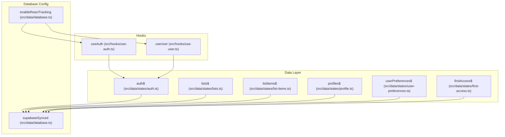
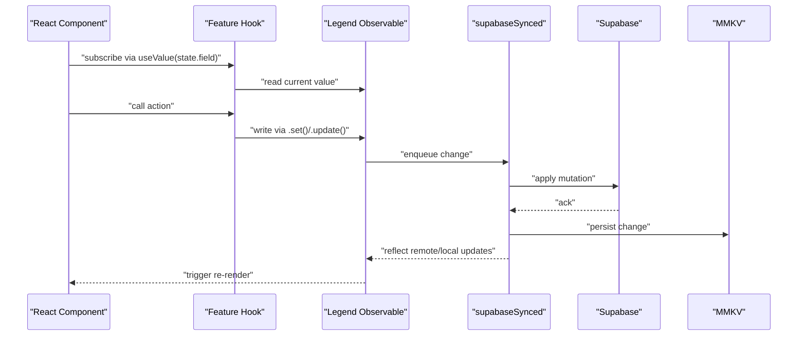
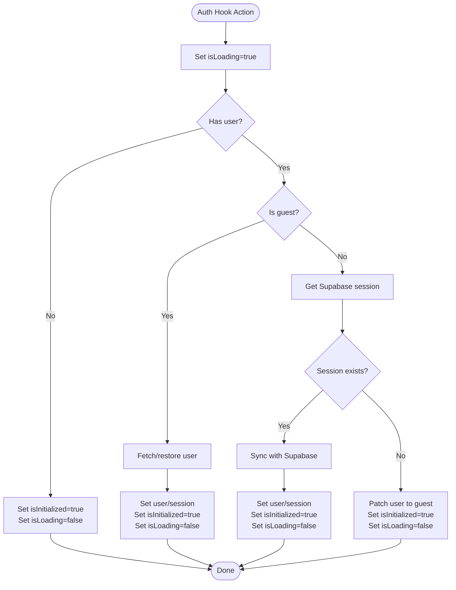
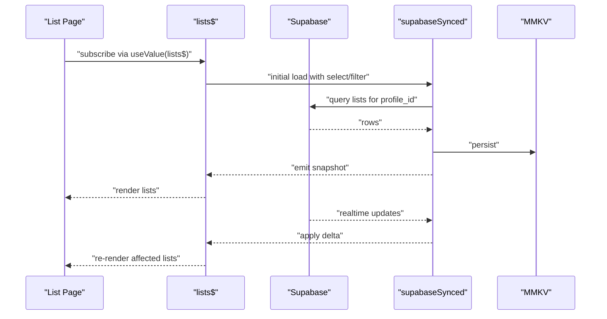
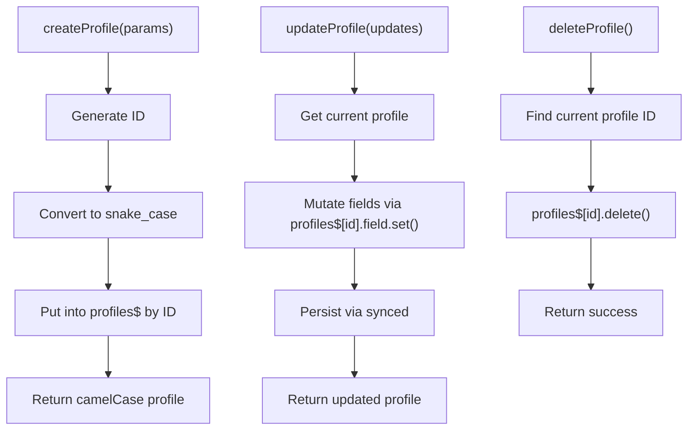
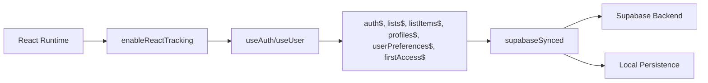

# LegendAppState Core System

<cite>
**Referenced Files in This Document**
- [auth.ts](file://src/data/states/auth.ts)
- [lists.ts](file://src/data/states/lists.ts)
- [list-items.ts](file://src/data/states/list-items.ts)
- [profile.ts](file://src/data/states/profile.ts)
- [user-preferences.ts](file://src/data/states/user-preferences.ts)
- [first-access.ts](file://src/data/states/first-access.ts)
- [database.ts](file://src/data/database.ts)
- [use-auth.ts](file://src/hooks/use-auth.ts)
- [use-user.ts](file://src/hooks/use-user.ts)
- [RULES.md](file://__docs__/RULES.md)
- [new-screen.md](file://.github/agents/new-screen.md)
</cite>

## Table of Contents
1. [Introduction](#introduction)
2. [Project Structure](#project-structure)
3. [Core Components](#core-components)
4. [Architecture Overview](#architecture-overview)
5. [Detailed Component Analysis](#detailed-component-analysis)
6. [Dependency Analysis](#dependency-analysis)
7. [Performance Considerations](#performance-considerations)
8. [Troubleshooting Guide](#troubleshooting-guide)
9. [Conclusion](#conclusion)
10. [Appendices](#appendices)

## Introduction
This document explains the LegendAppState core system powering reactive state in PowerLists. It covers the reactive state architecture, observer pattern implementation, automatic UI updates, state configuration, tracking setup, and integration with React components. It also documents initialization, observable patterns, performance optimizations, practical examples, validation, and debugging strategies for reactive state management.

## Project Structure
The state system is organized around observable stores defined under the data layer. Each domain (authentication, lists, list items, profiles, user preferences, first access) exposes a single observable root for global state. The database module configures Legend’s synced transport for Supabase and persistence, and enables React tracking to connect state changes to component re-renders.



**Diagram sources**
- [auth.ts:22-33](file://src/data/states/auth.ts#L22-L33)
- [lists.ts:5-26](file://src/data/states/lists.ts#L5-L26)
- [list-items.ts:5-23](file://src/data/states/list-items.ts#L5-L23)
- [profile.ts:10-19](file://src/data/states/profile.ts#L10-L19)
- [user-preferences.ts:12-25](file://src/data/states/user-preferences.ts#L12-L25)
- [first-access.ts:7-16](file://src/data/states/first-access.ts#L7-L16)
- [database.ts:9-29](file://src/data/database.ts#L9-L29)
- [use-auth.ts:19-26](file://src/hooks/use-auth.ts#L19-L28)
- [use-user.ts:8-12](file://src/hooks/use-user.ts#L8-L12)

**Section sources**
- [auth.ts:1-34](file://src/data/states/auth.ts#L1-L34)
- [lists.ts:1-27](file://src/data/states/lists.ts#L1-L27)
- [list-items.ts:1-24](file://src/data/states/list-items.ts#L1-L24)
- [profile.ts:1-194](file://src/data/states/profile.ts#L1-L194)
- [user-preferences.ts:1-28](file://src/data/states/user-preferences.ts#L1-L28)
- [first-access.ts:1-17](file://src/data/states/first-access.ts#L1-L17)
- [database.ts:1-36](file://src/data/database.ts#L1-L36)
- [use-auth.ts:1-261](file://src/hooks/use-auth.ts#L1-L261)
- [use-user.ts:1-85](file://src/hooks/use-user.ts#L1-L85)
- [RULES.md:42-77](file://__docs__/RULES.md#L42-L77)
- [new-screen.md:145-491](file://.github/agents/new-screen.md#L145-L491)

## Core Components
- Global observables: Each domain defines a root observable (e.g., auth$, lists$, listItems$, profiles$, userPreferences$, firstAccess$). These are the single sources of truth for their respective domains.
- Synced transport: The database module configures supabaseSynced to enable automatic bidirectional synchronization with Supabase and persistence with MMKV.
- React tracking: enableReactTracking ensures that components subscribed via useValue or observer automatically re-render on state changes.
- Hooks: Feature-specific hooks (e.g., useAuth, useUser) expose typed APIs to read/write state and orchestrate side effects.

Key implementation patterns:
- State declaration: observable(...) or observable(supabaseSynced({...})).
- Subscriptions: useValue(state.field) in components.
- Writes: state.field.set(...) or nested set/update patterns.
- Persistence: synced({ persist: { name, plugin, retrySync } }) for offline-first behavior.

**Section sources**
- [auth.ts:22-33](file://src/data/states/auth.ts#L22-L33)
- [lists.ts:5-26](file://src/data/states/lists.ts#L5-L26)
- [list-items.ts:5-23](file://src/data/states/list-items.ts#L5-L23)
- [profile.ts:10-19](file://src/data/states/profile.ts#L10-L19)
- [user-preferences.ts:12-25](file://src/data/states/user-preferences.ts#L12-L25)
- [first-access.ts:7-16](file://src/data/states/first-access.ts#L7-L16)
- [database.ts:9-29](file://src/data/database.ts#L9-L29)
- [use-auth.ts:19-26](file://src/hooks/use-auth.ts#L19-L28)
- [use-user.ts:8-12](file://src/hooks/use-user.ts#L8-L12)
- [RULES.md:42-77](file://__docs__/RULES.md#L42-L77)

## Architecture Overview
The LegendAppState architecture integrates three pillars:
- Reactive state: Observables emit changes when fields mutate.
- Transport layer: supabaseSynced coordinates reads/writes with Supabase and persists data locally.
- React integration: enableReactTracking wires state changes to component reactivity.



**Diagram sources**
- [database.ts:9-29](file://src/data/database.ts#L9-L29)
- [use-auth.ts:29-74](file://src/hooks/use-auth.ts#L29-L74)
- [auth.ts:22-33](file://src/data/states/auth.ts#L22-L33)

## Detailed Component Analysis

### Authentication State (auth$)
- Purpose: Holds user, session, initialization, and loading flags.
- Persistence: user field is persisted via synced with MMKV.
- Initialization flow: Components read isInitialized and isLoading via useValue; hooks set these flags during async operations.



**Diagram sources**
- [use-auth.ts:29-74](file://src/hooks/use-auth.ts#L29-L74)
- [auth.ts:22-33](file://src/data/states/auth.ts#L22-L33)

**Section sources**
- [auth.ts:8-33](file://src/data/states/auth.ts#L8-L33)
- [use-auth.ts:19-74](file://src/hooks/use-auth.ts#L19-L74)

### Lists State (lists$)
- Purpose: Realtime, persisted map of lists scoped to the current user.
- Sync configuration: Uses supabaseSynced with select/filter, actions, persistence, and realtime filters derived from getCurrentUserId.
- Access pattern: Components subscribe to lists$ and read nested fields (e.g., list items).



**Diagram sources**
- [lists.ts:5-26](file://src/data/states/lists.ts#L5-L26)
- [database.ts:31-35](file://src/data/database.ts#L31-L35)

**Section sources**
- [lists.ts:1-27](file://src/data/states/lists.ts#L1-L27)
- [database.ts:13-29](file://src/data/database.ts#L13-L29)

### List Items State (listItems$)
- Purpose: Realtime, persisted map of list items scoped to the current user.
- Sync configuration: Similar to lists$ but tailored for list_items collection.

**Section sources**
- [list-items.ts:1-24](file://src/data/states/list-items.ts#L1-L24)
- [database.ts:13-29](file://src/data/database.ts#L13-L29)

### Profiles State (profiles$) and CRUD Utilities
- Purpose: Manages the current user’s profile with automatic sync and persistence.
- Utilities: getProfile, createProfile, updateProfile, deleteProfile encapsulate observable mutations and conversion between camelCase and snake_case.
- Persistence: profiles$ is persisted with retrySync enabled.



**Diagram sources**
- [profile.ts:61-103](file://src/data/states/profile.ts#L61-L103)
- [profile.ts:121-159](file://src/data/states/profile.ts#L121-L159)
- [profile.ts:171-186](file://src/data/states/profile.ts#L171-L186)

**Section sources**
- [profile.ts:10-19](file://src/data/states/profile.ts#L10-L19)
- [profile.ts:33-48](file://src/data/states/profile.ts#L33-L48)
- [profile.ts:61-103](file://src/data/states/profile.ts#L61-L103)
- [profile.ts:121-159](file://src/data/states/profile.ts#L121-L159)
- [profile.ts:171-186](file://src/data/states/profile.ts#L171-L186)

### User Preferences State (userPreferences$)
- Purpose: Stores theme, color scheme, and background color with persisted synced state.
- Usage: Components can subscribe to preferences and update them via set.

**Section sources**
- [user-preferences.ts:6-27](file://src/data/states/user-preferences.ts#L6-L27)

### First Access State (firstAccess$)
- Purpose: Tracks whether the user has completed first access, persisted via synced with MMKV.
- Usage: Used to drive onboarding flows.

**Section sources**
- [first-access.ts:5-16](file://src/data/states/first-access.ts#L5-L16)

### Database Configuration (supabaseSynced and enableReactTracking)
- Purpose: Centralizes Legend App sync configuration for Supabase, including persistence, merge mode, generated IDs, and retry policies.
- React tracking: enableReactTracking warns when state reads are used without proper tracking, ensuring reliable reactivity.

```mermaid
classDiagram
class SupabaseSynced {
+configureSynced(plugin, options)
+generateId()
+mode : "merge"
+as : "Map"
+changesSince : "last-sync"
+fieldCreatedAt : "created_at"
+fieldUpdatedAt : "updated_at"
+fieldDeleted : "deleted"
+retry : { infinite : true }
}
class EnableReactTracking {
+warnMissingUse : true
}
SupabaseSynced <.. EnableReactTracking : "configured together"
```

**Diagram sources**
- [database.ts:13-29](file://src/data/database.ts#L13-L29)
- [database.ts:9-11](file://src/data/database.ts#L9-L11)

**Section sources**
- [database.ts:1-36](file://src/data/database.ts#L1-L36)

### Hooks Integration (useAuth, useUser)
- Purpose: Provide typed, reactive accessors to auth state and user operations.
- Pattern: Subscribe via useValue, then call state setters or perform async actions that update observables.

**Section sources**
- [use-auth.ts:19-261](file://src/hooks/use-auth.ts#L19-L261)
- [use-user.ts:8-85](file://src/hooks/use-user.ts#L8-L85)

## Dependency Analysis
LegendAppState depends on:
- Legend App observables and synced transport for reactive state and persistence.
- Supabase for backend synchronization and real-time events.
- React tracking to propagate state changes to components.



**Diagram sources**
- [database.ts:9-29](file://src/data/database.ts#L9-L29)
- [use-auth.ts:19-26](file://src/hooks/use-auth.ts#L19-L26)
- [use-user.ts:8-12](file://src/hooks/use-user.ts#L8-L12)

**Section sources**
- [database.ts:13-29](file://src/data/database.ts#L13-L29)
- [use-auth.ts:19-26](file://src/hooks/use-auth.ts#L19-L26)
- [use-user.ts:8-12](file://src/hooks/use-user.ts#L8-L12)

## Performance Considerations
- Minimize writes: Batch updates using nested set operations to reduce re-renders.
- Scope subscriptions: Subscribe only to the fields needed to avoid unnecessary re-renders.
- Retry and merge: supabaseSynced uses merge mode and retry policies to handle network flakiness efficiently.
- Persistence: Persisted synced state reduces redundant fetches and supports offline-first workflows.
- Realtime filtering: Use server-side filters (e.g., profile_id) to limit dataset size and improve responsiveness.

[No sources needed since this section provides general guidance]

## Troubleshooting Guide
Common issues and remedies:
- Missing useValue warnings: enableReactTracking warns when state reads occur outside tracked contexts. Wrap reads in observer or use useValue to resolve.
- No re-render after mutation: Ensure the component subscribes to the exact observable path being mutated.
- Offline sync delays: Verify persisted sync is enabled and retry policies are configured.
- Realtime not updating: Confirm realtime filter matches current user and backend events are firing.
- Type mismatches: Remember Supabase uses snake_case while TypeScript uses camelCase; use conversion helpers when reading/writing raw objects.

**Section sources**
- [database.ts:9-11](file://src/data/database.ts#L9-L11)
- [profile.ts:33-48](file://src/data/states/profile.ts#L33-L48)
- [profile.ts:121-159](file://src/data/states/profile.ts#L121-L159)
- [new-screen.md:455-461](file://.github/agents/new-screen.md#L455-L461)

## Conclusion
LegendAppState provides a robust, reactive foundation for PowerLists. By centralizing state in observable roots, configuring synced transport for Supabase and persistence, and enabling React tracking, the system delivers automatic UI updates, offline-first behavior, and scalable data flows. Following the documented patterns ensures predictable state management, maintainable components, and efficient performance.

[No sources needed since this section summarizes without analyzing specific files]

## Appendices

### Practical Examples Index
- Declaring a new synced observable: See the pattern in [lists.ts:5-26](file://src/data/states/lists.ts#L5-L26).
- Subscribing in a component: See [use-auth.ts:20-22](file://src/hooks/use-auth.ts#L20-L22).
- Writing to state: See [use-auth.ts:31](file://src/hooks/use-auth.ts#L31) and [use-auth.ts:53](file://src/hooks/use-auth.ts#L53).
- CRUD with profiles: See [profile.ts:61-103](file://src/data/states/profile.ts#L61-L103), [profile.ts:121-159](file://src/data/states/profile.ts#L121-L159), [profile.ts:171-186](file://src/data/states/profile.ts#L171-L186).
- Realtime filtering: See [lists.ts:17-21](file://src/data/states/lists.ts#L17-L21) and [list-items.ts:17-21](file://src/data/states/list-items.ts#L17-L21).
- Persistence keys: See [auth.ts:25-28](file://src/data/states/auth.ts#L25-L28), [user-preferences.ts:19-23](file://src/data/states/user-preferences.ts#L19-L23), [first-access.ts:10-14](file://src/data/states/first-access.ts#L10-L14).

**Section sources**
- [lists.ts:5-26](file://src/data/states/lists.ts#L5-L26)
- [use-auth.ts:20-22](file://src/hooks/use-auth.ts#L20-L22)
- [use-auth.ts:31](file://src/hooks/use-auth.ts#L31)
- [use-auth.ts:53](file://src/hooks/use-auth.ts#L53)
- [profile.ts:61-103](file://src/data/states/profile.ts#L61-L103)
- [profile.ts:121-159](file://src/data/states/profile.ts#L121-L159)
- [profile.ts:171-186](file://src/data/states/profile.ts#L171-L186)
- [list-items.ts:17-21](file://src/data/states/list-items.ts#L17-L21)
- [auth.ts:25-28](file://src/data/states/auth.ts#L25-L28)
- [user-preferences.ts:19-23](file://src/data/states/user-preferences.ts#L19-L23)
- [first-access.ts:10-14](file://src/data/states/first-access.ts#L10-L14)