# Local Persistence with MMKV

<cite>
**Referenced Files in This Document**
- [storage.ts](file://src/data/storage.ts)
- [database.ts](file://src/data/database.ts)
- [session-store.ts](file://src/data/session-store.ts)
- [sync.ts](file://src/services/sync.ts)
- [auth.ts](file://src/data/states/auth.ts)
- [lists.ts](file://src/data/states/lists.ts)
- [list-items.ts](file://src/data/states/list-items.ts)
- [profile.ts](file://src/data/states/profile.ts)
- [lists actions](file://src/data/actions/lists.ts)
- [list-items actions](file://src/data/actions/list-items.ts)
- [supabase client](file://src/lib/supabase/supabase.ts)
- [RULES.md](file://__docs__/RULES.md)
</cite>

## Table of Contents
1. [Introduction](#introduction)
2. [Project Structure](#project-structure)
3. [Core Components](#core-components)
4. [Architecture Overview](#architecture-overview)
5. [Detailed Component Analysis](#detailed-component-analysis)
6. [Dependency Analysis](#dependency-analysis)
7. [Performance Considerations](#performance-considerations)
8. [Troubleshooting Guide](#troubleshooting-guide)
9. [Conclusion](#conclusion)

## Introduction
This document explains the MMKV-based local persistence implementation powering offline-first data management in the application. It covers the ObservablePersistMMKV plugin configuration, offline-first architecture, data hydration strategies, session storage management, local caching, conflict resolution between local and cloud data, persistence configuration, data serialization, and performance optimizations. It also includes examples of local data operations, sync triggers, and offline functionality implementation.

## Project Structure
The persistence stack is organized around:
- A dedicated MMKV wrapper for low-level storage operations and debugging
- LegendApp State stores configured with Supabase sync and MMKV persistence
- A Supabase client configured to use MMKV for auth session persistence
- Services orchestrating migration and sync behaviors

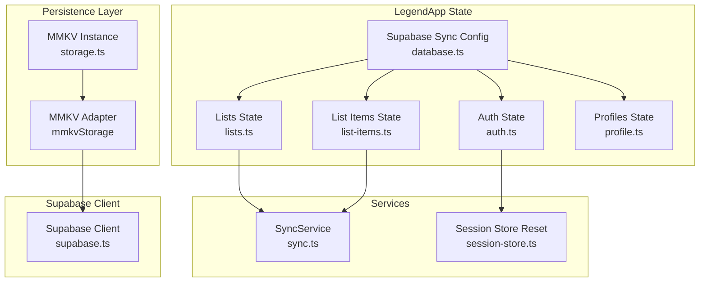

**Diagram sources**
- [storage.ts:1-74](file://src/data/storage.ts#L1-L74)
- [database.ts:1-36](file://src/data/database.ts#L1-L36)
- [auth.ts:1-34](file://src/data/states/auth.ts#L1-L34)
- [lists.ts:1-27](file://src/data/states/lists.ts#L1-L27)
- [list-items.ts:1-24](file://src/data/states/list-items.ts#L1-L24)
- [profile.ts:1-194](file://src/data/states/profile.ts#L1-L194)
- [sync.ts:1-203](file://src/services/sync.ts#L1-L203)
- [session-store.ts:1-24](file://src/data/session-store.ts#L1-L24)
- [supabase client:1-28](file://src/lib/supabase/supabase.ts#L1-L28)

**Section sources**
- [storage.ts:1-74](file://src/data/storage.ts#L1-L74)
- [database.ts:1-36](file://src/data/database.ts#L1-L36)
- [auth.ts:1-34](file://src/data/states/auth.ts#L1-L34)
- [lists.ts:1-27](file://src/data/states/lists.ts#L1-L27)
- [list-items.ts:1-24](file://src/data/states/list-items.ts#L1-L24)
- [profile.ts:1-194](file://src/data/states/profile.ts#L1-L194)
- [sync.ts:1-203](file://src/services/sync.ts#L1-L203)
- [session-store.ts:1-24](file://src/data/session-store.ts#L1-L24)
- [supabase client:1-28](file://src/lib/supabase/supabase.ts#L1-L28)
- [RULES.md:42-77](file://__docs__/RULES.md#L42-L77)

## Core Components
- MMKV storage wrapper: Provides encryption, key management, and a minimal adapter for external consumers.
- Supabase sync configuration: Centralized LegendApp sync setup enabling offline-first with merge mode and metadata-based change tracking.
- LegendApp state stores: Typed observable stores for lists, list items, profiles, and auth, each configured with MMKV persistence and Supabase sync.
- Session store manager: Resets local stores when the user changes to avoid cross-session data leakage.
- Sync service: Handles guest-to-user data migration and user-facing prompts for data synchronization.

**Section sources**
- [storage.ts:1-74](file://src/data/storage.ts#L1-L74)
- [database.ts:1-36](file://src/data/database.ts#L1-L36)
- [auth.ts:1-34](file://src/data/states/auth.ts#L1-L34)
- [lists.ts:1-27](file://src/data/states/lists.ts#L1-L27)
- [list-items.ts:1-24](file://src/data/states/list-items.ts#L1-L24)
- [profile.ts:1-194](file://src/data/states/profile.ts#L1-L194)
- [session-store.ts:1-24](file://src/data/session-store.ts#L1-L24)
- [sync.ts:1-203](file://src/services/sync.ts#L1-L203)

## Architecture Overview
The system implements an offline-first architecture:
- Local persistence: LegendApp stores persist to MMKV via ObservablePersistMMKV.
- Cloud sync: Supabase sync manages real-time and background synchronization with merge semantics.
- Conflict resolution: Merge mode and metadata fields (created_at, updated_at, deleted) drive deterministic reconciliation.
- Hydration: Stores hydrate from MMKV on startup; Supabase sync fetches remote changes afterward.
- Session isolation: Stores reset when the user changes to prevent cross-session contamination.

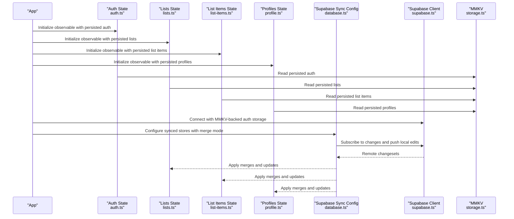

**Diagram sources**
- [auth.ts:1-34](file://src/data/states/auth.ts#L1-L34)
- [lists.ts:1-27](file://src/data/states/lists.ts#L1-L27)
- [list-items.ts:1-24](file://src/data/states/list-items.ts#L1-L24)
- [profile.ts:1-194](file://src/data/states/profile.ts#L1-L194)
- [database.ts:1-36](file://src/data/database.ts#L1-L36)
- [supabase client:1-28](file://src/lib/supabase/supabase.ts#L1-L28)
- [storage.ts:1-74](file://src/data/storage.ts#L1-L74)

## Detailed Component Analysis

### MMKV Storage Wrapper
- Initializes a single MMKV instance with optional encryption key from environment variables.
- Exposes convenience APIs for clearing, key enumeration, selective deletions, and debugging.
- Provides a minimal adapter compatible with external consumers (e.g., Expo Router).

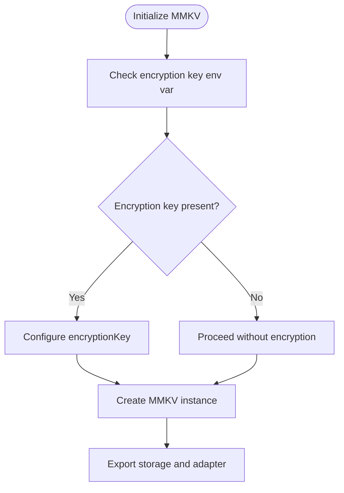

**Diagram sources**
- [storage.ts:10-23](file://src/data/storage.ts#L10-L23)

**Section sources**
- [storage.ts:1-74](file://src/data/storage.ts#L1-L74)

### Supabase Sync Configuration and Offline-First Behavior
- Centralized sync configuration enables:
  - Plugin: ObservablePersistMMKV for local persistence
  - Mode: merge for deterministic reconciliation
  - Metadata fields: created_at, updated_at, deleted for conflict resolution
  - Retry policy: infinite retries for robustness
  - Change tracking: last-sync boundary for incremental sync
- Realtime filters scoped to current user via computed filters in state stores.

```mermaid
classDiagram
class SupabaseSyncConfig {
+plugin : ObservablePersistMMKV
+mode : "merge"
+as : "Map"
+changesSince : "last-sync"
+fieldCreatedAt : "created_at"
+fieldUpdatedAt : "updated_at"
+fieldDeleted : "deleted"
+retry : { infinite : true }
}
class ListsState {
+collection : "lists"
+filter : "profile_id=eq.<userId>"
+persist : { name : "lists", retrySync : true }
+realtime : { filter }
}
class ListItemsState {
+collection : "list_items"
+filter : "profile_id=eq.<userId>"
+persist : { name : "list_items" }
+realtime : { filter }
}
class ProfilesState {
+collection : "profiles"
+filter : "id=eq.<userId>"
+persist : { name : "profiles", retrySync : true }
}
SupabaseSyncConfig --> ListsState : "configures"
SupabaseSyncConfig --> ListItemsState : "configures"
SupabaseSyncConfig --> ProfilesState : "configures"
```

**Diagram sources**
- [database.ts:13-29](file://src/data/database.ts#L13-L29)
- [lists.ts:5-26](file://src/data/states/lists.ts#L5-L26)
- [list-items.ts:5-23](file://src/data/states/list-items.ts#L5-L23)
- [profile.ts:10-20](file://src/data/states/profile.ts#L10-L20)

**Section sources**
- [database.ts:1-36](file://src/data/database.ts#L1-L36)
- [lists.ts:1-27](file://src/data/states/lists.ts#L1-L27)
- [list-items.ts:1-24](file://src/data/states/list-items.ts#L1-L24)
- [profile.ts:1-194](file://src/data/states/profile.ts#L1-L194)

### Auth State and Session Storage Management
- Auth state persists under a named key using ObservablePersistMMKV.
- Session store manager watches for user changes and resets local stores to prevent cross-session data leakage.
- Supabase client uses MMKV adapter for auth session persistence to keep tokens and session data secure and available offline.

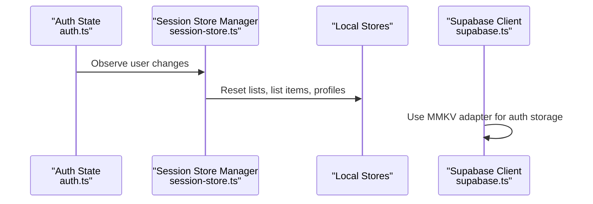

**Diagram sources**
- [auth.ts:22-33](file://src/data/states/auth.ts#L22-L33)
- [session-store.ts:10-23](file://src/data/session-store.ts#L10-L23)
- [supabase client:9-28](file://src/lib/supabase/supabase.ts#L9-L28)

**Section sources**
- [auth.ts:1-34](file://src/data/states/auth.ts#L1-L34)
- [session-store.ts:1-24](file://src/data/session-store.ts#L1-L24)
- [supabase client:1-28](file://src/lib/supabase/supabase.ts#L1-L28)

### Data Hydration Strategies
- Hydration occurs automatically when LegendApp observable stores initialize, reading persisted values from MMKV.
- Supabase sync runs after hydration to fetch remote changes and reconcile differences using merge mode and metadata fields.
- Realtime subscriptions ensure immediate updates for the current user’s scope.

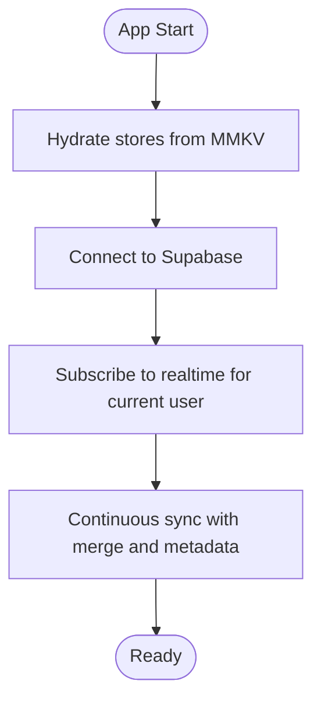

**Diagram sources**
- [database.ts:13-29](file://src/data/database.ts#L13-L29)
- [lists.ts:17-21](file://src/data/states/lists.ts#L17-L21)
- [list-items.ts:17-21](file://src/data/states/list-items.ts#L17-L21)
- [profile.ts:16-18](file://src/data/states/profile.ts#L16-L18)

**Section sources**
- [database.ts:1-36](file://src/data/database.ts#L1-L36)
- [lists.ts:1-27](file://src/data/states/lists.ts#L1-L27)
- [list-items.ts:1-24](file://src/data/states/list-items.ts#L1-L24)
- [profile.ts:1-194](file://src/data/states/profile.ts#L1-L194)

### Conflict Resolution Between Local and Cloud Data
- Merge mode ensures local and remote changes are combined deterministically.
- Metadata fields:
  - created_at: Establishes baseline timestamps
  - updated_at: Drives last-writer-wins within merge boundaries
  - deleted: Supports tombstoning for soft-deleted records
- Retry configuration with infinite retries minimizes transient conflicts.

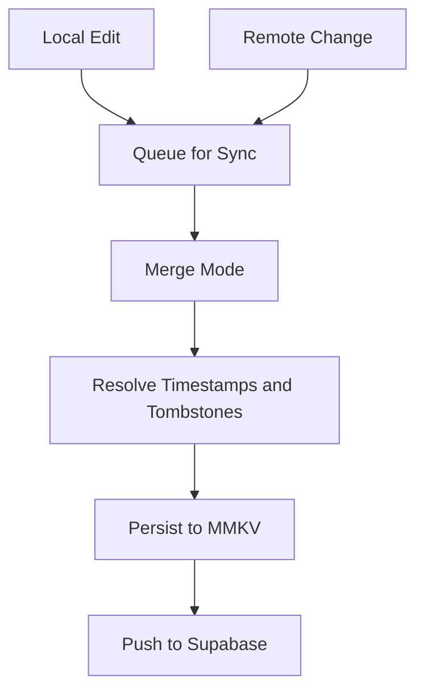

**Diagram sources**
- [database.ts:20-28](file://src/data/database.ts#L20-L28)

**Section sources**
- [database.ts:1-36](file://src/data/database.ts#L1-L36)

### Persistence Configuration and Data Serialization
- Persistence names:
  - Auth: local_user
  - Lists: lists
  - List Items: list_items
  - Profiles: profiles
  - First Access: app.first_access
  - User Preferences: userPreferences
- Serialization:
  - Supabase expects snake_case column names; conversion helpers transform between camelCase (TS) and snake_case (DB).
  - LegendApp stores serialize to MMKV automatically via ObservablePersistMMKV.

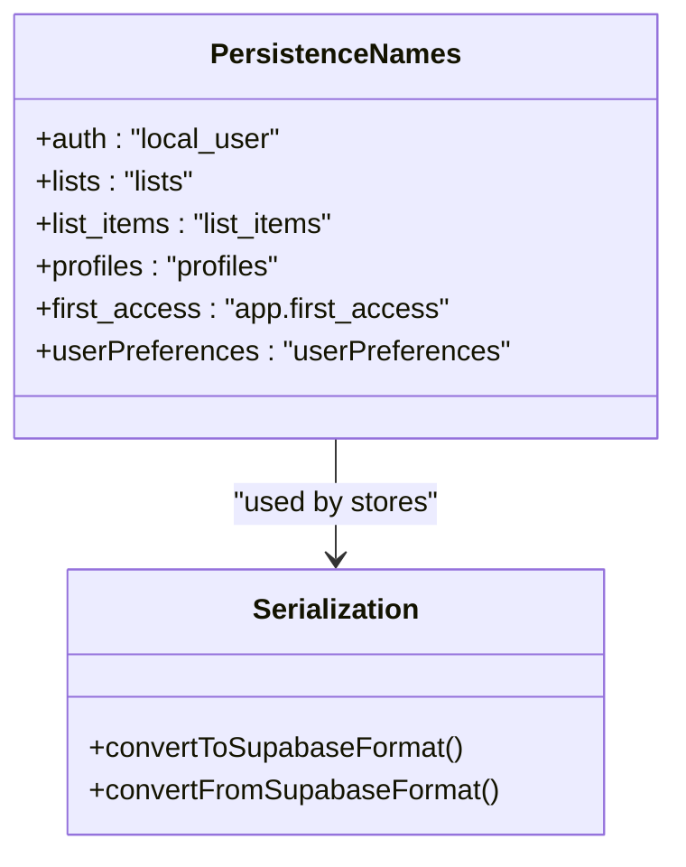

**Diagram sources**
- [auth.ts:25-27](file://src/data/states/auth.ts#L25-L27)
- [lists.ts:16](file://src/data/states/lists.ts#L16)
- [list-items.ts:13](file://src/data/states/list-items.ts#L13)
- [profile.ts:18](file://src/data/states/profile.ts#L18)
- [lists actions:1-211](file://src/data/actions/lists.ts#L1-L211)
- [list-items actions:1-193](file://src/data/actions/list-items.ts#L1-L193)

**Section sources**
- [auth.ts:1-34](file://src/data/states/auth.ts#L1-L34)
- [lists.ts:1-27](file://src/data/states/lists.ts#L1-L27)
- [list-items.ts:1-24](file://src/data/states/list-items.ts#L1-L24)
- [profile.ts:1-194](file://src/data/states/profile.ts#L1-L194)
- [lists actions:1-211](file://src/data/actions/lists.ts#L1-L211)
- [list-items actions:1-193](file://src/data/actions/list-items.ts#L1-L193)

### Examples of Local Data Operations and Sync Triggers
- Create a list:
  - Generate a local ID
  - Convert to snake_case payload
  - Set observable record (triggers sync)
  - Return camelCase representation
- Update a list item:
  - Update fields using snake_case keys
  - Trigger sync automatically
- Delete a list:
  - Delete observable record (triggers sync)
- Reset stores:
  - Clear observable store and remove persisted keys from MMKV

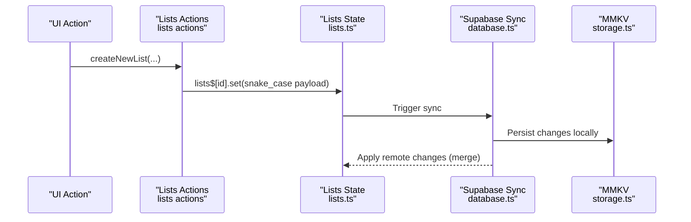

**Diagram sources**
- [lists actions:79-122](file://src/data/actions/lists.ts#L79-L122)
- [lists.ts:5-26](file://src/data/states/lists.ts#L5-L26)
- [database.ts:13-29](file://src/data/database.ts#L13-L29)
- [storage.ts:1-74](file://src/data/storage.ts#L1-L74)

**Section sources**
- [lists actions:1-211](file://src/data/actions/lists.ts#L1-L211)
- [list-items actions:1-193](file://src/data/actions/list-items.ts#L1-L193)
- [lists.ts:1-27](file://src/data/states/lists.ts#L1-L27)
- [list-items.ts:1-24](file://src/data/states/list-items.ts#L1-L24)
- [database.ts:1-36](file://src/data/database.ts#L1-L36)
- [storage.ts:1-74](file://src/data/storage.ts#L1-L74)

### Offline Functionality Implementation
- Offline-first: Stores hydrate from MMKV immediately; sync runs in background.
- Realtime: Subscriptions scoped to current user via computed filters.
- Retry: Infinite retry policies ensure eventual consistency.
- Auth sessions: Supabase client uses MMKV adapter to persist auth state securely.

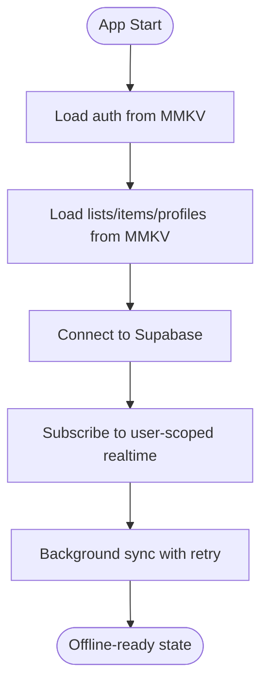

**Diagram sources**
- [auth.ts:22-33](file://src/data/states/auth.ts#L22-L33)
- [lists.ts:17-21](file://src/data/states/lists.ts#L17-L21)
- [list-items.ts:17-21](file://src/data/states/list-items.ts#L17-L21)
- [profile.ts:16-18](file://src/data/states/profile.ts#L16-L18)
- [database.ts:26-28](file://src/data/database.ts#L26-L28)
- [supabase client:21-28](file://src/lib/supabase/supabase.ts#L21-L28)

**Section sources**
- [auth.ts:1-34](file://src/data/states/auth.ts#L1-L34)
- [lists.ts:1-27](file://src/data/states/lists.ts#L1-L27)
- [list-items.ts:1-24](file://src/data/states/list-items.ts#L1-L24)
- [profile.ts:1-194](file://src/data/states/profile.ts#L1-L194)
- [database.ts:1-36](file://src/data/database.ts#L1-L36)
- [supabase client:1-28](file://src/lib/supabase/supabase.ts#L1-L28)

### Guest-to-User Data Migration and Sync Triggers
- Detects guest data in local stores and prompts the user to migrate to their authenticated account.
- On confirmation, updates the profile_id of guest-owned lists and relies on LegendApp sync to propagate to Supabase.

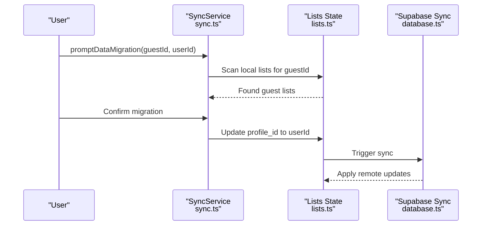

**Diagram sources**
- [sync.ts:102-150](file://src/services/sync.ts#L102-L150)
- [lists.ts:14](file://src/data/states/lists.ts#L14)
- [database.ts:13-29](file://src/data/database.ts#L13-L29)

**Section sources**
- [sync.ts:1-203](file://src/services/sync.ts#L1-L203)
- [lists.ts:1-27](file://src/data/states/lists.ts#L1-L27)
- [database.ts:1-36](file://src/data/database.ts#L1-L36)

## Dependency Analysis
- Coupling:
  - States depend on the centralized supabaseSynced configuration.
  - Actions depend on state stores and conversion helpers.
  - Session store manager depends on auth$ to reset stores.
- Cohesion:
  - storage.ts encapsulates MMKV concerns.
  - database.ts centralizes sync configuration.
  - supabase client integrates MMKV adapter for auth persistence.
- External dependencies:
  - react-native-mmkv for local storage
  - @legendapp/state for observable state and sync plugins
  - @supabase/supabase-js for backend sync and auth

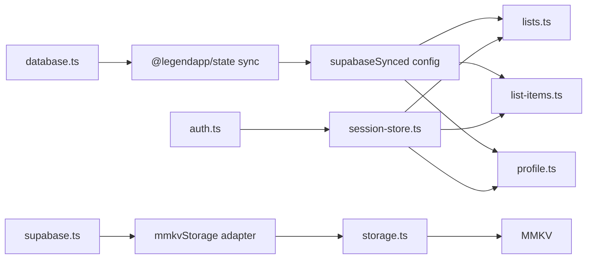

**Diagram sources**
- [storage.ts:1-74](file://src/data/storage.ts#L1-L74)
- [database.ts:1-36](file://src/data/database.ts#L1-L36)
- [lists.ts:1-27](file://src/data/states/lists.ts#L1-L27)
- [list-items.ts:1-24](file://src/data/states/list-items.ts#L1-L24)
- [profile.ts:1-194](file://src/data/states/profile.ts#L1-L194)
- [supabase client:1-28](file://src/lib/supabase/supabase.ts#L1-L28)
- [auth.ts:1-34](file://src/data/states/auth.ts#L1-L34)
- [session-store.ts:1-24](file://src/data/session-store.ts#L1-L24)

**Section sources**
- [storage.ts:1-74](file://src/data/storage.ts#L1-L74)
- [database.ts:1-36](file://src/data/database.ts#L1-L36)
- [lists.ts:1-27](file://src/data/states/lists.ts#L1-L27)
- [list-items.ts:1-24](file://src/data/states/list-items.ts#L1-L24)
- [profile.ts:1-194](file://src/data/states/profile.ts#L1-L194)
- [supabase client:1-28](file://src/lib/supabase/supabase.ts#L1-L28)
- [auth.ts:1-34](file://src/data/states/auth.ts#L1-L34)
- [session-store.ts:1-24](file://src/data/session-store.ts#L1-L24)

## Performance Considerations
- Minimize unnecessary writes: Prefer batched updates and avoid frequent toggles that trigger redundant syncs.
- Use pagination and targeted queries: Limit initial fetch sizes and rely on incremental sync.
- Encryption overhead: Enabling encryption adds CPU cost; evaluate necessity for sensitive data.
- Retry tuning: Infinite retries improve reliability but may increase network usage; monitor and adjust as needed.
- Realtime filtering: Keep filters narrow to reduce payload sizes and processing overhead.
- Hydration timing: Initialize stores early to allow background sync while UI renders.

[No sources needed since this section provides general guidance]

## Troubleshooting Guide
- Symptom: Data not persisting across app restarts
  - Verify persistence names and that ObservablePersistMMKV is configured for each store.
  - Confirm encryption key environment variables are set consistently.
- Symptom: Conflicts or unexpected merges
  - Ensure merge mode and metadata fields are configured correctly.
  - Review retry settings and network connectivity.
- Symptom: Cross-session data leakage
  - Confirm session store manager resets stores on user change.
- Symptom: Auth session not restored
  - Verify MMKV adapter is attached to Supabase client auth storage.
- Debugging utilities:
  - Use MMKV debugStorage to inspect stored keys and values.
  - Inspect getAllStorageKeys and selectively delete keys for testing.

**Section sources**
- [storage.ts:29-73](file://src/data/storage.ts#L29-L73)
- [session-store.ts:10-23](file://src/data/session-store.ts#L10-L23)
- [supabase client:9-28](file://src/lib/supabase/supabase.ts#L9-L28)
- [database.ts:13-29](file://src/data/database.ts#L13-L29)

## Conclusion
The MMKV-based persistence layer delivers a robust offline-first experience by combining LegendApp’s observable stores, MMKV persistence, and Supabase sync with merge semantics. The architecture ensures reliable hydration, deterministic conflict resolution, and seamless migration of guest data to authenticated accounts, while maintaining strong isolation between user sessions.