# Local Persistence with MMKV

<cite>
**Referenced Files in This Document**
- [supabase.ts](file://src/lib/supabase/supabase.ts)
- [database.ts](file://src/database/index.ts)
- [sync.ts](file://src/database/sync.ts)
- [auth.ts](file://src/database/operations/auth.ts)
- [lists.ts](file://src/data/states/lists.ts)
- [list-items.ts](file://src/data/states/list-items.ts)
- [profile.ts](file://src/data/states/profile.ts)
- [lists actions](file://src/data/actions/lists.ts)
- [list-items actions](file://src/data/actions/list-items.ts)
- [use-auth.ts](file://src/hooks/use-auth.ts)
- [use-observable-query.ts](file://src/hooks/use-observable-query.ts)
- [profiles operations](file://src/database/operations/profiles.ts)
- [schema.ts](file://src/database/schema.ts)
- [migrations.ts](file://src/database/migrations.ts)
- [RULES.md](file://__docs__/RULES.md)
</cite>

## Update Summary
**Changes Made**
- Updated persistence mechanism from MMKV-based local storage to WatermelonDB with SQLite/LokiJS adapters
- Replaced ObservablePersistMMKV plugin with WatermelonDB local database persistence
- Updated Supabase client configuration to use secureStoreAdapter for enhanced token management
- Revised offline-first architecture to leverage WatermelonDB's built-in offline capabilities
- Updated data hydration strategies to work with WatermelonDB's observable query system
- Removed MMKV-specific configuration and replaced with database adapter configuration

## Table of Contents
1. [Introduction](#introduction)
2. [Project Structure](#project-structure)
3. [Core Components](#core-components)
4. [Architecture Overview](#architecture-overview)
5. [Detailed Component Analysis](#detailed-component-analysis)
6. [Dependency Analysis](#dependency-analysis)
7. [Performance Considerations](#performance-considerations)
8. [Troubleshooting Guide](#troubleshooting-guide)
9. [Conclusion](#conclusion)

## Introduction
This document explains the WatermelonDB-based local persistence implementation powering offline-first data management in the application. It covers the new Supabase client configuration using secureStoreAdapter for enhanced security, offline-first architecture with WatermelonDB's built-in capabilities, data hydration strategies through observable queries, local data caching with SQLite/LokiJS adapters, conflict resolution between local and cloud data, persistence configuration, data serialization, and performance optimizations. It also includes examples of local data operations, sync triggers, and offline functionality implementation.

## Project Structure
The persistence stack is organized around:
- A dedicated WatermelonDB instance with SQLite adapter for mobile and LokiJS for web
- Supabase client configured to use secureStoreAdapter for auth session persistence
- Database synchronization service managing pull/push operations and realtime subscriptions
- Observable query hooks for reactive data access and hydration
- Feature-specific data operations leveraging WatermelonDB's ORM capabilities

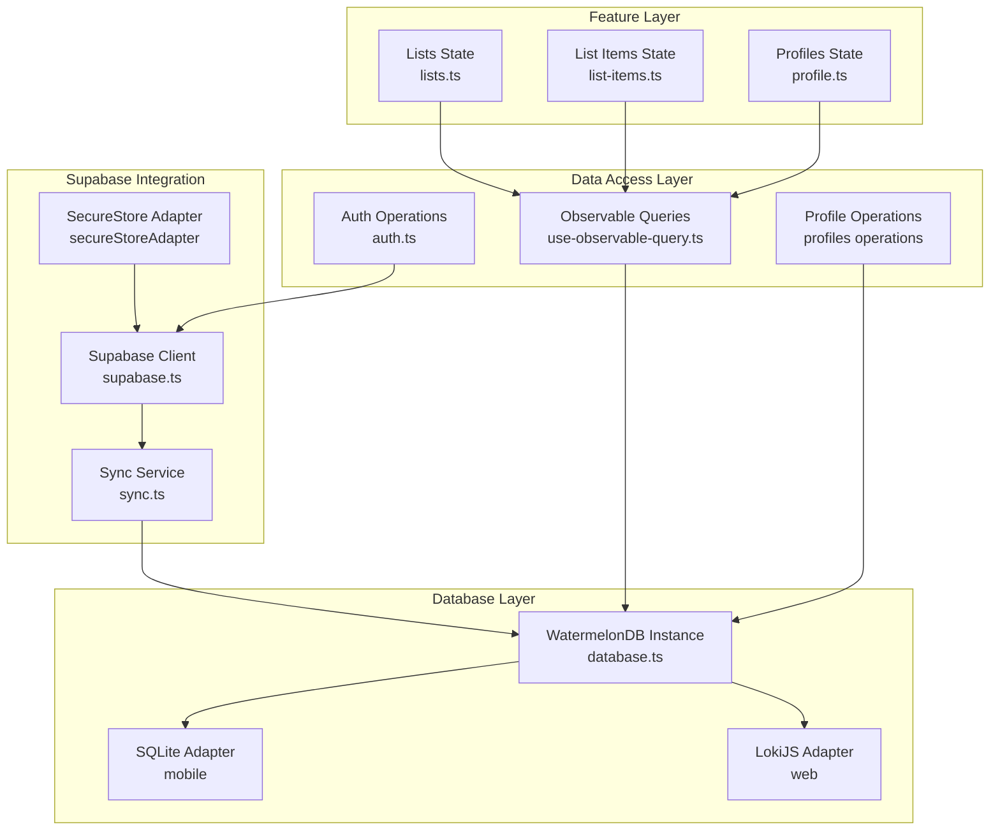

**Diagram sources**
- [database.ts:12-32](file://src/database/index.ts#L12-L32)
- [supabase.ts:9-22](file://src/lib/supabase/supabase.ts#L9-L22)
- [sync.ts:8-56](file://src/database/sync.ts#L8-L56)
- [use-observable-query.ts:4-13](file://src/hooks/use-observable-query.ts#L4-L13)
- [auth.ts:56-108](file://src/database/operations/auth.ts#L56-L108)
- [profiles operations:6-62](file://src/database/operations/profiles.ts#L6-L62)

**Section sources**
- [database.ts:1-33](file://src/database/index.ts#L1-L33)
- [supabase.ts:1-23](file://src/lib/supabase/supabase.ts#L1-L23)
- [sync.ts:1-56](file://src/database/sync.ts#L1-L56)
- [use-observable-query.ts:1-13](file://src/hooks/use-observable-query.ts#L1-L13)
- [auth.ts:1-108](file://src/database/operations/auth.ts#L1-L108)
- [profiles operations:1-62](file://src/database/operations/profiles.ts#L1-L62)

## Core Components
- WatermelonDB database: Provides SQLite adapter for mobile devices and LokiJS adapter for web browsers, enabling robust local data persistence with SQL-like querying capabilities.
- Supabase client with secureStoreAdapter: Enhanced authentication session management using Expo SecureStore for improved token security and persistence.
- Database synchronization service: Manages bidirectional sync between local database and Supabase backend through RPC calls and realtime subscriptions.
- Observable query hooks: Reactive data access layer that automatically hydrates components when local data changes.
- Feature-specific data operations: CRUD operations leveraging WatermelonDB's ORM for type-safe database interactions.

**Section sources**
- [database.ts:1-33](file://src/database/index.ts#L1-L33)
- [supabase.ts:1-23](file://src/lib/supabase/supabase.ts#L1-L23)
- [sync.ts:1-56](file://src/database/sync.ts#L1-L56)
- [use-observable-query.ts:1-13](file://src/hooks/use-observable-query.ts#L1-L13)

## Architecture Overview
The system implements an offline-first architecture with WatermelonDB:
- Local persistence: WatermelonDB provides SQLite/LokiJS storage with automatic conflict resolution and transaction support.
- Cloud sync: Supabase RPC endpoints handle bidirectional synchronization with merge semantics.
- Conflict resolution: WatermelonDB's built-in conflict detection and resolution mechanisms work with Supabase's timestamp-based approach.
- Hydration: Observable queries automatically update components when local data changes, with initial hydration from local database.
- Session isolation: SecureStoreAdapter ensures authentication tokens are securely persisted and isolated per device.

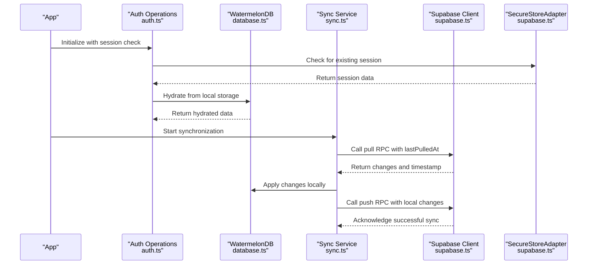

**Diagram sources**
- [auth.ts:246-286](file://src/hooks/use-auth.ts#L246-L286)
- [database.ts:29-32](file://src/database/index.ts#L29-L32)
- [sync.ts:15-34](file://src/database/sync.ts#L15-L34)
- [supabase.ts:15-22](file://src/lib/supabase/supabase.ts#L15-L22)

## Detailed Component Analysis

### WatermelonDB Database Configuration
- Platform-specific adapters: SQLite adapter for mobile devices with JSI enabled for optimal performance, LokiJS adapter for web browsers using IndexedDB.
- Schema definition: Three core tables (profiles, lists, list_items) with proper indexing and timestamp columns for conflict resolution.
- Migration system: Versioned schema migrations handling table structure changes and column modifications.

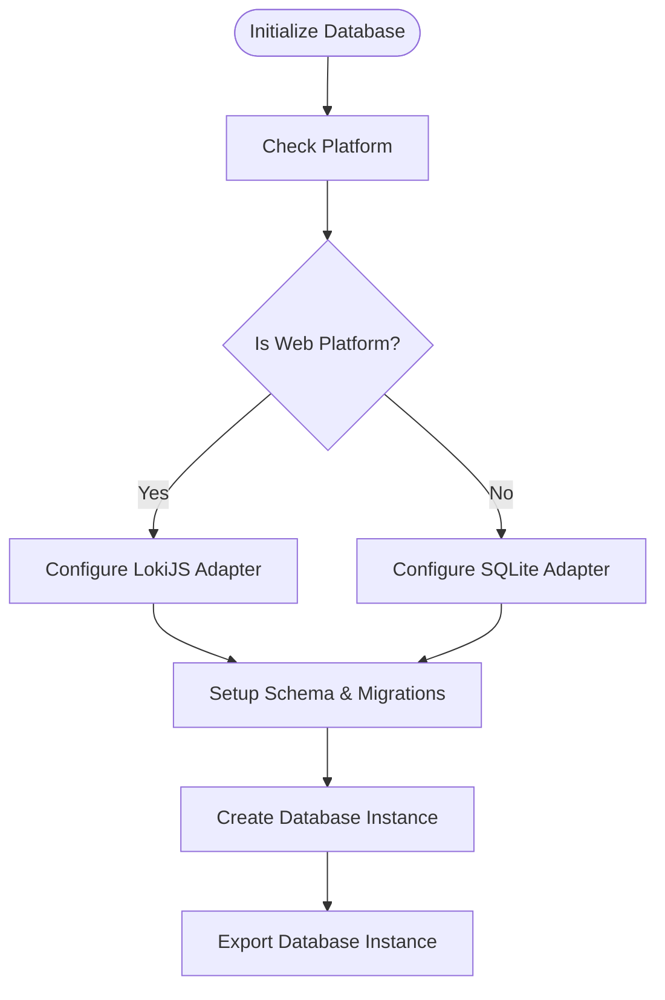

**Diagram sources**
- [database.ts:12-32](file://src/database/index.ts#L12-L32)
- [schema.ts:3-45](file://src/database/schema.ts#L3-L45)
- [migrations.ts:3-16](file://src/database/migrations.ts#L3-L16)

**Section sources**
- [database.ts:1-33](file://src/database/index.ts#L1-L33)
- [schema.ts:1-45](file://src/database/schema.ts#L1-L45)
- [migrations.ts:1-16](file://src/database/migrations.ts#L1-L16)

### Supabase Client with SecureStoreAdapter
- Enhanced authentication security: Uses Expo SecureStore for encrypted token storage instead of MMKV.
- Automatic session management: Configured with auto-refresh token, persistent sessions, and URL session detection disabled.
- Custom storage adapter: Implements getItem, setItem, and removeItem methods for seamless integration with Supabase auth.

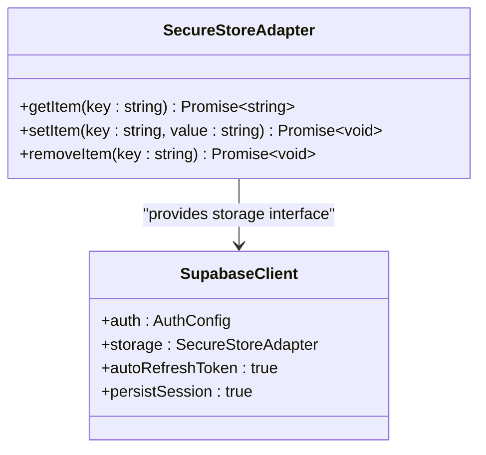

**Diagram sources**
- [supabase.ts:9-22](file://src/lib/supabase/supabase.ts#L9-L22)

**Section sources**
- [supabase.ts:1-23](file://src/lib/supabase/supabase.ts#L1-L23)

### Database Synchronization Service
- Bidirectional sync: Pull changes from Supabase backend and push local changes to cloud storage.
- Realtime subscriptions: Monitors PostgreSQL changes and triggers sync when database events occur.
- Error handling: Comprehensive error handling with retry logic and channel cleanup.

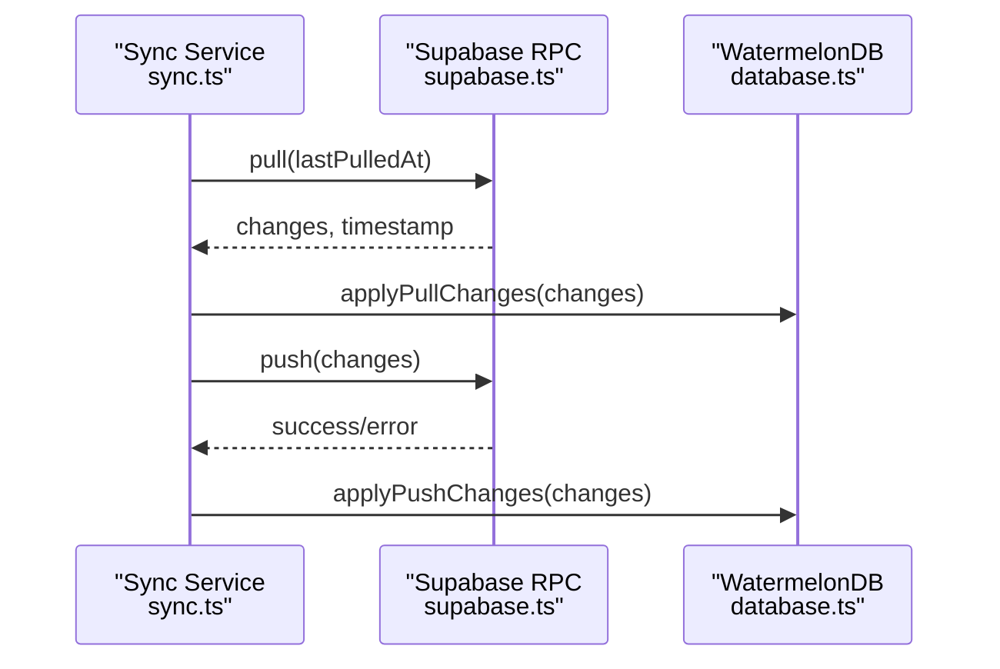

**Diagram sources**
- [sync.ts:15-34](file://src/database/sync.ts#L15-L34)

**Section sources**
- [sync.ts:1-56](file://src/database/sync.ts#L1-L56)

### Observable Query System for Data Hydration
- Reactive data access: Observable queries automatically update components when underlying data changes.
- Type-safe queries: Leverages WatermelonDB's Query API for efficient data retrieval and filtering.
- Component integration: Hooks provide seamless integration between database queries and React components.

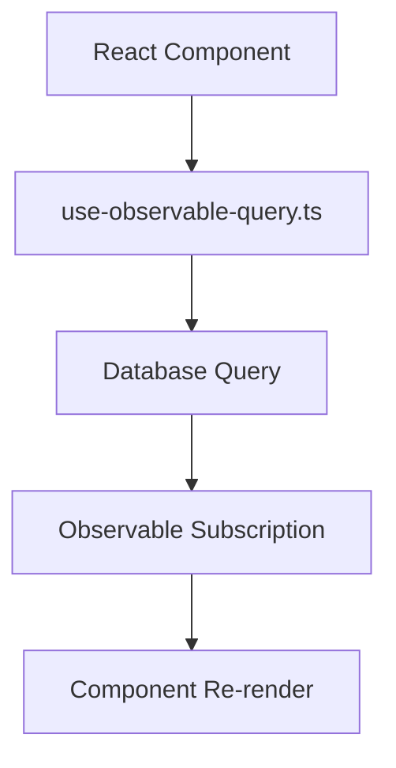

**Diagram sources**
- [use-observable-query.ts:4-13](file://src/hooks/use-observable-query.ts#L4-L13)

**Section sources**
- [use-observable-query.ts:1-13](file://src/hooks/use-observable-query.ts#L1-L13)

### Authentication and Session Management
- Session persistence: SecureStoreAdapter ensures authentication tokens are securely stored and retrieved.
- User state synchronization: Coordinates between local user state and Supabase authentication.
- Guest vs authenticated user handling: Manages data migration between guest and authenticated states.

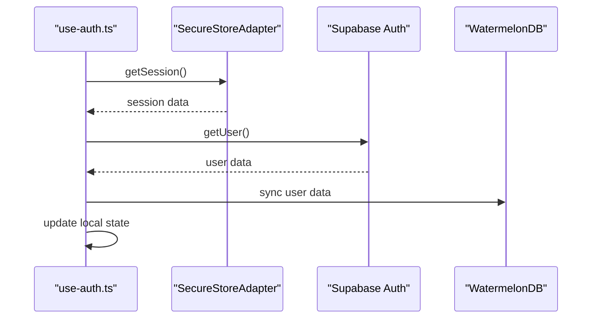

**Diagram sources**
- [use-auth.ts:246-286](file://src/hooks/use-auth.ts#L246-L286)
- [supabase.ts:15-22](file://src/lib/supabase/supabase.ts#L15-L22)

**Section sources**
- [use-auth.ts:1-286](file://src/hooks/use-auth.ts#L1-L286)

### Data Operations and Conflict Resolution
- CRUD operations: Type-safe operations for profiles, lists, and list items with proper error handling.
- Conflict detection: WatermelonDB's built-in conflict resolution works with Supabase's timestamp-based approach.
- Transaction support: Database write operations ensure data consistency and atomicity.

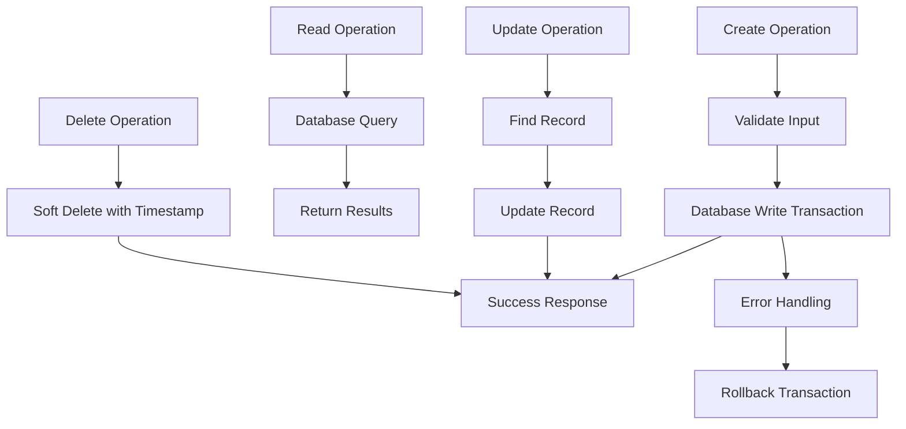

**Diagram sources**
- [profiles operations:14-62](file://src/database/operations/profiles.ts#L14-L62)

**Section sources**
- [profiles operations:1-62](file://src/database/operations/profiles.ts#L1-L62)

### Examples of Local Data Operations and Sync Triggers
- Create a list: Database write operation with automatic sync to Supabase backend.
- Update a list item: Direct database update with immediate UI re-render through observable queries.
- Delete a profile: Soft delete with timestamp tracking for proper conflict resolution.
- Realtime updates: Database changes automatically trigger sync service and UI updates.

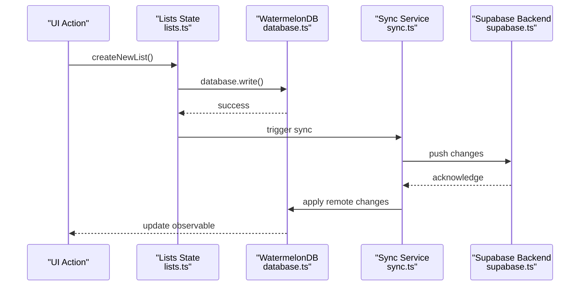

**Diagram sources**
- [lists actions:79-122](file://src/data/actions/lists.ts#L79-L122)
- [sync.ts:25-34](file://src/database/sync.ts#L25-L34)

**Section sources**
- [lists actions:1-211](file://src/data/actions/lists.ts#L1-L211)
- [list-items actions:1-193](file://src/data/actions/list-items.ts#L1-L193)
- [sync.ts:1-56](file://src/database/sync.ts#L1-L56)

### Offline Functionality Implementation
- Built-in offline support: WatermelonDB provides comprehensive offline capabilities with automatic conflict resolution.
- Realtime subscriptions: PostgreSQL changes trigger immediate sync and UI updates when connectivity is restored.
- Session persistence: SecureStoreAdapter ensures authentication state persists across app restarts.
- Graceful degradation: Application continues to function with local data when backend is unavailable.

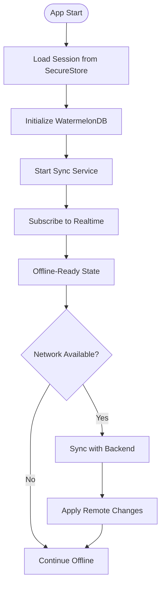

**Diagram sources**
- [supabase.ts:15-22](file://src/lib/supabase/supabase.ts#L15-L22)
- [database.ts:29-32](file://src/database/index.ts#L29-L32)
- [sync.ts:36-49](file://src/database/sync.ts#L36-L49)

**Section sources**
- [supabase.ts:1-23](file://src/lib/supabase/supabase.ts#L1-L23)
- [database.ts:1-33](file://src/database/index.ts#L1-L33)
- [sync.ts:1-56](file://src/database/sync.ts#L1-L56)

## Dependency Analysis
- Coupling:
  - Database operations depend on WatermelonDB schema and adapter configuration.
  - Sync service coordinates between database and Supabase backend.
  - Observable query hooks provide reactive data access to components.
- Cohesion:
  - database.ts encapsulates database configuration and adapter selection.
  - supabase.ts centralizes authentication configuration with secure storage.
  - sync.ts manages all synchronization logic in a single module.
- External dependencies:
  - @nozbe/watermelondb for local database operations and ORM
  - expo-secure-store for enhanced authentication token security
  - @supabase/supabase-js for backend synchronization and auth

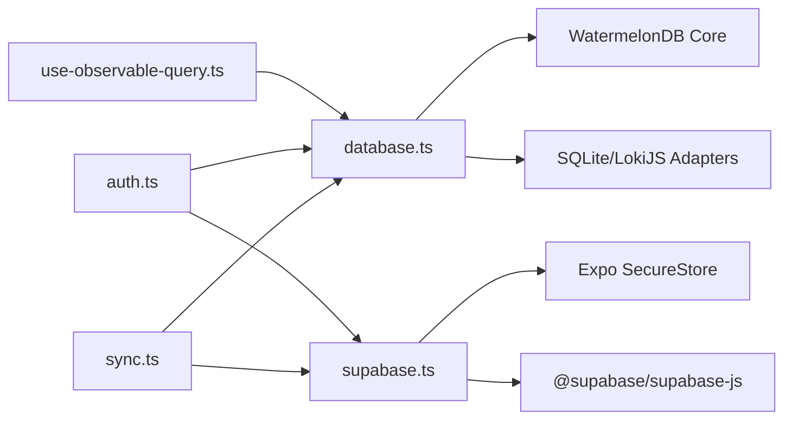

**Diagram sources**
- [database.ts:1-33](file://src/database/index.ts#L1-L33)
- [supabase.ts:1-23](file://src/lib/supabase/supabase.ts#L1-L23)
- [sync.ts:1-56](file://src/database/sync.ts#L1-L56)
- [auth.ts:1-108](file://src/database/operations/auth.ts#L1-L108)

**Section sources**
- [database.ts:1-33](file://src/database/index.ts#L1-L33)
- [supabase.ts:1-23](file://src/lib/supabase/supabase.ts#L1-L23)
- [sync.ts:1-56](file://src/database/sync.ts#L1-L56)
- [auth.ts:1-108](file://src/database/operations/auth.ts#L1-L108)

## Performance Considerations
- Database optimization: SQLite adapter provides excellent performance on mobile devices with JSI enabled.
- Query optimization: WatermelonDB's indexed columns and efficient query patterns minimize database overhead.
- Memory management: Observable queries automatically clean up subscriptions when components unmount.
- Network efficiency: Sync service implements batching and incremental sync to minimize bandwidth usage.
- Security overhead: SecureStoreAdapter adds minimal performance cost compared to the security benefits.
- Migration strategy: WatermelonDB migrations handle schema changes efficiently without data loss.

## Troubleshooting Guide
- Symptom: Database initialization fails
  - Verify platform detection logic and adapter configuration.
  - Check schema version compatibility and migration status.
- Symptom: Sync operations fail
  - Verify Supabase RPC endpoints are accessible and returning expected data.
  - Check network connectivity and realtime subscription status.
- Symptom: Authentication issues
  - Verify SecureStoreAdapter is properly configured and tokens are being stored.
  - Check session persistence and auto-refresh token settings.
- Symptom: Data conflicts or unexpected merges
  - Review WatermelonDB conflict resolution settings and timestamp handling.
  - Verify sync service is properly applying remote changes.
- Debugging utilities:
  - Use database logs to trace query execution and performance.
  - Monitor sync service logs for error messages and retry attempts.
  - Check SecureStore for proper token persistence and retrieval.

**Section sources**
- [database.ts:24-27](file://src/database/index.ts#L24-L27)
- [sync.ts:13-34](file://src/database/sync.ts#L13-L34)
- [supabase.ts:15-22](file://src/lib/supabase/supabase.ts#L15-L22)

## Conclusion
The WatermelonDB-based persistence layer delivers a robust offline-first experience by combining SQLite/LokiJS adapters, enhanced authentication with SecureStoreAdapter, and Supabase synchronization with conflict resolution. The architecture ensures reliable hydration through observable queries, automatic conflict detection, and seamless migration between guest and authenticated states, while maintaining strong security isolation and optimal performance across platforms.