# State Management Architecture

<cite>
**Referenced Files in This Document**
- [database.ts](file://src/data/database.ts)
- [auth.ts](file://src/data/states/auth.ts)
- [lists.ts](file://src/data/states/lists.ts)
- [list-items.ts](file://src/data/states/list-items.ts)
- [profiles.ts](file://src/data/states/profiles.ts)
- [user-preferences.ts](file://src/data/states/user-preferences.ts)
- [first-access.ts](file://src/data/states/first-access.ts)
- [storage.ts](file://src/data/storage.ts)
- [sync.ts](file://src/services/sync.ts)
- [lists actions](file://src/data/actions/lists.ts)
- [list-items actions](file://src/data/actions/list-items.ts)
- [lists page](file://src/features/lists/page.tsx)
- [onboarding hook](file://src/features/onboarding/hooks/use-onboarding-first-access.ts)
- [RULES.md](file://__docs__/RULES.md)
- [new-screen.md](file://.github/agents/new-screen.md)
</cite>

## Table of Contents
1. [Introduction](#introduction)
2. [Project Structure](#project-structure)
3. [Core Components](#core-components)
4. [Architecture Overview](#architecture-overview)
5. [Detailed Component Analysis](#detailed-component-analysis)
6. [Dependency Analysis](#dependency-analysis)
7. [Performance Considerations](#performance-considerations)
8. [Troubleshooting Guide](#troubleshooting-guide)
9. [Conclusion](#conclusion)
10. [Appendices](#appendices)

## Introduction
This document describes the PowerLists state management architecture built on LegendAppState. It explains the reactive state patterns, observer implementation, and automatic UI updates. It documents the centralized database structure, state synchronization strategies, and conflict resolution mechanisms. It details the dual-storage approach combining cloud-based Supabase synchronization with local MMKV persistence, and it covers state initialization, data hydration, and offline-first architecture. It also covers observer pattern usage, state subscription management, performance optimization techniques, integration with React components, state validation, and debugging strategies for reactive state management.

## Project Structure
The state management system is organized around:
- Centralized Supabase configuration and dual-storage setup
- Feature-specific observable stores for domain entities
- Action modules that encapsulate mutations and data transformations
- Services that orchestrate cross-cutting state operations
- React components that subscribe to state via the observer pattern

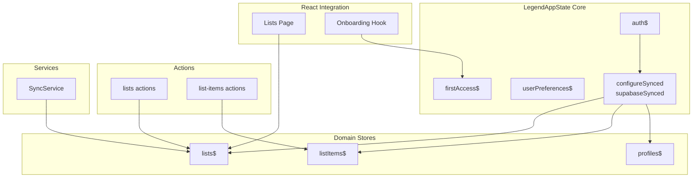

**Diagram sources**
- [database.ts:13-29](file://src/data/database.ts#L13-L29)
- [auth.ts:22-33](file://src/data/states/auth.ts#L22-L33)
- [lists.ts:5-26](file://src/data/states/lists.ts#L5-L26)
- [list-items.ts:5-23](file://src/data/states/list-items.ts#L5-L23)
- [profiles.ts:10-19](file://src/data/states/profiles.ts#L10-L19)
- [lists actions:1-211](file://src/data/actions/lists.ts#L1-L211)
- [list-items actions:1-193](file://src/data/actions/list-items.ts#L1-L193)
- [sync.ts:41-202](file://src/services/sync.ts#L41-L202)
- [lists page:24-95](file://src/features/lists/page.tsx#L24-L95)
- [onboarding hook:5-16](file://src/features/onboarding/hooks/use-onboarding-first-access.ts#L5-L16)

**Section sources**
- [database.ts:1-36](file://src/data/database.ts#L1-L36)
- [RULES.md:42-77](file://__docs__/RULES.md#L42-L77)
- [new-screen.md:145-491](file://.github/agents/new-screen.md#L145-L491)

## Core Components
- Centralized Supabase configuration with dual-storage enabled via MMKV
- Global auth state with local persistence
- Domain stores for lists, list items, and profiles
- User preferences and first-access flags with persistence
- Action modules for CRUD operations with conversion utilities
- Service layer for cross-cutting operations like guest-to-user data migration
- React integration via observer pattern and useValue hooks

Key implementation patterns:
- All global state is observable; reads use observer or useValue; writes use .set/.update
- Supabase ↔ MMKV bidirectional sync with offline-first semantics
- Snake_case to camelCase conversions for Supabase compatibility

**Section sources**
- [database.ts:13-29](file://src/data/database.ts#L13-L29)
- [auth.ts:22-33](file://src/data/states/auth.ts#L22-L33)
- [lists.ts:5-26](file://src/data/states/lists.ts#L5-L26)
- [list-items.ts:5-23](file://src/data/states/list-items.ts#L5-L23)
- [profiles.ts:10-19](file://src/data/states/profiles.ts#L10-L19)
- [user-preferences.ts:12-25](file://src/data/states/user-preferences.ts#L12-L25)
- [first-access.ts:7-16](file://src/data/states/first-access.ts#L7-L16)
- [lists actions:1-211](file://src/data/actions/lists.ts#L1-L211)
- [list-items actions:1-193](file://src/data/actions/list-items.ts#L1-L193)
- [sync.ts:41-202](file://src/services/sync.ts#L41-L202)
- [RULES.md:42-77](file://__docs__/RULES.md#L42-L77)

## Architecture Overview
The system uses LegendAppState’s synced stores to maintain a single source of truth. Each store is configured with:
- Supabase collection mapping and filtering by current user
- Local persistence via MMKV
- Automatic real-time subscriptions
- Conflict resolution via merge mode and timestamps

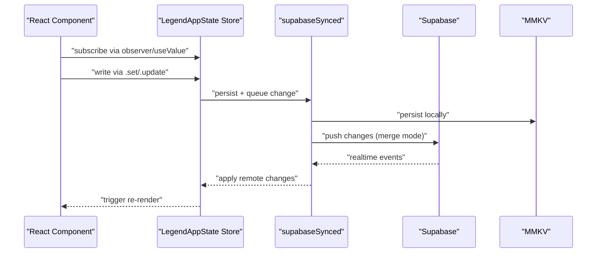

**Diagram sources**
- [database.ts:13-29](file://src/data/database.ts#L13-L29)
- [lists.ts:5-26](file://src/data/states/lists.ts#L5-L26)
- [list-items.ts:5-23](file://src/data/states/list-items.ts#L5-L23)
- [profiles.ts:10-19](file://src/data/states/profiles.ts#L10-L19)
- [lists actions:1-211](file://src/data/actions/lists.ts#L1-L211)
- [list-items actions:1-193](file://src/data/actions/list-items.ts#L1-L193)

## Detailed Component Analysis

### Centralized Supabase Configuration and Dual Storage
- Configures supabaseSynced with:
  - Persist plugin: ObservablePersistMMKV
  - Retry behavior: infinite retries
  - Mode: merge
  - Field mappings: created_at, updated_at, deleted
  - Changes since last sync
  - Generates IDs via shared generator
- Exposes getCurrentUserId to filter queries and real-time subscriptions by authenticated user

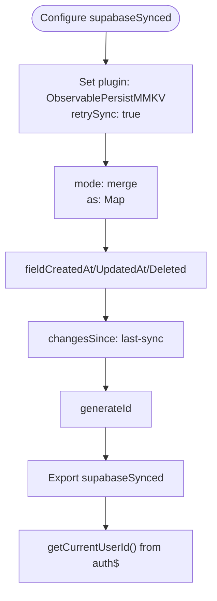

**Diagram sources**
- [database.ts:13-29](file://src/data/database.ts#L13-L29)
- [database.ts:31-35](file://src/data/database.ts#L31-L35)

**Section sources**
- [database.ts:1-36](file://src/data/database.ts#L1-L36)

### Auth State and Initialization
- Global auth$ observable with:
  - user: synced with local persistence
  - session, isInitialized, isLoading: plain observables
- Used by getCurrentUserId to scope queries and real-time filters

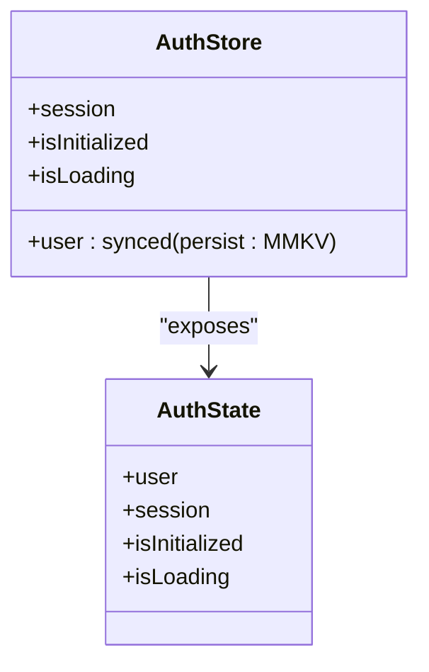

**Diagram sources**
- [auth.ts:8-20](file://src/data/states/auth.ts#L8-L20)
- [auth.ts:22-33](file://src/data/states/auth.ts#L22-L33)

**Section sources**
- [auth.ts:1-34](file://src/data/states/auth.ts#L1-L34)
- [database.ts:31-35](file://src/data/database.ts#L31-L35)

### Lists Store and Real-Time Filtering
- Lists store configured with:
  - Collection: lists
  - Select fields including nested list_items
  - Filter by profile_id via getCurrentUserId
  - Actions: read/create/update/delete
  - Persistence: lists with retrySync
  - Realtime filter scoped to current user
  - Infinite retry policy

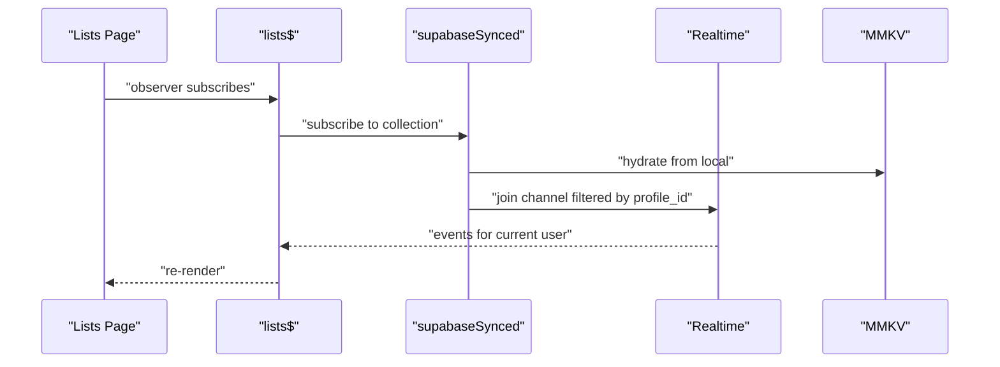

**Diagram sources**
- [lists.ts:5-26](file://src/data/states/lists.ts#L5-L26)
- [lists page:24-95](file://src/features/lists/page.tsx#L24-L95)

**Section sources**
- [lists.ts:1-27](file://src/data/states/lists.ts#L1-L27)
- [lists page:24-95](file://src/features/lists/page.tsx#L24-L95)

### List Items Store and Offline-First Hydration
- List items store configured with:
  - Collection: list_items
  - Filter by profile_id
  - Actions: read/create/update/delete
  - Persistence: list_items
  - Infinite retry policy
  - Realtime filter scoped to current user

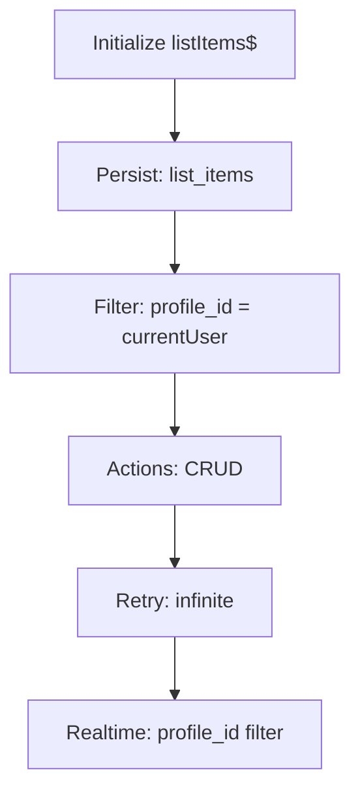

**Diagram sources**
- [list-items.ts:5-23](file://src/data/states/list-items.ts#L5-L23)

**Section sources**
- [list-items.ts:1-24](file://src/data/states/list-items.ts#L1-L24)

### Profiles Store and Data Validation
- Profiles store configured with:
  - Collection: profiles
  - Filter by id = getCurrentUserId()
  - Actions: read/create/update/delete
  - Persistence: profiles with retrySync
- Helper functions:
  - getProfile: returns camelCase profile
  - createProfile: validates presence of user and name, converts to snake_case, sets in store
  - updateProfile: updates selective fields, sets updated_at
  - deleteProfile: deletes current profile
  - resetProfilesStore: clears store and MMKV metadata

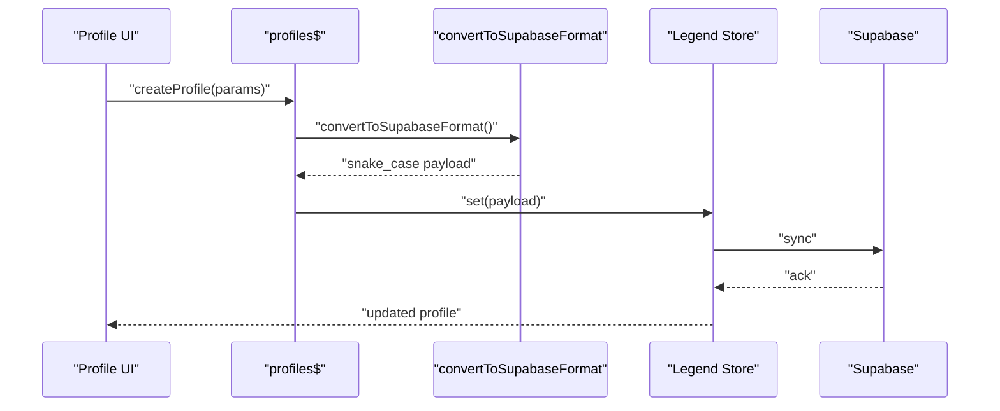

**Diagram sources**
- [profiles.ts:10-19](file://src/data/states/profiles.ts#L10-L19)
- [profiles.ts:61-103](file://src/data/states/profiles.ts#L61-L103)
- [profiles.ts:121-159](file://src/data/states/profiles.ts#L121-L159)
- [profiles.ts:171-186](file://src/data/states/profiles.ts#L171-L186)

**Section sources**
- [profiles.ts:1-194](file://src/data/states/profiles.ts#L1-L194)

### User Preferences and First Access Flags
- User preferences store with persisted defaults and retrySync
- First access flag persisted under a dedicated key

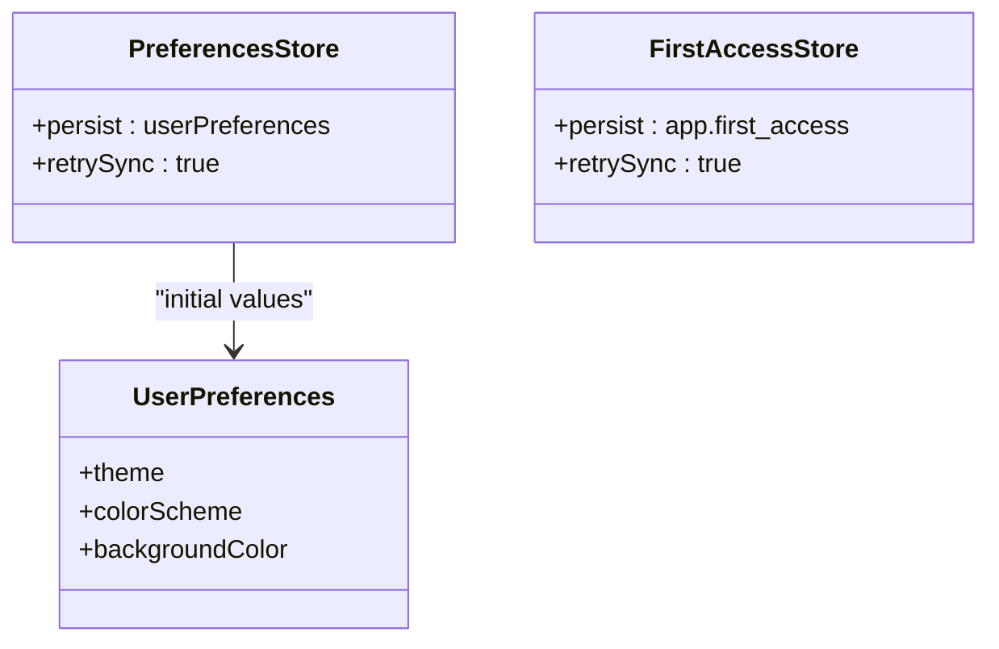

**Diagram sources**
- [user-preferences.ts:12-25](file://src/data/states/user-preferences.ts#L12-L25)
- [first-access.ts:7-16](file://src/data/states/first-access.ts#L7-L16)

**Section sources**
- [user-preferences.ts:1-27](file://src/data/states/user-preferences.ts#L1-L27)
- [first-access.ts:1-16](file://src/data/states/first-access.ts#L1-L16)

### Actions Modules and State Validation
- Lists actions:
  - getAllLists: hydrates from store, converts to camelCase
  - createNewList: validates auth and fields, generates ID, sets in store
  - updateList: updates selective fields, returns converted result
  - deleteList: deletes by ID
  - resetListStore: clears store and MMKV metadata
- List items actions:
  - getAllListItems, getListItemsByListId
  - createNewListItem, toggleCheckListItem, updateListItem, deleteListItem
  - resetListItemsStore: clears store and MMKV metadata

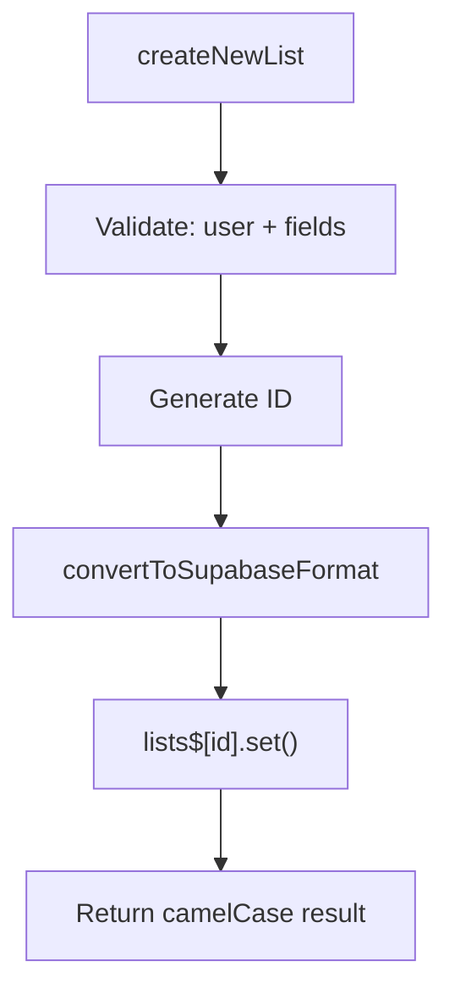

**Diagram sources**
- [lists actions:79-122](file://src/data/actions/lists.ts#L79-L122)
- [list-items actions:53-104](file://src/data/actions/list-items.ts#L53-L104)

**Section sources**
- [lists actions:1-211](file://src/data/actions/lists.ts#L1-L211)
- [list-items actions:1-193](file://src/data/actions/list-items.ts#L1-L193)

### Service Orchestration: Guest-to-User Data Migration
- SyncService:
  - hasGuestData: checks lists owned by guestId
  - getGuestListsCount: counts guest-owned lists
  - promptDataMigration: prompts user and migrates via store updates
  - migrateGuestDataToUser: updates profile_id for all guest lists; LegendAppState auto-syncs to Supabase

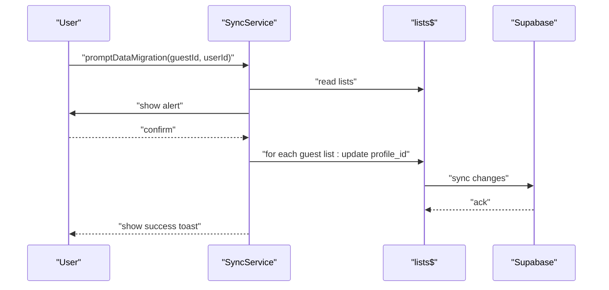

**Diagram sources**
- [sync.ts:102-150](file://src/services/sync.ts#L102-L150)
- [sync.ts:166-201](file://src/services/sync.ts#L166-L201)

**Section sources**
- [sync.ts:1-203](file://src/services/sync.ts#L1-L203)

### React Integration: Observer Pattern and UI Updates
- Lists page:
  - Uses observer to wrap the component
  - Reads lists via useValue and computed totals
  - Renders a virtualized list with LegendList
- Onboarding hook:
  - Subscribes to firstAccess$ via useValue
  - Completes onboarding by calling action

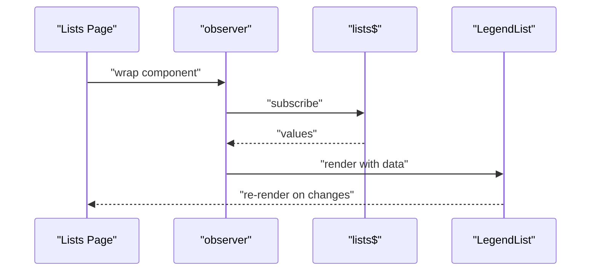

**Diagram sources**
- [lists page:24-95](file://src/features/lists/page.tsx#L24-L95)
- [onboarding hook:5-16](file://src/features/onboarding/hooks/use-onboarding-first-access.ts#L5-L16)

**Section sources**
- [lists page:1-98](file://src/features/lists/page.tsx#L1-L98)
- [onboarding hook:1-16](file://src/features/onboarding/hooks/use-onboarding-first-access.ts#L1-L16)

## Dependency Analysis
- LegendAppState core depends on:
  - Supabase client
  - MMKV persistence plugin
  - Auth state for user scoping
- Domain stores depend on:
  - supabaseSynced configuration
  - getCurrentUserId
  - Supabase utilities for conversion
- Actions depend on:
  - Stores for mutation
  - Conversion utilities
  - Storage for cleanup
- Services depend on:
  - Stores for cross-cutting operations
  - Toast service for feedback

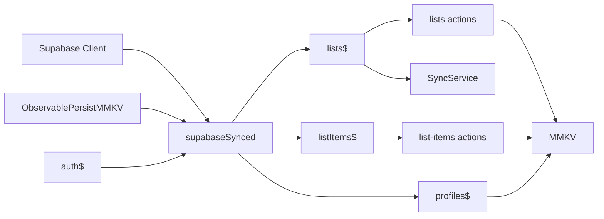

**Diagram sources**
- [database.ts:13-29](file://src/data/database.ts#L13-L29)
- [auth.ts:22-33](file://src/data/states/auth.ts#L22-L33)
- [lists.ts:5-26](file://src/data/states/lists.ts#L5-L26)
- [list-items.ts:5-23](file://src/data/states/list-items.ts#L5-L23)
- [profiles.ts:10-19](file://src/data/states/profiles.ts#L10-L19)
- [lists actions:1-211](file://src/data/actions/lists.ts#L1-L211)
- [list-items actions:1-193](file://src/data/actions/list-items.ts#L1-L193)
- [sync.ts:41-202](file://src/services/sync.ts#L41-L202)
- [storage.ts:1-74](file://src/data/storage.ts#L1-L74)

**Section sources**
- [database.ts:1-36](file://src/data/database.ts#L1-L36)
- [storage.ts:1-74](file://src/data/storage.ts#L1-L74)

## Performance Considerations
- Virtualization and rendering:
  - Lists page uses a virtualized list with estimated item size and draw distance to minimize DOM overhead
  - Recycle items enabled to reduce render churn
- Reactive updates:
  - Observer pattern ensures fine-grained re-renders only when subscribed values change
  - useValue hook used for selective subscriptions
- Persistence and hydration:
  - MMKV persistence avoids expensive network calls on cold start
  - Retry policies ensure eventual consistency without blocking UI
- Network efficiency:
  - Real-time filters scoped to current user reduce event volume
  - Merge mode prevents redundant writes and conflicts

[No sources needed since this section provides general guidance]

## Troubleshooting Guide
- Observability:
  - Use debugStorage to enumerate and inspect persisted keys and values
  - Use getAllStorageKeys and deleteStorageKeys for targeted cleanup
- State validation:
  - Ensure convertToSupabaseFormat and convertFromSupabaseFormat are used consistently for mutations and reads
  - Validate required fields before calling actions (e.g., createNewList requires title, accentColor, icon)
- Conflict resolution:
  - Merge mode and updated_at fields help resolve concurrent edits
  - If conflicts occur, rely on retry policies and server timestamps
- Offline-first:
  - Confirm MMKV persistence is initialized and encryption key is configured if applicable
  - Verify getCurrentUserId returns a valid user ID for proper filtering and real-time channels
- React integration:
  - Wrap components with observer and subscribe via useValue to avoid stale reads
  - Avoid direct Supabase calls from components; always go through observable stores and actions

**Section sources**
- [storage.ts:25-74](file://src/data/storage.ts#L25-L74)
- [lists actions:79-122](file://src/data/actions/lists.ts#L79-L122)
- [database.ts:31-35](file://src/data/database.ts#L31-L35)
- [RULES.md:42-77](file://__docs__/RULES.md#L42-L77)

## Conclusion
PowerLists leverages LegendAppState to deliver a robust, offline-first state management system. The combination of Supabase synchronization and MMKV persistence ensures reliable data availability and consistency across devices. The observer pattern and useValue hooks provide efficient, reactive UI updates. Centralized configuration, strict validation, and modular action/services layers keep the system maintainable and scalable.

[No sources needed since this section summarizes without analyzing specific files]

## Appendices
- State initialization and hydration:
  - Stores initialize from persisted MMKV data and then synchronize with Supabase
  - Auth state hydrates user/session and toggles isInitialized
- Conflict resolution:
  - Merge mode and updated_at fields coordinate remote and local changes
  - Infinite retry policies ensure convergence
- Best practices:
  - Prefer observable stores over direct Supabase calls
  - Use convertToSupabaseFormat/convertFromSupabaseFormat for data shape consistency
  - Scope queries and real-time filters to the current user

[No sources needed since this section provides general guidance]