# State Management Architecture

<cite>
**Referenced Files in This Document**
- [database.ts](file://src/database/index.ts)
- [schema.ts](file://src/database/schema.ts)
- [sync.ts](file://src/database/sync.ts)
- [Profile.ts](file://src/database/models/Profile.ts)
- [List.ts](file://src/database/models/List.ts)
- [ListItem.ts](file://src/database/models/ListItem.ts)
- [profiles.ts](file://src/database/operations/profiles.ts)
- [lists.ts](file://src/database/operations/lists.ts)
- [listItems.ts](file://src/database/operations/listItems.ts)
- [auth.ts](file://src/database/operations/auth.ts)
- [sync-service.ts](file://src/services/sync.ts)
- [auth-state.ts](file://src/features/auth/authState.ts)
- [use-auth.ts](file://src/hooks/use-auth.ts)
- [lists page](file://src/features/lists/page.tsx)
- [onboarding hook](file://src/features/onboarding/hooks/use-onboarding-first-access.ts)
</cite>

## Update Summary
**Changes Made**
- Complete architectural transformation from LegendAppState to WatermelonDB-based database-first architecture
- Replaced automatic bidirectional sync with explicit synchronize() function using Supabase RPC functions
- Updated all state management components to use WatermelonDB models and operations
- Removed LegendAppState stores and replaced with database-centric approach
- Updated synchronization strategy to use pull/push RPC functions instead of automatic sync
- Modified authentication state to use SecureStore persistence instead of MMKV

## Table of Contents
1. [Introduction](#introduction)
2. [Project Structure](#project-structure)
3. [Core Components](#core-components)
4. [Architecture Overview](#architecture-overview)
5. [Detailed Component Analysis](#detailed-component-analysis)
6. [Dependency Analysis](#dependency-analysis)
7. [Performance Considerations](#performance-considerations)
8. [Troubleshooting Guide](#troubleshooting-guide)
9. [Conclusion](#conclusion)
10. [Appendices](#appendices)

## Introduction
This document describes the PowerLists state management architecture built on WatermelonDB database-first architecture. The system has been completely transformed from the previous LegendAppState approach to a database-centric design using WatermelonDB with explicit synchronization via Supabase RPC functions. This new architecture provides better transaction handling, improved error management, and more predictable state synchronization patterns.

The system implements a dual-storage approach combining local WatermelonDB persistence with cloud-based Supabase synchronization through explicit sync functions. It maintains offline-first capabilities while providing controlled synchronization through the synchronize() function with pull/push RPC operations.

## Project Structure
The state management system is now organized around:
- Centralized WatermelonDB configuration with SQLite/LokiJS adapters
- Database-first architecture with explicit synchronization
- Feature-specific database operations for domain entities
- Authentication state with SecureStore persistence
- Service layer for cross-cutting operations like guest-to-user data migration
- React components that interact with database operations and sync service

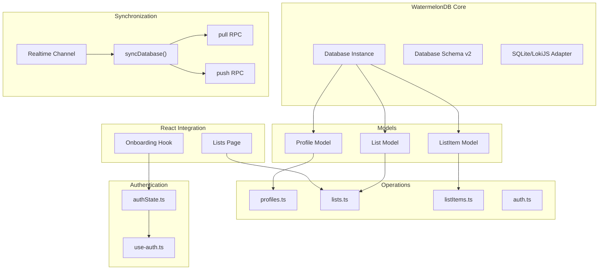

**Diagram sources**
- [database.ts:12-32](file://src/database/index.ts#L12-L32)
- [schema.ts:3-45](file://src/database/schema.ts#L3-L45)
- [Profile.ts:6-20](file://src/database/models/Profile.ts#L6-L20)
- [List.ts:7-22](file://src/database/models/List.ts#L7-L22)
- [ListItem.ts:6-19](file://src/database/models/ListItem.ts#L6-L19)
- [profiles.ts:6-62](file://src/database/operations/profiles.ts#L6-L62)
- [lists.ts:6-64](file://src/database/operations/lists.ts#L6-L64)
- [listItems.ts:6-78](file://src/database/operations/listItems.ts#L6-L78)
- [sync.ts:8-34](file://src/database/sync.ts#L8-L34)
- [auth-state.ts:23-66](file://src/features/auth/authState.ts#L23-L66)
- [use-auth.ts:44-91](file://src/hooks/use-auth.ts#L44-L91)

**Section sources**
- [database.ts:1-33](file://src/database/index.ts#L1-L33)
- [schema.ts:1-46](file://src/database/schema.ts#L1-L46)
- [sync.ts:1-57](file://src/database/sync.ts#L1-L57)

## Core Components
- Centralized WatermelonDB configuration with platform-specific adapters (SQLite for mobile, LokiJS for web)
- Database schema with version 2 supporting profiles, lists, and list_items tables
- Explicit synchronization via synchronize() function with Supabase RPC pull/push operations
- Authentication state with SecureStore persistence for user sessions
- Database operations layer providing CRUD functionality with proper transaction handling
- Service layer for cross-cutting operations like guest-to-user data migration
- React integration through database operations and sync service

Key implementation patterns:
- All state is database-first with WatermelonDB as the single source of truth
- Explicit synchronization through syncDatabase() function with proper error handling
- Transaction-safe operations using database.write() blocks
- Real-time subscription triggers manual sync via subscribeToRealtimeSync()

**Section sources**
- [database.ts:12-32](file://src/database/index.ts#L12-L32)
- [schema.ts:3-45](file://src/database/schema.ts#L3-L45)
- [sync.ts:8-34](file://src/database/sync.ts#L8-L34)
- [auth-state.ts:23-66](file://src/features/auth/authState.ts#L23-L66)
- [profiles.ts:25-34](file://src/database/operations/profiles.ts#L25-L34)
- [lists.ts:27-36](file://src/database/operations/lists.ts#L27-L36)
- [listItems.ts:27-38](file://src/database/operations/listItems.ts#L27-L38)

## Architecture Overview
The system uses WatermelonDB as the central database with explicit synchronization to Supabase. The architecture follows these principles:
- Database-first design with WatermelonDB as the single source of truth
- Explicit synchronization via synchronize() function with pull/push RPC operations
- Transaction-safe operations using database.write() blocks
- Real-time subscription triggers manual sync through subscribeToRealtimeSync()
- Authentication state managed separately with SecureStore persistence

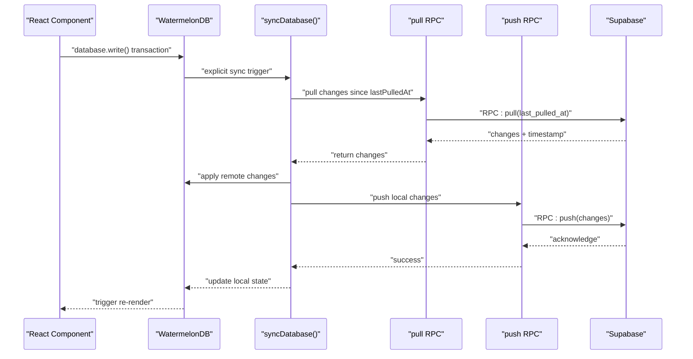

**Diagram sources**
- [sync.ts:15-30](file://src/database/sync.ts#L15-L30)
- [sync.ts:17-28](file://src/database/sync.ts#L17-L28)
- [database.ts:29-32](file://src/database/index.ts#L29-L32)

## Detailed Component Analysis

### WatermelonDB Configuration and Database Schema
The system uses WatermelonDB as the central database with platform-specific adapters:
- SQLite adapter for mobile platforms with JSI enabled for performance
- LokiJS adapter for web platforms with IndexedDB support
- Database schema version 2 with three main tables: profiles, lists, and list_items
- Proper indexing on foreign key columns (profile_id, list_id) for query performance

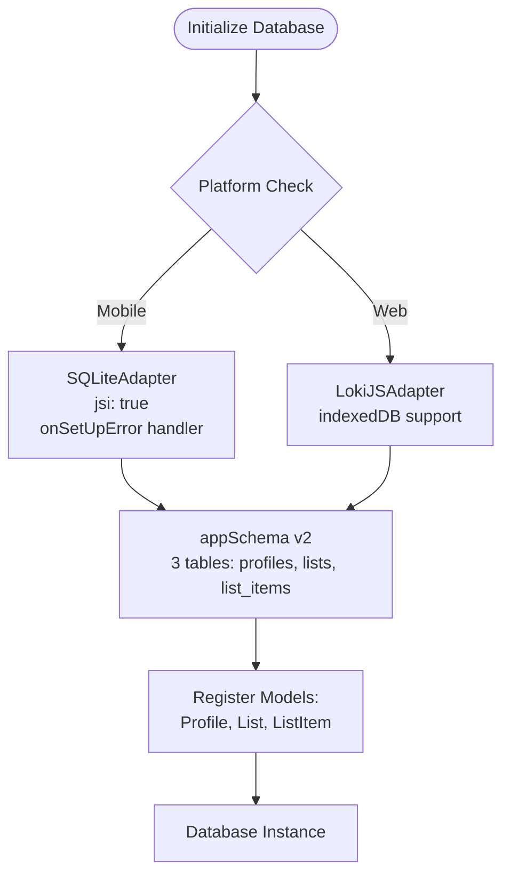

**Diagram sources**
- [database.ts:12-32](file://src/database/index.ts#L12-L32)
- [schema.ts:3-45](file://src/database/schema.ts#L3-L45)

**Section sources**
- [database.ts:1-33](file://src/database/index.ts#L1-L33)
- [schema.ts:1-46](file://src/database/schema.ts#L1-L46)

### Database Models and Associations
Each domain entity is represented as a WatermelonDB model with proper associations:
- Profile model with has_many association to List model
- List model with belongs_to Profile and has_many association to ListItem
- ListItem model with belongs_to List relationship
- All models include proper decorators for field types and relationships

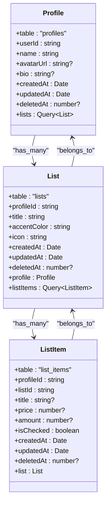

**Diagram sources**
- [Profile.ts:6-20](file://src/database/models/Profile.ts#L6-L20)
- [List.ts:7-22](file://src/database/models/List.ts#L7-L22)
- [ListItem.ts:6-19](file://src/database/models/ListItem.ts#L6-L19)

**Section sources**
- [Profile.ts:1-21](file://src/database/models/Profile.ts#L1-L21)
- [List.ts:1-23](file://src/database/models/List.ts#L1-L23)
- [ListItem.ts:1-20](file://src/database/models/ListItem.ts#L1-L20)

### Database Operations Layer
The operations layer provides transaction-safe CRUD functionality:
- All write operations wrapped in database.write() blocks
- Query operations using WatermelonDB's Query builder with proper filtering
- Soft delete pattern using deleted_at field instead of hard deletion
- Proper error handling and transaction rollback on failures

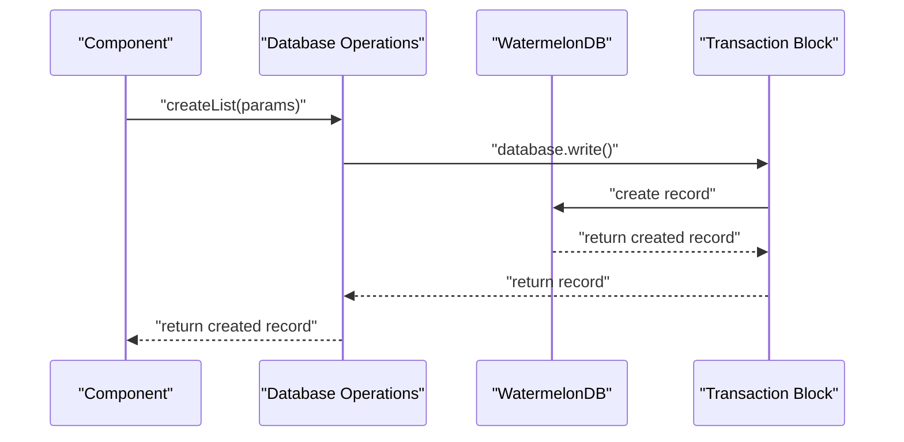

**Diagram sources**
- [lists.ts:27-36](file://src/database/operations/lists.ts#L27-L36)
- [profiles.ts:25-34](file://src/database/operations/profiles.ts#L25-L34)
- [listItems.ts:27-38](file://src/database/operations/listItems.ts#L27-L38)

**Section sources**
- [profiles.ts:1-63](file://src/database/operations/profiles.ts#L1-L63)
- [lists.ts:1-65](file://src/database/operations/lists.ts#L1-L65)
- [listItems.ts:1-79](file://src/database/operations/listItems.ts#L1-L79)

### Explicit Synchronization with Supabase RPC
The synchronization system uses explicit synchronize() function with Supabase RPC:
- pull RPC function retrieves changes since lastPulledAt timestamp
- push RPC function sends local changes to server
- Real-time subscription triggers manual sync via subscribeToRealtimeSync()
- Proper error handling and retry logic in isSyncing guard

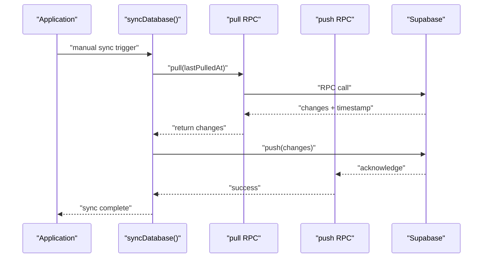

**Diagram sources**
- [sync.ts:8-34](file://src/database/sync.ts#L8-L34)
- [sync.ts:17-28](file://src/database/sync.ts#L17-L28)

**Section sources**
- [sync.ts:1-57](file://src/database/sync.ts#L1-L57)

### Authentication State Management
Authentication state is now managed separately with SecureStore persistence:
- Current user stored in memory with SecureStore backup
- Session information persisted separately
- Real-time subscription to authentication state changes
- Support for both guest and authenticated user states

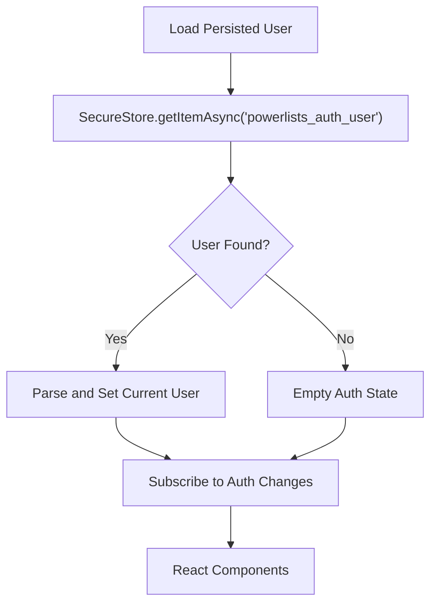

**Diagram sources**
- [auth-state.ts:44-54](file://src/features/auth/authState.ts#L44-L54)
- [auth-state.ts:23-42](file://src/features/auth/authState.ts#L23-L42)

**Section sources**
- [auth-state.ts:1-67](file://src/features/auth/authState.ts#L1-L67)
- [use-auth.ts:44-91](file://src/hooks/use-auth.ts#L44-L91)

### Database Operations and State Validation
Database operations provide comprehensive CRUD functionality:
- Create operations with proper field validation and timestamp setting
- Update operations with selective field updates and timestamp refresh
- Delete operations using soft delete pattern with proper cleanup
- Query operations with proper filtering and ordering

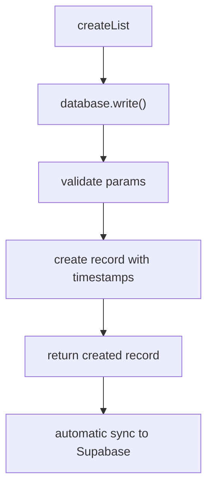

**Diagram sources**
- [lists.ts:16-36](file://src/database/operations/lists.ts#L16-L36)
- [profiles.ts:14-35](file://src/database/operations/profiles.ts#L14-L35)
- [listItems.ts:12-38](file://src/database/operations/listItems.ts#L12-L38)

**Section sources**
- [lists.ts:1-65](file://src/database/operations/lists.ts#L1-L65)
- [profiles.ts:1-63](file://src/database/operations/profiles.ts#L1-L63)
- [listItems.ts:1-79](file://src/database/operations/listItems.ts#L1-L79)

### Service Orchestration: Guest-to-User Data Migration
The SyncService handles cross-cutting operations with database operations:
- Detects guest data using database queries
- Prompts user for migration decision
- Performs transaction-safe migration via database operations
- Provides proper error handling and user feedback

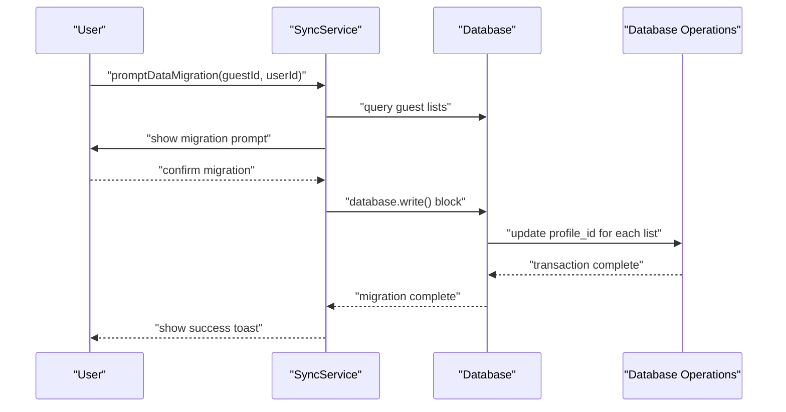

**Diagram sources**
- [sync-service.ts:103-151](file://src/services/sync.ts#L103-L151)
- [sync-service.ts:167-203](file://src/services/sync.ts#L167-L203)

**Section sources**
- [sync-service.ts:1-205](file://src/services/sync.ts#L1-L205)

### React Integration: Database Operations and UI Updates
React components now interact directly with database operations:
- Components import specific database operations for data access
- No more observer pattern or useValue hooks for state management
- Direct database queries and mutations through operations layer
- Manual sync triggers when needed for real-time updates

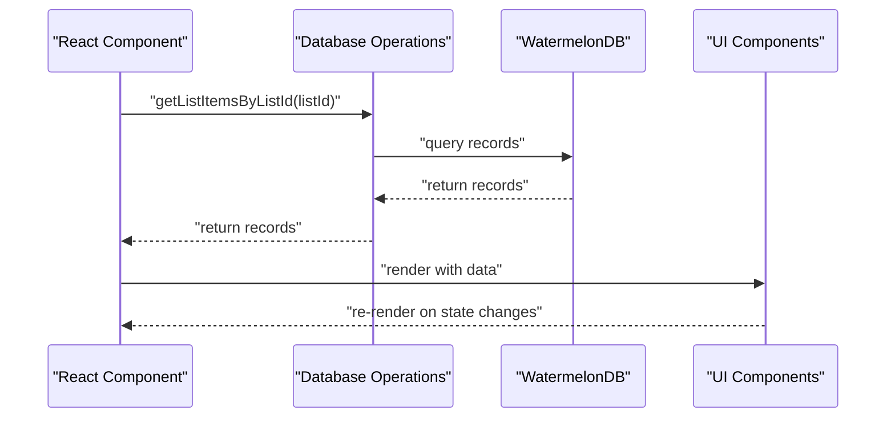

**Diagram sources**
- [lists page:24-95](file://src/features/lists/page.tsx#L24-L95)
- [onboarding hook:5-16](file://src/features/onboarding/hooks/use-onboarding-first-access.ts#L5-L16)

**Section sources**
- [lists page:1-98](file://src/features/lists/page.tsx#L1-L98)
- [onboarding hook:1-16](file://src/features/onboarding/hooks/use-onboarding-first-access.ts#L1-L16)

## Dependency Analysis
The new architecture has simplified dependencies:
- Database layer depends on WatermelonDB core and platform adapters
- Operations layer depends on database instance and model classes
- Authentication layer depends on SecureStore and Supabase auth
- Service layer depends on database operations and toast service
- React components depend on specific database operations

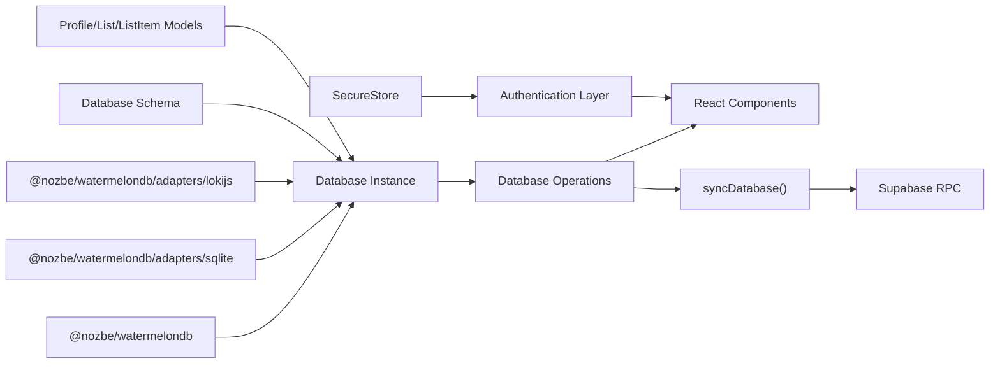

**Diagram sources**
- [database.ts:12-32](file://src/database/index.ts#L12-L32)
- [schema.ts:3-45](file://src/database/schema.ts#L3-L45)
- [auth-state.ts:44-54](file://src/features/auth/authState.ts#L44-L54)
- [sync.ts:15-30](file://src/database/sync.ts#L15-L30)

**Section sources**
- [database.ts:1-33](file://src/database/index.ts#L1-L33)
- [auth-state.ts:1-67](file://src/features/auth/authState.ts#L1-L67)
- [sync.ts:1-57](file://src/database/sync.ts#L1-L57)

## Performance Considerations
- Database-first design eliminates reactive overhead:
  - Direct database queries instead of observable stores
  - Explicit transaction boundaries for batch operations
  - Platform-specific adapters optimized for each environment
- Query performance:
  - Proper indexing on foreign key columns (profile_id, list_id)
  - Efficient query patterns using WatermelonDB's Query builder
  - Batch operations within database.write() blocks
- Synchronization efficiency:
  - Explicit sync triggers prevent unnecessary background sync
  - Pull/push RPC operations with proper error handling
  - Real-time subscription only triggers manual sync when needed
- Memory management:
  - SecureStore for persistent authentication state
  - Lightweight in-memory state for current user/session

## Troubleshooting Guide
- Database initialization:
  - Verify SQLite/LokiJS adapter initialization based on platform
  - Check database schema version matches expected version
  - Ensure model classes are properly registered
- Synchronization issues:
  - Monitor isSyncing guard to prevent concurrent sync operations
  - Check pull RPC function returns proper changes and timestamp
  - Verify push RPC function acknowledges all changes
- Authentication problems:
  - Ensure SecureStore is properly initialized and accessible
  - Verify authentication state persistence and restoration
  - Check real-time subscription to authentication changes
- Database operations:
  - Wrap all write operations in database.write() blocks
  - Handle transaction failures and rollbacks appropriately
  - Use proper error handling for database queries

**Section sources**
- [database.ts:24-27](file://src/database/index.ts#L24-L27)
- [sync.ts:9-11](file://src/database/sync.ts#L9-L11)
- [auth-state.ts:44-54](file://src/features/auth/authState.ts#L44-L54)

## Conclusion
PowerLists has successfully transitioned from LegendAppState to a robust WatermelonDB-based database-first architecture. The new system provides better control over synchronization, improved transaction handling, and more predictable state management. The explicit synchronization approach with Supabase RPC functions offers better error management and debugging capabilities. The database-centric design with proper transaction boundaries ensures data integrity and consistency across devices.

## Appendices
- Database initialization and schema:
  - WatermelonDB schema version 2 with proper table definitions
  - Platform-specific adapter selection for optimal performance
  - Migration support for schema evolution
- Synchronization strategy:
  - Explicit sync via synchronize() function with pull/push RPC
  - Real-time subscription triggers manual sync
  - Proper error handling and retry logic
- Authentication management:
  - SecureStore persistence for user sessions
  - In-memory state management with real-time updates
  - Support for guest and authenticated user states
- Best practices:
  - Always use database.write() blocks for transactions
  - Implement proper error handling for all database operations
  - Use explicit sync triggers for real-time updates
  - Leverage Soft delete pattern for data integrity