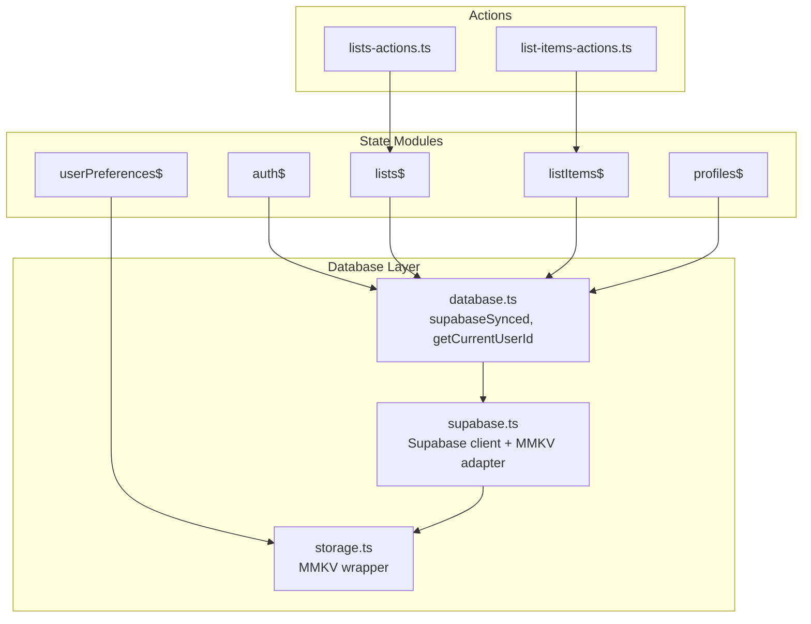
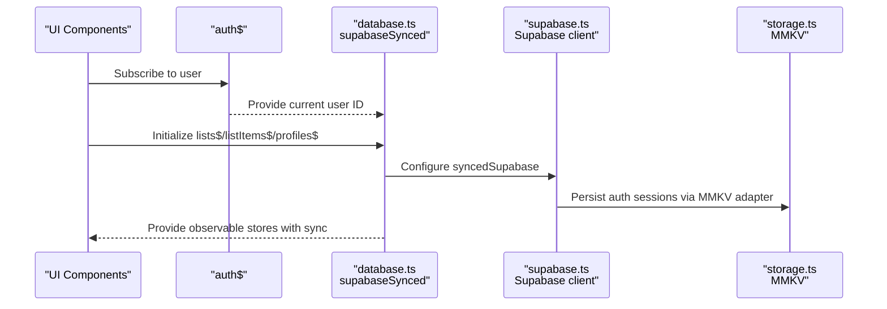
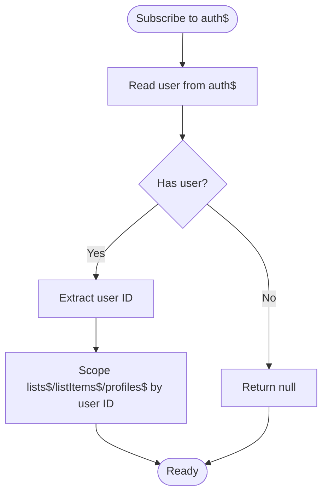
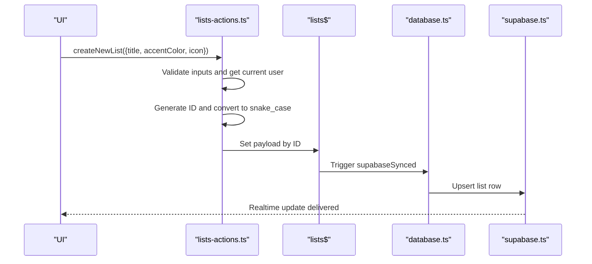
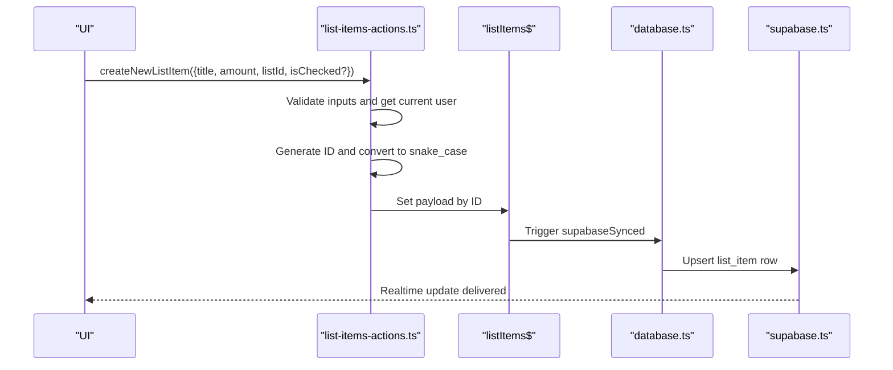
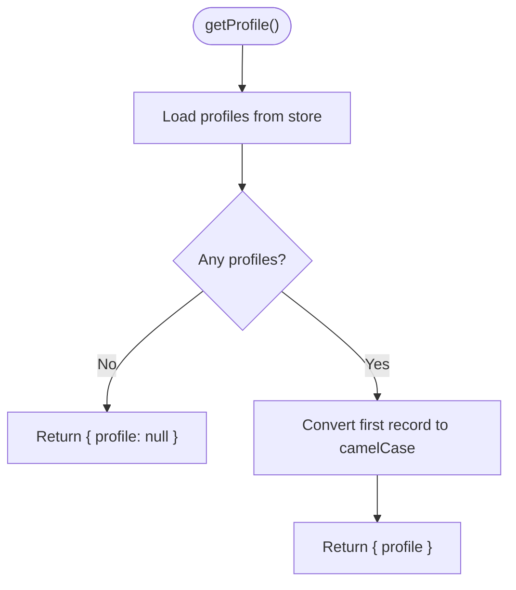
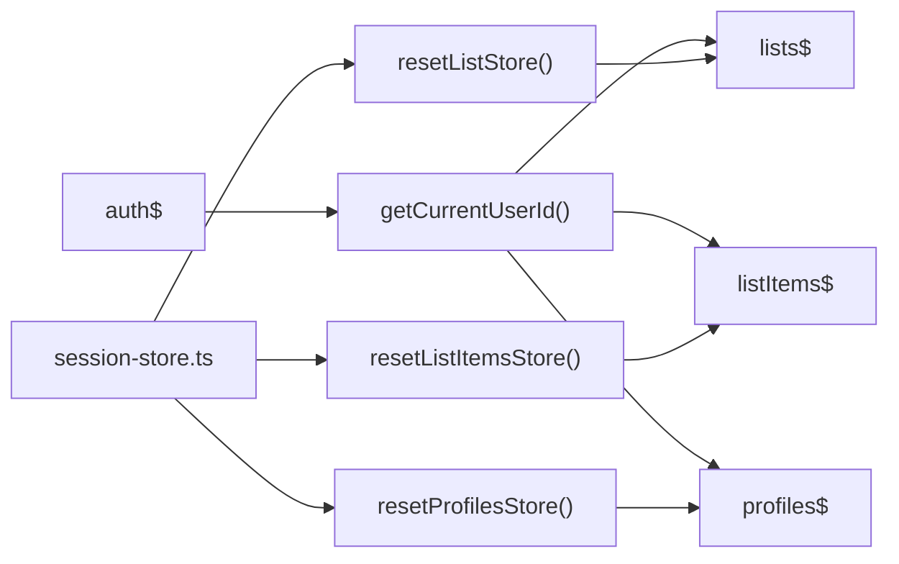

# State Modules and Data Models

<cite>
**Referenced Files in This Document**
- [auth.ts](file://src/data/states/auth.ts)
- [lists.ts](file://src/data/states/lists.ts)
- [list-items.ts](file://src/data/states/list-items.ts)
- [profile.ts](file://src/data/states/profile.ts)
- [user-preferences.ts](file://src/data/states/user-preferences.ts)
- [database.ts](file://src/data/database.ts)
- [session-store.ts](file://src/data/session-store.ts)
- [storage.ts](file://src/data/storage.ts)
- [supabase.ts](file://src/lib/supabase/supabase.ts)
- [lists-actions.ts](file://src/data/actions/lists.ts)
- [list-items-actions.ts](file://src/data/actions/list-items.ts)
- [user-types.ts](file://src/data/types/user.ts)
- [profile-types.ts](file://src/data/types/profile.ts)
- [list-types.ts](file://src/data/types/list.ts)
- [list-item-types.ts](file://src/data/types/list-item.ts)
</cite>

## Table of Contents
1. [Introduction](#introduction)
2. [Project Structure](#project-structure)
3. [Core Components](#core-components)
4. [Architecture Overview](#architecture-overview)
5. [Detailed Component Analysis](#detailed-component-analysis)
6. [Dependency Analysis](#dependency-analysis)
7. [Performance Considerations](#performance-considerations)
8. [Troubleshooting Guide](#troubleshooting-guide)
9. [Conclusion](#conclusion)

## Introduction
This document explains the state modules and data models used in PowerLists. It focuses on five state modules: auth$, lists$, listItems$, profile$, and userPreferences$. For each module, we describe the state structure, data types, validation rules, and business logic. We also detail relationships between modules, data flow patterns, and composition strategies. Finally, we provide examples of state operations, data transformations, and integrations with Supabase and local persistence.

## Project Structure
The state system is organized around observable stores backed by LegendAppState and synchronized with Supabase. Persistence is handled via MMKV for both Supabase sync metadata and user preferences. The database layer centralizes Supabase configuration and shared sync behavior.

**Diagram sources**
- [database.ts:13-35](file://src/data/database.ts#L13-L35)
- [supabase.ts:21-28](file://src/lib/supabase/supabase.ts#L21-L28)
- [storage.ts:14-23](file://src/data/storage.ts#L14-L23)
- [lists-actions.ts:1-211](file://src/data/actions/lists.ts#L1-L211)
- [list-items-actions.ts:1-193](file://src/data/actions/list-items.ts#L1-L193)

**Section sources**
- [database.ts:13-35](file://src/data/database.ts#L13-L35)
- [supabase.ts:21-28](file://src/lib/supabase/supabase.ts#L21-L28)
- [storage.ts:14-23](file://src/data/storage.ts#L14-L23)

## Core Components

### Auth State Module (auth$)
- Purpose: Holds the current user, session, initialization flag, and loading state.
- Persistence: User data is persisted locally via MMKV.
- Key fields:
  - user: UserType (supports guest and authenticated users)
  - session: Session | null
  - isInitialized: boolean
  - isLoading: boolean
- Validation and business logic:
  - The user ID is derived via getCurrentUserId() from auth$.
  - Real-time filtering for lists and list items relies on the current user ID.
- Integration:
  - Provides getCurrentUserId() used by other stores to scope queries.
  - Triggers session resets when the user changes.

**Section sources**
- [auth.ts:8-33](file://src/data/states/auth.ts#L8-L33)
- [database.ts:31-35](file://src/data/database.ts#L31-L35)
- [session-store.ts:10-23](file://src/data/session-store.ts#L10-L23)

### Lists State Module (lists$)
- Purpose: Synchronizes lists scoped to the current user.
- Data model: Records keyed by list ID mapped to list objects.
- Sync configuration:
  - Collection: lists
  - Select: includes list metadata and nested list_items with selected fields
  - Filter: profile_id equals current user ID
  - Actions: read, create, update, delete
  - Persistence: MMKV-backed with retry on sync failures
  - Realtime: filter by profile_id
- Business logic:
  - getAllLists() converts the store object to an array and camelizes keys.
  - createNewList(), updateList(), deleteList() enforce required fields and transform to/from snake_case.
- Composition:
  - Uses supabaseSynced configured centrally in database.ts.

**Section sources**
- [lists.ts:5-26](file://src/data/states/lists.ts#L5-L26)
- [lists-actions.ts:37-52](file://src/data/actions/lists.ts#L37-L52)
- [lists-actions.ts:79-122](file://src/data/actions/lists.ts#L79-L122)
- [lists-actions.ts:144-170](file://src/data/actions/lists.ts#L144-L170)
- [lists-actions.ts:187-203](file://src/data/actions/lists.ts#L187-L203)
- [database.ts:13-29](file://src/data/database.ts#L13-L29)

### List Items State Module (listItems$)
- Purpose: Synchronizes list items scoped to the current user.
- Data model: Records keyed by item ID mapped to item objects.
- Sync configuration:
  - Collection: list_items
  - Select: all fields
  - Filter: profile_id equals current user ID
  - Actions: read, create, update, delete
  - Persistence: MMKV-backed
  - Realtime: filter by profile_id
- Business logic:
  - getAllListItems() and getListItemsByListId() filter by list_id and camelize results.
  - createNewListItem(), updateListItem(), toggleCheckListItem(), deleteListItem() enforce required fields and transform to/from snake_case.
- Composition:
  - Uses supabaseSynced configured centrally in database.ts.

**Section sources**
- [list-items.ts:5-23](file://src/data/states/list-items.ts#L5-L23)
- [list-items-actions.ts:18-29](file://src/data/actions/list-items.ts#L18-L29)
- [list-items-actions.ts:34-48](file://src/data/actions/list-items.ts#L34-L48)
- [list-items-actions.ts:53-104](file://src/data/actions/list-items.ts#L53-L104)
- [list-items-actions.ts:109-127](file://src/data/actions/list-items.ts#L109-L127)
- [list-items-actions.ts:132-166](file://src/data/actions/list-items.ts#L132-L166)
- [list-items-actions.ts:171-186](file://src/data/actions/list-items.ts#L171-L186)
- [database.ts:13-29](file://src/data/database.ts#L13-L29)

### Profile State Module (profiles$)
- Purpose: Manages the current user’s profile record.
- Data model: Records keyed by profile ID mapped to profile objects.
- Sync configuration:
  - Collection: profiles
  - Filter: id equals current user ID
  - Actions: read, create, update, delete
  - Persistence: MMKV-backed with retry on sync failures
- Business logic:
  - getProfile(): returns the single profile for the current user after converting keys to camelCase.
  - createProfile(): validates presence of name, generates a new ID, converts to snake_case, and writes to the store.
  - updateProfile(): validates name, updates fields, sets updated_at, and returns the updated profile.
  - deleteProfile(): deletes the current profile.
  - resetProfilesStore(): clears the store and persisted metadata.
- Composition:
  - Uses supabaseSynced configured centrally in database.ts.

**Section sources**
- [profile.ts:10-20](file://src/data/states/profile.ts#L10-L20)
- [profile.ts:33-48](file://src/data/states/profile.ts#L33-L48)
- [profile.ts:61-103](file://src/data/states/profile.ts#L61-L103)
- [profile.ts:121-159](file://src/data/states/profile.ts#L121-L159)
- [profile.ts:171-186](file://src/data/states/profile.ts#L171-L186)
- [profile.ts:188-193](file://src/data/states/profile.ts#L188-L193)
- [database.ts:13-29](file://src/data/database.ts#L13-L29)

### User Preferences State Module (userPreferences$)
- Purpose: Stores theme, color scheme, and background color preferences.
- Data model: Observable with typed UserPreferences.
- Persistence: MMKV-backed with retry on sync failures.
- Validation and business logic:
  - Enforces theme key from available theme set and colorScheme union type.
  - Defaults are applied on initialization.

**Section sources**
- [user-preferences.ts:6-27](file://src/data/states/user-preferences.ts#L6-L27)

## Architecture Overview
The state architecture combines observable stores with Supabase real-time synchronization and local persistence. The database layer configures supabaseSynced globally, enabling consistent behavior across stores. The Supabase client integrates with MMKV for auth persistence. A session watcher resets scoped stores when the user changes.

**Diagram sources**
- [database.ts:13-29](file://src/data/database.ts#L13-L29)
- [supabase.ts:21-28](file://src/lib/supabase/supabase.ts#L21-L28)
- [storage.ts:65-73](file://src/data/storage.ts#L65-L73)

## Detailed Component Analysis

### Auth State Module (auth$)
- State structure:
  - user: UserType (supports guest and authenticated users)
  - session: Session | null
  - isInitialized: boolean
  - isLoading: boolean
- Data types:
  - UserType and guest type definitions support flexible identity handling.
- Validation rules:
  - No explicit runtime validations here; downstream logic checks for null user ID.
- Business logic:
  - Used by getCurrentUserId() to scope other stores.
  - Session reset triggers store resets via session-store.ts.

**Diagram sources**
- [auth.ts:31-35](file://src/data/database.ts#L31-L35)

**Section sources**
- [auth.ts:8-33](file://src/data/states/auth.ts#L8-L33)
- [user-types.ts:3-13](file://src/data/types/user.ts#L3-L13)
- [session-store.ts:10-23](file://src/data/session-store.ts#L10-L23)

### Lists State Module (lists$)
- State structure:
  - Map-like records keyed by list ID.
  - Nested list_items included in select for efficient UI rendering.
- Data types:
  - List interface defines shape and optional fields.
- Validation rules:
  - createNewList() requires title, accentColor, icon and current user.
  - updateList() requires id and all required fields.
  - deleteList() requires id.
- Business logic:
  - getAllLists() converts store object to array and camelizes keys.
  - Payloads are transformed to snake_case for Supabase.

**Diagram sources**
- [lists-actions.ts:79-122](file://src/data/actions/lists.ts#L79-L122)
- [lists.ts:5-26](file://src/data/states/lists.ts#L5-L26)
- [database.ts:13-29](file://src/data/database.ts#L13-L29)
- [supabase.ts:21-28](file://src/lib/supabase/supabase.ts#L21-L28)

**Section sources**
- [lists.ts:5-26](file://src/data/states/lists.ts#L5-L26)
- [lists-actions.ts:37-52](file://src/data/actions/lists.ts#L37-L52)
- [lists-actions.ts:79-122](file://src/data/actions/lists.ts#L79-L122)
- [lists-actions.ts:144-170](file://src/data/actions/lists.ts#L144-L170)
- [lists-actions.ts:187-203](file://src/data/actions/lists.ts#L187-L203)
- [list-types.ts:3-16](file://src/data/types/list.ts#L3-L16)

### List Items State Module (listItems$)
- State structure:
  - Map-like records keyed by item ID.
- Data types:
  - ListItem interface defines shape and optional fields.
- Validation rules:
  - createNewListItem() requires title, amount, listId, and current user.
  - toggleCheckListItem() requires id and boolean isChecked.
  - updateListItem() requires id and at least one updatable field.
  - deleteListItem() requires itemId.
- Business logic:
  - Filters items by list_id for list-specific views.
  - Payloads are transformed to snake_case for Supabase.

**Diagram sources**
- [list-items-actions.ts:53-104](file://src/data/actions/list-items.ts#L53-L104)
- [list-items.ts:5-23](file://src/data/states/list-items.ts#L5-L23)
- [database.ts:13-29](file://src/data/database.ts#L13-L29)
- [supabase.ts:21-28](file://src/lib/supabase/supabase.ts#L21-L28)

**Section sources**
- [list-items.ts:5-23](file://src/data/states/list-items.ts#L5-L23)
- [list-items-actions.ts:18-29](file://src/data/actions/list-items.ts#L18-L29)
- [list-items-actions.ts:34-48](file://src/data/actions/list-items.ts#L34-L48)
- [list-items-actions.ts:53-104](file://src/data/actions/list-items.ts#L53-L104)
- [list-items-actions.ts:109-127](file://src/data/actions/list-items.ts#L109-L127)
- [list-items-actions.ts:132-166](file://src/data/actions/list-items.ts#L132-L166)
- [list-items-actions.ts:171-186](file://src/data/actions/list-items.ts#L171-L186)
- [list-item-types.ts:1-12](file://src/data/types/list-item.ts#L1-L12)

### Profile State Module (profiles$)
- State structure:
  - Map-like records keyed by profile ID.
- Data types:
  - ProfileType defines shape and optional fields.
- Validation rules:
  - createProfile() requires name; generates ID and sets timestamps.
  - updateProfile() requires name; updates optional fields and timestamps.
  - deleteProfile() requires existing profile.
- Business logic:
  - getProfile() returns the single profile for the current user.
  - resetProfilesStore() clears store and persisted metadata.

**Diagram sources**
- [profile.ts:33-48](file://src/data/states/profile.ts#L33-L48)

**Section sources**
- [profile.ts:10-20](file://src/data/states/profile.ts#L10-L20)
- [profile.ts:33-48](file://src/data/states/profile.ts#L33-L48)
- [profile.ts:61-103](file://src/data/states/profile.ts#L61-L103)
- [profile.ts:121-159](file://src/data/states/profile.ts#L121-L159)
- [profile.ts:171-186](file://src/data/states/profile.ts#L171-L186)
- [profile.ts:188-193](file://src/data/states/profile.ts#L188-L193)
- [profile-types.ts:11-19](file://src/data/types/profile.ts#L11-L19)

### User Preferences State Module (userPreferences$)
- State structure:
  - Typed observable with defaults for theme, colorScheme, and backgroundColor.
- Data types:
  - UserPreferences enforces allowed theme keys and colorScheme union.
- Validation and business logic:
  - Persisted via MMKV with retry on sync failures.
  - Defaults applied on initialization.

**Section sources**
- [user-preferences.ts:6-27](file://src/data/states/user-preferences.ts#L6-L27)

## Dependency Analysis
The state modules share a common synchronization layer and depend on the current user ID for scoping. The session watcher ensures stores are reset when the user changes.

**Diagram sources**
- [database.ts:31-35](file://src/data/database.ts#L31-L35)
- [lists-actions.ts:205-210](file://src/data/actions/lists.ts#L205-L210)
- [list-items-actions.ts:188-192](file://src/data/actions/list-items.ts#L188-L192)
- [profile.ts:188-193](file://src/data/states/profile.ts#L188-L193)
- [session-store.ts:10-23](file://src/data/session-store.ts#L10-L23)

**Section sources**
- [database.ts:31-35](file://src/data/database.ts#L31-L35)
- [lists-actions.ts:205-210](file://src/data/actions/lists.ts#L205-L210)
- [list-items-actions.ts:188-192](file://src/data/actions/list-items.ts#L188-L192)
- [profile.ts:188-193](file://src/data/states/profile.ts#L188-L193)
- [session-store.ts:10-23](file://src/data/session-store.ts#L10-L23)

## Performance Considerations
- Supabase sync mode is configured to merge changes and use last-sync tracking, reducing redundant fetches.
- Persistence retries are enabled for robustness.
- Real-time filters restrict data volume per user.
- Consider batching updates and avoiding excessive recomputation in UI components by subscribing to specific fields rather than entire objects.

## Troubleshooting Guide
- Authentication issues:
  - Verify getCurrentUserId() returns a non-null value before performing scoped operations.
  - Ensure session persistence is active and MMKV adapter is configured.
- Sync failures:
  - Check persisted metadata keys for lists, list_items, and profiles; clearing them may resolve stale state.
- Validation errors:
  - Creation/update actions log and return null on failure; confirm required fields and current user presence.

**Section sources**
- [database.ts:31-35](file://src/data/database.ts#L31-L35)
- [supabase.ts:21-28](file://src/lib/supabase/supabase.ts#L21-L28)
- [lists-actions.ts:114-121](file://src/data/actions/lists.ts#L114-L121)
- [list-items-actions.ts:100-103](file://src/data/actions/list-items.ts#L100-L103)
- [lists-actions.ts:205-210](file://src/data/actions/lists.ts#L205-L210)
- [list-items-actions.ts:188-192](file://src/data/actions/list-items.ts#L188-L192)
- [profile.ts:188-193](file://src/data/states/profile.ts#L188-L193)

## Conclusion
PowerLists’ state system leverages observable stores with centralized Supabase synchronization and MMKV persistence. The auth$ module scopes downstream stores, while lists$, listItems$, and profiles$ encapsulate CRUD operations with consistent data transformation. userPreferences$ manages UI preferences with typed defaults. Together, these modules provide a cohesive, scalable foundation for list management and user customization.