# Supabase Real-time Synchronization

<cite>
**Referenced Files in This Document**
- [supabase.ts](file://src/lib/supabase/supabase.ts)
- [database.ts](file://src/data/database.ts)
- [lists.ts](file://src/data/states/lists.ts)
- [auth.ts](file://src/data/states/auth.ts)
- [storage.ts](file://src/data/storage.ts)
- [sync.ts](file://src/services/sync.ts)
- [use-auth.ts](file://src/hooks/use-auth.ts)
- [utils.ts](file://src/data/utils.ts)
</cite>

## Table of Contents
1. [Introduction](#introduction)
2. [Project Structure](#project-structure)
3. [Core Components](#core-components)
4. [Architecture Overview](#architecture-overview)
5. [Detailed Component Analysis](#detailed-component-analysis)
6. [Dependency Analysis](#dependency-analysis)
7. [Performance Considerations](#performance-considerations)
8. [Troubleshooting Guide](#troubleshooting-guide)
9. [Conclusion](#conclusion)

## Introduction
This document explains the Supabase real-time synchronization system used in the application. It covers how the synchronization is configured, how connections are managed, and how data is synchronized between the client and Supabase. It also documents merge mode configuration, conflict resolution, last-sync tracking, authentication integration, user context management, and real-time data updates. Practical examples, error handling, retry mechanisms, and performance optimization strategies are included to help developers implement and maintain reliable real-time synchronization.

## Project Structure
The real-time synchronization relies on three primary areas:
- Supabase client configuration and persistence adapter
- Global synchronization configuration via LegendApp State
- Observable state collections bound to Supabase tables with real-time subscriptions

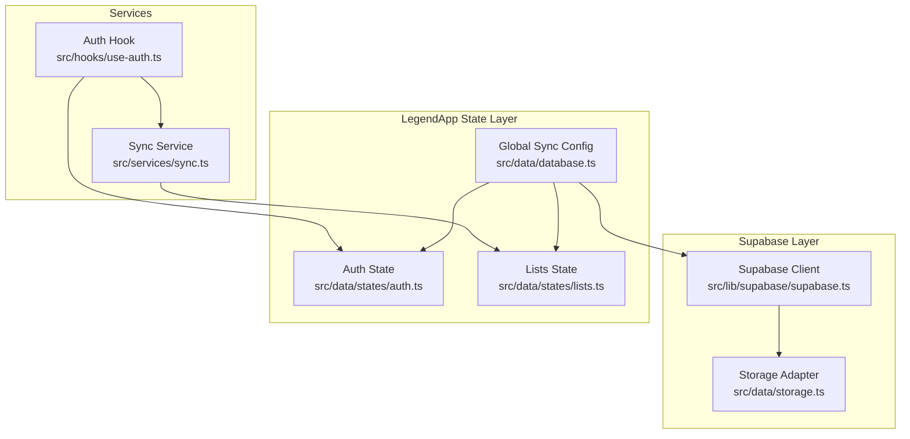

**Diagram sources**
- [supabase.ts:1-29](file://src/lib/supabase/supabase.ts#L1-L29)
- [database.ts:1-36](file://src/data/database.ts#L1-L36)
- [lists.ts:1-27](file://src/data/states/lists.ts#L1-L27)
- [auth.ts:1-34](file://src/data/states/auth.ts#L1-L34)
- [storage.ts:1-74](file://src/data/storage.ts#L1-L74)
- [sync.ts:1-203](file://src/services/sync.ts#L1-L203)
- [use-auth.ts:1-261](file://src/hooks/use-auth.ts#L1-L261)

**Section sources**
- [supabase.ts:1-29](file://src/lib/supabase/supabase.ts#L1-L29)
- [database.ts:1-36](file://src/data/database.ts#L1-L36)
- [lists.ts:1-27](file://src/data/states/lists.ts#L1-L27)
- [auth.ts:1-34](file://src/data/states/auth.ts#L1-L34)
- [storage.ts:1-74](file://src/data/storage.ts#L1-L74)
- [sync.ts:1-203](file://src/services/sync.ts#L1-L203)
- [use-auth.ts:1-261](file://src/hooks/use-auth.ts#L1-L261)

## Core Components
- Supabase client with MMKV-backed auth storage
- Global synchronization configuration with merge mode and last-sync tracking
- Observable state collections bound to Supabase tables with real-time filters
- Authentication state management integrated with Supabase sessions
- Guest-to-user data migration service leveraging LegendApp State’s automatic synchronization

Key configuration highlights:
- Merge mode ensures local and remote changes are merged rather than overwritten
- Last-sync tracking enables incremental synchronization
- Retry policies are configured for persistent synchronization attempts
- Real-time subscriptions are scoped to the current user via dynamic filters

**Section sources**
- [supabase.ts:1-29](file://src/lib/supabase/supabase.ts#L1-L29)
- [database.ts:13-29](file://src/data/database.ts#L13-L29)
- [lists.ts:5-26](file://src/data/states/lists.ts#L5-L26)
- [auth.ts:22-33](file://src/data/states/auth.ts#L22-L33)
- [sync.ts:41-202](file://src/services/sync.ts#L41-L202)

## Architecture Overview
The system architecture integrates Supabase authentication and real-time subscriptions with LegendApp State for reactive, offline-capable synchronization.

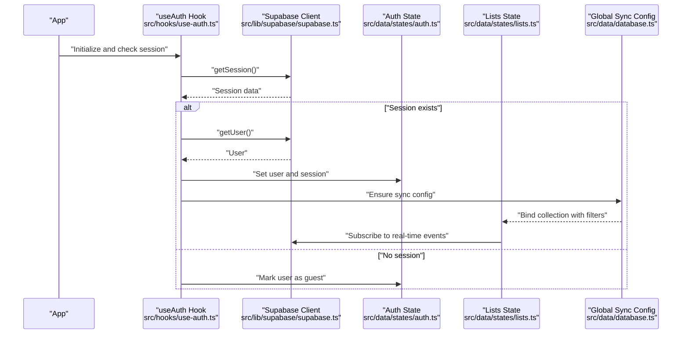

**Diagram sources**
- [use-auth.ts:231-258](file://src/hooks/use-auth.ts#L231-L258)
- [supabase.ts:21-28](file://src/lib/supabase/supabase.ts#L21-L28)
- [auth.ts:22-33](file://src/data/states/auth.ts#L22-L33)
- [database.ts:13-29](file://src/data/database.ts#L13-L29)
- [lists.ts:5-26](file://src/data/states/lists.ts#L5-L26)

## Detailed Component Analysis

### Supabase Client Configuration
- Creates the Supabase client with environment variables for URL and anonymous key
- Uses an MMKV-backed storage adapter for auth persistence
- Enables automatic token refresh and persistent sessions

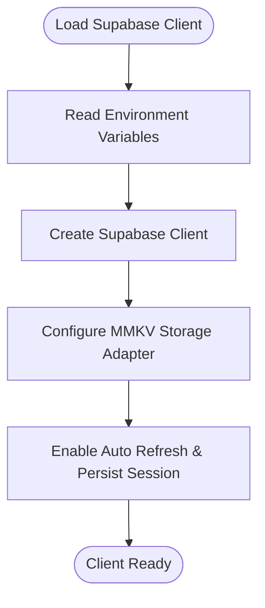

**Diagram sources**
- [supabase.ts:6-28](file://src/lib/supabase/supabase.ts#L6-L28)

**Section sources**
- [supabase.ts:1-29](file://src/lib/supabase/supabase.ts#L1-L29)

### Global Synchronization Configuration
- Configures LegendApp State’s Supabase sync plugin globally
- Sets merge mode, last-sync tracking, and field names for timestamps and deletion markers
- Enables persistent storage with retry and infinite retry policy
- Provides a helper to derive the current user ID for scoping queries and filters

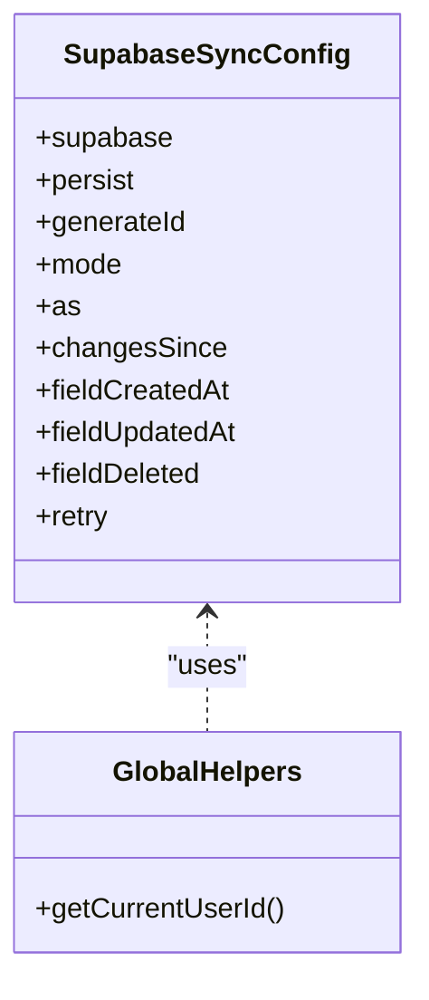

**Diagram sources**
- [database.ts:13-29](file://src/data/database.ts#L13-L29)
- [database.ts:31-35](file://src/data/database.ts#L31-L35)

**Section sources**
- [database.ts:1-36](file://src/data/database.ts#L1-L36)
- [utils.ts:1-6](file://src/data/utils.ts#L1-L6)

### Lists State and Real-time Subscriptions
- Defines the lists observable bound to the Supabase collection
- Selects specific fields and includes nested relations
- Filters records by the current user’s profile_id
- Enables read/create/update/delete actions and retries
- Configures real-time subscription with a dynamic filter based on the current user

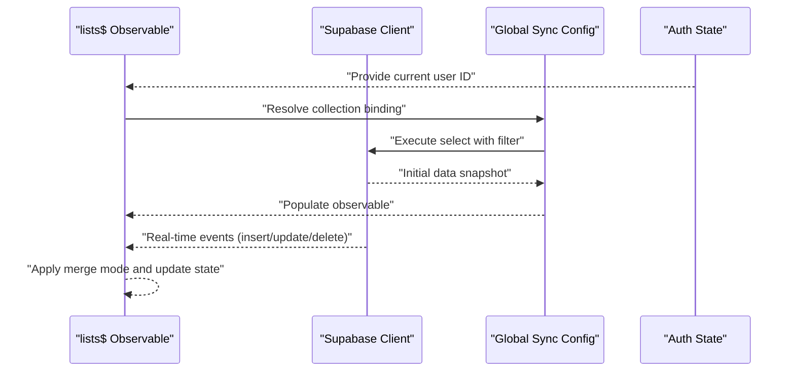

**Diagram sources**
- [lists.ts:5-26](file://src/data/states/lists.ts#L5-L26)
- [auth.ts:22-33](file://src/data/states/auth.ts#L22-L33)
- [database.ts:13-29](file://src/data/database.ts#L13-L29)

**Section sources**
- [lists.ts:1-27](file://src/data/states/lists.ts#L1-L27)

### Authentication Integration and User Context Management
- Initializes and checks sessions, syncing with Supabase when available
- Converts guest users to authenticated users and updates local state accordingly
- Manages session lifecycle and clears storage on sign out
- Integrates with the Supabase client’s auth hooks and session detection

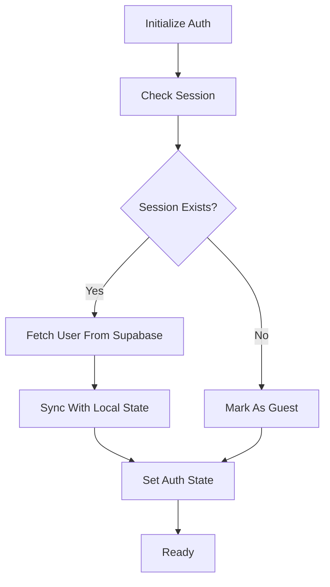

**Diagram sources**
- [use-auth.ts:29-74](file://src/hooks/use-auth.ts#L29-L74)
- [use-auth.ts:231-258](file://src/hooks/use-auth.ts#L231-L258)

**Section sources**
- [use-auth.ts:1-261](file://src/hooks/use-auth.ts#L1-L261)
- [auth.ts:1-34](file://src/data/states/auth.ts#L1-L34)

### Guest-to-User Data Migration Service
- Detects whether a guest has local data and prompts migration
- Migrates lists by updating the profile_id to the authenticated user’s ID
- Relies on LegendApp State’s automatic synchronization to push changes to Supabase
- Provides success/error feedback via toasts

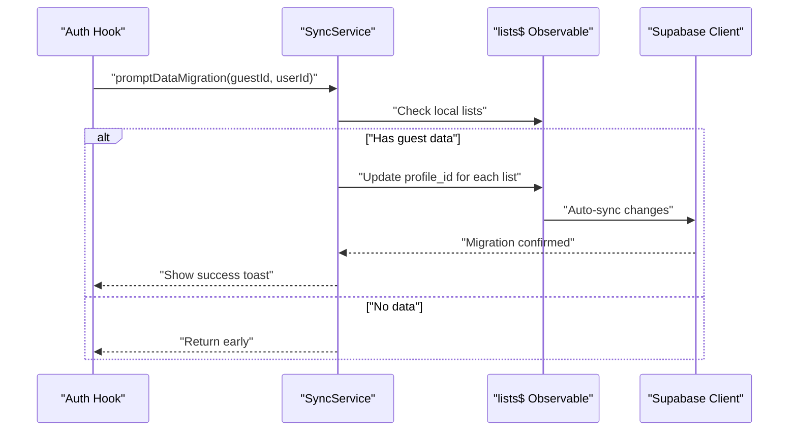

**Diagram sources**
- [sync.ts:102-150](file://src/services/sync.ts#L102-L150)
- [sync.ts:166-201](file://src/services/sync.ts#L166-L201)
- [lists.ts:5-26](file://src/data/states/lists.ts#L5-L26)

**Section sources**
- [sync.ts:1-203](file://src/services/sync.ts#L1-L203)

### Merge Mode Configuration and Conflict Resolution
- Merge mode is enabled globally, ensuring local and remote changes are combined
- Timestamp fields (created_at, updated_at) and a deleted flag (deleted) are used to reconcile changes
- Last-sync tracking allows incremental synchronization, reducing network overhead
- Infinite retry policies ensure eventual consistency even under intermittent connectivity

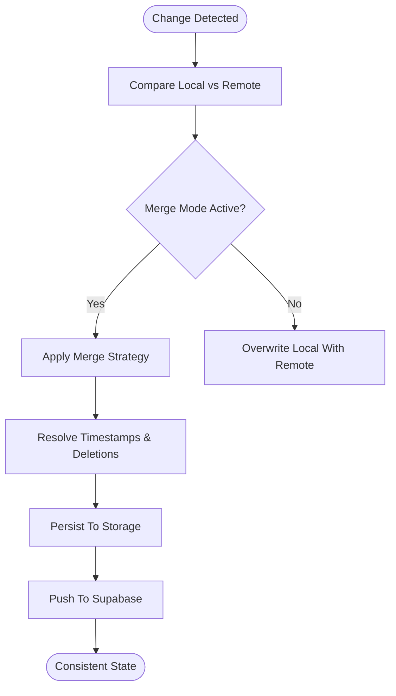

**Diagram sources**
- [database.ts:20-28](file://src/data/database.ts#L20-L28)
- [database.ts:22-26](file://src/data/database.ts#L22-L26)

**Section sources**
- [database.ts:13-29](file://src/data/database.ts#L13-L29)

### Last-Sync Tracking Implementation
- The system tracks the last synchronization boundary using a dedicated marker
- Incremental queries are executed to fetch only changes since the last sync
- This reduces bandwidth and improves performance during frequent updates

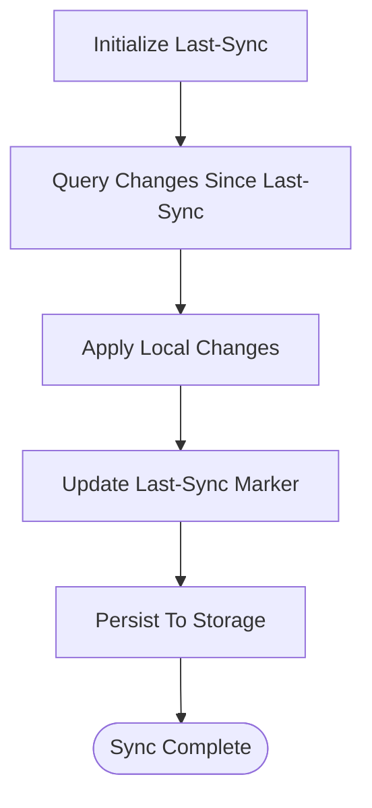

**Diagram sources**
- [database.ts:22-22](file://src/data/database.ts#L22-L22)

**Section sources**
- [database.ts:22-22](file://src/data/database.ts#L22-L22)

### Real-time Data Updates
- Real-time subscriptions are scoped to the current user via dynamic filters
- Events (insert/update/delete) are applied to the observable state using merge mode
- Nested relations (e.g., list items) are included in the selection to keep related data consistent

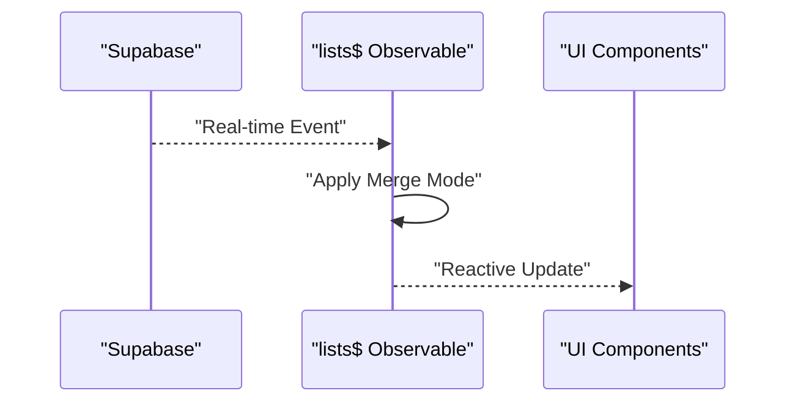

**Diagram sources**
- [lists.ts:17-21](file://src/data/states/lists.ts#L17-L21)
- [lists.ts:10-16](file://src/data/states/lists.ts#L10-L16)

**Section sources**
- [lists.ts:1-27](file://src/data/states/lists.ts#L1-L27)

## Dependency Analysis
The synchronization system depends on:
- Supabase client for authentication and real-time subscriptions
- LegendApp State for reactive state management and synchronization
- MMKV for persistent storage and offline-first behavior
- Utility functions for ID generation

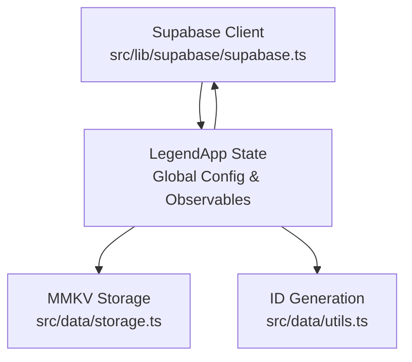

**Diagram sources**
- [supabase.ts:1-29](file://src/lib/supabase/supabase.ts#L1-L29)
- [database.ts:1-36](file://src/data/database.ts#L1-L36)
- [storage.ts:1-74](file://src/data/storage.ts#L1-L74)
- [utils.ts:1-6](file://src/data/utils.ts#L1-L6)

**Section sources**
- [supabase.ts:1-29](file://src/lib/supabase/supabase.ts#L1-L29)
- [database.ts:1-36](file://src/data/database.ts#L1-L36)
- [storage.ts:1-74](file://src/data/storage.ts#L1-L74)
- [utils.ts:1-6](file://src/data/utils.ts#L1-L6)

## Performance Considerations
- Use merge mode to minimize conflicts and reduce unnecessary overwrites
- Leverage last-sync tracking to limit the amount of data fetched per sync cycle
- Enable retry policies to improve resilience under intermittent connectivity
- Scope real-time subscriptions to the current user to reduce event volume
- Keep selections minimal to reduce payload sizes and improve responsiveness
- Persist data locally using MMKV to support offline usage and faster startup

## Troubleshooting Guide
Common issues and resolutions:
- No authenticated user detected: Ensure session retrieval succeeds and user is set in local state before initializing collections
- Real-time events not received: Verify the dynamic filter matches the current user ID and that the collection is bound after the user context is available
- Conflicts after merge: Confirm merge mode is enabled and that timestamp fields are properly maintained
- Migration failures: Check that local lists are present and that the profile_id update triggers synchronization
- Storage corruption or unexpected resets: Use storage debug utilities to inspect keys and values; clear storage carefully when necessary

**Section sources**
- [use-auth.ts:231-258](file://src/hooks/use-auth.ts#L231-L258)
- [lists.ts:17-21](file://src/data/states/lists.ts#L17-L21)
- [sync.ts:166-201](file://src/services/sync.ts#L166-L201)
- [storage.ts:54-62](file://src/data/storage.ts#L54-L62)

## Conclusion
The Supabase real-time synchronization system combines Supabase’s authentication and real-time capabilities with LegendApp State’s reactive synchronization to deliver a robust, offline-capable, and user-scoped data layer. Merge mode, last-sync tracking, and retry policies ensure consistency and resilience. The guest-to-user migration service demonstrates how automatic synchronization can be leveraged to seamlessly transfer user data. By following the recommended practices and troubleshooting steps, teams can maintain a reliable and performant real-time data experience.