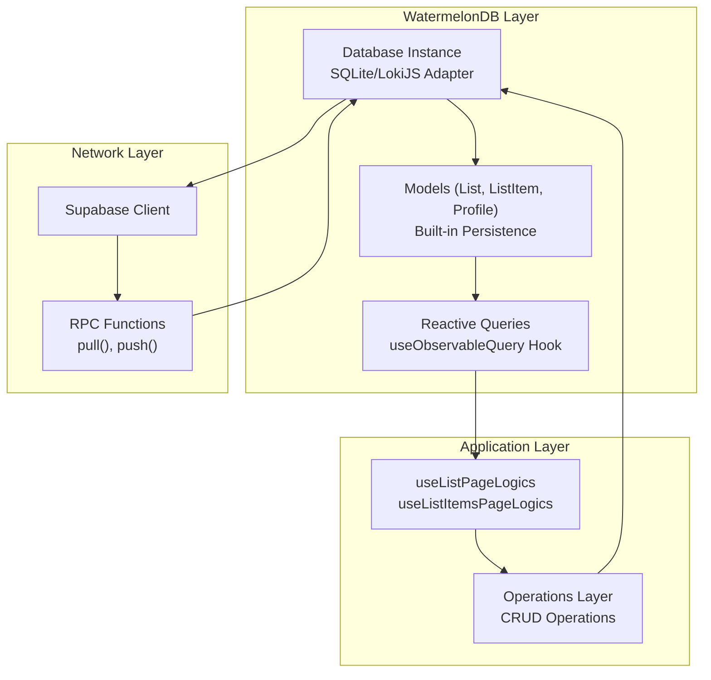
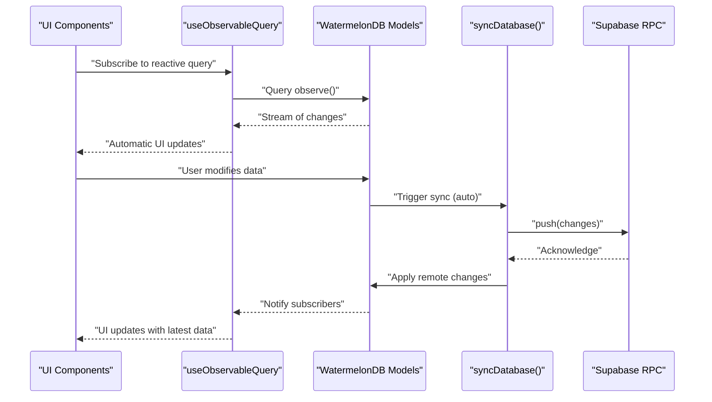
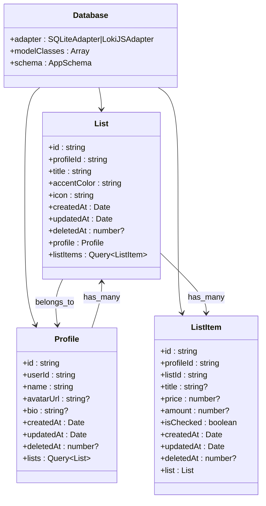
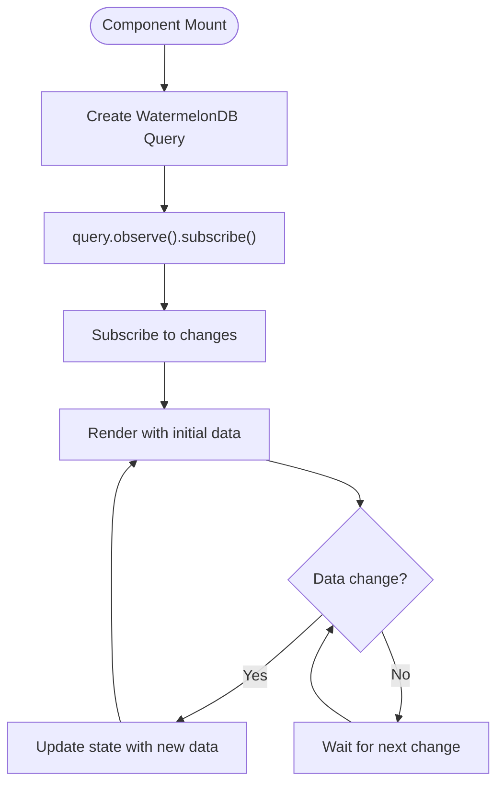
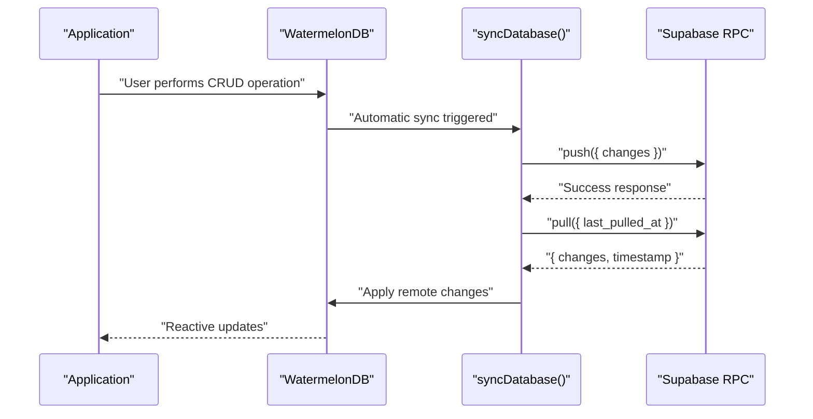
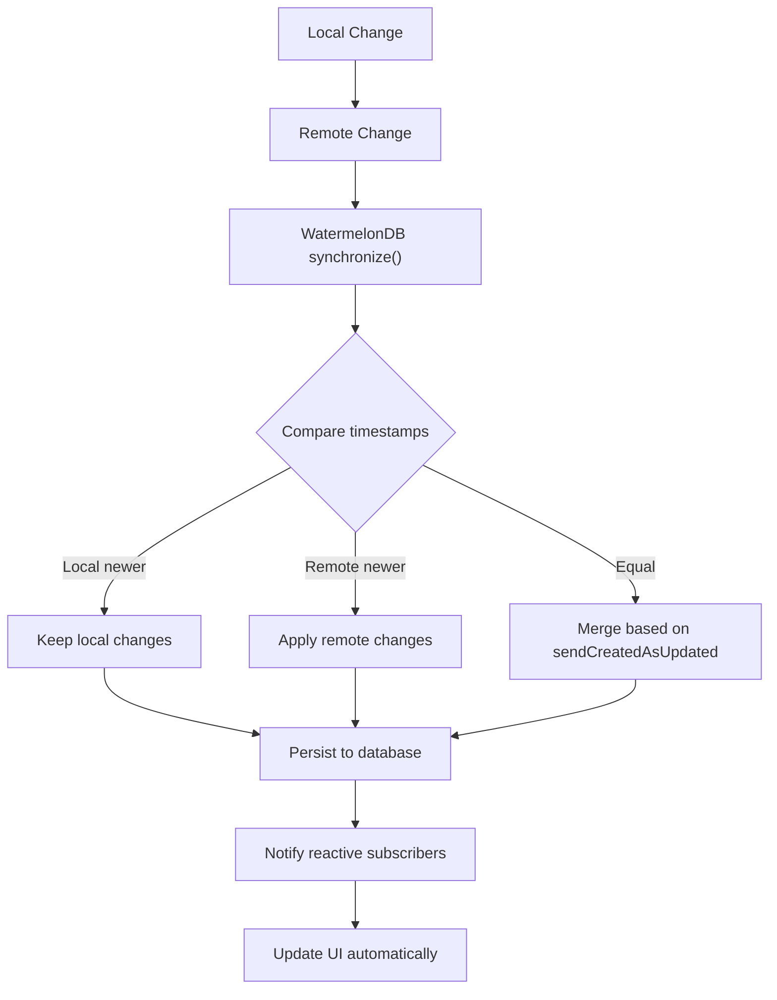
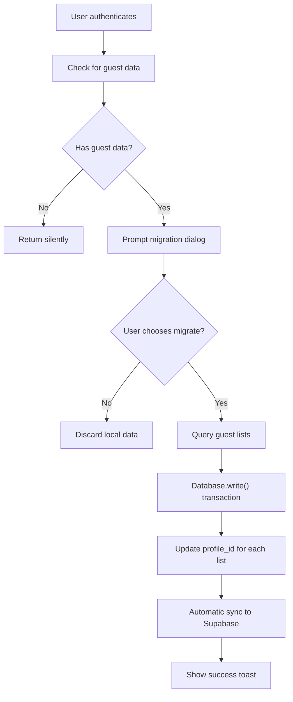
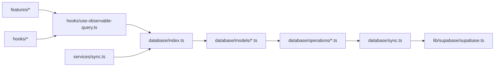

# Synchronization Strategies and Conflict Resolution

<cite>
**Referenced Files in This Document**
- [src/database/sync.ts](file://src/database/sync.ts)
- [src/database/index.ts](file://src/database/index.ts)
- [src/database/schema.ts](file://src/database/schema.ts)
- [src/database/models/List.ts](file://src/database/models/List.ts)
- [src/database/models/ListItem.ts](file://src/database/models/ListItem.ts)
- [src/database/models/Profile.ts](file://src/database/models/Profile.ts)
- [src/database/operations/lists.ts](file://src/database/operations/lists.ts)
- [src/database/operations/listItems.ts](file://src/database/operations/listItems.ts)
- [src/hooks/use-observable-query.ts](file://src/hooks/use-observable-query.ts)
- [src/services/sync.ts](file://src/services/sync.ts)
- [src/lib/supabase/supabase.ts](file://src/lib/supabase/supabase.ts)
- [src/features/lists/hooks/use-list-page-logics.ts](file://src/features/lists/hooks/use-list-page-logics.ts)
- [src/features/list/hooks/use-list-items-page-logics.ts](file://src/features/list/hooks/use-list-items-page-logics.ts)
</cite>

## Update Summary
**Changes Made**
- Complete restructuring from Legend App's merge mode to WatermelonDB's reactive query patterns
- Replaced MMKV persistence with WatermelonDB's built-in persistence layer
- Eliminated custom merge mode configuration in favor of WatermelonDB's native conflict resolution
- Updated synchronization architecture to use WatermelonDB's synchronize function
- Removed Legend App State observables and replaced with WatermelonDB queries
- Updated conflict resolution to leverage WatermelonDB's built-in timestamp-based resolution

## Table of Contents
1. [Introduction](#introduction)
2. [Project Structure](#project-structure)
3. [Core Components](#core-components)
4. [Architecture Overview](#architecture-overview)
5. [Detailed Component Analysis](#detailed-component-analysis)
6. [Dependency Analysis](#dependency-analysis)
7. [Performance Considerations](#performance-considerations)
8. [Troubleshooting Guide](#troubleshooting-guide)
9. [Conclusion](#conclusion)

## Introduction
This document explains the synchronization strategies and conflict resolution mechanisms used in the application following the complete migration from Legend App's merge mode to WatermelonDB's database-centric approach. The new architecture leverages WatermelonDB's reactive query patterns, built-in conflict resolution, and native synchronization capabilities to provide robust offline-first synchronization.

Key aspects of the new approach:
- Reactive query patterns with automatic UI updates
- Built-in conflict resolution using WatermelonDB's synchronize function
- Database-centric architecture with WatermelonDB as the single source of truth
- Real-time synchronization through Supabase RPC functions
- Automatic persistence without external storage plugins

## Project Structure
The synchronization stack is now built around WatermelonDB's database-centric architecture with reactive queries. The system consists of:
- WatermelonDB database with SQLite/LokiJS adapters
- Reactive query hooks for real-time UI updates
- Supabase RPC-based synchronization functions
- Native WatermelonDB conflict resolution
- Automatic persistence through WatermelonDB's built-in storage

**Diagram sources**
- [src/database/index.ts:12-32](file://src/database/index.ts#L12-L32)
- [src/database/models/List.ts:7-22](file://src/database/models/List.ts#L7-L22)
- [src/hooks/use-observable-query.ts:4-12](file://src/hooks/use-observable-query.ts#L4-L12)
- [src/database/sync.ts:15-30](file://src/database/sync.ts#L15-L30)
- [src/lib/supabase/supabase.ts:15-22](file://src/lib/supabase/supabase.ts#L15-L22)

**Section sources**
- [src/database/index.ts:1-33](file://src/database/index.ts#L1-L33)
- [src/database/schema.ts:1-46](file://src/database/schema.ts#L1-L46)
- [src/hooks/use-observable-query.ts:1-13](file://src/hooks/use-observable-query.ts#L1-L13)
- [src/database/sync.ts:1-57](file://src/database/sync.ts#L1-L57)

## Core Components
The new architecture is built around four core components:

- **WatermelonDB Database**: Central database instance with platform-specific adapters (SQLite for mobile, LokiJS for web)
- **Reactive Query System**: Automatic UI updates through useObservableQuery hook and WatermelonDB's observe() method
- **Supabase RPC Synchronization**: Custom pull() and push() RPC functions for bidirectional sync
- **Native Conflict Resolution**: Built-in timestamp-based conflict resolution through WatermelonDB's synchronize function

These components work together to provide automatic, conflict-free synchronization without manual merge mode configuration.

**Section sources**
- [src/database/index.ts:12-32](file://src/database/index.ts#L12-L32)
- [src/hooks/use-observable-query.ts:4-12](file://src/hooks/use-observable-query.ts#L4-L12)
- [src/database/sync.ts:15-30](file://src/database/sync.ts#L15-L30)

## Architecture Overview
The new architecture follows WatermelonDB's database-centric approach where the database serves as the single source of truth. Application logic interacts with WatermelonDB models directly, which automatically sync with Supabase through RPC functions. Reactive queries ensure the UI updates automatically when data changes.

**Diagram sources**
- [src/features/lists/hooks/use-list-page-logics.ts:23-24](file://src/features/lists/hooks/use-list-page-logics.ts#L23-L24)
- [src/features/list/hooks/use-list-items-page-logics.ts:32-33](file://src/features/list/hooks/use-list-items-page-logics.ts#L32-L33)
- [src/hooks/use-observable-query.ts:7-9](file://src/hooks/use-observable-query.ts#L7-L9)
- [src/database/sync.ts:8-34](file://src/database/sync.ts#L8-L34)

## Detailed Component Analysis

### WatermelonDB Database Configuration and Schema
The database is configured with platform-specific adapters and includes three main models with proper associations and indexing for optimal performance.

**Diagram sources**
- [src/database/index.ts:29-32](file://src/database/index.ts#L29-L32)
- [src/database/models/List.ts:7-22](file://src/database/models/List.ts#L7-L22)
- [src/database/models/ListItem.ts:6-19](file://src/database/models/ListItem.ts#L6-L19)
- [src/database/models/Profile.ts:6-20](file://src/database/models/Profile.ts#L6-L20)

**Section sources**
- [src/database/index.ts:12-32](file://src/database/index.ts#L12-L32)
- [src/database/schema.ts:3-45](file://src/database/schema.ts#L3-L45)
- [src/database/models/List.ts:7-22](file://src/database/models/List.ts#L7-L22)
- [src/database/models/ListItem.ts:6-19](file://src/database/models/ListItem.ts#L6-L19)
- [src/database/models/Profile.ts:6-20](file://src/database/models/Profile.ts#L6-L20)

### Reactive Query Patterns and UI Integration
The application uses a custom hook that subscribes to WatermelonDB queries and provides automatic UI updates. This replaces the previous Legend App State observables with a more efficient reactive pattern.

**Diagram sources**
- [src/hooks/use-observable-query.ts:7-10](file://src/hooks/use-observable-query.ts#L7-L10)

**Section sources**
- [src/hooks/use-observable-query.ts:1-13](file://src/hooks/use-observable-query.ts#L1-L13)
- [src/features/lists/hooks/use-list-page-logics.ts:23-24](file://src/features/lists/hooks/use-list-page-logics.ts#L23-L24)
- [src/features/list/hooks/use-list-items-page-logics.ts:32-33](file://src/features/list/hooks/use-list-items-page-logics.ts#L32-L33)

### Supabase RPC-Based Synchronization
The synchronization system uses custom Supabase RPC functions for bidirectional data synchronization. The pull() function retrieves changes since the last sync, while push() sends local changes to the server.

**Diagram sources**
- [src/database/sync.ts:15-30](file://src/database/sync.ts#L15-L30)

**Section sources**
- [src/database/sync.ts:1-57](file://src/database/sync.ts#L1-L57)
- [src/lib/supabase/supabase.ts:15-22](file://src/lib/supabase/supabase.ts#L15-L22)

### Native Conflict Resolution and Timestamp Management
WatermelonDB provides built-in conflict resolution through its synchronize function. The system automatically handles timestamp-based conflict resolution, ensuring that the most recent changes take precedence without manual merge mode configuration.

**Diagram sources**
- [src/database/sync.ts:29](file://src/database/sync.ts#L29)

**Section sources**
- [src/database/sync.ts:15-30](file://src/database/sync.ts#L15-L30)

### Guest Data Migration Service
The migration service demonstrates practical conflict-free ownership transfer using WatermelonDB's reactive patterns. The service queries for guest data, prompts the user for migration, and updates ownership through WatermelonDB's write transactions.

**Diagram sources**
- [src/services/sync.ts:103-151](file://src/services/sync.ts#L103-L151)

**Section sources**
- [src/services/sync.ts:43-205](file://src/services/sync.ts#L43-L205)

### Practical Examples

#### Example 1: Creating a List with Reactive Updates
The new approach eliminates the need for manual observable management. Components simply subscribe to reactive queries, and WatermelonDB handles all synchronization automatically.

**Section sources**
- [src/features/lists/hooks/use-list-page-logics.ts:23-24](file://src/features/lists/hooks/use-list-page-logics.ts#L23-L24)
- [src/database/operations/lists.ts](file://src/database/operations/lists.ts)

#### Example 2: Real-time List Item Updates
Components automatically receive updates when other clients modify data. The reactive query system ensures UI consistency without manual state management.

**Section sources**
- [src/features/list/hooks/use-list-items-page-logics.ts:32-33](file://src/features/list/hooks/use-list-items-page-logics.ts#L32-L33)
- [src/database/operations/listItems.ts:52-78](file://src/database/operations/listItems.ts#L52-L78)

#### Example 3: Guest to User Data Migration
The migration service demonstrates seamless data ownership transfer using WatermelonDB's transaction system and automatic synchronization.

**Section sources**
- [src/services/sync.ts:167-203](file://src/services/sync.ts#L167-L203)

## Dependency Analysis
The new architecture has simplified dependencies focused on WatermelonDB and Supabase integration:

**Diagram sources**
- [src/features/lists/hooks/use-list-page-logics.ts:7-8](file://src/features/lists/hooks/use-list-page-logics.ts#L7-L8)
- [src/hooks/use-observable-query.ts:2](file://src/hooks/use-observable-query.ts#L2)
- [src/database/index.ts:1-33](file://src/database/index.ts#L1-L33)
- [src/database/sync.ts:1-57](file://src/database/sync.ts#L1-L57)
- [src/lib/supabase/supabase.ts:1-23](file://src/lib/supabase/supabase.ts#L1-L23)

**Section sources**
- [src/features/lists/hooks/use-list-page-logics.ts:1-90](file://src/features/lists/hooks/use-list-page-logics.ts#L1-L90)
- [src/features/list/hooks/use-list-items-page-logics.ts:1-128](file://src/features/list/hooks/use-list-items-page-logics.ts#L1-L128)
- [src/hooks/use-observable-query.ts:1-13](file://src/hooks/use-observable-query.ts#L1-L13)
- [src/database/index.ts:1-33](file://src/database/index.ts#L1-L33)
- [src/database/sync.ts:1-57](file://src/database/sync.ts#L1-L57)
- [src/lib/supabase/supabase.ts:1-23](file://src/lib/supabase/supabase.ts#L1-L23)

## Performance Considerations
The new WatermelonDB-based architecture provides several performance improvements:

- **Automatic Persistence**: WatermelonDB handles all persistence automatically without external storage plugins
- **Efficient Reactive Queries**: useObservableQuery provides optimized subscription management
- **Built-in Conflict Resolution**: Eliminates the overhead of manual merge mode processing
- **Platform Optimization**: SQLite adapter for mobile provides native performance, LokiJS for web compatibility
- **Reduced Memory Usage**: Reactive queries stream only necessary data to components
- **Automatic Indexing**: WatermelonDB schema defines optimal indexes for query performance

## Troubleshooting Guide
Common issues and resolutions in the new WatermelonDB architecture:

- **No data loading**: Verify database initialization and schema version match
- **Reactive queries not updating**: Check query subscriptions and ensure proper cleanup in useEffect
- **Sync not working**: Verify Supabase RPC functions exist and credentials are correct
- **Conflicts occurring**: Review WatermelonDB's automatic conflict resolution behavior
- **Performance issues**: Check query complexity and ensure proper indexing on frequently queried fields
- **Migration failures**: Verify guest data exists and user authentication state is correct

**Section sources**
- [src/database/index.ts:12-27](file://src/database/index.ts#L12-L27)
- [src/hooks/use-observable-query.ts:7-10](file://src/hooks/use-observable-query.ts#L7-L10)
- [src/database/sync.ts:15-30](file://src/database/sync.ts#L15-L30)
- [src/services/sync.ts:167-203](file://src/services/sync.ts#L167-L203)

## Conclusion
The migration from Legend App's merge mode to WatermelonDB's reactive query patterns represents a fundamental shift toward a more robust, maintainable synchronization architecture. The new approach eliminates manual merge mode configuration, provides automatic conflict resolution, and offers superior performance through reactive queries and built-in persistence. The database-centric design ensures data consistency while simplifying application logic and reducing the potential for synchronization errors.