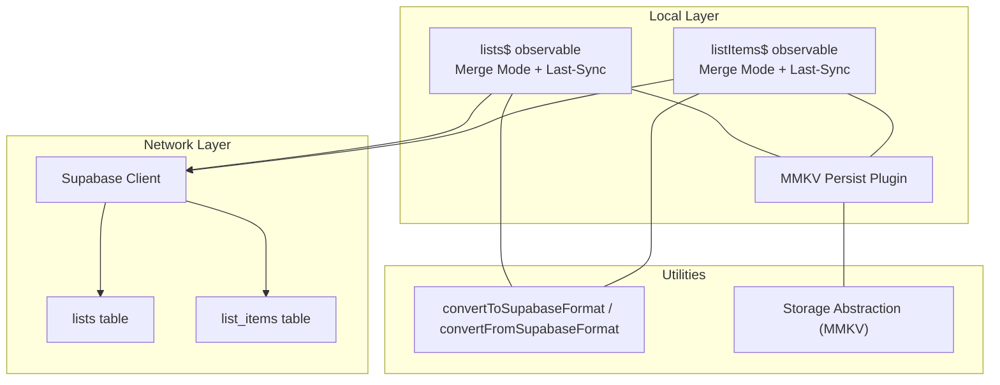
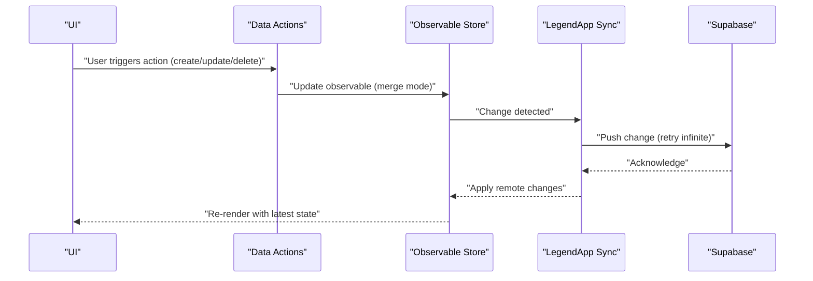
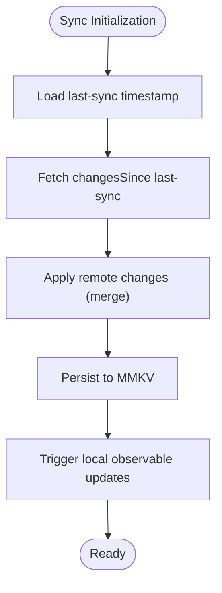
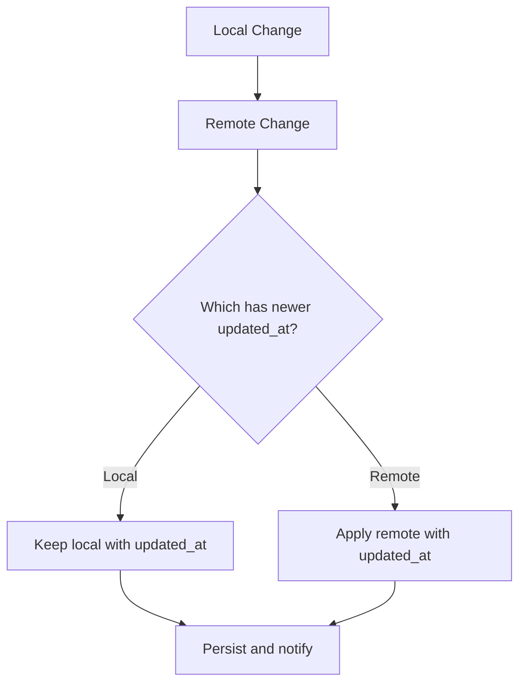
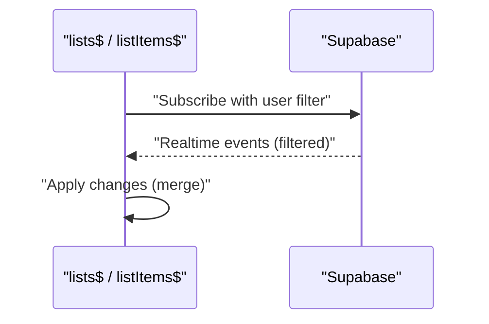
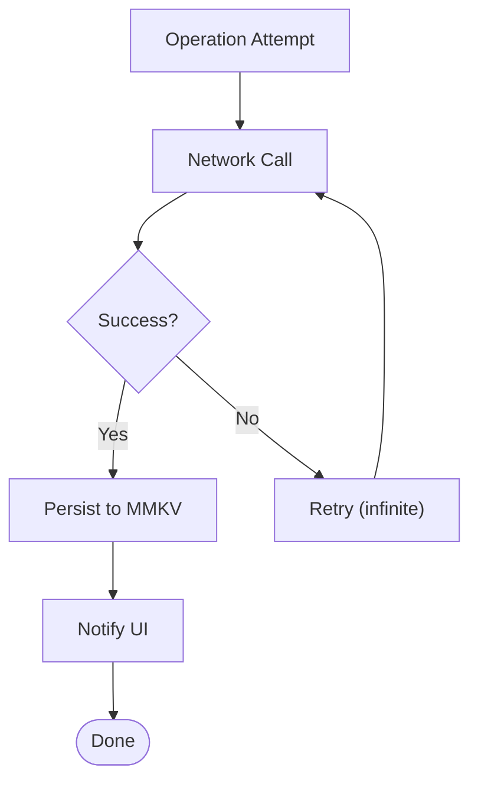
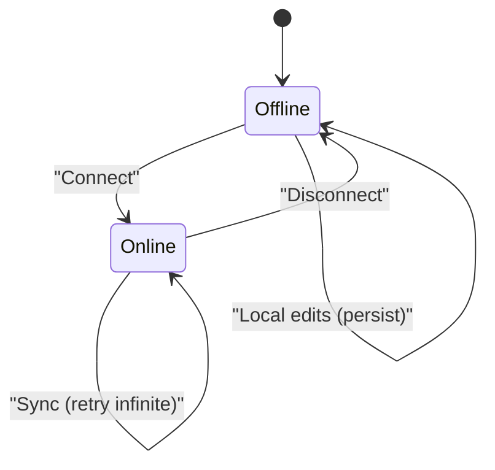
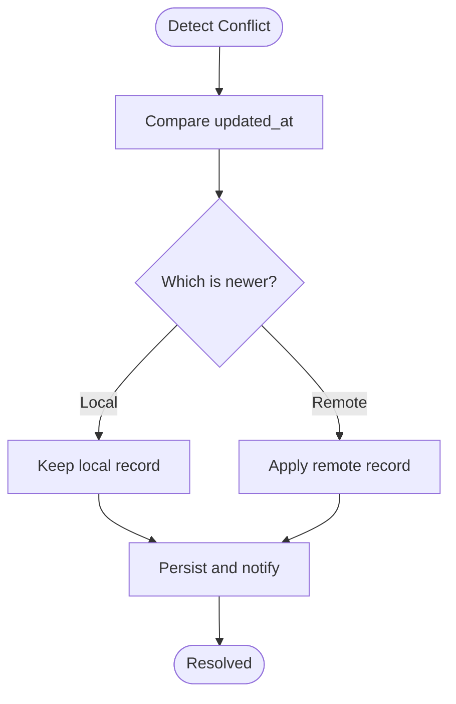
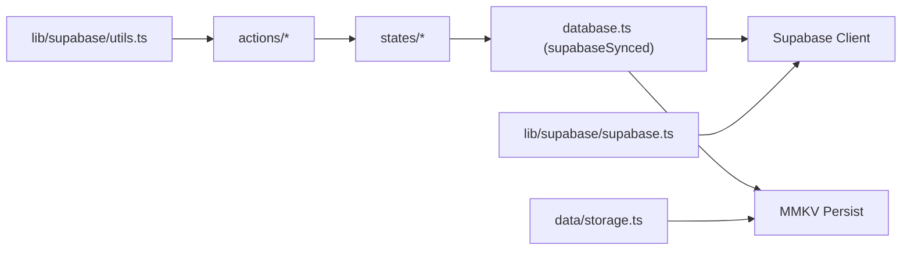

# Synchronization Strategies and Conflict Resolution

<cite>
**Referenced Files in This Document**
- [src/services/sync.ts](file://src/services/sync.ts)
- [src/data/database.ts](file://src/data/database.ts)
- [src/data/states/lists.ts](file://src/data/states/lists.ts)
- [src/data/states/list-items.ts](file://src/data/states/list-items.ts)
- [src/data/actions/lists.ts](file://src/data/actions/lists.ts)
- [src/data/actions/list-items.ts](file://src/data/actions/list-items.ts)
- [src/lib/supabase/supabase.ts](file://src/lib/supabase/supabase.ts)
- [src/lib/supabase/utils.ts](file://src/lib/supabase/utils.ts)
- [src/data/storage.ts](file://src/data/storage.ts)
- [src/services/toast.ts](file://src/services/toast.ts)
</cite>

## Table of Contents
1. [Introduction](#introduction)
2. [Project Structure](#project-structure)
3. [Core Components](#core-components)
4. [Architecture Overview](#architecture-overview)
5. [Detailed Component Analysis](#detailed-component-analysis)
6. [Dependency Analysis](#dependency-analysis)
7. [Performance Considerations](#performance-considerations)
8. [Troubleshooting Guide](#troubleshooting-guide)
9. [Conclusion](#conclusion)

## Introduction
This document explains the synchronization strategies and conflict resolution mechanisms used in the application. It focuses on:
- Merge mode configuration and its impact on synchronization
- Timestamp-based conflict resolution using created_at and updated_at
- Last-sync tracking to minimize redundant data transfers
- Retry mechanisms and error handling for robust offline and online workflows
- Conflict detection and resolution priorities
- Practical examples of sync operations, conflict scenarios, and troubleshooting steps

## Project Structure
The synchronization stack is built around LegendApp State’s Supabase plugin with persistent storage via MMKV. Two primary observable stores are configured:
- Lists store: synchronized with the lists table and filtered per user
- List items store: synchronized with the list_items table and filtered per user

Persistence, merge mode, and last-sync tracking are centrally configured in the database module. Guest-to-user data migration is handled by a dedicated service.

**Diagram sources**
- [src/data/states/lists.ts:5-26](file://src/data/states/lists.ts#L5-L26)
- [src/data/states/list-items.ts:5-23](file://src/data/states/list-items.ts#L5-L23)
- [src/data/database.ts:13-29](file://src/data/database.ts#L13-L29)
- [src/lib/supabase/supabase.ts:21-28](file://src/lib/supabase/supabase.ts#L21-L28)
- [src/lib/supabase/utils.ts:1-9](file://src/lib/supabase/utils.ts#L1-L9)
- [src/data/storage.ts:1-74](file://src/data/storage.ts#L1-L74)

**Section sources**
- [src/data/states/lists.ts:1-27](file://src/data/states/lists.ts#L1-L27)
- [src/data/states/list-items.ts:1-24](file://src/data/states/list-items.ts#L1-L24)
- [src/data/database.ts:1-36](file://src/data/database.ts#L1-L36)
- [src/lib/supabase/supabase.ts:1-29](file://src/lib/supabase/supabase.ts#L1-L29)
- [src/lib/supabase/utils.ts:1-9](file://src/lib/supabase/utils.ts#L1-L9)
- [src/data/storage.ts:1-74](file://src/data/storage.ts#L1-L74)

## Core Components
- Merge mode configuration: Ensures local and remote changes coexist and are merged deterministically.
- Timestamp fields: created_at and updated_at are used to detect and resolve conflicts.
- Last-sync tracking: ChangesSince “last-sync” limits fetches to incremental updates.
- Persistent storage: MMKV persists observables to disk with retry on sync failures.
- Realtime filtering: Stores subscribe to user-scoped filters to receive only relevant events.
- Retry policy: Infinite retries for network and transient failures.

These components collectively provide robust offline-first synchronization with deterministic conflict resolution.

**Section sources**
- [src/data/database.ts:13-29](file://src/data/database.ts#L13-L29)
- [src/data/states/lists.ts:16-21](file://src/data/states/lists.ts#L16-L21)
- [src/data/states/list-items.ts:13-17](file://src/data/states/list-items.ts#L13-L17)

## Architecture Overview
The synchronization architecture leverages LegendApp State’s Supabase plugin to keep local observables in sync with Supabase tables. Persistence and merge mode are configured globally, while actions update observables, triggering sync automatically.

**Diagram sources**
- [src/data/actions/lists.ts:79-122](file://src/data/actions/lists.ts#L79-L122)
- [src/data/actions/list-items.ts:53-104](file://src/data/actions/list-items.ts#L53-L104)
- [src/data/states/lists.ts:5-26](file://src/data/states/lists.ts#L5-L26)
- [src/data/states/list-items.ts:5-23](file://src/data/states/list-items.ts#L5-L23)
- [src/data/database.ts:13-29](file://src/data/database.ts#L13-L29)

## Detailed Component Analysis

### Merge Mode Configuration and Last-Sync Tracking
- Merge mode: Set to “merge” globally, ensuring local and remote changes are combined rather than overwritten.
- Last-sync tracking: changesSince “last-sync” ensures only incremental changes are fetched after the initial sync.
- Field mapping: created_at, updated_at, and deleted fields are mapped for conflict detection and lifecycle management.
- Retry policy: Infinite retries for transient failures, with persistence enabling recovery after restart.

**Diagram sources**
- [src/data/database.ts:20-29](file://src/data/database.ts#L20-L29)
- [src/data/states/lists.ts:16-16](file://src/data/states/lists.ts#L16-L16)
- [src/data/states/list-items.ts:13-13](file://src/data/states/list-items.ts#L13-L13)

**Section sources**
- [src/data/database.ts:13-29](file://src/data/database.ts#L13-L29)
- [src/data/states/lists.ts:16-16](file://src/data/states/lists.ts#L16-L16)
- [src/data/states/list-items.ts:13-13](file://src/data/states/list-items.ts#L13-L13)

### Timestamp-Based Conflict Resolution
- created_at: Used to establish baseline ordering for records.
- updated_at: Used to detect newer remote changes versus local modifications.
- Merge semantics: Local updates are merged with remote updates; the most recent updated_at wins for conflict resolution.
- Deleted records: The deleted field marks logical deletions; merge mode handles restoration or suppression appropriately.

**Diagram sources**
- [src/data/database.ts:22-25](file://src/data/database.ts#L22-L25)
- [src/lib/supabase/utils.ts:1-9](file://src/lib/supabase/utils.ts#L1-L9)

**Section sources**
- [src/data/database.ts:22-25](file://src/data/database.ts#L22-L25)
- [src/lib/supabase/utils.ts:1-9](file://src/lib/supabase/utils.ts#L1-L9)

### Realtime Filtering and Incremental Fetching
- Realtime filter: Each store applies a user-scoped filter to receive only relevant events.
- Selective fetching: Lists store fetches nested list_items to maintain referential integrity.
- Filtered reads: Actions filter local data by list_id to avoid cross-list contamination.

**Diagram sources**
- [src/data/states/lists.ts:10-21](file://src/data/states/lists.ts#L10-L21)
- [src/data/states/list-items.ts:9-21](file://src/data/states/list-items.ts#L9-L21)

**Section sources**
- [src/data/states/lists.ts:10-21](file://src/data/states/lists.ts#L10-L21)
- [src/data/states/list-items.ts:9-21](file://src/data/states/list-items.ts#L9-L21)

### Retry Mechanisms and Error Handling
- Infinite retry: Both global and per-store retry policies ensure eventual consistency.
- Persistence: MMKV persists observables so changes are not lost across app restarts.
- Action-level error handling: Actions wrap operations and return structured results with errors.
- Toast notifications: UI feedback for success and error outcomes.

**Diagram sources**
- [src/data/database.ts:26-28](file://src/data/database.ts#L26-L28)
- [src/data/states/lists.ts:22-24](file://src/data/states/lists.ts#L22-L24)
- [src/data/states/list-items.ts:14-16](file://src/data/states/list-items.ts#L14-L16)
- [src/services/toast.ts:24-43](file://src/services/toast.ts#L24-L43)

**Section sources**
- [src/data/database.ts:26-28](file://src/data/database.ts#L26-L28)
- [src/data/states/lists.ts:22-24](file://src/data/states/lists.ts#L22-L24)
- [src/data/states/list-items.ts:14-16](file://src/data/states/list-items.ts#L14-L16)
- [src/services/toast.ts:24-43](file://src/services/toast.ts#L24-L43)

### Offline Synchronization Workflows
- Offline edits: Users can create, update, and delete items while offline; changes persist locally.
- Background sync: On connectivity restore, pending changes are retried until acknowledged.
- Incremental sync: Subsequent syncs fetch only changesSince last-sync, minimizing bandwidth.
- Real-time updates: When online, realtime filters ensure immediate propagation of other clients’ changes.

**Diagram sources**
- [src/data/database.ts:17-17](file://src/data/database.ts#L17-L17)
- [src/data/states/lists.ts:16-16](file://src/data/states/lists.ts#L16-L16)
- [src/data/states/list-items.ts:13-13](file://src/data/states/list-items.ts#L13-L13)

**Section sources**
- [src/data/database.ts:17-17](file://src/data/database.ts#L17-L17)
- [src/data/states/lists.ts:16-16](file://src/data/states/lists.ts#L16-L16)
- [src/data/states/list-items.ts:13-13](file://src/data/states/list-items.ts#L13-L13)

### Conflict Detection and Resolution Algorithms
- Conflict detection: Occurs when local and remote records share the same id but differ in updated_at timestamps.
- Resolution priority: The record with the later updated_at timestamp prevails.
- Merge behavior: Non-conflicting fields are preserved; conflicting fields adopt the remote value.
- Deletions: Logical deletions are respected; merging restores or suppresses as appropriate.

**Diagram sources**
- [src/data/database.ts:22-25](file://src/data/database.ts#L22-L25)

**Section sources**
- [src/data/database.ts:22-25](file://src/data/database.ts#L22-L25)

### Practical Examples

#### Example 1: Creating a List (Offline-First)
- Action: createNewList constructs a payload and writes to the lists$ observable.
- Behavior: The write triggers sync; if offline, changes persist locally and retry indefinitely.
- Outcome: Remote acknowledgment updates the observable and UI.

**Section sources**
- [src/data/actions/lists.ts:79-122](file://src/data/actions/lists.ts#L79-L122)
- [src/data/states/lists.ts:5-26](file://src/data/states/lists.ts#L5-L26)
- [src/data/database.ts:26-28](file://src/data/database.ts#L26-L28)

#### Example 2: Updating a List Item (Conflict Scenario)
- Action: updateListItem merges partial updates and writes to listItems$.
- Conflict scenario: If another client updated the same item with a later updated_at, the remote change takes precedence.
- Outcome: The observable reflects the newer remote state after merge.

**Section sources**
- [src/data/actions/list-items.ts:132-166](file://src/data/actions/list-items.ts#L132-L166)
- [src/data/states/list-items.ts:5-23](file://src/data/states/list-items.ts#L5-L23)
- [src/data/database.ts:22-25](file://src/data/database.ts#L22-L25)

#### Example 3: Guest Data Migration to User Account
- Service: SyncService detects guest lists and migrates them by updating profile_id.
- Behavior: Updates trigger automatic sync; user sees a success/error toast.
- Outcome: Guest lists become user-owned and synchronized.

**Section sources**
- [src/services/sync.ts:48-201](file://src/services/sync.ts#L48-L201)
- [src/services/toast.ts:24-43](file://src/services/toast.ts#L24-L43)

## Dependency Analysis
The synchronization pipeline depends on:
- Supabase client configured with MMKV-backed auth storage
- LegendApp State configured with merge mode, last-sync, and retry
- Utility functions to normalize key casing between local and remote formats
- Storage abstraction for persistence and debugging

**Diagram sources**
- [src/data/actions/lists.ts:1-211](file://src/data/actions/lists.ts#L1-L211)
- [src/data/actions/list-items.ts:1-193](file://src/data/actions/list-items.ts#L1-L193)
- [src/data/states/lists.ts:1-27](file://src/data/states/lists.ts#L1-L27)
- [src/data/states/list-items.ts:1-24](file://src/data/states/list-items.ts#L1-L24)
- [src/data/database.ts:1-36](file://src/data/database.ts#L1-L36)
- [src/lib/supabase/utils.ts:1-9](file://src/lib/supabase/utils.ts#L1-L9)
- [src/data/storage.ts:1-74](file://src/data/storage.ts#L1-L74)
- [src/lib/supabase/supabase.ts:1-29](file://src/lib/supabase/supabase.ts#L1-L29)

**Section sources**
- [src/data/actions/lists.ts:1-211](file://src/data/actions/lists.ts#L1-L211)
- [src/data/actions/list-items.ts:1-193](file://src/data/actions/list-items.ts#L1-L193)
- [src/data/states/lists.ts:1-27](file://src/data/states/lists.ts#L1-L27)
- [src/data/states/list-items.ts:1-24](file://src/data/states/list-items.ts#L1-L24)
- [src/data/database.ts:1-36](file://src/data/database.ts#L1-L36)
- [src/lib/supabase/utils.ts:1-9](file://src/lib/supabase/utils.ts#L1-L9)
- [src/data/storage.ts:1-74](file://src/data/storage.ts#L1-L74)
- [src/lib/supabase/supabase.ts:1-29](file://src/lib/supabase/supabase.ts#L1-L29)

## Performance Considerations
- Incremental sync: Using changesSince “last-sync” reduces payload sizes after the first sync.
- Realtime filtering: Per-user filters minimize event volume and processing overhead.
- Merge mode: Reduces write conflicts and network round-trips by combining changes.
- Retry policy: Infinite retries improve reliability at the cost of continuous background work; monitor connectivity to avoid excessive contention.
- Persistence: MMKV reduces cold-start sync time by preloading known state.

[No sources needed since this section provides general guidance]

## Troubleshooting Guide
Common issues and resolutions:
- No sync after offline: Verify persistence is enabled and retry is infinite. Confirm last-sync timestamp is present.
- Conflicts not resolving: Ensure updated_at is being updated on server-side and that merge mode is active.
- Stale UI after remote change: Confirm realtime filters are applied and observable updates propagate.
- Guest migration errors: Check guestId and userId correctness; review toast messages for error details.
- Storage corruption or stale keys: Use storage debug utilities to inspect keys and clear selectively.

**Section sources**
- [src/data/database.ts:26-28](file://src/data/database.ts#L26-L28)
- [src/data/states/lists.ts:16-16](file://src/data/states/lists.ts#L16-L16)
- [src/data/states/list-items.ts:13-13](file://src/data/states/list-items.ts#L13-L13)
- [src/services/sync.ts:102-150](file://src/services/sync.ts#L102-L150)
- [src/data/storage.ts:54-62](file://src/data/storage.ts#L54-L62)

## Conclusion
The application employs a robust offline-first synchronization strategy centered on merge mode, timestamp-based conflict resolution, and last-sync tracking. Persistence and infinite retry ensure resilience against network interruptions, while realtime filtering and selective fetching optimize performance. The guest-to-user migration service demonstrates practical conflict-free ownership transfer. Together, these mechanisms maintain data consistency and provide a reliable user experience across online and offline scenarios.