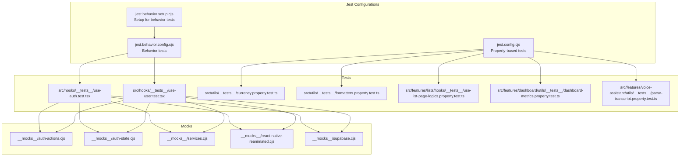
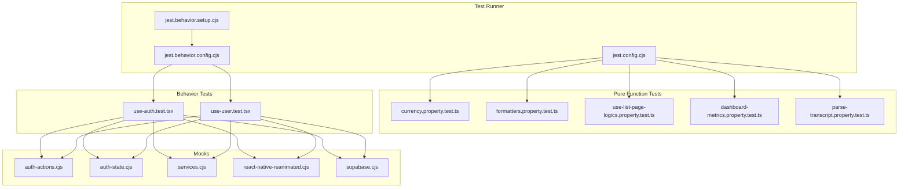
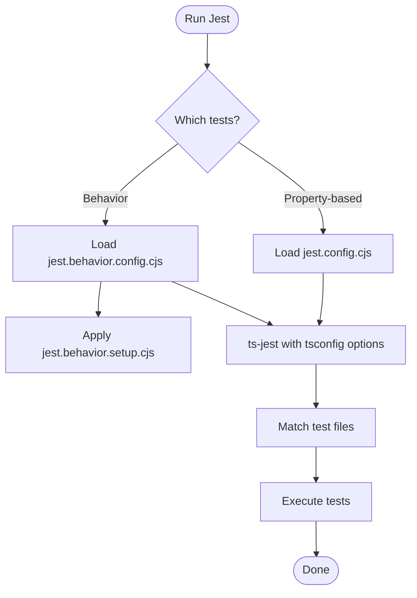
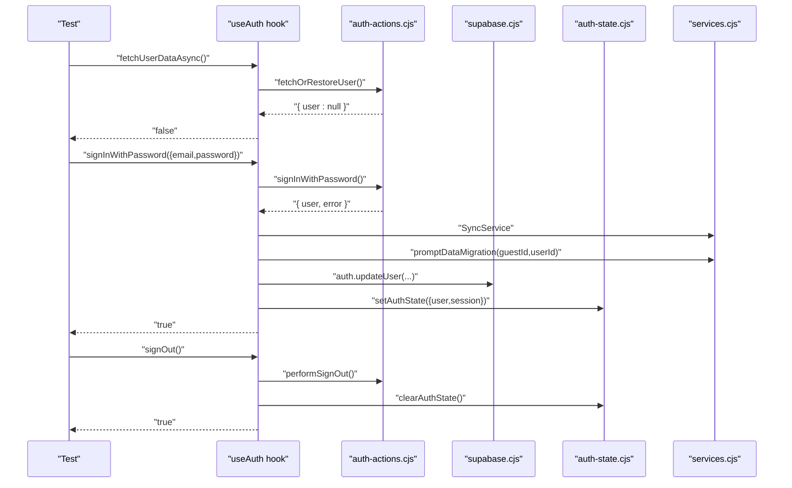
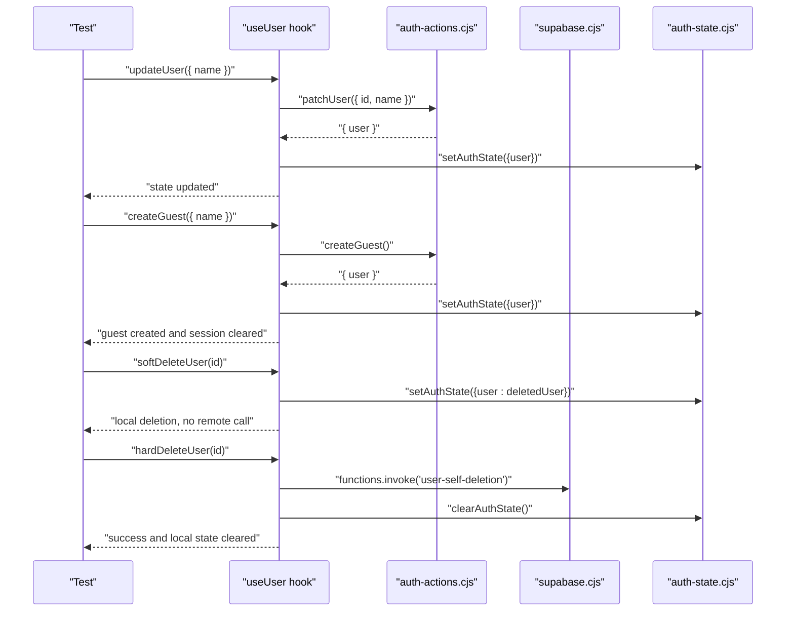
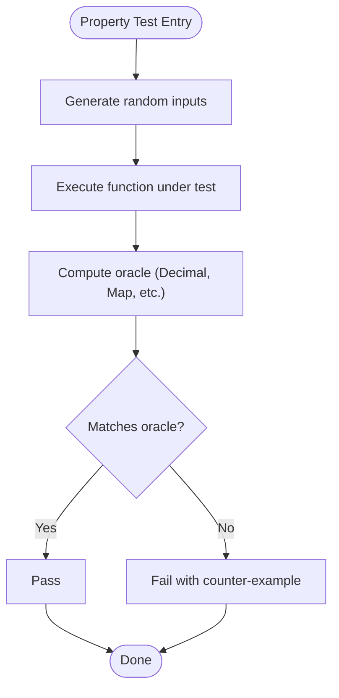
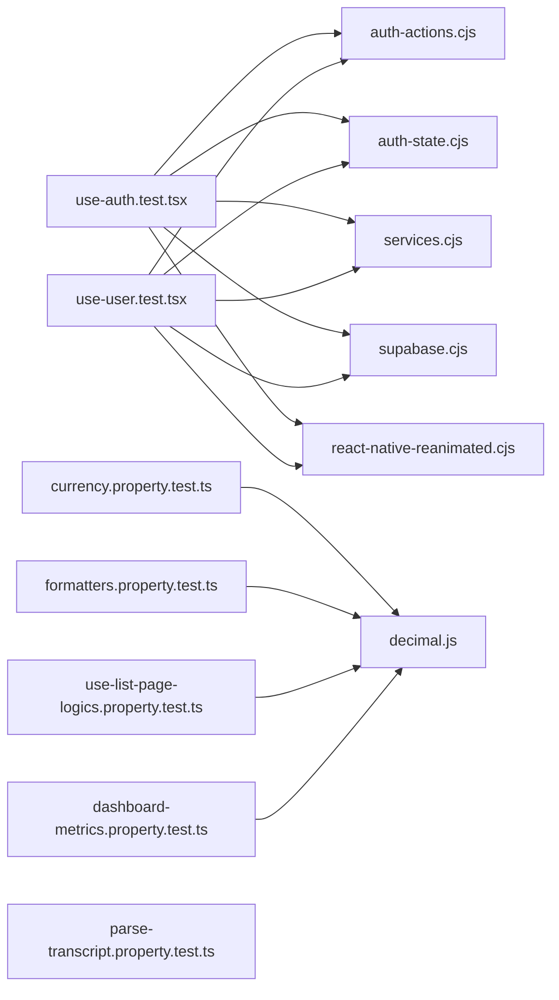

# Testing Strategy

<cite>
**Referenced Files in This Document**
- [jest.config.cjs](file://jest.config.cjs)
- [jest.behavior.config.cjs](file://jest.behavior.config.cjs)
- [jest.behavior.setup.cjs](file://jest.behavior.setup.cjs)
- [package.json](file://package.json)
- [src/hooks/__tests__/use-auth.test.tsx](file://src/hooks/__tests__/use-auth.test.tsx)
- [src/hooks/__tests__/use-user.test.tsx](file://src/hooks/__tests__/use-user.test.tsx)
- [src/features/lists/hooks/__tests__/use-list-page-logics.property.test.ts](file://src/features/lists/hooks/__tests__/use-list-page-logics.property.test.ts)
- [src/utils/__tests__/currency.property.test.ts](file://src/utils/__tests__/currency.property.test.ts)
- [src/utils/__tests__/formatters.property.test.ts](file://src/utils/__tests__/formatters.property.test.ts)
- [src/features/dashboard/utils/__tests__/dashboard-metrics.property.test.ts](file://src/features/dashboard/utils/__tests__/dashboard-metrics.property.test.ts)
- [src/features/voice-assistant/utils/__tests__/parse-transcript.property.test.ts](file://src/features/voice-assistant/utils/__tests__/parse-transcript.property.test.ts)
- [__mocks__/auth-actions.cjs](file://__mocks__/auth-actions.cjs)
- [__mocks__/auth-state.cjs](file://__mocks__/auth-state.cjs)
- [__mocks__/react-native-reanimated.cjs](file://__mocks__/react-native-reanimated.cjs)
- [__mocks__/services.cjs](file://__mocks__/services.cjs)
- [__mocks__/supabase.cjs](file://__mocks__/supabase.cjs)
</cite>

## Update Summary
**Changes Made**
- Updated mock implementation documentation to reflect simplified auth-state mock using explicit user/session state and listener pattern
- Removed references to deprecated mock files (__mocks__/legend-state-react.cjs, __mocks__/react-native-mmkv.cjs, __mocks__/storage.cjs)
- Updated authentication hook tests to demonstrate new explicit state management approach
- Enhanced mock architecture documentation to show cleaner separation between auth actions, state, and services
- Updated troubleshooting guidance to reflect current mock setup patterns

## Table of Contents
1. [Introduction](#introduction)
2. [Project Structure](#project-structure)
3. [Core Components](#core-components)
4. [Architecture Overview](#architecture-overview)
5. [Detailed Component Analysis](#detailed-component-analysis)
6. [Dependency Analysis](#dependency-analysis)
7. [Performance Considerations](#performance-considerations)
8. [Troubleshooting Guide](#troubleshooting-guide)
9. [Conclusion](#conclusion)
10. [Appendices](#appendices)

## Introduction
This document describes the testing strategy for PowerLists, focusing on Jest configuration, unit and behavior testing, property-based testing, and CI-ready workflows. It explains how authentication hooks, state management functions, and UI components are tested, along with mocking patterns for external dependencies, test coverage expectations, and debugging techniques.

**Updated** The testing infrastructure has been significantly refactored with simplified mock implementations and improved state management patterns.

## Project Structure
The repository organizes tests by feature and domain:
- Unit and behavior tests live alongside the code under feature folders and hooks.
- Property-based tests reside in dedicated __tests__ folders within utils and features.
- Mocks are centralized under __mocks__ to isolate external dependencies and platform-specific libraries.



**Diagram sources**
- [jest.config.cjs:1-22](file://jest.config.cjs#L1-L22)
- [jest.behavior.config.cjs:1-26](file://jest.behavior.config.cjs#L1-L26)
- [jest.behavior.setup.cjs:1-4](file://jest.behavior.setup.cjs#L1-L4)
- [src/hooks/__tests__/use-auth.test.tsx:1-167](file://src/hooks/__tests__/use-auth.test.tsx#L1-L167)
- [src/hooks/__tests__/use-user.test.tsx:1-145](file://src/hooks/__tests__/use-user.test.tsx#L1-L145)
- [src/utils/__tests__/currency.property.test.ts:1-43](file://src/utils/__tests__/currency.property.test.ts#L1-L43)
- [src/utils/__tests__/formatters.property.test.ts:1-88](file://src/utils/__tests__/formatters.property.test.ts#L1-L88)
- [src/features/lists/hooks/__tests__/use-list-page-logics.property.test.ts:1-71](file://src/features/lists/hooks/__tests__/use-list-page-logics.property.test.ts#L1-L71)
- [src/features/dashboard/utils/__tests__/dashboard-metrics.property.test.ts:1-204](file://src/features/dashboard/utils/__tests__/dashboard-metrics.property.test.ts#L1-L204)
- [src/features/voice-assistant/utils/__tests__/parse-transcript.property.test.ts:1-22](file://src/features/voice-assistant/utils/__tests__/parse-transcript.property.test.ts#L1-L22)
- [__mocks__/auth-actions.cjs:1-50](file://__mocks__/auth-actions.cjs#L1-L50)
- [__mocks__/auth-state.cjs:1-42](file://__mocks__/auth-state.cjs#L1-L42)
- [__mocks__/react-native-reanimated.cjs:1-72](file://__mocks__/react-native-reanimated.cjs#L1-L72)
- [__mocks__/services.cjs:1-28](file://__mocks__/services.cjs#L1-L28)
- [__mocks__/supabase.cjs:1-36](file://__mocks__/supabase.cjs#L1-L36)

**Section sources**
- [jest.config.cjs:1-22](file://jest.config.cjs#L1-L22)
- [jest.behavior.config.cjs:1-26](file://jest.behavior.config.cjs#L1-L26)
- [jest.behavior.setup.cjs:1-4](file://jest.behavior.setup.cjs#L1-L4)
- [package.json:1-118](file://package.json#L1-L118)

## Core Components
- Jest configurations:
  - Property-based tests: configured to run files matching the pattern for property tests and to transform TypeScript with ts-jest.
  - Behavior tests: configured to run React component tests with JSX enabled and to mock reanimated via moduleNameMapper.
- Test suites:
  - Authentication hook tests validate initialization, sign-in flows, sign-out, and password reset.
  - User hook tests validate user retrieval, updates, guest creation, and deletion flows.
  - Property-based tests validate numeric precision, aggregation correctness, and robustness against random inputs.
- Mock ecosystem:
  - Simplified inline mocks replace platform-specific libraries and third-party services to keep tests deterministic and fast.
  - Explicit state management with listener pattern for auth-state mock.
  - Reset helpers ensure clean state between tests.

**Updated** Mock implementations have been streamlined with explicit user/session state management and simplified architecture.

**Section sources**
- [jest.config.cjs:1-22](file://jest.config.cjs#L1-L22)
- [jest.behavior.config.cjs:1-26](file://jest.behavior.config.cjs#L1-L26)
- [jest.behavior.setup.cjs:1-4](file://jest.behavior.setup.cjs#L1-L4)
- [src/hooks/__tests__/use-auth.test.tsx:1-167](file://src/hooks/__tests__/use-auth.test.tsx#L1-L167)
- [src/hooks/__tests__/use-user.test.tsx:1-145](file://src/hooks/__tests__/use-user.test.tsx#L1-L145)
- [src/utils/__tests__/currency.property.test.ts:1-43](file://src/utils/__tests__/currency.property.test.ts#L1-L43)
- [src/utils/__tests__/formatters.property.test.ts:1-88](file://src/utils/__tests__/formatters.property.test.ts#L1-L88)
- [src/features/lists/hooks/__tests__/use-list-page-logics.property.test.ts:1-71](file://src/features/lists/hooks/__tests__/use-list-page-logics.property.test.ts#L1-L71)
- [src/features/dashboard/utils/__tests__/dashboard-metrics.property.test.ts:1-204](file://src/features/dashboard/utils/__tests__/dashboard-metrics.property.test.ts#L1-L204)
- [src/features/voice-assistant/utils/__tests__/parse-transcript.property.test.ts:1-22](file://src/features/voice-assistant/utils/__tests__/parse-transcript.property.test.ts#L1-L22)
- [__mocks__/auth-actions.cjs:1-50](file://__mocks__/auth-actions.cjs#L1-L50)
- [__mocks__/auth-state.cjs:1-42](file://__mocks__/auth-state.cjs#L1-L42)
- [__mocks__/react-native-reanimated.cjs:1-72](file://__mocks__/react-native-reanimated.cjs#L1-L72)
- [__mocks__/services.cjs:1-28](file://__mocks__/services.cjs#L1-L28)
- [__mocks__/supabase.cjs:1-36](file://__mocks__/supabase.cjs#L1-L36)

## Architecture Overview
The testing architecture separates concerns into:
- Property-based tests for pure functions and aggregations.
- Behavior tests for hooks and UI logic with mocked dependencies.
- Simplified mock system for platform libraries and external services.

**Updated** Architecture now features explicit state management with listener pattern and reduced complexity.



**Diagram sources**
- [jest.config.cjs:1-22](file://jest.config.cjs#L1-L22)
- [jest.behavior.config.cjs:1-26](file://jest.behavior.config.cjs#L1-L26)
- [jest.behavior.setup.cjs:1-4](file://jest.behavior.setup.cjs#L1-L4)
- [src/utils/__tests__/currency.property.test.ts:1-43](file://src/utils/__tests__/currency.property.test.ts#L1-L43)
- [src/utils/__tests__/formatters.property.test.ts:1-88](file://src/utils/__tests__/formatters.property.test.ts#L1-L88)
- [src/features/lists/hooks/__tests__/use-list-page-logics.property.test.ts:1-71](file://src/features/lists/hooks/__tests__/use-list-page-logics.property.test.ts#L1-L71)
- [src/features/dashboard/utils/__tests__/dashboard-metrics.property.test.ts:1-204](file://src/features/dashboard/utils/__tests__/dashboard-metrics.property.test.ts#L1-L204)
- [src/features/voice-assistant/utils/__tests__/parse-transcript.property.test.ts:1-22](file://src/features/voice-assistant/utils/__tests__/parse-transcript.property.test.ts#L1-L22)
- [src/hooks/__tests__/use-auth.test.tsx:1-167](file://src/hooks/__tests__/use-auth.test.tsx#L1-L167)
- [src/hooks/__tests__/use-user.test.tsx:1-145](file://src/hooks/__tests__/use-user.test.tsx#L1-L145)
- [__mocks__/auth-actions.cjs:1-50](file://__mocks__/auth-actions.cjs#L1-L50)
- [__mocks__/auth-state.cjs:1-42](file://__mocks__/auth-state.cjs#L1-L42)
- [__mocks__/services.cjs:1-28](file://__mocks__/services.cjs#L1-L28)
- [__mocks__/react-native-reanimated.cjs:1-72](file://__mocks__/react-native-reanimated.cjs#L1-L72)
- [__mocks__/supabase.cjs:1-36](file://__mocks__/supabase.cjs#L1-L36)

## Detailed Component Analysis

### Jest Configuration and Test Environments
- Property-based tests:
  - Run with Node environment and ts-jest.
  - Match files ending with .property.test.ts.
  - Module name mapping includes support for project aliases.
- Behavior tests:
  - Run with Node environment and ts-jest with JSX enabled.
  - Match files ending with .test.tsx.
  - Module name mapping includes mocks for react-native-reanimated.
  - Setup script mocks reanimated globally for behavior tests.



**Diagram sources**
- [jest.config.cjs:1-22](file://jest.config.cjs#L1-L22)
- [jest.behavior.config.cjs:1-26](file://jest.behavior.config.cjs#L1-L26)
- [jest.behavior.setup.cjs:1-4](file://jest.behavior.setup.cjs#L1-L4)

**Section sources**
- [jest.config.cjs:1-22](file://jest.config.cjs#L1-L22)
- [jest.behavior.config.cjs:1-26](file://jest.behavior.config.cjs#L1-L26)
- [jest.behavior.setup.cjs:1-4](file://jest.behavior.setup.cjs#L1-L4)

### Authentication Hook Tests
- Purpose: Validate initialization, sign-in, sign-out, and password reset flows.
- Mocks used:
  - @/lib/supabase, @/data/actions/auth, @/services, @/features/auth/authState.
- Patterns:
  - beforeEach clears and resets all mocks using explicit reset functions.
  - Assertions check explicit user/session state and service calls.
  - Edge cases covered: invalid credentials, guest migration, and session cleanup.

**Updated** Authentication tests now use simplified auth-state mock with explicit state management and listener pattern.



**Diagram sources**
- [src/hooks/__tests__/use-auth.test.tsx:1-167](file://src/hooks/__tests__/use-auth.test.tsx#L1-L167)
- [__mocks__/auth-actions.cjs:1-50](file://__mocks__/auth-actions.cjs#L1-L50)
- [__mocks__/supabase.cjs:1-36](file://__mocks__/supabase.cjs#L1-L36)
- [__mocks__/auth-state.cjs:1-42](file://__mocks__/auth-state.cjs#L1-L42)
- [__mocks__/services.cjs:1-28](file://__mocks__/services.cjs#L1-L28)

**Section sources**
- [src/hooks/__tests__/use-auth.test.tsx:1-167](file://src/hooks/__tests__/use-auth.test.tsx#L1-L167)
- [__mocks__/auth-actions.cjs:1-50](file://__mocks__/auth-actions.cjs#L1-L50)
- [__mocks__/supabase.cjs:1-36](file://__mocks__/supabase.cjs#L1-L36)
- [__mocks__/auth-state.cjs:1-42](file://__mocks__/auth-state.cjs#L1-L42)
- [__mocks__/services.cjs:1-28](file://__mocks__/services.cjs#L1-L28)

### User Hook Tests
- Purpose: Validate user retrieval, updates, guest creation, and deletion flows.
- Mocks used:
  - @/features/auth/authState, @/data/actions/auth, @/lib/supabase.
- Patterns:
  - Uses explicit cell-based state to simulate current user/session with listener pattern.
  - Verifies local vs remote behavior differences (e.g., guest soft delete does not call remote auth).

**Updated** User tests now demonstrate the simplified auth-state mock with explicit state management.



**Diagram sources**
- [src/hooks/__tests__/use-user.test.tsx:1-145](file://src/hooks/__tests__/use-user.test.tsx#L1-L145)
- [__mocks__/auth-actions.cjs:1-50](file://__mocks__/auth-actions.cjs#L1-L50)
- [__mocks__/supabase.cjs:1-36](file://__mocks__/supabase.cjs#L1-L36)
- [__mocks__/auth-state.cjs:1-42](file://__mocks__/auth-state.cjs#L1-L42)

**Section sources**
- [src/hooks/__tests__/use-user.test.tsx:1-145](file://src/hooks/__tests__/use-user.test.tsx#L1-L145)
- [__mocks__/auth-actions.cjs:1-50](file://__mocks__/auth-actions.cjs#L1-L50)
- [__mocks__/supabase.cjs:1-36](file://__mocks__/supabase.cjs#L1-L36)
- [__mocks__/auth-state.cjs:1-42](file://__mocks__/auth-state.cjs#L1-L42)

### Property-Based Testing Patterns
- Currency utilities:
  - Tests round-trip conversions to preserve cents.
  - Validates formatting and parsing with fast-check generators.
- Formatters:
  - Validates parsePrice and parseAmount semantics.
  - Ensures calculateTotal matches a Decimal oracle across random inputs.
- Lists totals:
  - Aggregation correctness for list totals with optional fields and infinite values.
- Dashboard metrics:
  - Robustness checks for filtering, totals, and daily series generation.
- Voice assistant transcript parser:
  - Exhaustive test cases for natural-language item parsing.



**Diagram sources**
- [src/utils/__tests__/currency.property.test.ts:1-43](file://src/utils/__tests__/currency.property.test.ts#L1-L43)
- [src/utils/__tests__/formatters.property.test.ts:1-88](file://src/utils/__tests__/formatters.property.test.ts#L1-L88)
- [src/features/lists/hooks/__tests__/use-list-page-logics.property.test.ts:1-71](file://src/features/lists/hooks/__tests__/use-list-page-logics.property.test.ts#L1-L71)
- [src/features/dashboard/utils/__tests__/dashboard-metrics.property.test.ts:1-204](file://src/features/dashboard/utils/__tests__/dashboard-metrics.property.test.ts#L1-L204)
- [src/features/voice-assistant/utils/__tests__/parse-transcript.property.test.ts:1-22](file://src/features/voice-assistant/utils/__tests__/parse-transcript.property.test.ts#L1-L22)

**Section sources**
- [src/utils/__tests__/currency.property.test.ts:1-43](file://src/utils/__tests__/currency.property.test.ts#L1-L43)
- [src/utils/__tests__/formatters.property.test.ts:1-88](file://src/utils/__tests__/formatters.property.test.ts#L1-L88)
- [src/features/lists/hooks/__tests__/use-list-page-logics.property.test.ts:1-71](file://src/features/lists/hooks/__tests__/use-list-page-logics.property.test.ts#L1-L71)
- [src/features/dashboard/utils/__tests__/dashboard-metrics.property.test.ts:1-204](file://src/features/dashboard/utils/__tests__/dashboard-metrics.property.test.ts#L1-L204)
- [src/features/voice-assistant/utils/__tests__/parse-transcript.property.test.ts:1-22](file://src/features/voice-assistant/utils/__tests__/parse-transcript.property.test.ts#L1-L22)

### Mock Implementations and External Dependencies
- Simplified auth-state:
  - Explicit user/session state with listener pattern instead of createCell approach.
  - Provides getCurrentUser, getCurrentSession, setAuthState, clearAuthState, and subscribe methods.
  - Reset function clears state and removes all listeners.
- auth-actions and services:
  - Cell-based reactive store and action mocks with reset helpers.
  - Services mock includes SyncService factory and promptDataMigration function.
- react-native-reanimated:
  - Minimal manual mock replicating shared values and animation functions without importing RN.
- supabase:
  - Auth and functions mocks with default implementations and reset helpers.

**Updated** Mock implementations have been significantly simplified with explicit state management and removed deprecated dependencies.

```mermaid
classDiagram
class AuthState {
+getCurrentUser()
+getCurrentSession()
+setAuthState({user, session})
+clearAuthState()
+subscribe(listener)
+resetAuthState()
}
class AuthActions {
+fetchOrRestoreUser()
+syncWithSupabase()
+patchUser()
+signInWithPassword()
+handleError()
+createSupabaseUser()
+performSignOut()
+createGuest()
+resetAuthActionMocks()
}
class Services {
+showToast()
+SyncService()
+promptDataMigration()
+resetServiceMocks()
}
class Supabase {
+auth.getSession()
+auth.getUser()
+auth.resetPasswordForEmail()
+auth.updateUser()
+functions.invoke()
+resetSupabaseMocks()
}
class Reanimated {
+useSharedValue()
+withTiming()
+withDelay()
+withSpring()
+useAnimatedStyle()
+useAnimatedProps()
+runOnJS()
+cancelAnimation()
}
AuthState <.. AuthActions : "used by tests"
AuthActions <.. Supabase : "called by hooks"
Services <.. Tests : "used by hooks"
Reanimated <.. Tests : "moduleNameMapper/setup"
```

**Diagram sources**
- [__mocks__/auth-state.cjs:1-42](file://__mocks__/auth-state.cjs#L1-L42)
- [__mocks__/auth-actions.cjs:1-50](file://__mocks__/auth-actions.cjs#L1-L50)
- [__mocks__/services.cjs:1-28](file://__mocks__/services.cjs#L1-L28)
- [__mocks__/supabase.cjs:1-36](file://__mocks__/supabase.cjs#L1-L36)
- [__mocks__/react-native-reanimated.cjs:1-72](file://__mocks__/react-native-reanimated.cjs#L1-L72)

**Section sources**
- [__mocks__/auth-state.cjs:1-42](file://__mocks__/auth-state.cjs#L1-L42)
- [__mocks__/auth-actions.cjs:1-50](file://__mocks__/auth-actions.cjs#L1-L50)
- [__mocks__/services.cjs:1-28](file://__mocks__/services.cjs#L1-L28)
- [__mocks__/supabase.cjs:1-36](file://__mocks__/supabase.cjs#L1-L36)
- [__mocks__/react-native-reanimated.cjs:1-72](file://__mocks__/react-native-reanimated.cjs#L1-L72)

## Dependency Analysis
- Test-to-mock coupling:
  - Authentication and user tests depend on a streamlined set of inline mocks to isolate Supabase, services, and state management.
- External dependency isolation:
  - react-native-reanimated is mocked to avoid platform-specific runtime dependencies in Node.
- Test environment separation:
  - Property-based and behavior tests use separate configs to tailor transform and module mapping.

**Updated** Dependency analysis reflects simplified mock architecture with explicit state management.



**Diagram sources**
- [src/hooks/__tests__/use-auth.test.tsx:1-167](file://src/hooks/__tests__/use-auth.test.tsx#L1-L167)
- [src/hooks/__tests__/use-user.test.tsx:1-145](file://src/hooks/__tests__/use-user.test.tsx#L1-L145)
- [src/utils/__tests__/currency.property.test.ts:1-43](file://src/utils/__tests__/currency.property.test.ts#L1-L43)
- [src/utils/__tests__/formatters.property.test.ts:1-88](file://src/utils/__tests__/formatters.property.test.ts#L1-L88)
- [src/features/lists/hooks/__tests__/use-list-page-logics.property.test.ts:1-71](file://src/features/lists/hooks/__tests__/use-list-page-logics.property.test.ts#L1-L71)
- [src/features/dashboard/utils/__tests__/dashboard-metrics.property.test.ts:1-204](file://src/features/dashboard/utils/__tests__/dashboard-metrics.property.test.ts#L1-L204)
- [src/features/voice-assistant/utils/__tests__/parse-transcript.property.test.ts:1-22](file://src/features/voice-assistant/utils/__tests__/parse-transcript.property.test.ts#L1-L22)
- [__mocks__/auth-actions.cjs:1-50](file://__mocks__/auth-actions.cjs#L1-L50)
- [__mocks__/auth-state.cjs:1-42](file://__mocks__/auth-state.cjs#L1-L42)
- [__mocks__/services.cjs:1-28](file://__mocks__/services.cjs#L1-L28)
- [__mocks__/supabase.cjs:1-36](file://__mocks__/supabase.cjs#L1-L36)
- [__mocks__/react-native-reanimated.cjs:1-72](file://__mocks__/react-native-reanimated.cjs#L1-L72)

**Section sources**
- [src/hooks/__tests__/use-auth.test.tsx:1-167](file://src/hooks/__tests__/use-auth.test.tsx#L1-L167)
- [src/hooks/__tests__/use-user.test.tsx:1-145](file://src/hooks/__tests__/use-user.test.tsx#L1-L145)
- [src/utils/__tests__/currency.property.test.ts:1-43](file://src/utils/__tests__/currency.property.test.ts#L1-L43)
- [src/utils/__tests__/formatters.property.test.ts:1-88](file://src/utils/__tests__/formatters.property.test.ts#L1-L88)
- [src/features/lists/hooks/__tests__/use-list-page-logics.property.test.ts:1-71](file://src/features/lists/hooks/__tests__/use-list-page-logics.property.test.ts#L1-L71)
- [src/features/dashboard/utils/__tests__/dashboard-metrics.property.test.ts:1-204](file://src/features/dashboard/utils/__tests__/dashboard-metrics.property.test.ts#L1-L204)
- [src/features/voice-assistant/utils/__tests__/parse-transcript.property.test.ts:1-22](file://src/features/voice-assistant/utils/__tests__/parse-transcript.property.test.ts#L1-L22)

## Performance Considerations
- Keep tests synchronous where possible; only use async when interacting with mocked services.
- Prefer property-based tests for numeric precision and edge cases to reduce brittle unit tests.
- Avoid heavy setup in beforeEach; rely on explicit reset helpers to minimize overhead.
- Use moduleNameMapper to avoid loading heavy platform libraries during tests.

**Updated** Performance considerations now reflect simplified mock architecture with explicit state management.

## Troubleshooting Guide
Common issues and resolutions:
- Reanimated errors in behavior tests:
  - Ensure jest.behavior.setup.cjs is applied and react-native-reanimated is mocked via moduleNameMapper.
- Supabase method not called:
  - Confirm mocks are reset before each test and that the hook under test calls the expected method.
- State not updating:
  - Ensure auth-state explicit state management is properly initialized and that the hook reads from the mocked store.
- flaky property-based tests:
  - Add explicit preconditions (e.g., skip non-finite values) and increase seed stability for reproducibility.
- Mock reset failures:
  - Verify explicit resetAuthState, resetAuthActionMocks, resetServiceMocks, and resetSupabaseMocks are called in beforeEach.

**Updated** Troubleshooting guide now addresses simplified mock reset patterns and explicit state management.

**Section sources**
- [jest.behavior.setup.cjs:1-4](file://jest.behavior.setup.cjs#L1-L4)
- [__mocks__/react-native-reanimated.cjs:1-72](file://__mocks__/react-native-reanimated.cjs#L1-L72)
- [__mocks__/supabase.cjs:1-36](file://__mocks__/supabase.cjs#L1-L36)
- [__mocks__/auth-state.cjs:1-42](file://__mocks__/auth-state.cjs#L1-L42)
- [__mocks__/services.cjs:1-28](file://__mocks__/services.cjs#L1-L28)
- [__mocks__/auth-actions.cjs:1-50](file://__mocks__/auth-actions.cjs#L1-L50)

## Conclusion
PowerLists employs a streamlined testing strategy: property-based tests for numeric correctness, behavior tests for hooks and UI logic, and a simplified mock suite for platform and external dependencies. The refactored Jest configurations and setup scripts ensure reliable, fast, and deterministic test runs suitable for CI with explicit state management patterns.

**Updated** The testing strategy now features simplified mock implementations with explicit state management, reducing complexity while maintaining comprehensive test coverage.

## Appendices

### Test Coverage Guidelines
- Aim for high coverage in pure functions and hooks; prioritize branches and error paths.
- For property-based tests, cover edge cases (nulls, infinities, empty arrays) and round-trip invariants.
- Behavior tests should validate observable side effects (state updates, service calls, toasts).

### Writing Effective Tests
- Use beforeEach to reset mocks using explicit reset functions; use afterEach to restore spies.
- Prefer assertions on observable outcomes (explicit state getters, service calls) rather than internal implementation details.
- For hooks, test both happy and error paths; simulate network/service failures via mocks.

### Debugging Test Failures
- Temporarily log mock calls to identify mismatches.
- Reduce test scope to a minimal reproduction.
- Use console.error spies to capture unexpected logs.

### Continuous Integration Testing Workflows
- Configure CI to run:
  - Property-based tests with jest.config.cjs.
  - Behavior tests with jest.behavior.config.cjs and jest.behavior.setup.cjs.
- Ensure environment variables and secrets are mocked or stubbed in CI.

**Updated** CI workflows now support the simplified mock architecture with explicit state management.

**Section sources**
- [jest.config.cjs:1-22](file://jest.config.cjs#L1-L22)
- [jest.behavior.config.cjs:1-26](file://jest.behavior.config.cjs#L1-L26)
- [jest.behavior.setup.cjs:1-4](file://jest.behavior.setup.cjs#L1-L4)
- [package.json:1-118](file://package.json#L1-L118)