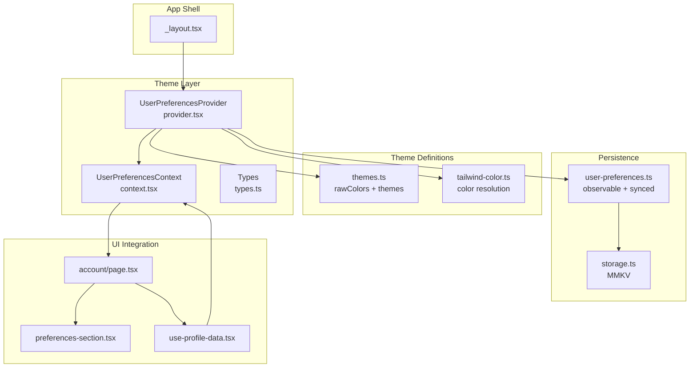
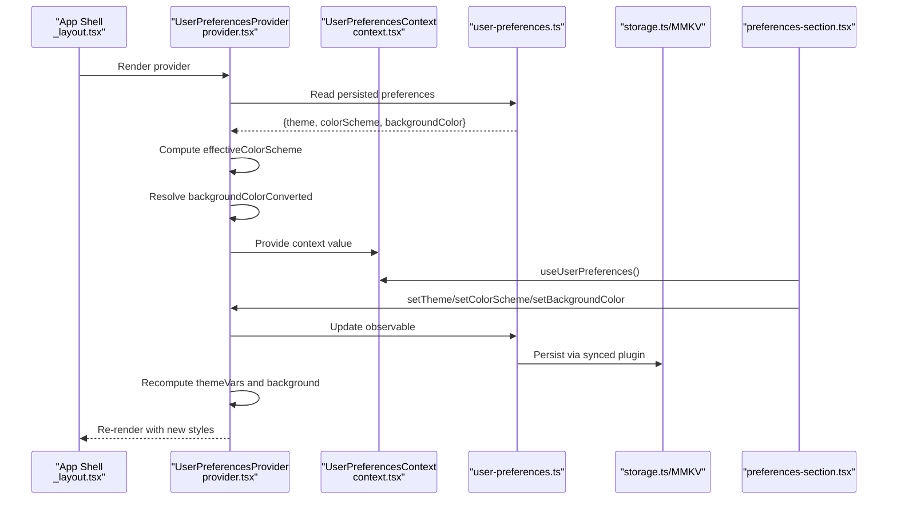
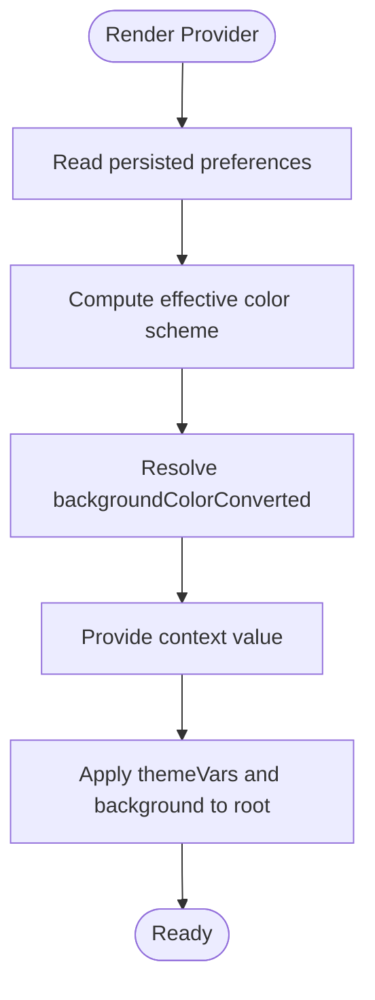
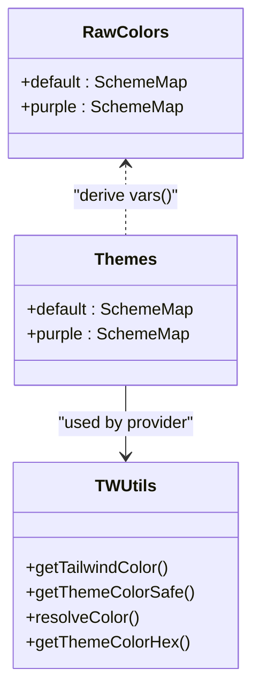
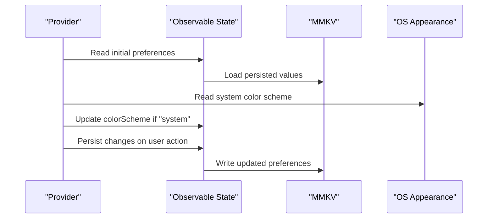
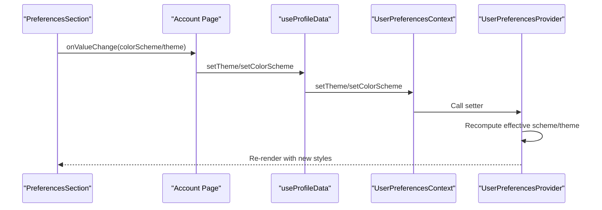
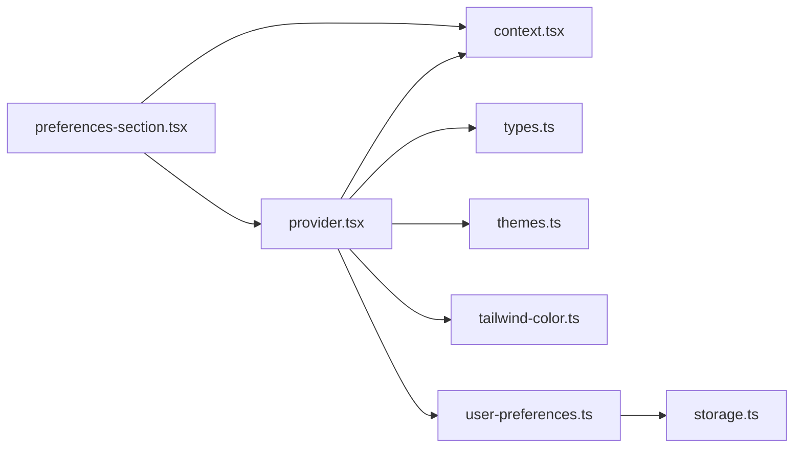

# Theme System

<cite>
**Referenced Files in This Document**
- [provider.tsx](file://src/context/themes/provider.tsx)
- [context.tsx](file://src/context/themes/context.tsx)
- [types.ts](file://src/context/themes/types.ts)
- [_layout.tsx](file://src/app/_layout.tsx)
- [themes.ts](file://src/lib/themes.ts)
- [tailwind-color.ts](file://src/utils/tailwind-color.ts)
- [user-preferences.ts](file://src/data/states/user-preferences.ts)
- [storage.ts](file://src/data/storage.ts)
- [preferences-section.tsx](file://src/features/account/components/preferences-section.tsx)
- [page.tsx](file://src/features/account/page.tsx)
- [use-profile-data.tsx](file://src/features/account/use-profile-data.tsx)
</cite>

## Table of Contents
1. [Introduction](#introduction)
2. [Project Structure](#project-structure)
3. [Core Components](#core-components)
4. [Architecture Overview](#architecture-overview)
5. [Detailed Component Analysis](#detailed-component-analysis)
6. [Dependency Analysis](#dependency-analysis)
7. [Performance Considerations](#performance-considerations)
8. [Troubleshooting Guide](#troubleshooting-guide)
9. [Conclusion](#conclusion)

## Introduction
This document explains the PowerLists theme system: how themes are defined, how the provider manages context and state, how runtime theme switching works, and how colors are resolved and applied. It covers predefined themes, background color customization, system preference detection, persistence, and integration with UI components. Accessibility considerations are addressed through semantic color roles and contrast-aware tokens.

## Project Structure
The theme system spans several layers:
- Provider and context define the theme runtime and expose setters.
- Theme definitions live in a centralized library module.
- Color resolution utilities normalize and resolve color values.
- Persistent user preferences are managed via observable state with MMKV-backed persistence.
- UI components consume the theme context to render appropriately.

**Diagram sources**
- [_layout.tsx:34-58](file://src/app/_layout.tsx#L34-L58)
- [provider.tsx:18-152](file://src/context/themes/provider.tsx#L18-L152)
- [context.tsx:1-17](file://src/context/themes/context.tsx#L1-L17)
- [types.ts:1-14](file://src/context/themes/types.ts#L1-L14)
- [themes.ts:1-214](file://src/lib/themes.ts#L1-L214)
- [tailwind-color.ts:1-241](file://src/utils/tailwind-color.ts#L1-L241)
- [user-preferences.ts:1-28](file://src/data/states/user-preferences.ts#L1-L28)
- [storage.ts:1-74](file://src/data/storage.ts#L1-L74)
- [page.tsx:1-70](file://src/features/account/page.tsx#L1-L70)
- [preferences-section.tsx:1-99](file://src/features/account/components/preferences-section.tsx#L1-L99)
- [use-profile-data.tsx:1-18](file://src/features/account/use-profile-data.tsx#L1-L18)

**Section sources**
- [_layout.tsx:34-58](file://src/app/_layout.tsx#L34-L58)
- [provider.tsx:18-152](file://src/context/themes/provider.tsx#L18-L152)
- [context.tsx:1-17](file://src/context/themes/context.tsx#L1-L17)
- [types.ts:1-14](file://src/context/themes/types.ts#L1-L14)
- [themes.ts:1-214](file://src/lib/themes.ts#L1-L214)
- [tailwind-color.ts:1-241](file://src/utils/tailwind-color.ts#L1-L241)
- [user-preferences.ts:1-28](file://src/data/states/user-preferences.ts#L1-L28)
- [storage.ts:1-74](file://src/data/storage.ts#L1-L74)
- [page.tsx:1-70](file://src/features/account/page.tsx#L1-L70)
- [preferences-section.tsx:1-99](file://src/features/account/components/preferences-section.tsx#L1-L99)
- [use-profile-data.tsx:1-18](file://src/features/account/use-profile-data.tsx#L1-L18)

## Core Components
- Theme provider: orchestrates theme selection, system color scheme, background color, and exposes setters to update preferences.
- Theme context: exposes current theme, color scheme, background color, and setters.
- Theme definitions: raw color tokens and derived NativeWind vars per theme and scheme.
- Color utilities: resolve Tailwind tokens, theme variables, and arbitrary formats to normalized values.
- Persistence: observable state synced to MMKV for theme, color scheme, and background color.
- UI integration: account page and preferences section consume context and drive runtime changes.

**Section sources**
- [provider.tsx:18-152](file://src/context/themes/provider.tsx#L18-L152)
- [context.tsx:1-17](file://src/context/themes/context.tsx#L1-L17)
- [types.ts:1-14](file://src/context/themes/types.ts#L1-L14)
- [themes.ts:1-214](file://src/lib/themes.ts#L1-L214)
- [tailwind-color.ts:1-241](file://src/utils/tailwind-color.ts#L1-L241)
- [user-preferences.ts:1-28](file://src/data/states/user-preferences.ts#L1-L28)
- [storage.ts:1-74](file://src/data/storage.ts#L1-L74)
- [page.tsx:1-70](file://src/features/account/page.tsx#L1-L70)
- [preferences-section.tsx:1-99](file://src/features/account/components/preferences-section.tsx#L1-L99)
- [use-profile-data.tsx:1-18](file://src/features/account/use-profile-data.tsx#L1-L18)

## Architecture Overview
The theme system follows a layered architecture:
- Provider computes effective color scheme and theme, resolves background color, and injects styles into the app shell.
- Context exposes getters/setters for theme-aware components.
- Theme definitions centralize color tokens and derive NativeWind vars.
- Color utilities normalize inputs and resolve theme variables safely.
- Observable state persists preferences with MMKV.

**Diagram sources**
- [_layout.tsx:34-58](file://src/app/_layout.tsx#L34-L58)
- [provider.tsx:26-152](file://src/context/themes/provider.tsx#L26-L152)
- [context.tsx:1-17](file://src/context/themes/context.tsx#L1-L17)
- [user-preferences.ts:12-25](file://src/data/states/user-preferences.ts#L12-L25)
- [storage.ts:65-73](file://src/data/storage.ts#L65-L73)
- [preferences-section.tsx:76-94](file://src/features/account/components/preferences-section.tsx#L76-L94)

## Detailed Component Analysis

### Theme Provider and Context
The provider:
- Reads persisted preferences from observable state.
- Computes effective color scheme by combining user preference with system preference.
- Resolves background color from theme variables and fallbacks.
- Exposes setters to change theme, color scheme, and background color.
- Injects theme variables into the app shell and applies background color to the root container.

Key behaviors:
- Effective color scheme resolution: prefers user choice, falls back to system, with “system” dynamically following OS.
- Background color resolution: supports “default” mapping to the theme’s background variable and explicit color values.
- Setters validate inputs and persist changes via observable state.

**Diagram sources**
- [provider.tsx:26-152](file://src/context/themes/provider.tsx#L26-L152)

**Section sources**
- [provider.tsx:18-152](file://src/context/themes/provider.tsx#L18-L152)
- [context.tsx:1-17](file://src/context/themes/context.tsx#L1-L17)
- [types.ts:1-14](file://src/context/themes/types.ts#L1-L14)

### Theme Definitions and Color Resolution
Theme definitions:
- Centralized raw color tokens per theme and scheme.
- Derived NativeWind vars for use in style props.
- Two built-in themes: default and purple.

Color resolution utilities:
- Resolve Tailwind tokens, theme CSS variables, and direct formats (hex/rgb/hsl).
- Safe resolution with fallbacks to prevent crashes.
- Hex normalization for consistent downstream usage.

**Diagram sources**
- [themes.ts:15-214](file://src/lib/themes.ts#L15-L214)
- [tailwind-color.ts:24-241](file://src/utils/tailwind-color.ts#L24-L241)

**Section sources**
- [themes.ts:1-214](file://src/lib/themes.ts#L1-L214)
- [tailwind-color.ts:1-241](file://src/utils/tailwind-color.ts#L1-L241)

### Persistence and System Preference Detection
Persistence:
- Observable state with synced plugin backed by MMKV.
- Stores theme, colorScheme, and backgroundColor.
- Provides retry on sync failures.

System preference detection:
- Uses NativeWind’s color scheme hook to detect OS-level preference.
- “system” mode dynamically follows OS changes.

**Diagram sources**
- [user-preferences.ts:12-25](file://src/data/states/user-preferences.ts#L12-L25)
- [storage.ts:65-73](file://src/data/storage.ts#L65-L73)
- [provider.tsx:22-24](file://src/context/themes/provider.tsx#L22-L24)

**Section sources**
- [user-preferences.ts:1-28](file://src/data/states/user-preferences.ts#L1-L28)
- [storage.ts:1-74](file://src/data/storage.ts#L1-L74)
- [provider.tsx:21-33](file://src/context/themes/provider.tsx#L21-L33)

### UI Integration and Reactive Switching
Integration points:
- Account page composes profile, sections, and logout.
- Preferences section renders selects for color mode and theme.
- useProfileData hook consumes context and exposes setters.

Runtime switching:
- Select handlers call setters from context.
- Provider recomputes effective scheme and theme, updates styles, and persists changes.

**Diagram sources**
- [preferences-section.tsx:76-94](file://src/features/account/components/preferences-section.tsx#L76-L94)
- [page.tsx:39-45](file://src/features/account/page.tsx#L39-L45)
- [use-profile-data.tsx:12-14](file://src/features/account/use-profile-data.tsx#L12-L14)
- [context.tsx:11-16](file://src/context/themes/context.tsx#L11-L16)
- [provider.tsx:64-78](file://src/context/themes/provider.tsx#L64-L78)

**Section sources**
- [page.tsx:1-70](file://src/features/account/page.tsx#L1-L70)
- [preferences-section.tsx:1-99](file://src/features/account/components/preferences-section.tsx#L1-L99)
- [use-profile-data.tsx:1-18](file://src/features/account/use-profile-data.tsx#L1-L18)
- [context.tsx:1-17](file://src/context/themes/context.tsx#L1-L17)
- [provider.tsx:64-98](file://src/context/themes/provider.tsx#L64-L98)

### Theme-Aware Styling Patterns and Accessibility
Patterns:
- Use theme variables for consistent colors across components.
- Apply background color from context to root containers for coherent visuals.
- Prefer semantic tokens (primary, secondary, destructive, muted) for component styling.

Accessibility considerations:
- Semantic tokens support contrast-aware variants.
- Use foreground tokens alongside backgrounds to maintain readable text.
- Respect system color scheme for users who prefer dark mode.

[No sources needed since this section provides general guidance]

## Dependency Analysis
The provider depends on:
- NativeWind color scheme detection.
- Observable state for preferences.
- Theme definitions and color utilities.
- UI components for rendering and user interaction.

**Diagram sources**
- [provider.tsx:1-12](file://src/context/themes/provider.tsx#L1-L12)
- [context.tsx:1-17](file://src/context/themes/context.tsx#L1-L17)
- [types.ts:1-14](file://src/context/themes/types.ts#L1-L14)
- [themes.ts:1-214](file://src/lib/themes.ts#L1-L214)
- [tailwind-color.ts:1-241](file://src/utils/tailwind-color.ts#L1-L241)
- [user-preferences.ts:1-28](file://src/data/states/user-preferences.ts#L1-L28)
- [storage.ts:1-74](file://src/data/storage.ts#L1-L74)
- [preferences-section.tsx:1-99](file://src/features/account/components/preferences-section.tsx#L1-L99)

**Section sources**
- [provider.tsx:1-12](file://src/context/themes/provider.tsx#L1-L12)
- [context.tsx:1-17](file://src/context/themes/context.tsx#L1-L17)
- [types.ts:1-14](file://src/context/themes/types.ts#L1-L14)
- [themes.ts:1-214](file://src/lib/themes.ts#L1-L214)
- [tailwind-color.ts:1-241](file://src/utils/tailwind-color.ts#L1-L241)
- [user-preferences.ts:1-28](file://src/data/states/user-preferences.ts#L1-L28)
- [storage.ts:1-74](file://src/data/storage.ts#L1-L74)
- [preferences-section.tsx:1-99](file://src/features/account/components/preferences-section.tsx#L1-L99)

## Performance Considerations
- Memoization: Provider uses useMemo for computed values to minimize re-renders.
- Minimal recomputation: Setters short-circuit invalid inputs and only persist valid changes.
- Efficient color resolution: Utilities cache and reuse resolved values when possible.

[No sources needed since this section provides general guidance]

## Troubleshooting Guide
Common issues and resolutions:
- Invalid color scheme or theme: Setters validate inputs and log errors; ensure values match supported options.
- Missing theme variable: Color utilities return fallbacks; verify theme variable names and scheme.
- Persistence failures: Synced observable retries; check MMKV encryption key and storage ID configuration.
- System scheme not updating: Ensure “system” mode is selected and OS preference changes propagate.

**Section sources**
- [provider.tsx:37-62](file://src/context/themes/provider.tsx#L37-L62)
- [provider.tsx:64-78](file://src/context/themes/provider.tsx#L64-L78)
- [provider.tsx:80-98](file://src/context/themes/provider.tsx#L80-L98)
- [tailwind-color.ts:132-147](file://src/utils/tailwind-color.ts#L132-L147)
- [user-preferences.ts:19-24](file://src/data/states/user-preferences.ts#L19-L24)
- [storage.ts:10-23](file://src/data/storage.ts#L10-L23)

## Conclusion
The PowerLists theme system provides a robust, reactive, and persistent theming solution. It defines clear theme tokens, resolves colors safely, respects system preferences, and integrates seamlessly with UI components. Developers can extend themes, customize backgrounds, and switch themes at runtime while maintaining accessibility and performance.