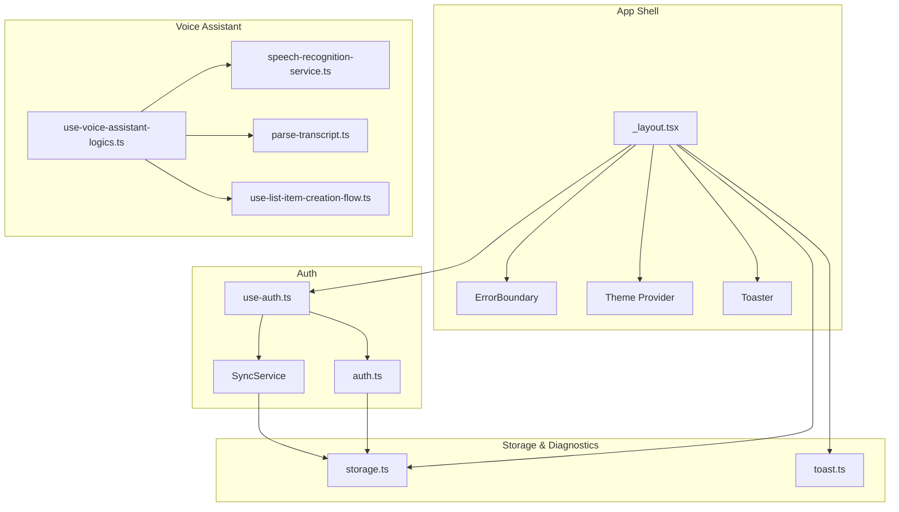
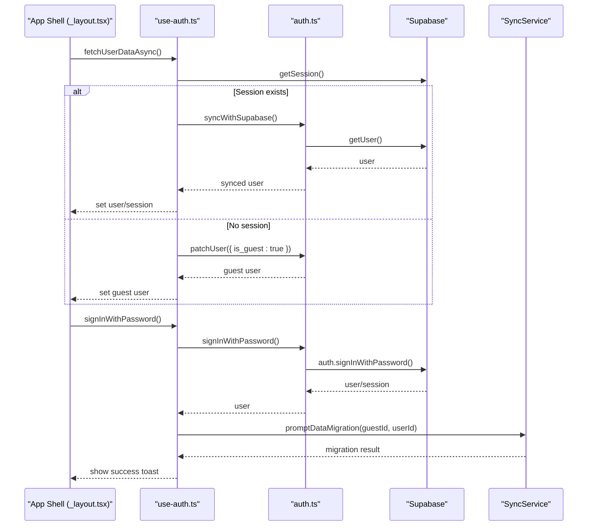
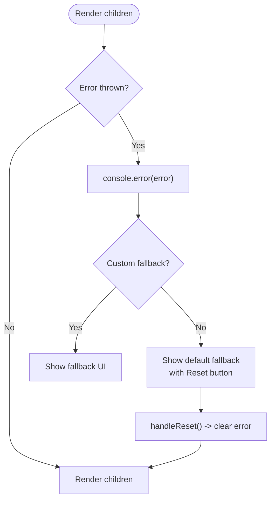
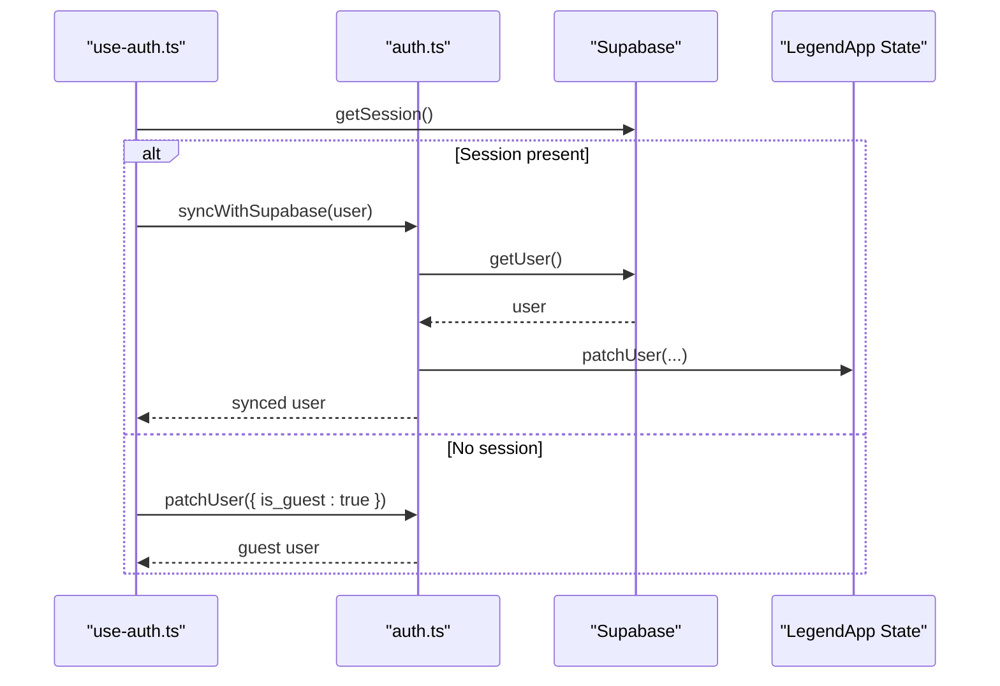
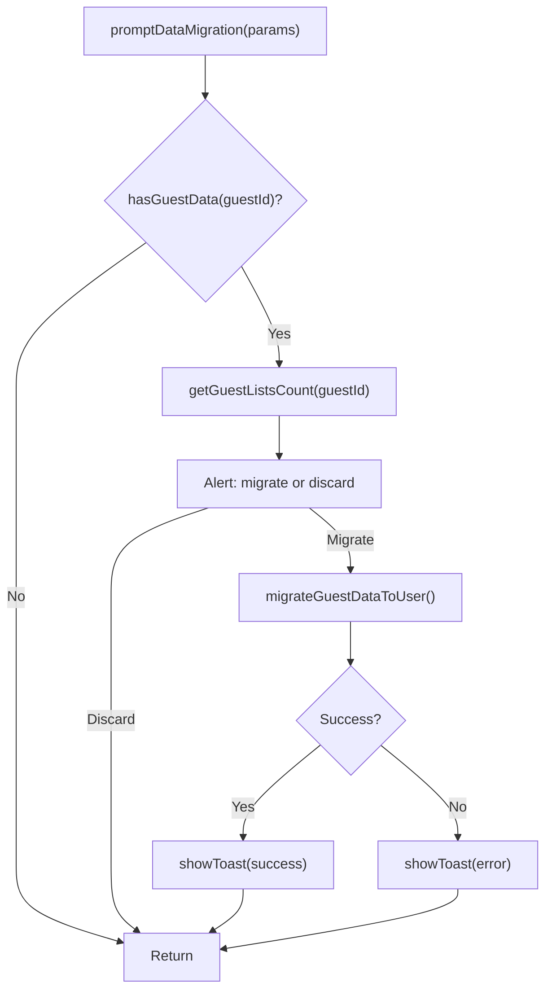
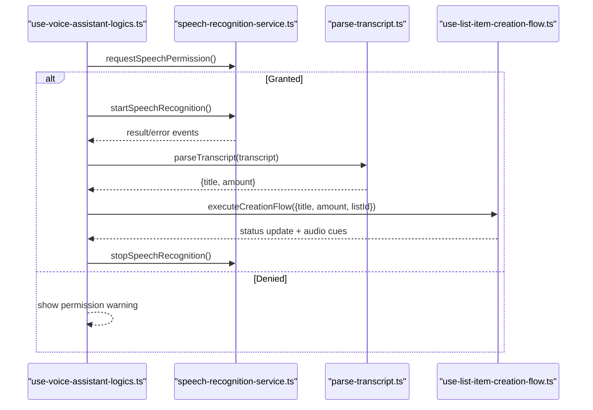
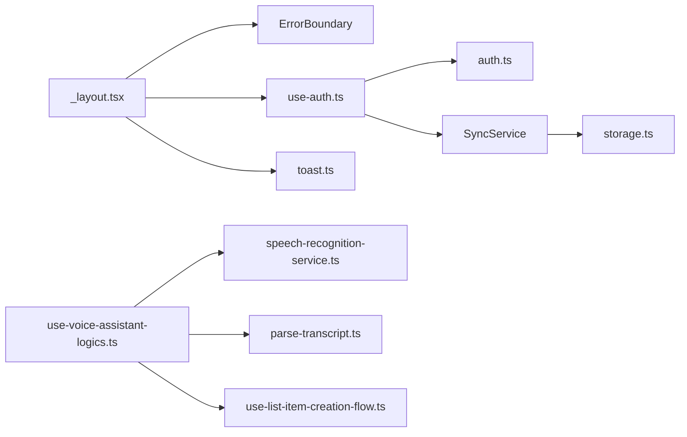

# Troubleshooting and FAQ

<cite>
**Referenced Files in This Document**
- [_layout.tsx](file://src/app/_layout.tsx)
- [error-boundary/index.tsx](file://src/components/error-boundary/index.tsx)
- [metro.config.cjs](file://metro.config.cjs)
- [package.json](file://package.json)
- [use-auth.ts](file://src/hooks/use-auth.ts)
- [auth.ts](file://src/data/actions/auth.ts)
- [storage.ts](file://src/data/storage.ts)
- [toast.ts](file://src/services/toast.ts)
- [sync.ts](file://src/services/sync.ts)
- [speech-recognition-service.ts](file://src/features/voice-assistant/services/speech-recognition-service.ts)
- [use-voice-assistant-logics.ts](file://src/features/voice-assistant/hooks/use-voice-assistant-logics.ts)
- [parse-transcript.ts](file://src/features/voice-assistant/utils/parse-transcript.ts)
- [use-list-item-creation-flow.ts](file://src/features/voice-assistant/hooks/use-list-item-creation-flow.ts)
- [jest.config.cjs](file://jest.config.cjs)
</cite>

## Table of Contents
1. [Introduction](#introduction)
2. [Project Structure](#project-structure)
3. [Core Components](#core-components)
4. [Architecture Overview](#architecture-overview)
5. [Detailed Component Analysis](#detailed-component-analysis)
6. [Dependency Analysis](#dependency-analysis)
7. [Performance Considerations](#performance-considerations)
8. [Troubleshooting Guide](#troubleshooting-guide)
9. [Conclusion](#conclusion)
10. [Appendices](#appendices)

## Introduction
This document provides a comprehensive troubleshooting and FAQ guide for PowerLists. It focuses on:
- Development environment issues (Metro bundler, dependency conflicts, platform-specific build errors)
- Runtime issues (authentication failures, synchronization problems, voice assistant functionality)
- Debugging strategies (state management, UI rendering, performance)
- Error boundaries, logging, and diagnostics
- Frequently asked questions and escalation paths

## Project Structure
PowerLists is an Expo + React Native application using:
- Expo Router for navigation
- LegendApp State for reactive state management
- Supabase for authentication and backend
- NativeWind/Tailwind for styling
- Jest for property-based tests
- Voice assistant powered by expo-speech-recognition

**Diagram sources**
- [_layout.tsx:17-62](file://src/app/_layout.tsx#L17-L62)
- [error-boundary/index.tsx:15-55](file://src/components/error-boundary/index.tsx#L15-L55)
- [use-auth.ts:19-260](file://src/hooks/use-auth.ts#L19-L260)
- [auth.ts:16-138](file://src/data/actions/auth.ts#L16-L138)
- [sync.ts:41-202](file://src/services/sync.ts#L41-L202)
- [speech-recognition-service.ts:1-54](file://src/features/voice-assistant/services/speech-recognition-service.ts#L1-L54)
- [use-voice-assistant-logics.ts:19-213](file://src/features/voice-assistant/hooks/use-voice-assistant-logics.ts#L19-L213)
- [parse-transcript.ts:194-225](file://src/features/voice-assistant/utils/parse-transcript.ts#L194-L225)
- [use-list-item-creation-flow.ts:22-96](file://src/features/voice-assistant/hooks/use-list-item-creation-flow.ts#L22-L96)
- [storage.ts:1-74](file://src/data/storage.ts#L1-L74)
- [toast.ts:24-44](file://src/services/toast.ts#L24-L44)

**Section sources**
- [_layout.tsx:17-62](file://src/app/_layout.tsx#L17-L62)
- [package.json:1-118](file://package.json#L1-L118)

## Core Components
- Error Boundary: Catches unexpected errors and logs them to the console, offering a reset option.
- Authentication Hooks: Centralized auth flows, session checks, and migration prompts.
- Sync Service: Guest-to-user data migration with user prompts and toast feedback.
- Voice Assistant: Speech permission handling, recognition lifecycle, transcript parsing, and item creation flow.
- Storage Utilities: MMKV-backed storage with debug helpers and encryption support.
- Toast Notifications: Unified toast notifications via sonner-native.

**Section sources**
- [error-boundary/index.tsx:15-55](file://src/components/error-boundary/index.tsx#L15-L55)
- [use-auth.ts:19-260](file://src/hooks/use-auth.ts#L19-L260)
- [sync.ts:41-202](file://src/services/sync.ts#L41-L202)
- [speech-recognition-service.ts:1-54](file://src/features/voice-assistant/services/speech-recognition-service.ts#L1-L54)
- [parse-transcript.ts:194-225](file://src/features/voice-assistant/utils/parse-transcript.ts#L194-L225)
- [storage.ts:1-74](file://src/data/storage.ts#L1-L74)
- [toast.ts:24-44](file://src/services/toast.ts#L24-L44)

## Architecture Overview
High-level runtime flows for authentication and voice assistant.

**Diagram sources**
- [_layout.tsx:20-26](file://src/app/_layout.tsx#L20-L26)
- [use-auth.ts:29-74](file://src/hooks/use-auth.ts#L29-L74)
- [auth.ts:72-97](file://src/data/actions/auth.ts#L72-L97)
- [sync.ts:102-150](file://src/services/sync.ts#L102-L150)

## Detailed Component Analysis

### Error Boundary
- Purpose: Prevent app crashes by catching errors and rendering a friendly fallback or reset UX.
- Logging: Logs captured errors to the console.
- Fallback: Renders a reset button; optional custom fallback via props.

**Diagram sources**
- [error-boundary/index.tsx:15-55](file://src/components/error-boundary/index.tsx#L15-L55)

**Section sources**
- [error-boundary/index.tsx:15-55](file://src/components/error-boundary/index.tsx#L15-L55)

### Authentication and Session Management
- fetchUserDataAsync: Initializes auth state, restores user, or downgrades to guest if session invalid.
- signInWithPassword: Authenticates user, syncs with Supabase, and triggers migration if switching from guest.
- signOut: Clears session and storage, resets state.
- handleError: Normalizes error messages for UI.

**Diagram sources**
- [use-auth.ts:29-74](file://src/hooks/use-auth.ts#L29-L74)
- [auth.ts:72-97](file://src/data/actions/auth.ts#L72-L97)

**Section sources**
- [use-auth.ts:19-260](file://src/hooks/use-auth.ts#L19-L260)
- [auth.ts:16-138](file://src/data/actions/auth.ts#L16-L138)

### Data Synchronization (Guest to User)
- hasGuestData/getGuestListsCount: Detects presence and count of guest-owned lists.
- promptDataMigration: Prompts user to migrate; shows success/error toasts.
- migrateGuestDataToUser: Updates profile_id for all guest lists; relies on LegendApp auto-sync.

**Diagram sources**
- [sync.ts:102-150](file://src/services/sync.ts#L102-L150)
- [sync.ts:166-201](file://src/services/sync.ts#L166-L201)

**Section sources**
- [sync.ts:41-202](file://src/services/sync.ts#L41-L202)

### Voice Assistant
- Permission and Lifecycle: requestSpeechPermission, start/stop recognition, event handlers.
- Transcript Parsing: parseTranscript supports numeric words and digits.
- Item Creation Flow: Acknowledgment, save item, success/failure feedback.

**Diagram sources**
- [use-voice-assistant-logics.ts:113-139](file://src/features/voice-assistant/hooks/use-voice-assistant-logics.ts#L113-L139)
- [speech-recognition-service.ts:19-33](file://src/features/voice-assistant/services/speech-recognition-service.ts#L19-L33)
- [parse-transcript.ts:194-225](file://src/features/voice-assistant/utils/parse-transcript.ts#L194-L225)
- [use-list-item-creation-flow.ts:27-92](file://src/features/voice-assistant/hooks/use-list-item-creation-flow.ts#L27-L92)

**Section sources**
- [use-voice-assistant-logics.ts:19-213](file://src/features/voice-assistant/hooks/use-voice-assistant-logics.ts#L19-L213)
- [speech-recognition-service.ts:1-54](file://src/features/voice-assistant/services/speech-recognition-service.ts#L1-L54)
- [parse-transcript.ts:1-225](file://src/features/voice-assistant/utils/parse-transcript.ts#L1-L225)
- [use-list-item-creation-flow.ts:1-96](file://src/features/voice-assistant/hooks/use-list-item-creation-flow.ts#L1-L96)

### Storage and Diagnostics
- MMKV-backed storage with optional encryption via environment variables.
- Clear-all, key listing, selective deletion, and debug logging utilities.
- Toast notifications for user feedback.

**Section sources**
- [storage.ts:1-74](file://src/data/storage.ts#L1-L74)
- [toast.ts:24-44](file://src/services/toast.ts#L24-L44)

## Dependency Analysis
- Expo Router and navigation stack guarded by authentication state.
- Error boundary wraps the entire app shell.
- Auth hooks depend on Supabase for session and user operations.
- Sync service depends on LegendApp state for reactive persistence.
- Voice assistant depends on expo-speech-recognition and audio queues.

**Diagram sources**
- [_layout.tsx:34-57](file://src/app/_layout.tsx#L34-L57)
- [use-auth.ts:19-260](file://src/hooks/use-auth.ts#L19-L260)
- [auth.ts:16-138](file://src/data/actions/auth.ts#L16-L138)
- [sync.ts:41-202](file://src/services/sync.ts#L41-L202)
- [storage.ts:1-74](file://src/data/storage.ts#L1-L74)
- [use-voice-assistant-logics.ts:19-213](file://src/features/voice-assistant/hooks/use-voice-assistant-logics.ts#L19-L213)
- [speech-recognition-service.ts:1-54](file://src/features/voice-assistant/services/speech-recognition-service.ts#L1-L54)
- [parse-transcript.ts:194-225](file://src/features/voice-assistant/utils/parse-transcript.ts#L194-L225)
- [use-list-item-creation-flow.ts:22-96](file://src/features/voice-assistant/hooks/use-list-item-creation-flow.ts#L22-L96)
- [toast.ts:24-44](file://src/services/toast.ts#L24-L44)

**Section sources**
- [package.json:14-86](file://package.json#L14-L86)
- [metro.config.cjs:1-7](file://metro.config.cjs#L1-L7)

## Performance Considerations
- Avoid unnecessary re-renders by using LegendApp state selectors and memoization in hooks.
- Debounce or throttle speech recognition start attempts to prevent race conditions.
- Limit heavy computations in event handlers; defer to background tasks when possible.
- Use minimal UI updates during recognition; batch state changes.

[No sources needed since this section provides general guidance]

## Troubleshooting Guide

### Development Environment

- Metro Bundler Issues
  - Symptoms: Build stuck, cache errors, platform-specific failures.
  - Steps:
    - Clear Metro cache and reinstall dependencies.
    - Verify Metro/NativeWind configuration.
    - Reinstall Yarn 4 and ensure Corepack is enabled.
  - References:
    - [metro.config.cjs:1-7](file://metro.config.cjs#L1-L7)
    - [package.json:12-12](file://package.json#L12-L12)

- Dependency Conflicts
  - Symptoms: Type errors, peer dependency warnings, platform mismatches.
  - Steps:
    - Align versions with Expo SDK and React Native versions.
    - Prefer Yarn 4 with Corepack as configured.
    - Resolve conflicting packages (e.g., react, react-native, react-native-reanimated).
  - References:
    - [package.json:14-86](file://package.json#L14-L86)
    - [package.json:88-112](file://package.json#L88-L112)

- Platform-Specific Build Errors
  - iOS/Android differences:
    - Ensure platform-specific prebuild steps are executed.
    - Validate device simulators/emulators and permissions.
  - References:
    - [package.json:5-8](file://package.json#L5-L8)

### Runtime Troubleshooting

- Authentication Failures
  - Symptoms: Login/signup fails, session lost, guest downgrade loops.
  - Steps:
    - Verify Supabase credentials and network connectivity.
    - Check session restoration flow and user sync.
    - Inspect error normalization and toast feedback.
  - References:
    - [use-auth.ts:76-121](file://src/hooks/use-auth.ts#L76-L121)
    - [auth.ts:99-110](file://src/data/actions/auth.ts#L99-L110)
    - [auth.ts:135-137](file://src/data/actions/auth.ts#L135-L137)
    - [toast.ts:24-44](file://src/services/toast.ts#L24-L44)

- Synchronization Problems
  - Symptoms: Guest data not migrating, stale lists, inconsistent counts.
  - Steps:
    - Confirm guest lists detection and count retrieval.
    - Trigger migration prompt and review migration result.
    - Validate LegendApp state updates and auto-sync behavior.
  - References:
    - [sync.ts:48-81](file://src/services/sync.ts#L48-L81)
    - [sync.ts:102-150](file://src/services/sync.ts#L102-L150)
    - [sync.ts:166-201](file://src/services/sync.ts#L166-L201)

- Voice Assistant Functionality
  - Symptoms: Microphone denied, no speech detected, parsing errors.
  - Steps:
    - Request speech permission and handle denial gracefully.
    - Validate transcript parsing rules and numeric word support.
    - Monitor recognition lifecycle and error events.
  - References:
    - [use-voice-assistant-logics.ts:113-139](file://src/features/voice-assistant/hooks/use-voice-assistant-logics.ts#L113-L139)
    - [speech-recognition-service.ts:19-33](file://src/features/voice-assistant/services/speech-recognition-service.ts#L19-L33)
    - [parse-transcript.ts:194-225](file://src/features/voice-assistant/utils/parse-transcript.ts#L194-L225)

- State Management Problems
  - Symptoms: UI not updating, stale values, unexpected re-renders.
  - Steps:
    - Use LegendApp state getters/setters correctly.
    - Wrap critical screens with ErrorBoundary to isolate issues.
    - Inspect storage state and clear selectively when needed.
  - References:
    - [_layout.tsx:38-57](file://src/app/_layout.tsx#L38-L57)
    - [error-boundary/index.tsx:15-55](file://src/components/error-boundary/index.tsx#L15-L55)
    - [storage.ts:29-32](file://src/data/storage.ts#L29-L32)

- UI Rendering Issues
  - Symptoms: Blank screens, boot splash not hiding, theme not applied.
  - Steps:
    - Ensure fonts are loaded before hiding splash.
    - Verify theme provider and portal host are present.
    - Check navigation guards and protected routes.
  - References:
    - [_layout.tsx:24-32](file://src/app/_layout.tsx#L24-L32)
    - [_layout.tsx:34-57](file://src/app/_layout.tsx#L34-L57)

- Performance Bottlenecks
  - Symptoms: Slow recognition, jank during item creation, excessive logging.
  - Steps:
    - Debounce repeated start attempts.
    - Minimize UI updates during recognition.
    - Reduce heavy computations in event handlers.
  - References:
    - [use-voice-assistant-logics.ts:141-163](file://src/features/voice-assistant/hooks/use-voice-assistant-logics.ts#L141-L163)

- Error Boundaries and Logging
  - Steps:
    - Review logged errors in console.
    - Use fallback UI to recover from fatal errors.
  - References:
    - [error-boundary/index.tsx:22-26](file://src/components/error-boundary/index.tsx#L22-L26)

- Diagnostic Tools
  - Steps:
    - Use storage debug utilities to inspect keys/values.
    - Clear storage selectively for isolated testing.
    - Leverage toast notifications for immediate feedback.
  - References:
    - [storage.ts:54-62](file://src/data/storage.ts#L54-L62)
    - [storage.ts:44-49](file://src/data/storage.ts#L44-L49)
    - [toast.ts:24-44](file://src/services/toast.ts#L24-L44)

### Frequently Asked Questions

- Why does the app crash on startup?
  - Check ErrorBoundary logs and ensure splash hides only after fonts load.
  - References:
    - [error-boundary/index.tsx:22-26](file://src/components/error-boundary/index.tsx#L22-L26)
    - [_layout.tsx:24-32](file://src/app/_layout.tsx#L24-L32)

- Why does login fail intermittently?
  - Verify Supabase credentials, network, and session restoration logic.
  - References:
    - [use-auth.ts:231-258](file://src/hooks/use-auth.ts#L231-L258)
    - [auth.ts:99-110](file://src/data/actions/auth.ts#L99-L110)

- Why is my guest data not migrating?
  - Confirm guest lists detection and migration prompt flow.
  - References:
    - [sync.ts:48-60](file://src/services/sync.ts#L48-L60)
    - [sync.ts:102-150](file://src/services/sync.ts#L102-L150)

- Why does speech recognition not start?
  - Ensure microphone permission is granted and handle denial gracefully.
  - References:
    - [use-voice-assistant-logics.ts:113-139](file://src/features/voice-assistant/hooks/use-voice-assistant-logics.ts#L113-L139)
    - [speech-recognition-service.ts:19-22](file://src/features/voice-assistant/services/speech-recognition-service.ts#L19-L22)

- How do I clear app data for testing?
  - Use storage clear utilities and confirm logs.
  - References:
    - [storage.ts:29-32](file://src/data/storage.ts#L29-L32)

- How do I validate my environment setup?
  - Run lint/format scripts and ensure Yarn 4/Corepack is enabled.
  - References:
    - [package.json:9-12](file://package.json#L9-L12)

### Escalation Paths
- For persistent Metro issues:
  - Clear caches, reinstall dependencies, and re-run prebuild.
- For authentication escalations:
  - Validate Supabase project settings and network access.
- For voice assistant escalations:
  - Test on multiple devices and compare permission prompts.
- For state/UI escalations:
  - Add targeted logs around state transitions and wrap problematic screens with ErrorBoundary.

**Section sources**
- [metro.config.cjs:1-7](file://metro.config.cjs#L1-L7)
- [package.json:9-12](file://package.json#L9-L12)
- [package.json:14-86](file://package.json#L14-L86)
- [use-auth.ts:231-258](file://src/hooks/use-auth.ts#L231-L258)
- [auth.ts:99-110](file://src/data/actions/auth.ts#L99-L110)
- [sync.ts:48-60](file://src/services/sync.ts#L48-L60)
- [use-voice-assistant-logics.ts:113-139](file://src/features/voice-assistant/hooks/use-voice-assistant-logics.ts#L113-L139)
- [speech-recognition-service.ts:19-22](file://src/features/voice-assistant/services/speech-recognition-service.ts#L19-L22)
- [storage.ts:29-32](file://src/data/storage.ts#L29-L32)
- [_layout.tsx:24-32](file://src/app/_layout.tsx#L24-L32)

## Conclusion
This guide consolidates actionable troubleshooting steps, diagnostic procedures, and escalation paths for PowerLists. By leveraging the built-in error boundary, toast notifications, storage utilities, and voice assistant components, most issues can be resolved quickly. For persistent problems, follow the escalation paths and consult the referenced files for deeper insights.

## Appendices

### Testing Setup Notes
- Property-based tests use Jest with ts-jest and module resolution mapped to src.
- MMKV mock is used for tests to avoid native dependencies.

**Section sources**
- [jest.config.cjs:1-23](file://jest.config.cjs#L1-L23)