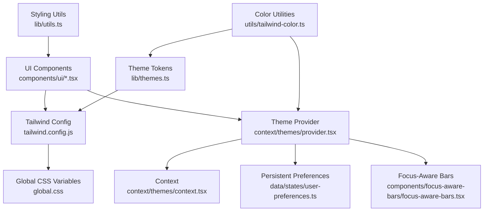
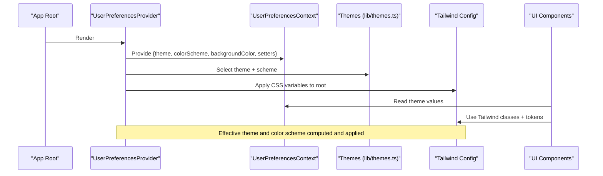
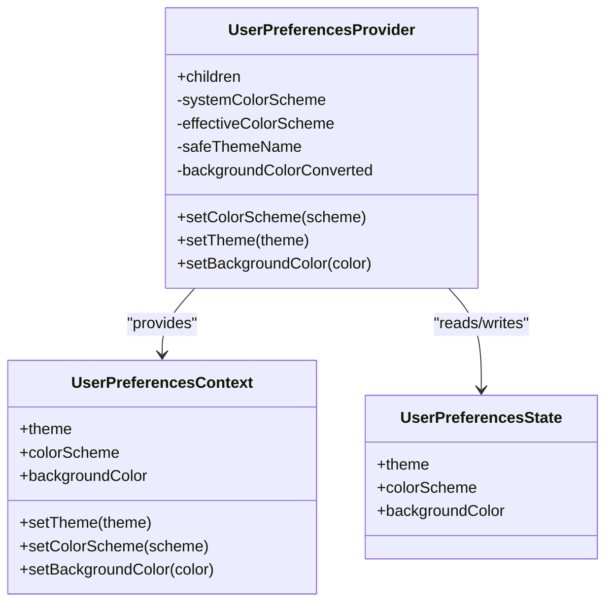
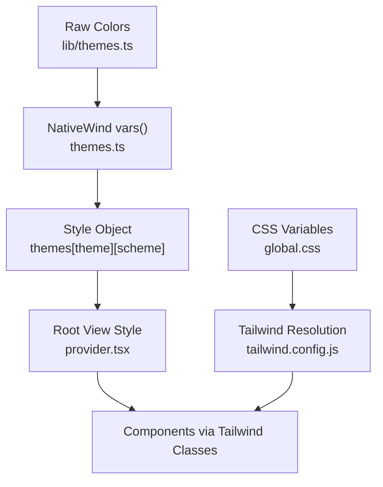
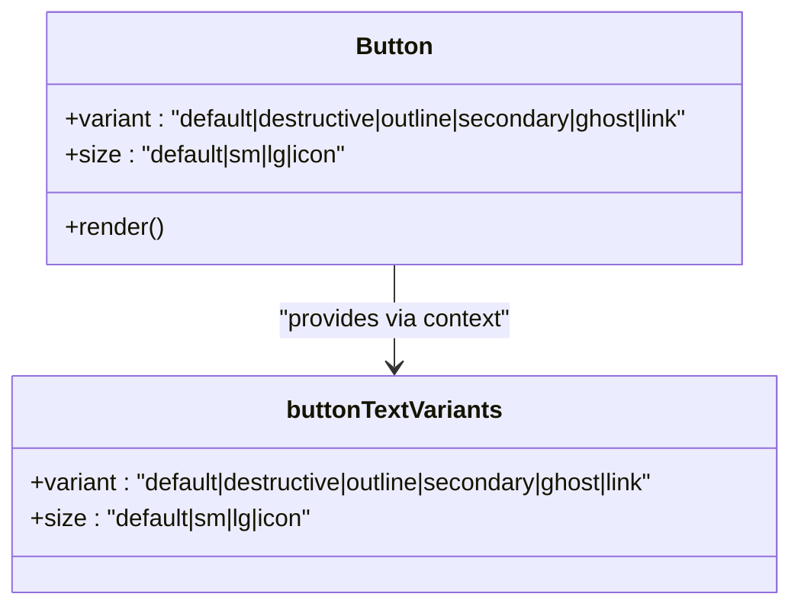
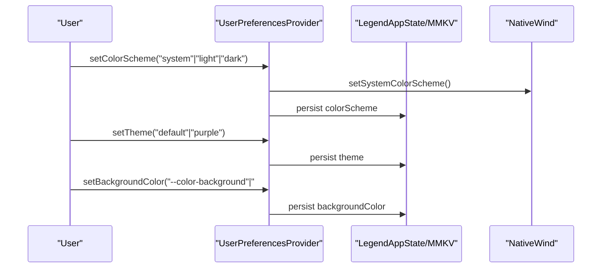
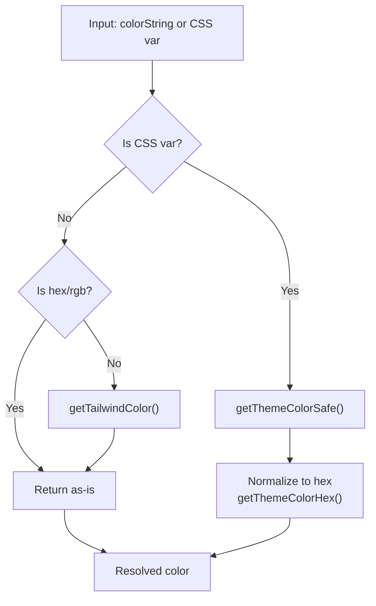
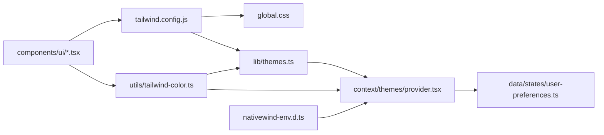

# Component Styling and Theming

<cite>
**Referenced Files in This Document**
- [provider.tsx](file://src/context/themes/provider.tsx)
- [context.tsx](file://src/context/themes/context.tsx)
- [types.ts](file://src/context/themes/types.ts)
- [themes.ts](file://src/lib/themes.ts)
- [tailwind.config.js](file://tailwind.config.js)
- [global.css](file://src/css/global.css)
- [tailwind-color.ts](file://src/utils/tailwind-color.ts)
- [button.tsx](file://src/components/ui/button.tsx)
- [input.tsx](file://src/components/ui/input.tsx)
- [text.tsx](file://src/components/ui/text.tsx)
- [user-preferences.ts](file://src/data/states/user-preferences.ts)
- [focus-aware-bars.tsx](file://src/components/focus-aware-bars/focus-aware-bars.tsx)
- [nativewind-env.d.ts](file://nativewind-env.d.ts)
- [utils.ts](file://src/lib/utils.ts)
</cite>

## Table of Contents
1. [Introduction](#introduction)
2. [Project Structure](#project-structure)
3. [Core Components](#core-components)
4. [Architecture Overview](#architecture-overview)
5. [Detailed Component Analysis](#detailed-component-analysis)
6. [Dependency Analysis](#dependency-analysis)
7. [Performance Considerations](#performance-considerations)
8. [Troubleshooting Guide](#troubleshooting-guide)
9. [Conclusion](#conclusion)

## Introduction
This document explains the component styling and theming system that ensures visual consistency across all UI elements. It covers Tailwind CSS integration via NativeWind, the theme provider implementation, color scheme management, and the variant system powered by Class Variance Authority (CVA). It also documents theme-aware styling patterns, responsive design utilities, the theme context provider, theme switching mechanisms, persistent theme storage, styling utilities, color token systems, and design token management. Finally, it outlines component composition patterns for cross-platform consistency, accessibility compliance, and performance optimizations for dynamic styling.

## Project Structure
The styling and theming system spans several layers:
- Theme definition and token management in a centralized library module
- Tailwind configuration and global CSS variables
- A theme provider that computes effective theme, color scheme, and background color
- UI components using CVA for variants and Tailwind classes
- Utilities for resolving color tokens and safely accessing theme variables
- Persistent user preferences stored locally

**Diagram sources**
- [tailwind.config.js:1-176](file://tailwind.config.js#L1-L176)
- [global.css:1-96](file://src/css/global.css#L1-L96)
- [themes.ts:1-214](file://src/lib/themes.ts#L1-L214)
- [tailwind-color.ts:1-241](file://src/utils/tailwind-color.ts#L1-L241)
- [provider.tsx:1-156](file://src/context/themes/provider.tsx#L1-L156)
- [context.tsx:1-18](file://src/context/themes/context.tsx#L1-L18)
- [user-preferences.ts:1-28](file://src/data/states/user-preferences.ts#L1-L28)
- [focus-aware-bars.tsx:1-16](file://src/components/focus-aware-bars/focus-aware-bars.tsx#L1-L16)
- [utils.ts:1-7](file://src/lib/utils.ts#L1-L7)

**Section sources**
- [tailwind.config.js:1-176](file://tailwind.config.js#L1-L176)
- [global.css:1-96](file://src/css/global.css#L1-L96)
- [themes.ts:1-214](file://src/lib/themes.ts#L1-L214)
- [provider.tsx:1-156](file://src/context/themes/provider.tsx#L1-L156)
- [context.tsx:1-18](file://src/context/themes/context.tsx#L1-L18)
- [user-preferences.ts:1-28](file://src/data/states/user-preferences.ts#L1-L28)
- [tailwind-color.ts:1-241](file://src/utils/tailwind-color.ts#L1-L241)
- [utils.ts:1-7](file://src/lib/utils.ts#L1-L7)

## Core Components
- Theme tokens and computed variables: Centralized color tokens and automatic NativeWind variable generation.
- Theme provider: Computes effective theme, color scheme, and background color; exposes setters; applies theme variables to the root view.
- Context: Provides theme-aware values to components.
- UI components: Buttons, inputs, and text components use CVA variants and Tailwind classes for consistent styling.
- Color utilities: Safe resolution of Tailwind colors, theme variables, and normalized hex values.
- Persistent preferences: Local storage of theme, color scheme, and background color.

**Section sources**
- [themes.ts:1-214](file://src/lib/themes.ts#L1-L214)
- [provider.tsx:1-156](file://src/context/themes/provider.tsx#L1-L156)
- [context.tsx:1-18](file://src/context/themes/context.tsx#L1-L18)
- [button.tsx:1-109](file://src/components/ui/button.tsx#L1-L109)
- [input.tsx:1-36](file://src/components/ui/input.tsx#L1-L36)
- [text.tsx:1-90](file://src/components/ui/text.tsx#L1-L90)
- [tailwind-color.ts:1-241](file://src/utils/tailwind-color.ts#L1-L241)
- [user-preferences.ts:1-28](file://src/data/states/user-preferences.ts#L1-L28)

## Architecture Overview
The theming pipeline:
- Tokens are defined centrally and transformed into NativeWind variables.
- Tailwind resolves tokens into CSS variables and color scales.
- The provider computes the effective color scheme and theme, converts background tokens to HSL, and applies theme variables to the root view.
- Components consume theme-aware tokens via Tailwind classes and CVA variants.
- Persistent preferences synchronize user choices to local storage.

**Diagram sources**
- [provider.tsx:1-156](file://src/context/themes/provider.tsx#L1-L156)
- [themes.ts:1-214](file://src/lib/themes.ts#L1-L214)
- [tailwind.config.js:1-176](file://tailwind.config.js#L1-L176)
- [context.tsx:1-18](file://src/context/themes/context.tsx#L1-L18)

## Detailed Component Analysis

### Theme Provider and Context
The provider integrates NativeWind’s color scheme detection, LegendAppState for reactive preferences, and SafeAreaView/Safe styles to apply theme variables globally. It computes:
- Effective color scheme (system-aware)
- Selected theme name
- Background color derived from theme variables and user preference
It exposes setters to change theme, color scheme, and background color, and persists them to local storage.

**Diagram sources**
- [provider.tsx:1-156](file://src/context/themes/provider.tsx#L1-L156)
- [context.tsx:1-18](file://src/context/themes/context.tsx#L1-L18)
- [user-preferences.ts:1-28](file://src/data/states/user-preferences.ts#L1-L28)

**Section sources**
- [provider.tsx:1-156](file://src/context/themes/provider.tsx#L1-L156)
- [context.tsx:1-18](file://src/context/themes/context.tsx#L1-L18)
- [user-preferences.ts:1-28](file://src/data/states/user-preferences.ts#L1-L28)

### Theme Tokens and Color System
Tokens are defined per theme and per scheme, then wrapped with NativeWind’s vars() to produce style objects for runtime application. Tailwind config maps CSS variables to semantic tokens and color scales. Global CSS defines root variables and dark-mode overrides.

**Diagram sources**
- [themes.ts:1-214](file://src/lib/themes.ts#L1-L214)
- [provider.tsx:134-136](file://src/context/themes/provider.tsx#L134-L136)
- [global.css:1-96](file://src/css/global.css#L1-L96)
- [tailwind.config.js:1-176](file://tailwind.config.js#L1-L176)

**Section sources**
- [themes.ts:1-214](file://src/lib/themes.ts#L1-L214)
- [tailwind.config.js:1-176](file://tailwind.config.js#L1-L176)
- [global.css:1-96](file://src/css/global.css#L1-L96)

### Component Variant System with CVA
Components define variants and sizes using CVA, combining Tailwind classes and platform-specific adjustments. The Button component demonstrates:
- Variant classes for background, borders, and hover/active states
- Size classes for height, padding, and icon sizing
- A text variant context to propagate text styles consistently

**Diagram sources**
- [button.tsx:1-109](file://src/components/ui/button.tsx#L1-L109)

**Section sources**
- [button.tsx:1-109](file://src/components/ui/button.tsx#L1-L109)
- [text.tsx:1-90](file://src/components/ui/text.tsx#L1-L90)

### Responsive and Accessible Patterns
- Responsive breakpoints are handled via Tailwind utilities on components (e.g., size variants).
- Accessibility is addressed by:
  - Using semantic roles and ARIA levels for headings
  - Ensuring focus-visible rings and proper contrast via theme tokens
  - Providing hover and active states for web while preserving native interactions

**Section sources**
- [button.tsx:1-109](file://src/components/ui/button.tsx#L1-L109)
- [text.tsx:1-90](file://src/components/ui/text.tsx#L1-L90)

### Theme Switching and Persistence
- Theme switching updates the theme name and persists it.
- Color scheme switching supports light, dark, and system modes, updating NativeWind’s color scheme and persisting the choice.
- Background color can be set to a theme variable or default, converted to HSL for SafeAreaView background.
- Persistent storage uses LegendAppState with MMKV persistence.

**Diagram sources**
- [provider.tsx:37-98](file://src/context/themes/provider.tsx#L37-L98)
- [user-preferences.ts:12-28](file://src/data/states/user-preferences.ts#L12-L28)

**Section sources**
- [provider.tsx:37-98](file://src/context/themes/provider.tsx#L37-L98)
- [user-preferences.ts:12-28](file://src/data/states/user-preferences.ts#L12-L28)

### Color Token Utilities
Utilities support:
- Resolving Tailwind color strings to hex
- Resolving theme CSS variables to values
- Normalizing theme variable channels to hex
- Safe fallbacks when tokens are missing

**Diagram sources**
- [tailwind-color.ts:132-241](file://src/utils/tailwind-color.ts#L132-L241)

**Section sources**
- [tailwind-color.ts:1-241](file://src/utils/tailwind-color.ts#L1-L241)

### Cross-Platform Composition Patterns
- Platform-specific adjustments are applied via Platform.select in components.
- NativeWind’s vars() and CSS variables ensure consistent rendering across platforms.
- SafeAreaView and focus-aware bars adapt system bar styles to the current color scheme.

**Section sources**
- [button.tsx:8-12](file://src/components/ui/button.tsx#L8-L12)
- [input.tsx:17-24](file://src/components/ui/input.tsx#L17-L24)
- [focus-aware-bars.tsx:6-15](file://src/components/focus-aware-bars/focus-aware-bars.tsx#L6-L15)
- [provider.tsx:140-141](file://src/context/themes/provider.tsx#L140-L141)

## Dependency Analysis
Key dependencies and relationships:
- Tailwind config depends on CSS variables defined in global.css and theme tokens in lib/themes.ts.
- The provider depends on NativeWind color scheme, theme tokens, and user preferences state.
- UI components depend on Tailwind classes and CVA variants.
- Color utilities depend on Tailwind color palette and color parsing.

**Diagram sources**
- [tailwind.config.js:1-176](file://tailwind.config.js#L1-L176)
- [global.css:1-96](file://src/css/global.css#L1-L96)
- [themes.ts:1-214](file://src/lib/themes.ts#L1-L214)
- [provider.tsx:1-156](file://src/context/themes/provider.tsx#L1-L156)
- [tailwind-color.ts:1-241](file://src/utils/tailwind-color.ts#L1-L241)
- [user-preferences.ts:1-28](file://src/data/states/user-preferences.ts#L1-L28)
- [nativewind-env.d.ts:1-2](file://nativewind-env.d.ts#L1-L2)

**Section sources**
- [tailwind.config.js:1-176](file://tailwind.config.js#L1-L176)
- [themes.ts:1-214](file://src/lib/themes.ts#L1-L214)
- [provider.tsx:1-156](file://src/context/themes/provider.tsx#L1-L156)
- [tailwind-color.ts:1-241](file://src/utils/tailwind-color.ts#L1-L241)
- [user-preferences.ts:1-28](file://src/data/states/user-preferences.ts#L1-L28)
- [nativewind-env.d.ts:1-2](file://nativewind-env.d.ts#L1-L2)

## Performance Considerations
- Memoization: The provider memoizes effective color scheme, theme name, and background color to prevent unnecessary re-renders.
- Minimal reflows: Applying theme variables at the root avoids per-component recomputation.
- Platform-specific classes: Using Platform.select reduces class churn on web vs native.
- Utility merging: Using twMerge and clsx prevents redundant classes and improves render performance.
- Persistent storage: Using MMKV ensures fast reads/writes for theme preferences.

[No sources needed since this section provides general guidance]

## Troubleshooting Guide
Common issues and resolutions:
- Invalid theme or color scheme: The provider validates inputs and logs errors; ensure theme keys exist and scheme values are supported.
- Missing theme variables: Color utilities provide safe fallbacks; verify CSS variables are present in global.css and mapped in tailwind.config.js.
- System bar style mismatch: The focus-aware bars component updates system bar styles based on color scheme; ensure the provider passes the correct scheme.
- Persisted preference conflicts: If a persisted preference is invalid, defaults are used; check storage keys and values.

**Section sources**
- [provider.tsx:37-98](file://src/context/themes/provider.tsx#L37-L98)
- [tailwind-color.ts:132-147](file://src/utils/tailwind-color.ts#L132-L147)
- [focus-aware-bars.tsx:6-15](file://src/components/focus-aware-bars/focus-aware-bars.tsx#L6-L15)
- [user-preferences.ts:12-28](file://src/data/states/user-preferences.ts#L12-L28)

## Conclusion
The styling and theming system combines centralized token management, NativeWind/Tailwind integration, and a robust provider pattern to deliver consistent, theme-aware UI across platforms. CVA-based variants and Tailwind utilities ensure maintainable component styling, while persistent preferences and safe color resolution provide reliable user customization. The architecture balances performance, accessibility, and extensibility for scalable UI development.