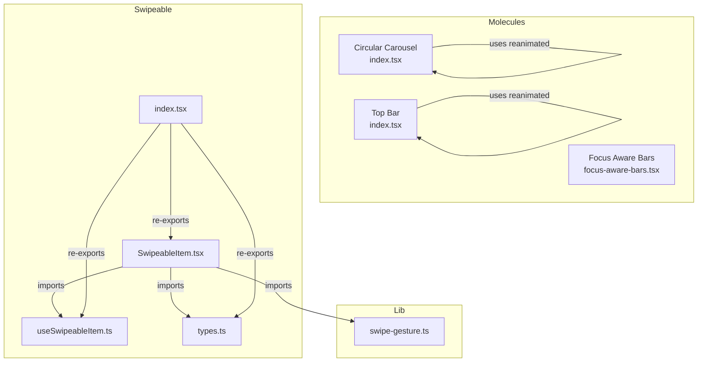
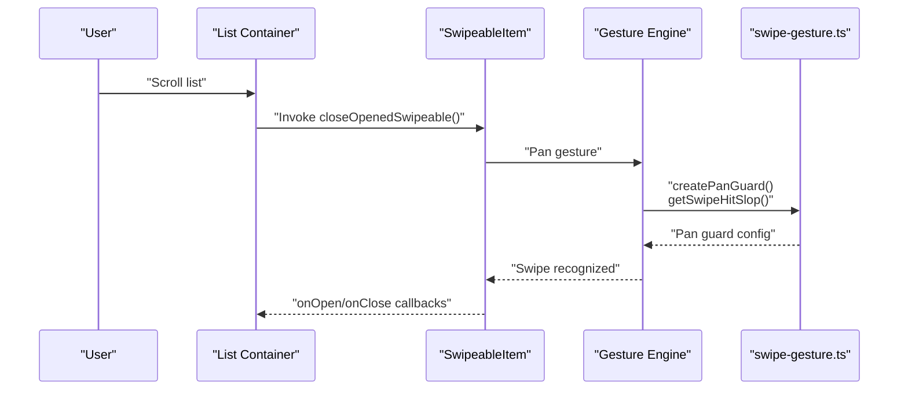
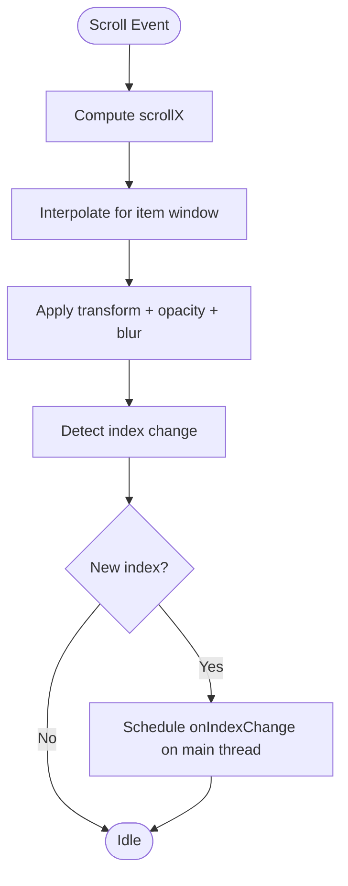
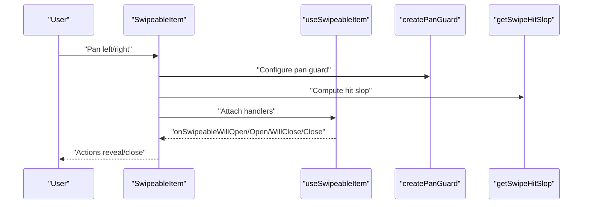
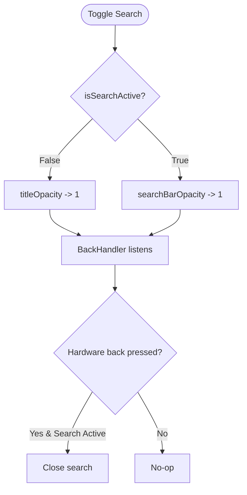
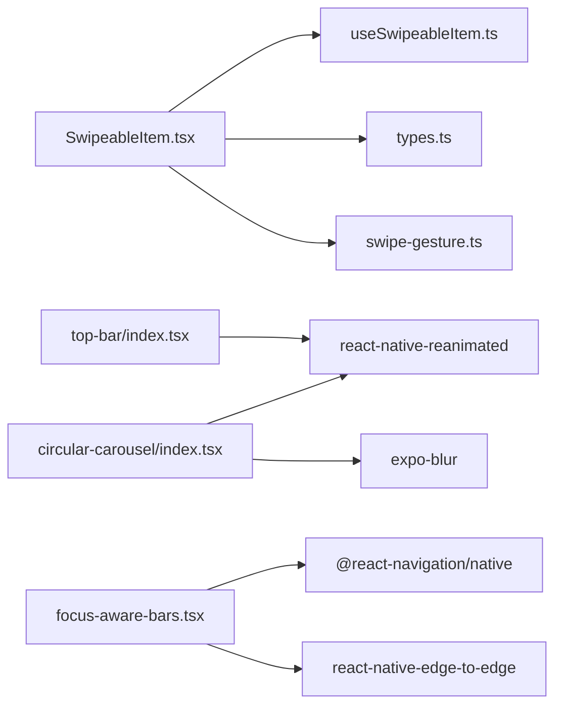

# Custom Molecules

<cite>
**Referenced Files in This Document**
- [circular-carousel/index.tsx](file://src/components/molecules/circular-carousel/index.tsx)
- [circular-carousel/types.ts](file://src/components/molecules/circular-carousel/types.ts)
- [swipeable/SwipeableItem.tsx](file://src/components/swipeable/SwipeableItem.tsx)
- [swipeable/types.ts](file://src/components/swipeable/types.ts)
- [swipeable/useSwipeableItem.ts](file://src/components/swipeable/useSwipeableItem.ts)
- [swipeable/index.tsx](file://src/components/swipeable/index.tsx)
- [swipe-gesture.ts](file://src/lib/swipe-gesture.ts)
- [top-bar/index.tsx](file://src/components/top-bar/index.tsx)
- [focus-aware-bars/focus-aware-bars.tsx](file://src/components/focus-aware-bars/focus-aware-bars.tsx)
- [focus-aware-bars/focus-aware-bars.types.ts](file://src/components/focus-aware-bars/focus-aware-bars.types.ts)
- [features/list/components/list-items-content.tsx](file://src/features/list/components/list-items-content.tsx)
</cite>

## Table of Contents
1. [Introduction](#introduction)
2. [Project Structure](#project-structure)
3. [Core Components](#core-components)
4. [Architecture Overview](#architecture-overview)
5. [Detailed Component Analysis](#detailed-component-analysis)
6. [Dependency Analysis](#dependency-analysis)
7. [Performance Considerations](#performance-considerations)
8. [Accessibility Considerations](#accessibility-considerations)
9. [Troubleshooting Guide](#troubleshooting-guide)
10. [Conclusion](#conclusion)
11. [Appendices](#appendices)

## Introduction
This document describes three custom molecule components that combine primitive UI elements into sophisticated interaction patterns:
- Circular Carousel: A horizontally scrolling, paginated carousel with animated depth and blur effects.
- SwipeableItem: A swipeable container that exposes left/right actions and integrates gesture handling with pan guards and hit slop tuning.
- Top Bar with Focus-Aware Bars: An adaptive top navigation bar with animated search, back navigation, and dynamic system bar styling.

Each component’s API, interaction patterns, accessibility, and performance characteristics are documented, along with integration examples and usage guidance.

## Project Structure
The molecules live under dedicated folders with clear separation of concerns:
- Molecules: reusable composition of primitives (carousel, top bar, focus-aware bars)
- Swipeable: a cohesive set of swipe-related primitives and utilities
- Lib: shared gesture utilities consumed by swipeable components

**Diagram sources**
- [circular-carousel/index.tsx:1-191](file://src/components/molecules/circular-carousel/index.tsx#L1-L191)
- [top-bar/index.tsx:1-159](file://src/components/top-bar/index.tsx#L1-L159)
- [focus-aware-bars/focus-aware-bars.tsx:1-16](file://src/components/focus-aware-bars/focus-aware-bars.tsx#L1-L16)
- [swipeable/SwipeableItem.tsx:1-39](file://src/components/swipeable/SwipeableItem.tsx#L1-L39)
- [swipeable/useSwipeableItem.ts:1-64](file://src/components/swipeable/useSwipeableItem.ts#L1-L64)
- [swipeable/types.ts:1-39](file://src/components/swipeable/types.ts#L1-L39)
- [swipeable/index.tsx:1-4](file://src/components/swipeable/index.tsx#L1-L4)
- [swipe-gesture.ts:1-29](file://src/lib/swipe-gesture.ts#L1-L29)

**Section sources**
- [circular-carousel/index.tsx:1-191](file://src/components/molecules/circular-carousel/index.tsx#L1-L191)
- [swipeable/SwipeableItem.tsx:1-39](file://src/components/swipeable/SwipeableItem.tsx#L1-L39)
- [top-bar/index.tsx:1-159](file://src/components/top-bar/index.tsx#L1-L159)
- [focus-aware-bars/focus-aware-bars.tsx:1-16](file://src/components/focus-aware-bars/focus-aware-bars.tsx#L1-L16)
- [swipe-gesture.ts:1-29](file://src/lib/swipe-gesture.ts#L1-L29)
- [swipeable/index.tsx:1-4](file://src/components/swipeable/index.tsx#L1-L4)

## Core Components
- Circular Carousel
  - Purpose: Horizontally paginated carousel with per-item transforms, opacity, scaling, rotation, and blur intensity driven by scroll position.
  - Key props: data, renderItem, spacing, itemWidth, horizontalSpacing, onIndexChange.
  - Animation system: Interpolations over a sliding window around the current index; animated blur via Expo Blur.
  - Interaction: Horizontal scroll with paging and fast deceleration; index change callback scheduled on the main thread.

- SwipeableItem
  - Purpose: A swipeable wrapper around a gesture-enabled component with controlled open/close semantics and platform-specific hit slop.
  - Key props: onOpen, onClose, className, children; forwards gesture handler props.
  - Gesture handling: Pan guard with min distance and fail offsets; dynamic hit slop based on screen width and platform.
  - Ref API: Imperative close method exposed via forwardRef.

- Top Bar
  - Purpose: Adaptive top navigation bar with animated title/search toggling, back navigation, and optional right action.
  - Key props: title, showBack, onBack, showSearch, searchQuery, onSearchChange, searchPlaceholder, rightAction, className.
  - Animation system: Two shared values controlling opacity transitions; hardware back handler integration.

- Focus Aware Bars
  - Purpose: Dynamically sets system bar styles (status/navigation) on focus and renders the system bars.
  - Key props: colorScheme with values auto, light, dark.

**Section sources**
- [circular-carousel/types.ts:4-12](file://src/components/molecules/circular-carousel/types.ts#L4-L12)
- [circular-carousel/index.tsx:105-166](file://src/components/molecules/circular-carousel/index.tsx#L105-L166)
- [swipeable/types.ts:10-21](file://src/components/swipeable/types.ts#L10-L21)
- [swipeable/SwipeableItem.tsx:10-38](file://src/components/swipeable/SwipeableItem.tsx#L10-L38)
- [swipe-gesture.ts:10-26](file://src/lib/swipe-gesture.ts#L10-L26)
- [top-bar/index.tsx:15-25](file://src/components/top-bar/index.tsx#L15-L25)
- [focus-aware-bars/focus-aware-bars.types.ts:1-3](file://src/components/focus-aware-bars/focus-aware-bars.types.ts#L1-L3)

## Architecture Overview
The molecules integrate with the rest of the app through explicit props and callbacks. The swipeable system coordinates with list scroll events to ensure only one item remains open at a time.

**Diagram sources**
- [features/list/components/list-items-content.tsx:30-32](file://src/features/list/components/list-items-content.tsx#L30-L32)
- [swipeable/SwipeableItem.tsx:16-17](file://src/components/swipeable/SwipeableItem.tsx#L16-L17)
- [swipe-gesture.ts:10-26](file://src/lib/swipe-gesture.ts#L10-L26)
- [swipeable/useSwipeableItem.ts:11-37](file://src/components/swipeable/useSwipeableItem.ts#L11-L37)

## Detailed Component Analysis

### Circular Carousel
- Carousel mechanics
  - Uses a horizontally scrolling FlatList with paging enabled and snap intervals matching item width plus spacing.
  - Scroll position is tracked via a shared value and mapped to per-item animations.
  - Index change detection uses an animated reaction to compute the current index and schedule a callback on the main thread.

- Touch interactions and animation system
  - Per-item transforms: translateY, scale, rotateZ, and opacity computed via interpolation over a fixed input range around the current index.
  - Blur overlay intensity increases toward the center item and decreases toward the edges.
  - Content container applies rounded corners and subtle shadows.

- API and customization
  - Props: data, renderItem, spacing, itemWidth, horizontalSpacing, onIndexChange.
  - Customization: adjust itemWidth and spacing to fit content density; override horizontalSpacing for outer padding.

**Diagram sources**
- [circular-carousel/index.tsx:116-125](file://src/components/molecules/circular-carousel/index.tsx#L116-L125)
- [circular-carousel/index.tsx:42-79](file://src/components/molecules/circular-carousel/index.tsx#L42-L79)

**Section sources**
- [circular-carousel/index.tsx:105-166](file://src/components/molecules/circular-carousel/index.tsx#L105-L166)
- [circular-carousel/types.ts:4-22](file://src/components/molecules/circular-carousel/types.ts#L4-L22)

### SwipeableItem
- SwipeableItem
  - Wraps a gesture-enabled component and wires up handlers from useSwipeableItem.
  - Computes a pan guard and hit slop dynamically based on device width and platform.
  - Exposes an imperative close method via forwardRef.

- Gesture handling logic
  - Pan guard enforces minimal movement and vertical tolerance to avoid accidental swipes.
  - Hit slop extends the touch area to the left (negative) to improve discoverability on mobile.
  - Simultaneous gesture policy prevents conflicts with external gestures.

- Left/right actions and coordination
  - The component itself does not define left/right actions; consumers supply left/right renderers via the underlying gesture component’s props.
  - The hook emits direction in onOpen to help coordinate UI updates.

**Diagram sources**
- [swipeable/SwipeableItem.tsx:10-38](file://src/components/swipeable/SwipeableItem.tsx#L10-L38)
- [swipeable/useSwipeableItem.ts:6-55](file://src/components/swipeable/useSwipeableItem.ts#L6-L55)
- [swipe-gesture.ts:10-26](file://src/lib/swipe-gesture.ts#L10-L26)

**Section sources**
- [swipeable/SwipeableItem.tsx:10-38](file://src/components/swipeable/SwipeableItem.tsx#L10-L38)
- [swipeable/types.ts:10-38](file://src/components/swipeable/types.ts#L10-L38)
- [swipeable/useSwipeableItem.ts:6-55](file://src/components/swipeable/useSwipeableItem.ts#L6-L55)
- [swipe-gesture.ts:10-26](file://src/lib/swipe-gesture.ts#L10-L26)

### Top Bar
- Interaction patterns
  - Animated search toggle: fades out title and fades in a search row with back affordance and clear action.
  - Back navigation: optional back button that triggers onBack when visible.
  - Right action slot: consumer-provided element (e.g., menu, filter) shown when not searching.

- Animation system
  - Two shared values control opacity transitions for smooth cross-fade between title and search UI.
  - Delays applied to restore title after closing search to avoid abrupt layout shifts.

- Accessibility considerations
  - Buttons use hitSlop to increase touch target size.
  - Hardware back press handler closes search when active.

**Diagram sources**
- [top-bar/index.tsx:62-82](file://src/components/top-bar/index.tsx#L62-L82)
- [top-bar/index.tsx:88-137](file://src/components/top-bar/index.tsx#L88-L137)

**Section sources**
- [top-bar/index.tsx:15-25](file://src/components/top-bar/index.tsx#L15-L25)
- [top-bar/index.tsx:27-158](file://src/components/top-bar/index.tsx#L27-L158)

### Focus Aware Bars
- Adaptive system bar styling
  - On focus, sets status bar and navigation bar styles according to colorScheme.
  - Renders the system bars with the chosen style.

**Section sources**
- [focus-aware-bars/focus-aware-bars.tsx:6-15](file://src/components/focus-aware-bars/focus-aware-bars.tsx#L6-L15)
- [focus-aware-bars/focus-aware-bars.types.ts:1-3](file://src/components/focus-aware-bars/focus-aware-bars.types.ts#L1-L3)

## Dependency Analysis
- Internal dependencies
  - SwipeableItem depends on useSwipeableItem and swipe-gesture utilities.
  - Circular Carousel depends on reanimated and expo-blur.
  - Top Bar depends on reanimated and UI primitives.
  - Focus Aware Bars depends on navigation focus hooks and system bars.

- External dependencies
  - react-native-gesture-handler for swipe gestures.
  - react-native-reanimated for animations.
  - expo-blur for animated blur overlays.

**Diagram sources**
- [swipeable/SwipeableItem.tsx:1-8](file://src/components/swipeable/SwipeableItem.tsx#L1-L8)
- [swipeable/useSwipeableItem.ts:1-2](file://src/components/swipeable/useSwipeableItem.ts#L1-L2)
- [swipe-gesture.ts:1-2](file://src/lib/swipe-gesture.ts#L1-L2)
- [circular-carousel/index.tsx:1-14](file://src/components/molecules/circular-carousel/index.tsx#L1-L14)
- [top-bar/index.tsx:1-13](file://src/components/top-bar/index.tsx#L1-L13)
- [focus-aware-bars/focus-aware-bars.tsx:1-2](file://src/components/focus-aware-bars/focus-aware-bars.tsx#L1-L2)

**Section sources**
- [swipeable/SwipeableItem.tsx:1-8](file://src/components/swipeable/SwipeableItem.tsx#L1-L8)
- [circular-carousel/index.tsx:1-14](file://src/components/molecules/circular-carousel/index.tsx#L1-L14)
- [top-bar/index.tsx:1-13](file://src/components/top-bar/index.tsx#L1-L13)
- [focus-aware-bars/focus-aware-bars.tsx:1-2](file://src/components/focus-aware-bars/focus-aware-bars.tsx#L1-L2)

## Performance Considerations
- Circular Carousel
  - Uses snap-to-interval and fast deceleration to reduce unnecessary work during scroll.
  - Animations rely on interpolated shared values; keep input ranges small and clamp extrapolation to avoid expensive recomputation.
  - Blur intensity is animated via props; ensure blur is only applied to visible items to minimize overdraw.

- SwipeableItem
  - Pan guard reduces accidental triggers; tune minDistance and failOffsetY for sensitivity.
  - Dynamic hit slop avoids layout thrashing by computing once per width measurement.
  - Only one swipeable can be open at a time; close others on list scroll to prevent stacking animations.

- Top Bar
  - Animated opacity transitions are lightweight; avoid animating layout-changing styles.
  - Hardware back handler prevents redundant renders by gating behavior.

- Focus Aware Bars
  - Style changes occur on focus; avoid frequent re-focus to prevent style thrashing.

[No sources needed since this section provides general guidance]

## Accessibility Considerations
- Touch targets
  - Buttons expose hitSlop to increase tap areas.
- Keyboard and focus
  - Search input focuses automatically when activated.
- Motion and control
  - Prefer reduced motion settings; ensure animations can be disabled if needed.
- Color contrast
  - Ensure sufficient contrast for text and icons against backgrounds.

[No sources needed since this section provides general guidance]

## Troubleshooting Guide
- SwipeableItem not closing when scrolling list
  - Ensure list scroll handlers call the exported close function to dismiss opened items.
  - Verify that only one item is open at a time; the hook enforces mutual exclusivity.

- Swipe gesture not triggering
  - Confirm pan guard thresholds are appropriate for the device; adjust minDistance and failOffsetY if needed.
  - Check hitSlop computation for the current device width and platform.

- Circular Carousel index change not firing
  - Ensure onIndexChange is provided and that the reaction detects a change in the computed index.
  - Verify snap interval matches item width plus spacing.

- Top Bar search not closing on back button
  - Confirm the hardware back handler is attached and that isSearchActive is toggled properly.

**Section sources**
- [features/list/components/list-items-content.tsx:30-32](file://src/features/list/components/list-items-content.tsx#L30-L32)
- [swipeable/useSwipeableItem.ts:11-37](file://src/components/swipeable/useSwipeableItem.ts#L11-L37)
- [swipe-gesture.ts:10-26](file://src/lib/swipe-gesture.ts#L10-L26)
- [circular-carousel/index.tsx:116-125](file://src/components/molecules/circular-carousel/index.tsx#L116-L125)
- [top-bar/index.tsx:73-82](file://src/components/top-bar/index.tsx#L73-L82)

## Conclusion
These molecules encapsulate complex interaction patterns while remaining composable and customizable:
- Circular Carousel delivers immersive horizontal browsing with precise animation control.
- SwipeableItem provides robust, configurable swipe interactions with platform-aware gesture tuning.
- Top Bar offers a flexible, animated navigation surface with integrated search and system bar awareness.
They integrate cleanly with the broader component architecture and can be extended to support richer action sets and accessibility enhancements.

[No sources needed since this section summarizes without analyzing specific files]

## Appendices

### Component APIs and Prop Interfaces
- Circular Carousel
  - Props: data, renderItem, spacing, itemWidth, horizontalSpacing, onIndexChange.
  - Types: CircularCarouselProps<ItemT>, CircularCarouselItemProps<ItemT>.

- SwipeableItem
  - Props: onOpen(direction), onClose(), className, children; forwards gesture handler props.
  - Types: SwipeableItemProps, SwipeableItemRef, UseSwipeableItemOptions, UseSwipeableItemReturn.

- Top Bar
  - Props: title, showBack, onBack, showSearch, searchQuery, onSearchChange, searchPlaceholder, rightAction, className.

- Focus Aware Bars
  - Props: colorScheme with values auto, light, dark.

**Section sources**
- [circular-carousel/types.ts:4-22](file://src/components/molecules/circular-carousel/types.ts#L4-L22)
- [swipeable/types.ts:10-38](file://src/components/swipeable/types.ts#L10-L38)
- [top-bar/index.tsx:15-25](file://src/components/top-bar/index.tsx#L15-L25)
- [focus-aware-bars/focus-aware-bars.types.ts:1-3](file://src/components/focus-aware-bars/focus-aware-bars.types.ts#L1-L3)

### Usage Examples
- Integrating SwipeableItem with a list
  - On list scroll start, close any opened swipeable to prevent overlapping actions.
  - Example reference: [features/list/components/list-items-content.tsx:30-32](file://src/features/list/components/list-items-content.tsx#L30-L32)

- Using Circular Carousel
  - Provide data and renderItem; optionally subscribe to onIndexChange for analytics or navigation.
  - Example reference: [circular-carousel/index.tsx:105-166](file://src/components/molecules/circular-carousel/index.tsx#L105-L166)

- Composing Top Bar with Focus Aware Bars
  - Wrap screens with Focus Aware Bars to adapt system bar appearance to theme.
  - Example reference: [focus-aware-bars/focus-aware-bars.tsx:6-15](file://src/components/focus-aware-bars/focus-aware-bars.tsx#L6-L15)

**Section sources**
- [features/list/components/list-items-content.tsx:30-32](file://src/features/list/components/list-items-content.tsx#L30-L32)
- [circular-carousel/index.tsx:105-166](file://src/components/molecules/circular-carousel/index.tsx#L105-L166)
- [focus-aware-bars/focus-aware-bars.tsx:6-15](file://src/components/focus-aware-bars/focus-aware-bars.tsx#L6-L15)