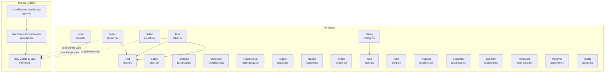
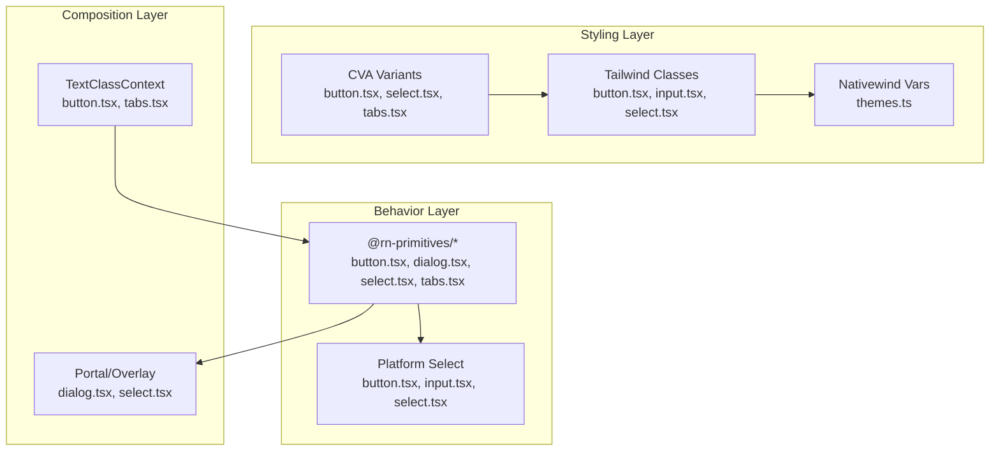
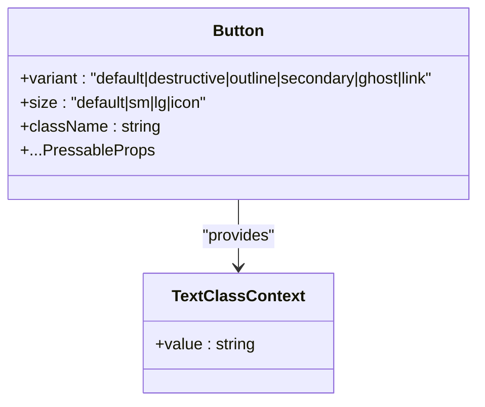
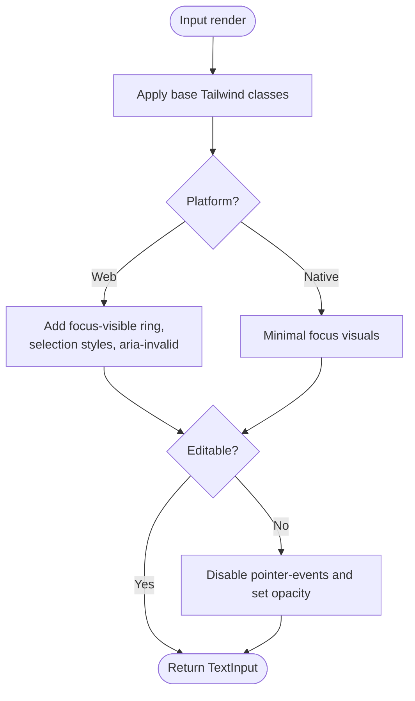
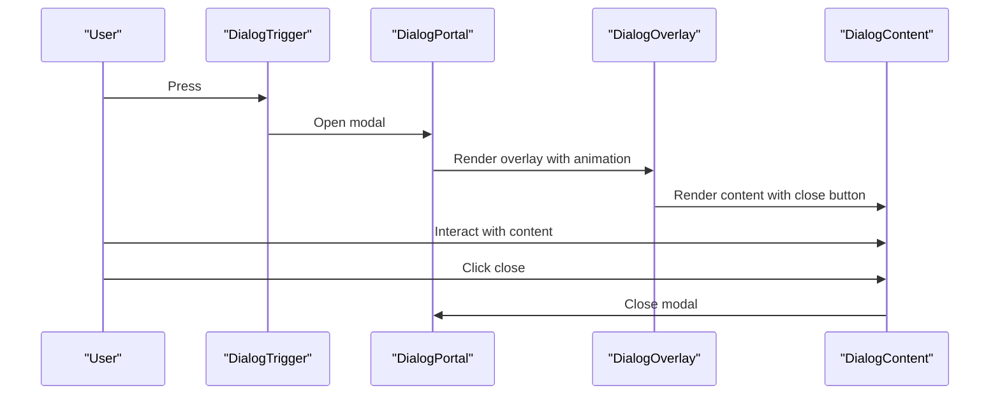
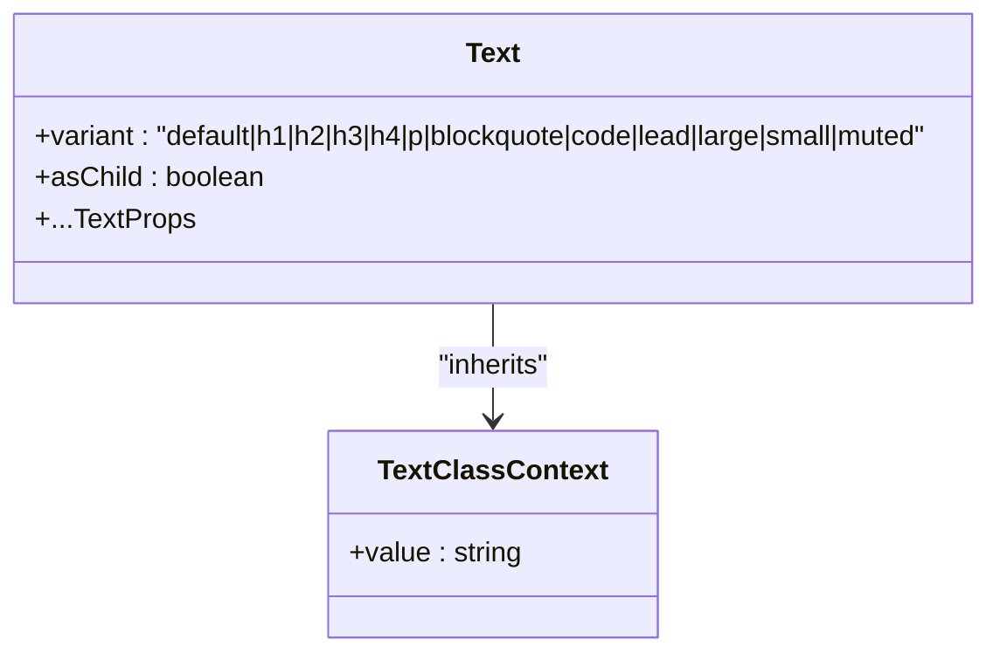
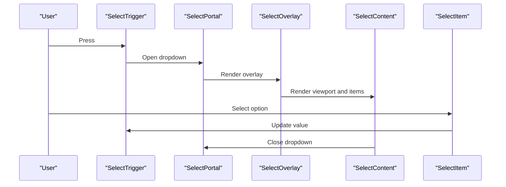
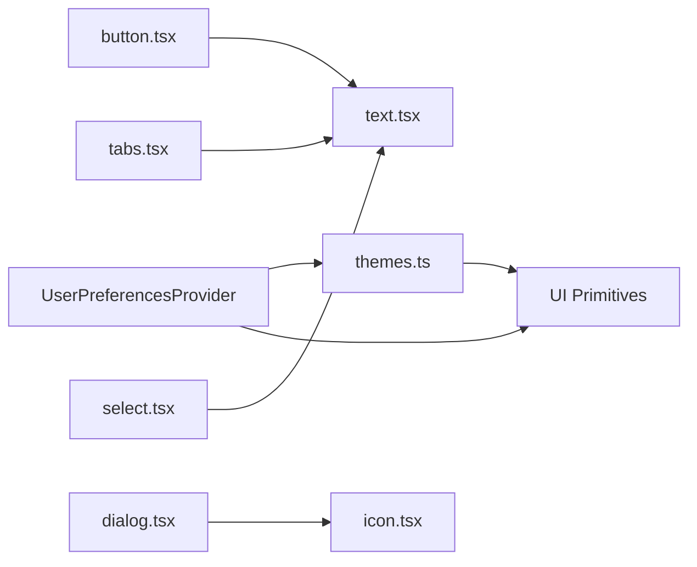

# Primitive Components

<cite>
**Referenced Files in This Document**
- [button.tsx](file://src/components/ui/button.tsx)
- [input.tsx](file://src/components/ui/input.tsx)
- [dialog.tsx](file://src/components/ui/dialog.tsx)
- [text.tsx](file://src/components/ui/text.tsx)
- [label.tsx](file://src/components/ui/label.tsx)
- [select.tsx](file://src/components/ui/select.tsx)
- [textarea.tsx](file://src/components/ui/textarea.tsx)
- [checkbox.tsx](file://src/components/ui/checkbox.tsx)
- [radio-group.tsx](file://src/components/ui/radio-group.tsx)
- [tabs.tsx](file://src/components/ui/tabs.tsx)
- [toggle.tsx](file://src/components/ui/toggle.tsx)
- [badge.tsx](file://src/components/ui/badge.tsx)
- [avatar.tsx](file://src/components/ui/avatar.tsx)
- [icon.tsx](file://src/components/ui/icon.tsx)
- [alert.tsx](file://src/components/ui/alert.tsx)
- [progress.tsx](file://src/components/ui/progress.tsx)
- [separator.tsx](file://src/components/ui/separator.tsx)
- [skeleton.tsx](file://src/components/ui/skeleton.tsx)
- [hover-card.tsx](file://src/components/ui/hover-card.tsx)
- [popover.tsx](file://src/components/ui/popover.tsx)
- [tooltip.tsx](file://src/components/ui/tooltip.tsx)
- [provider.tsx](file://src/context/themes/provider.tsx)
- [types.ts](file://src/context/themes/types.ts)
- [themes.ts](file://src/lib/themes.ts)
</cite>

## Table of Contents
1. [Introduction](#introduction)
2. [Project Structure](#project-structure)
3. [Core Components](#core-components)
4. [Architecture Overview](#architecture-overview)
5. [Detailed Component Analysis](#detailed-component-analysis)
6. [Dependency Analysis](#dependency-analysis)
7. [Performance Considerations](#performance-considerations)
8. [Troubleshooting Guide](#troubleshooting-guide)
9. [Conclusion](#conclusion)
10. [Appendices](#appendices)

## Introduction
This document describes the primitive UI components that form the foundation of the application’s design system. Built with RN Primitives and Nativewind, these components emphasize:
- Consistent styling via Tailwind classes and Nativewind’s theme variables
- Variant systems powered by Class Variance Authority (CVA)
- Accessibility and platform-specific behavior (iOS, Android, Web)
- Composition patterns enabling higher-level components
- Responsive design and integration with the theme provider

## Project Structure
The primitive components live under src/components/ui and are composed with RN Primitives slots and primitives. Styling leverages Tailwind classes applied through Nativewind, while the theme system provides color tokens and semantic variables.

**Diagram sources**
- [provider.tsx:18-152](file://src/context/themes/provider.tsx#L18-L152)
- [types.ts:7-14](file://src/context/themes/types.ts#L7-L14)
- [themes.ts:15-214](file://src/lib/themes.ts#L15-L214)
- [button.tsx:95-105](file://src/components/ui/button.tsx#L95-L105)
- [text.tsx:67-87](file://src/components/ui/text.tsx#L67-L87)
- [input.tsx:5-31](file://src/components/ui/input.tsx#L5-L31)
- [dialog.tsx:11-89](file://src/components/ui/dialog.tsx#L11-L89)
- [label.tsx:5-38](file://src/components/ui/label.tsx#L5-L38)
- [select.tsx:14-133](file://src/components/ui/select.tsx#L14-L133)
- [textarea.tsx:4-28](file://src/components/ui/textarea.tsx#L4-L28)
- [checkbox.tsx:9-46](file://src/components/ui/checkbox.tsx#L9-L46)
- [radio-group.tsx:6-41](file://src/components/ui/radio-group.tsx#L6-L41)
- [tabs.tsx:6-54](file://src/components/ui/tabs.tsx#L6-L54)
- [toggle.tsx](file://src/components/ui/toggle.tsx)
- [badge.tsx](file://src/components/ui/badge.tsx)
- [avatar.tsx](file://src/components/ui/avatar.tsx)
- [icon.tsx](file://src/components/ui/icon.tsx)
- [alert.tsx](file://src/components/ui/alert.tsx)
- [progress.tsx](file://src/components/ui/progress.tsx)
- [separator.tsx](file://src/components/ui/separator.tsx)
- [skeleton.tsx](file://src/components/ui/skeleton.tsx)
- [hover-card.tsx](file://src/components/ui/hover-card.tsx)
- [popover.tsx](file://src/components/ui/popover.tsx)
- [tooltip.tsx](file://src/components/ui/tooltip.tsx)

**Section sources**
- [provider.tsx:18-152](file://src/context/themes/provider.tsx#L18-L152)
- [themes.ts:15-214](file://src/lib/themes.ts#L15-L214)

## Core Components
This section outlines the foundational primitives and their key characteristics.

- Button
  - Purpose: Interactive action with variant and size variants.
  - Variants: default, destructive, outline, secondary, ghost, link.
  - Sizes: default, sm, lg, icon.
  - Behavior: Uses a TextClassContext to propagate text styles; platform-specific focus and hover effects; disabled state handled via opacity.
  - Accessibility: role="button"; integrates with screen readers.

- Input
  - Purpose: Single-line text input with placeholder and selection support on web.
  - Behavior: Platform-specific focus ring and selection styles; disabled state applies opacity and pointer events on web.

- Dialog
  - Purpose: Modal overlay with portal support and animated transitions.
  - Composition: Root, Trigger, Portal, Overlay, Content, Close, Header/Footer, Title/Description.
  - Platform: iOS uses FullWindowOverlay; animations via reanimated.

- Text
  - Purpose: Semantic text with variant-driven typography and accessibility roles.
  - Variants: default, h1–h4, p, blockquote, code, lead, large, small, muted.
  - Accessibility: role and aria-level derived from variant mapping.

- Label
  - Purpose: Associates interactive controls with labels; supports press handlers and disabled state.

- Select
  - Purpose: Dropdown selection with grouped options, viewport, and scroll buttons (web-only).
  - Composition: Root, Group, Trigger, Value, Content, Portal, Overlay, Viewport, Item, Label, Separator, ScrollUp/Down Buttons, ItemIndicator.
  - Platform: FullWindowOverlay on iOS; native ScrollView for long option lists on native.

- Textarea
  - Purpose: Multi-line text input with platform-aware sizing and placeholder styling.

- Checkbox
  - Purpose: Binary selection with customizable indicator and hitSlop for touch targets.

- RadioGroup
  - Purpose: Exclusive selection with optional hidden indicator for compact visuals.

- Tabs
  - Purpose: Tabbed navigation with list and trigger/content primitives.
  - Composition: Root, List, Trigger, Content; triggers receive text class context.

- Additional primitives (Toggle, Badge, Avatar, Icon, Alert, Progress, Separator, Skeleton, HoverCard, Popover, Tooltip)
  - Purpose: Toggle switch, status badges, user avatars, icons, alerts, progress indicators, dividers, loading placeholders, floating panels, and tooltips.
  - Implementation pattern: Built on RN Primitives where applicable; styled with Tailwind classes and theme variables.

**Section sources**
- [button.tsx:6-54](file://src/components/ui/button.tsx#L6-L54)
- [button.tsx:95-105](file://src/components/ui/button.tsx#L95-L105)
- [input.tsx:5-31](file://src/components/ui/input.tsx#L5-L31)
- [dialog.tsx:11-89](file://src/components/ui/dialog.tsx#L11-L89)
- [text.tsx:7-43](file://src/components/ui/text.tsx#L7-L43)
- [text.tsx:67-87](file://src/components/ui/text.tsx#L67-L87)
- [label.tsx:5-38](file://src/components/ui/label.tsx#L5-L38)
- [select.tsx:14-133](file://src/components/ui/select.tsx#L14-L133)
- [textarea.tsx:4-28](file://src/components/ui/textarea.tsx#L4-L28)
- [checkbox.tsx:9-46](file://src/components/ui/checkbox.tsx#L9-L46)
- [radio-group.tsx:6-41](file://src/components/ui/radio-group.tsx#L6-L41)
- [tabs.tsx:6-54](file://src/components/ui/tabs.tsx#L6-L54)

## Architecture Overview
The primitives are designed around:
- RN Primitives for accessible, cross-platform semantics
- Nativewind for Tailwind styling and theme variable injection
- Class Variance Authority for variant and size composition
- Platform-specific adaptations (iOS FullWindowOverlay, web focus/selection styles)
- Context propagation for shared text styles (e.g., Button -> Text)

**Diagram sources**
- [button.tsx:6-54](file://src/components/ui/button.tsx#L6-L54)
- [button.tsx:95-105](file://src/components/ui/button.tsx#L95-L105)
- [input.tsx:5-31](file://src/components/ui/input.tsx#L5-L31)
- [select.tsx:14-133](file://src/components/ui/select.tsx#L14-L133)
- [dialog.tsx:11-89](file://src/components/ui/dialog.tsx#L11-L89)
- [tabs.tsx:6-54](file://src/components/ui/tabs.tsx#L6-L54)
- [themes.ts:204-214](file://src/lib/themes.ts#L204-L214)

## Detailed Component Analysis

### Button
- Architecture: Uses cva for variants and sizes; wraps Pressable; injects text class via TextClassContext so child Text inherits appropriate colors.
- Props: Extends Pressable props plus variant and size from CVA.
- Accessibility: role="button".
- Platform specifics: Web adds focus-visible ring, hover states, selection behavior; native simplifies focus visuals.

**Diagram sources**
- [button.tsx:6-54](file://src/components/ui/button.tsx#L6-L54)
- [button.tsx:95-105](file://src/components/ui/button.tsx#L95-L105)

**Section sources**
- [button.tsx:6-54](file://src/components/ui/button.tsx#L6-L54)
- [button.tsx:95-105](file://src/components/ui/button.tsx#L95-L105)

### Input
- Architecture: ForwardRef TextInput wrapper; applies theme-aware border/background/foreground; platform-specific focus and selection styles.
- Props: TextInputProps extended with placeholderClassName; disabled state handled with opacity and pointer-events on web.

**Diagram sources**
- [input.tsx:5-31](file://src/components/ui/input.tsx#L5-L31)

**Section sources**
- [input.tsx:5-31](file://src/components/ui/input.tsx#L5-L31)

### Dialog
- Architecture: Composed from @rn-primitives/dialog; adds portal, overlay, and animated content; uses FullWindowOverlay on iOS; web animations via reanimated.
- Composition: Dialog.Root, Trigger, Portal, Overlay, Content, Close, Header/Footer, Title/Description.
- Accessibility: Close button includes screen-reader-only label.

**Diagram sources**
- [dialog.tsx:11-89](file://src/components/ui/dialog.tsx#L11-L89)

**Section sources**
- [dialog.tsx:11-89](file://src/components/ui/dialog.tsx#L11-L89)

### Text
- Architecture: Uses Slot.Text when asChild is true; applies variant classes; sets role and aria-level for headings/code.
- Variants: h1–h4, p, blockquote, code, lead, large, small, muted.

**Diagram sources**
- [text.tsx:7-43](file://src/components/ui/text.tsx#L7-L43)
- [text.tsx:67-87](file://src/components/ui/text.tsx#L67-L87)

**Section sources**
- [text.tsx:7-43](file://src/components/ui/text.tsx#L7-L43)
- [text.tsx:67-87](file://src/components/ui/text.tsx#L67-L87)

### Label
- Architecture: Wraps @rn-primitives/label; applies label-specific spacing and disabled state; forwards press handlers.

**Section sources**
- [label.tsx:5-38](file://src/components/ui/label.tsx#L5-L38)

### Select
- Architecture: Composite of @rn-primitives/select; adds portal, overlay, animated content; FullWindowOverlay on iOS; native ScrollView for long lists.
- Composition: Root, Group, Trigger, Value, Content, Portal, Overlay, Viewport, Item, Label, Separator, ScrollUp/Down Buttons, ItemIndicator.
- Platform: Web-only scroll buttons and positioning; native uses absolute fill and ScrollView.

**Diagram sources**
- [select.tsx:14-133](file://src/components/ui/select.tsx#L14-L133)

**Section sources**
- [select.tsx:14-133](file://src/components/ui/select.tsx#L14-L133)

### Textarea
- Architecture: TextInput with multi-line support; platform-aware numberOfLines and placeholder styling; disabled state applies opacity.

**Section sources**
- [textarea.tsx:4-28](file://src/components/ui/textarea.tsx#L4-L28)

### Checkbox
- Architecture: @rn-primitives/checkbox with custom indicator; platform-specific stroke width and hitSlop for accessibility.

**Section sources**
- [checkbox.tsx:9-46](file://src/components/ui/checkbox.tsx#L9-L46)

### RadioGroup
- Architecture: @rn-primitives/radio-group with optional hidden indicator; supports disabled state and custom children.

**Section sources**
- [radio-group.tsx:6-41](file://src/components/ui/radio-group.tsx#L6-L41)

### Tabs
- Architecture: @rn-primitives/tabs with list and trigger/content; triggers receive text class context to inherit proper text colors.

**Section sources**
- [tabs.tsx:6-54](file://src/components/ui/tabs.tsx#L6-L54)

### Additional Primitives
- Toggle: Switch-like control built on RN Primitives.
- Badge: Small status indicator.
- Avatar: User image with fallback.
- Icon: Wrapper around Tabler icons with size/stroke props.
- Alert: Informative banner with icon and action.
- Progress: Determinate or indeterminate progress bar.
- Separator: Horizontal or vertical divider.
- Skeleton: Loading placeholder with animated shimmer.
- HoverCard/Popover/Tooltip: Floating overlays with positioning and triggers.

[No sources needed since this section summarizes without analyzing specific files]

## Dependency Analysis
- Theme integration
  - The theme provider computes effective color scheme and theme name, converts background color variables to HSL, and exposes theme vars to the app.
  - Components consume theme variables via Tailwind classes and Nativewind vars.

- Component dependencies
  - Button depends on TextClassContext and uses cva variants.
  - Tabs depends on TextClassContext for text styling.
  - Select composes @rn-primitives/select and adds portal/overlay/animation.
  - Dialog composes @rn-primitives/dialog and adds portal/overlay/animation.

**Diagram sources**
- [provider.tsx:18-152](file://src/context/themes/provider.tsx#L18-L152)
- [themes.ts:204-214](file://src/lib/themes.ts#L204-L214)
- [button.tsx:95-105](file://src/components/ui/button.tsx#L95-L105)
- [tabs.tsx:35-53](file://src/components/ui/tabs.tsx#L35-L53)
- [select.tsx:87-133](file://src/components/ui/select.tsx#L87-L133)
- [dialog.tsx:30-89](file://src/components/ui/dialog.tsx#L30-L89)
- [icon.tsx](file://src/components/ui/icon.tsx)

**Section sources**
- [provider.tsx:18-152](file://src/context/themes/provider.tsx#L18-L152)
- [themes.ts:204-214](file://src/lib/themes.ts#L204-L214)

## Performance Considerations
- Prefer CVA variants for minimal re-renders; variants are computed once per component initialization.
- Use platform-specific optimizations (e.g., FullWindowOverlay on iOS) to reduce layout thrash.
- Avoid heavy nested animations inside portals; keep animations lightweight (fade in/out).
- Use forwardRef for inputs to prevent unnecessary re-wrapping.
- Keep portal hosts stable to minimize re-mounts.

[No sources needed since this section provides general guidance]

## Troubleshooting Guide
- Focus rings and selection on web
  - If focus rings appear inconsistent, verify focus-visible classes and ensure ring variables are present in theme vars.
- Disabled states
  - Confirm disabled opacity and pointer-events are applied on web; ensure editable=false is respected for inputs.
- Portal rendering
  - On iOS, ensure FullWindowOverlay is used for dialogs/selects; on web, confirm portal host exists.
- Theme variables not applying
  - Verify theme provider supplies theme vars and background color conversion is correct.

**Section sources**
- [input.tsx:5-31](file://src/components/ui/input.tsx#L5-L31)
- [dialog.tsx:19-49](file://src/components/ui/dialog.tsx#L19-L49)
- [select.tsx:70-133](file://src/components/ui/select.tsx#L70-L133)
- [provider.tsx:100-114](file://src/context/themes/provider.tsx#L100-L114)

## Conclusion
These primitives establish a robust, accessible, and theme-aware foundation for building consistent UI across platforms. Their composition with RN Primitives and Nativewind enables scalable styling and behavior, while CVA ensures predictable variants and sizes. Together, they support higher-level components and promote maintainable design systems.

[No sources needed since this section summarizes without analyzing specific files]

## Appendices

### Prop Interfaces and Variants Reference
- Button
  - Props: variant, size, className, plus Pressable props
  - Variants: default, destructive, outline, secondary, ghost, link
  - Sizes: default, sm, lg, icon

- Input
  - Props: placeholderClassName, plus TextInput props
  - States: disabled (opacity, pointer-events on web)

- Dialog
  - Parts: Root, Trigger, Portal, Overlay, Content, Close, Header/Footer, Title/Description

- Text
  - Props: variant, asChild, plus Text props
  - Variants: default, h1–h4, p, blockquote, code, lead, large, small, muted

- Label
  - Props: onPress, onLongPress, onPressIn, onPressOut, disabled, plus Label props

- Select
  - Props: size, position, portalHost, plus Select props
  - Items: Value, Trigger, Content, Item, Label, Separator, ScrollUp/Down Buttons

- Textarea
  - Props: numberOfLines (platform-aware), placeholderClassName, plus TextInput props

- Checkbox
  - Props: checkedClassName, indicatorClassName, iconClassName, plus Checkbox props

- RadioGroup
  - Props: hideIndicator, plus RadioGroup props

- Tabs
  - Props: plus Tabs props
  - Triggers receive text class context

[No sources needed since this section summarizes without analyzing specific files]