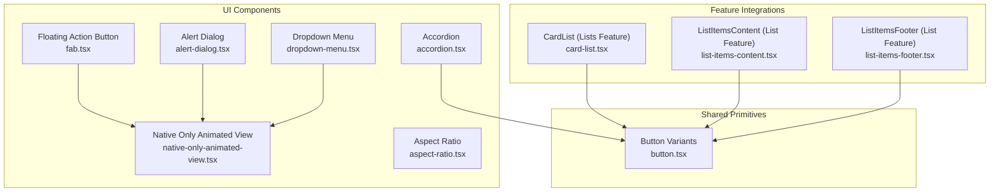
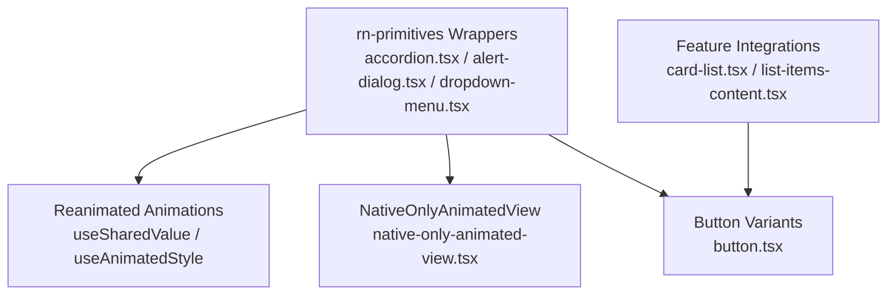
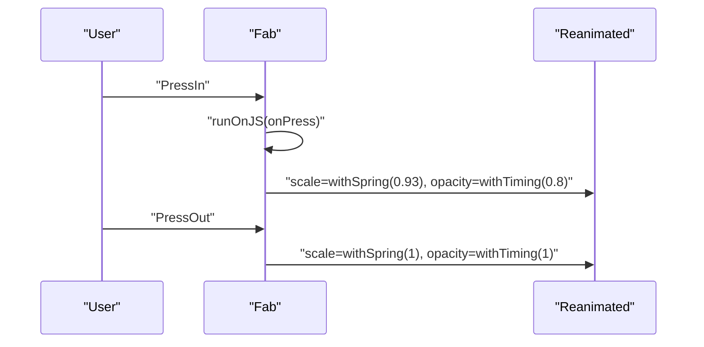
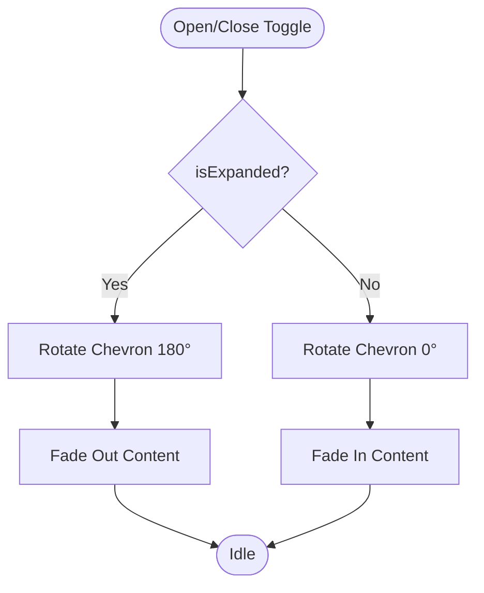
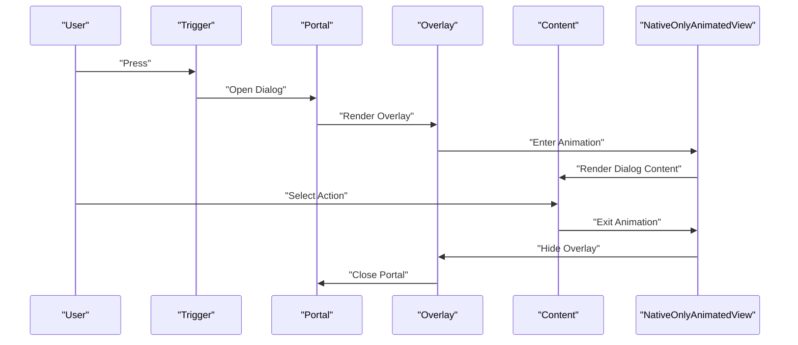
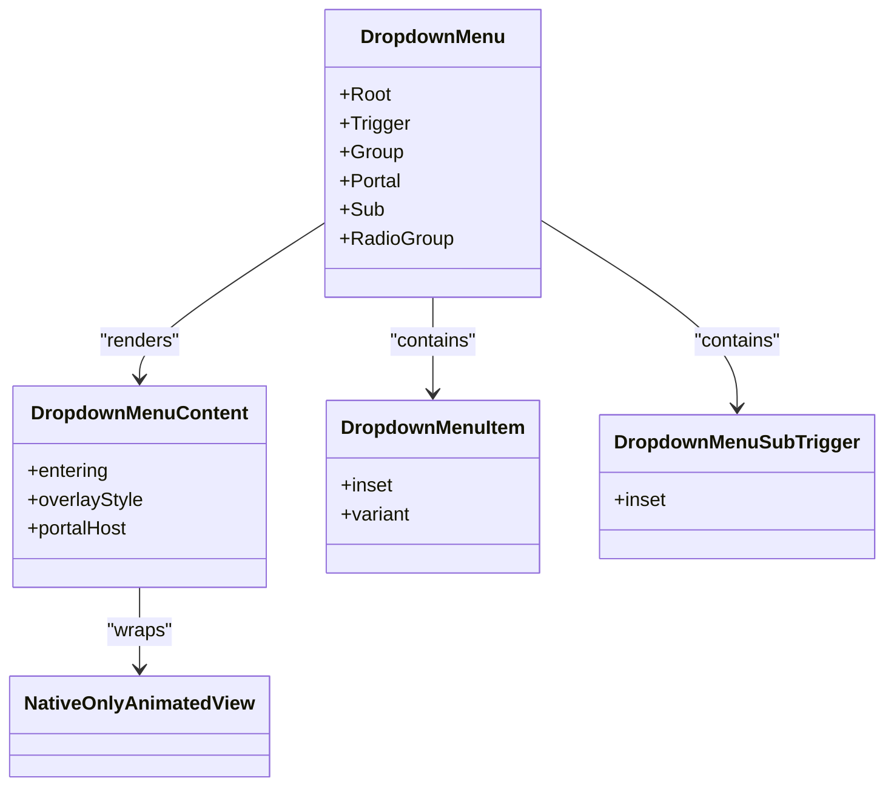
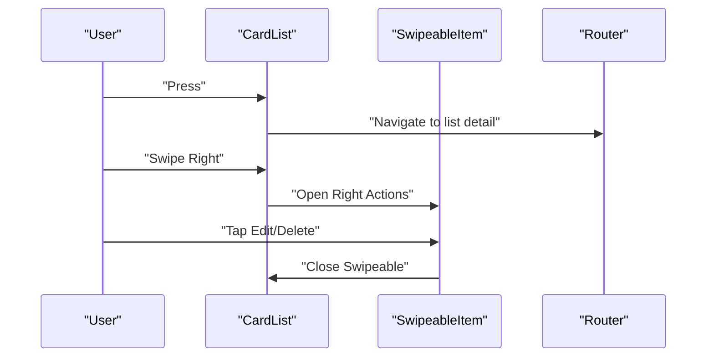
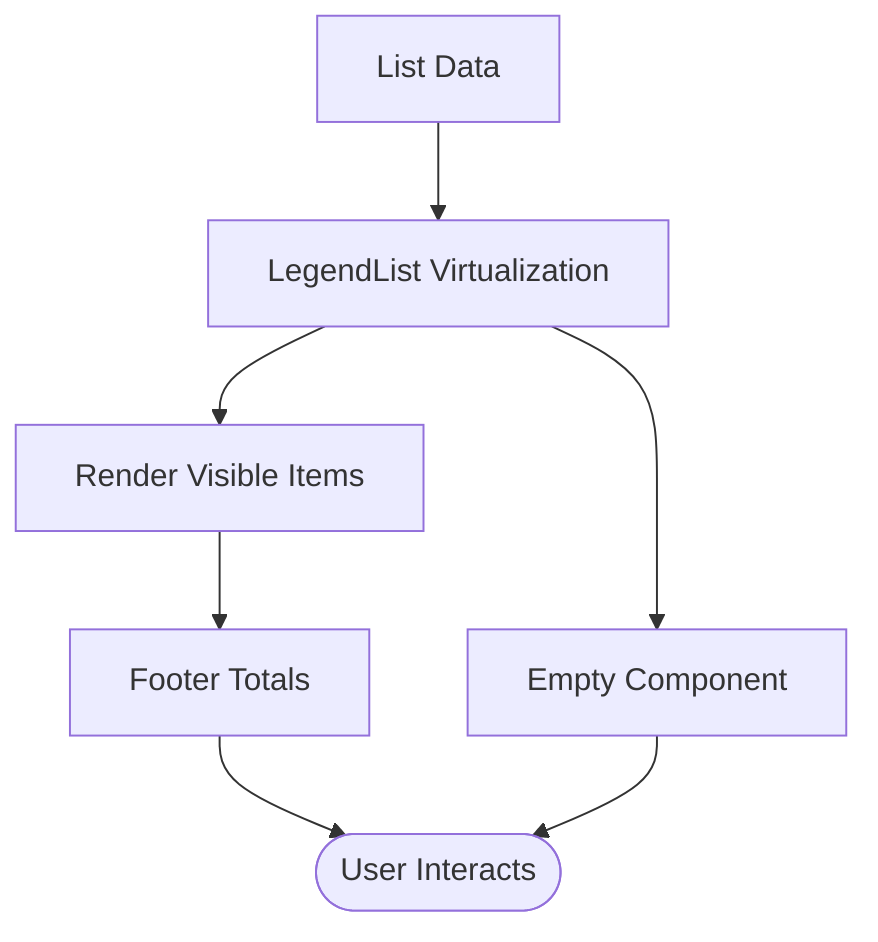
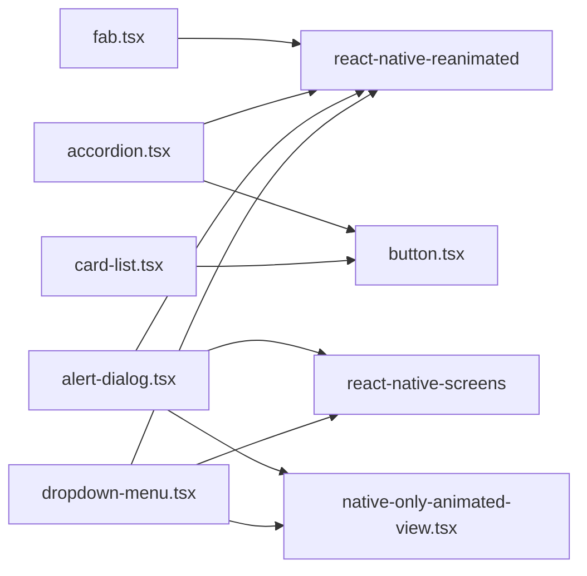

# Specialized UI Elements

<cite>
**Referenced Files in This Document**
- [fab.tsx](file://src/components/ui/fab.tsx)
- [accordion.tsx](file://src/components/ui/accordion.tsx)
- [alert-dialog.tsx](file://src/components/ui/alert-dialog.tsx)
- [dropdown-menu.tsx](file://src/components/ui/dropdown-menu.tsx)
- [native-only-animated-view.tsx](file://src/components/ui/native-only-animated-view.tsx)
- [aspect-ratio.tsx](file://src/components/ui/aspect-ratio.tsx)
- [button.tsx](file://src/components/ui/button.tsx)
- [card-list.tsx](file://src/features/lists/components/card-list.tsx)
- [list-items-content.tsx](file://src/features/list/components/list-items-content.tsx)
- [list-items-footer.tsx](file://src/features/list/components/list-items-footer.tsx)
</cite>

## Table of Contents
1. [Introduction](#introduction)
2. [Project Structure](#project-structure)
3. [Core Components](#core-components)
4. [Architecture Overview](#architecture-overview)
5. [Detailed Component Analysis](#detailed-component-analysis)
6. [Dependency Analysis](#dependency-analysis)
7. [Performance Considerations](#performance-considerations)
8. [Troubleshooting Guide](#troubleshooting-guide)
9. [Conclusion](#conclusion)

## Introduction
This document provides comprehensive documentation for specialized UI elements that extend beyond basic primitives. It focuses on:
- Floating Action Button (FAB): positioning, animations, and interaction patterns
- Accordion: collapsible content sections with smooth transitions
- Alert Dialog: modal confirmations with platform-aware overlays
- Dropdown Menu: contextual actions with nested submenus
- Native Only Animated View: platform-specific animation behavior
- Aspect Ratio: responsive layout constraints
- Card: content grouping with actionable surfaces
- Pagination and Table: data navigation and structured display patterns

Where applicable, we explain component variants, state management, accessibility features, and integration patterns with the broader component ecosystem.

## Project Structure
The specialized UI components are primarily located under src/components/ui/. Some components integrate with feature-specific implementations (e.g., CardList in lists feature) and shared primitives (e.g., rn-primitives).

**Diagram sources**
- [fab.tsx:1-93](file://src/components/ui/fab.tsx#L1-L93)
- [accordion.tsx:1-142](file://src/components/ui/accordion.tsx#L1-L142)
- [alert-dialog.tsx:1-154](file://src/components/ui/alert-dialog.tsx#L1-L154)
- [dropdown-menu.tsx:1-311](file://src/components/ui/dropdown-menu.tsx#L1-L311)
- [native-only-animated-view.tsx:1-24](file://src/components/ui/native-only-animated-view.tsx#L1-L24)
- [aspect-ratio.tsx:1-6](file://src/components/ui/aspect-ratio.tsx#L1-L6)
- [button.tsx:1-109](file://src/components/ui/button.tsx#L1-L109)
- [card-list.tsx:1-97](file://src/features/lists/components/card-list.tsx#L1-L97)
- [list-items-content.tsx:1-57](file://src/features/list/components/list-items-content.tsx#L1-L57)
- [list-items-footer.tsx:1-36](file://src/features/list/components/list-items-footer.tsx#L1-L36)

**Section sources**
- [fab.tsx:1-93](file://src/components/ui/fab.tsx#L1-L93)
- [accordion.tsx:1-142](file://src/components/ui/accordion.tsx#L1-L142)
- [alert-dialog.tsx:1-154](file://src/components/ui/alert-dialog.tsx#L1-L154)
- [dropdown-menu.tsx:1-311](file://src/components/ui/dropdown-menu.tsx#L1-L311)
- [native-only-animated-view.tsx:1-24](file://src/components/ui/native-only-animated-view.tsx#L1-L24)
- [aspect-ratio.tsx:1-6](file://src/components/ui/aspect-ratio.tsx#L1-L6)
- [button.tsx:1-109](file://src/components/ui/button.tsx#L1-L109)
- [card-list.tsx:1-97](file://src/features/lists/components/card-list.tsx#L1-L97)
- [list-items-content.tsx:1-57](file://src/features/list/components/list-items-content.tsx#L1-L57)
- [list-items-footer.tsx:1-36](file://src/features/list/components/list-items-footer.tsx#L1-L36)

## Core Components
This section summarizes the primary specialized UI elements and their roles.

- Floating Action Button (FAB)
  - Purpose: Prominent call-to-action with press feedback and persistent placement
  - Key behaviors: Animated press-in/out scaling and opacity, absolute positioning, optional label
  - Integration: Uses reanimated for transforms and opacity; leverages shared values and spring/timing animations

- Accordion
  - Purpose: Collapsible sections with smooth layout transitions
  - Key behaviors: Animated chevron rotation, content fade out/in, platform-aware layout animations
  - Integration: Uses @rn-primitives/accordion with reanimated transitions

- Alert Dialog
  - Purpose: Modal confirmations with overlay and animated content
  - Key behaviors: Platform-specific overlay (iOS FullWindowOverlay), animated entrance/exit via NativeOnlyAnimatedView
  - Integration: Composed from @rn-primitives/alert-dialog with button variants and reanimated animations

- Dropdown Menu
  - Purpose: Contextual actions with support for submenus, checkboxes, and radios
  - Key behaviors: Animated entrance on native, portal-based overlay, platform-specific icons and styles
  - Integration: Built on @rn-primitives/dropdown-menu with reanimated and screens

- Native Only Animated View
  - Purpose: Conditional animation on native platforms only
  - Key behaviors: Renders Animated.View on native; passes-through children on web
  - Integration: Used by Alert Dialog and Dropdown Menu for platform-specific animations

- Aspect Ratio
  - Purpose: Responsive layout constraint maintaining a width-to-height ratio
  - Key behaviors: Thin wrapper around @rn-primitives/aspect-ratio
  - Integration: Used wherever responsive containers are needed

- Card
  - Purpose: Content grouping with actionable surfaces
  - Implementation pattern: Feature-specific CardList integrates swipe gestures, icons, and routing
  - Integration: Uses shared Button variants and iconography; leverages accent color utilities

- Pagination and Table
  - Purpose: Data navigation and structured display
  - Implementation pattern: Lists use LegendList for virtualization; totals and summaries appear in footers
  - Integration: Footer displays aggregated metrics; content area virtualizes items for performance

**Section sources**
- [fab.tsx:1-93](file://src/components/ui/fab.tsx#L1-L93)
- [accordion.tsx:1-142](file://src/components/ui/accordion.tsx#L1-L142)
- [alert-dialog.tsx:1-154](file://src/components/ui/alert-dialog.tsx#L1-L154)
- [dropdown-menu.tsx:1-311](file://src/components/ui/dropdown-menu.tsx#L1-L311)
- [native-only-animated-view.tsx:1-24](file://src/components/ui/native-only-animated-view.tsx#L1-L24)
- [aspect-ratio.tsx:1-6](file://src/components/ui/aspect-ratio.tsx#L1-L6)
- [card-list.tsx:1-97](file://src/features/lists/components/card-list.tsx#L1-L97)
- [list-items-content.tsx:1-57](file://src/features/list/components/list-items-content.tsx#L1-L57)
- [list-items-footer.tsx:1-36](file://src/features/list/components/list-items-footer.tsx#L1-L36)

## Architecture Overview
The specialized UI components follow a layered approach:
- Primitive wrappers: Components like Accordion, Alert Dialog, and Dropdown Menu wrap @rn-primitives/* to provide consistent styling and animations
- Animation layer: Reanimated powers transitions and interactive feedback; NativeOnlyAnimatedView ensures platform-appropriate behavior
- Feature integrations: Components like CardList combine UI primitives with navigation, gestures, and theme utilities
- Shared variants: Button variants define consistent styling across components

**Diagram sources**
- [accordion.tsx:1-142](file://src/components/ui/accordion.tsx#L1-L142)
- [alert-dialog.tsx:1-154](file://src/components/ui/alert-dialog.tsx#L1-L154)
- [dropdown-menu.tsx:1-311](file://src/components/ui/dropdown-menu.tsx#L1-L311)
- [native-only-animated-view.tsx:1-24](file://src/components/ui/native-only-animated-view.tsx#L1-L24)
- [button.tsx:1-109](file://src/components/ui/button.tsx#L1-L109)
- [card-list.tsx:1-97](file://src/features/lists/components/card-list.tsx#L1-L97)
- [list-items-content.tsx:1-57](file://src/features/list/components/list-items-content.tsx#L1-L57)

## Detailed Component Analysis

### Floating Action Button (FAB)
- Positioning
  - Absolute placement with right and bottom offsets; z-index ensures visibility above content
  - Pointer events configured to avoid intercepting child presses unintentionally
- Animations
  - Press-in: Immediate callback execution, followed by spring compression and slight opacity reduction
  - Press-out: Spring expansion and opacity restoration
  - Uses shared values for transform and opacity; timing/spring configurations tuned for tactile feedback
- Interaction patterns
  - Supports standard press handlers; integrates with icon and optional label
  - Classes allow customization of button, icon, and label appearance
- Accessibility
  - Inherits pressable semantics; ensure sufficient contrast and touch target sizing
- Integration
  - Consumes Icon component and cn utility for class composition

**Diagram sources**
- [fab.tsx:47-62](file://src/components/ui/fab.tsx#L47-L62)

**Section sources**
- [fab.tsx:1-93](file://src/components/ui/fab.tsx#L1-L93)

### Accordion
- Collapsible sections
  - Root configures layout animations and platform-specific asChild behavior
  - Item container manages overflow and layout transitions per platform
- Animated trigger
  - Chevron rotation computed from expanded state using derived values and animated styles
  - Duration-based transitions for smooth state changes
- Content animation
  - Fade out/up on native; platform-specific web animations
- Accessibility
  - Uses primitive headers and triggers; ensure keyboard navigation and ARIA attributes where applicable
- Integration
  - Leverages Button variants indirectly via text class contexts for consistent typography

**Diagram sources**
- [accordion.tsx:68-77](file://src/components/ui/accordion.tsx#L68-L77)
- [accordion.tsx:120-136](file://src/components/ui/accordion.tsx#L120-L136)

**Section sources**
- [accordion.tsx:1-142](file://src/components/ui/accordion.tsx#L1-L142)

### Alert Dialog
- Overlay and portal
  - Portal host enables rendering outside normal hierarchy; iOS uses FullWindowOverlay for proper z-order
  - Overlay applies backdrop and platform-specific enter/exit animations
- Content and actions
  - Content container centers and sizes content; actions reuse Button variants for consistent styling
  - Header/Footer provide semantic grouping for title, description, and action buttons
- Native animations
  - NativeOnlyAnimatedView wraps content to apply reanimated animations only on native
- Accessibility
  - Uses primitive triggers and portals; ensure focus trapping and escape key handling

**Diagram sources**
- [alert-dialog.tsx:15-72](file://src/components/ui/alert-dialog.tsx#L15-L72)
- [alert-dialog.tsx:38-42](file://src/components/ui/alert-dialog.tsx#L38-L42)
- [native-only-animated-view.tsx:1-24](file://src/components/ui/native-only-animated-view.tsx#L1-L24)

**Section sources**
- [alert-dialog.tsx:1-154](file://src/components/ui/alert-dialog.tsx#L1-L154)

### Dropdown Menu
- Structure
  - Root, Trigger, Group, Portal, Sub, RadioGroup compose the menu system
  - SubTrigger toggles nested menus with directional chevrons
- Content and items
  - Content supports overlay styling and animated entrance on native
  - Items support inset spacing, destructive styling, and disabled states
  - Checkbox and Radio items include indicators and active states
- Shortcuts and separators
  - Shortcut text for keyboard hints; separators visually group items
- Native animations
  - NativeOnlyAnimatedView ensures animations occur only on native platforms
- Accessibility
  - Focus management and keyboard navigation supported by underlying primitives

**Diagram sources**
- [dropdown-menu.tsx:25-144](file://src/components/ui/dropdown-menu.tsx#L25-L144)
- [dropdown-menu.tsx:147-182](file://src/components/ui/dropdown-menu.tsx#L147-L182)
- [dropdown-menu.tsx:37-72](file://src/components/ui/dropdown-menu.tsx#L37-L72)
- [native-only-animated-view.tsx:1-24](file://src/components/ui/native-only-animated-view.tsx#L1-L24)

**Section sources**
- [dropdown-menu.tsx:1-311](file://src/components/ui/dropdown-menu.tsx#L1-L311)

### Native Only Animated View
- Purpose
  - Ensures animations run only on native platforms, avoiding unnecessary overhead on web
- Behavior
  - On web: renders children without animation wrapper
  - On native: renders Animated.View with provided props
- Usage
  - Applied around dialog content and dropdown menus to maintain consistent UX across platforms

**Section sources**
- [native-only-animated-view.tsx:1-24](file://src/components/ui/native-only-animated-view.tsx#L1-L24)

### Aspect Ratio
- Purpose
  - Maintain a consistent width-to-height ratio for responsive containers
- Implementation
  - Thin wrapper around @rn-primitives/aspect-ratio
- Usage
  - Ideal for images, cards, and media containers requiring proportional scaling

**Section sources**
- [aspect-ratio.tsx:1-6](file://src/components/ui/aspect-ratio.tsx#L1-L6)

### Card
- Pattern: CardList in the lists feature demonstrates a composite card component
  - Touchable surface groups icon, title, and summary
  - Accent color utilities set background/foreground classes for visual consistency
  - Swipeable actions enable contextual operations (edit/delete)
  - Navigation to list detail screen on press
- Variants and styling
  - Inherits Button variants for consistent typography and spacing
  - Uses cn for class composition and conditional styling
- Accessibility
  - Ensure sufficient contrast and accessible touch targets

**Diagram sources**
- [card-list.tsx:24-84](file://src/features/lists/components/card-list.tsx#L24-L84)

**Section sources**
- [card-list.tsx:1-97](file://src/features/lists/components/card-list.tsx#L1-L97)

### Pagination and Table
- Pagination
  - Implemented via virtualized lists using LegendList for efficient rendering
  - Estimated item size and draw distance optimize performance
  - Scroll callbacks close opened swipeable items to prevent conflicts
- Table
  - Structured data display achieved through list rendering with consistent item heights
  - Empty state and footer components provide context and totals
  - Accent colors applied to enhance readability and visual grouping

**Diagram sources**
- [list-items-content.tsx:20-53](file://src/features/list/components/list-items-content.tsx#L20-L53)
- [list-items-footer.tsx:16-35](file://src/features/list/components/list-items-footer.tsx#L16-L35)

**Section sources**
- [list-items-content.tsx:1-57](file://src/features/list/components/list-items-content.tsx#L1-L57)
- [list-items-footer.tsx:1-36](file://src/features/list/components/list-items-footer.tsx#L1-L36)

## Dependency Analysis
The specialized components rely on a small set of core dependencies:
- Reanimated: Provides shared values, derived values, and animations for FAB, Accordion, Alert Dialog, and Dropdown Menu
- rn-primitives: Underlying primitives for dialogs, accordions, and dropdowns
- screens: FullWindowOverlay for iOS-specific portal rendering
- NativeOnlyAnimatedView: Platform gating for animations
- Button variants: Consistent styling across components

**Diagram sources**
- [fab.tsx:3-11](file://src/components/ui/fab.tsx#L3-L11)
- [accordion.tsx:7-14](file://src/components/ui/accordion.tsx#L7-L14)
- [alert-dialog.tsx:8-9](file://src/components/ui/alert-dialog.tsx#L8-L9)
- [dropdown-menu.tsx:22-23](file://src/components/ui/dropdown-menu.tsx#L22-L23)
- [native-only-animated-view.tsx:1-2](file://src/components/ui/native-only-animated-view.tsx#L1-L2)
- [button.tsx:1-4](file://src/components/ui/button.tsx#L1-L4)
- [card-list.tsx:1-11](file://src/features/lists/components/card-list.tsx#L1-L11)

**Section sources**
- [fab.tsx:1-93](file://src/components/ui/fab.tsx#L1-L93)
- [accordion.tsx:1-142](file://src/components/ui/accordion.tsx#L1-L142)
- [alert-dialog.tsx:1-154](file://src/components/ui/alert-dialog.tsx#L1-L154)
- [dropdown-menu.tsx:1-311](file://src/components/ui/dropdown-menu.tsx#L1-L311)
- [native-only-animated-view.tsx:1-24](file://src/components/ui/native-only-animated-view.tsx#L1-L24)
- [button.tsx:1-109](file://src/components/ui/button.tsx#L1-L109)
- [card-list.tsx:1-97](file://src/features/lists/components/card-list.tsx#L1-L97)

## Performance Considerations
- Virtualization
  - Use LegendList for large datasets to minimize memory and improve scroll performance
- Animations
  - Prefer shared values and derived values for smooth animations; avoid layout thrashing
  - Gate animations on web using NativeOnlyAnimatedView to reduce overhead
- Rendering
  - Memoize components (e.g., CardList) to prevent unnecessary re-renders
  - Use platform-specific layout animations judiciously to balance polish and performance

## Troubleshooting Guide
- FAB press feedback not triggering
  - Verify press handlers are passed through and that runOnJS is invoked before animation updates
- Accordion chevron not rotating
  - Ensure isExpanded context is available and derived values update on state changes
- Alert Dialog overlay not covering content
  - Confirm portal host is set and FullWindowOverlay is active on iOS
- Dropdown Menu items not styled
  - Check text class context providers and variant props for destructive or inset states
- Native animations not visible on web
  - Confirm NativeOnlyAnimatedView is wrapping animated content and platform detection is working

**Section sources**
- [fab.tsx:47-62](file://src/components/ui/fab.tsx#L47-L62)
- [accordion.tsx:66-77](file://src/components/ui/accordion.tsx#L66-L77)
- [alert-dialog.tsx:17-45](file://src/components/ui/alert-dialog.tsx#L17-L45)
- [dropdown-menu.tsx:147-182](file://src/components/ui/dropdown-menu.tsx#L147-L182)
- [native-only-animated-view.tsx:16-21](file://src/components/ui/native-only-animated-view.tsx#L16-L21)

## Conclusion
These specialized UI elements provide robust, animated, and accessible building blocks for modern applications. By leveraging reanimated, rn-primitives, and platform-aware patterns, they deliver consistent experiences across environments while maintaining performance and extensibility. Integrate them thoughtfully with shared variants and feature-specific patterns to achieve cohesive designs and scalable component systems.