# UI Component Library

<cite>
**Referenced Files in This Document**
- [button.tsx](file://src/components/ui/button.tsx)
- [input.tsx](file://src/components/ui/input.tsx)
- [dialog.tsx](file://src/components/ui/dialog.tsx)
- [fab.tsx](file://src/components/ui/fab.tsx)
- [SwipeableItem.tsx](file://src/components/swipeable/SwipeableItem.tsx)
- [circular-carousel/index.tsx](file://src/components/molecules/circular-carousel/index.tsx)
- [top-bar/index.tsx](file://src/components/top-bar/index.tsx)
- [icon.tsx](file://src/components/ui/icon.tsx)
- [text.tsx](file://src/components/ui/text.tsx)
- [toggle.tsx](file://src/components/ui/toggle.tsx)
- [checkbox.tsx](file://src/components/ui/checkbox.tsx)
- [select.tsx](file://src/components/ui/select.tsx)
- [swipeable/types.ts](file://src/components/swipeable/types.ts)
- [circular-carousel/types.ts](file://src/components/molecules/circular-carousel/types.ts)
- [context.tsx](file://src/context/themes/context.tsx)
- [provider.tsx](file://src/context/themes/provider.tsx)
- [types.ts](file://src/context/themes/types.ts)
- [tailwind.config.js](file://tailwind.config.js)
- [global.css](file://src/css/global.css)
</cite>

## Table of Contents
1. [Introduction](#introduction)
2. [Project Structure](#project-structure)
3. [Core Components](#core-components)
4. [Architecture Overview](#architecture-overview)
5. [Detailed Component Analysis](#detailed-component-analysis)
6. [Dependency Analysis](#dependency-analysis)
7. [Performance Considerations](#performance-considerations)
8. [Accessibility Features](#accessibility-features)
9. [Responsive Design and Cross-Platform Compatibility](#responsive-design-and-cross-platform-compatibility)
10. [Styling System Integration](#styling-system-integration)
11. [Usage Examples and Integration Patterns](#usage-examples-and-integration-patterns)
12. [Troubleshooting Guide](#troubleshooting-guide)
13. [Conclusion](#conclusion)

## Introduction
This document describes the PowerLists UI component library, focusing on primitive components (buttons, inputs, dialogs, toggles, checkboxes, selects), interactive elements (floating action buttons, swipeable items), and custom UI elements (circular carousels, top bars). It explains composition patterns, prop interfaces, customization options, accessibility, responsiveness, cross-platform behavior, styling with Tailwind CSS and Nativewind, theme-awareness, and animations. The goal is to help developers integrate and extend the UI library consistently across the application.

## Project Structure
The UI library is organized by feature and molecule categories:
- Primitive UI: located under src/components/ui
- Interactive molecules: src/components/swipeable and src/components/molecules/circular-carousel
- Top bar: src/components/top-bar
- Theme context and provider: src/context/themes
- Global styles and Tailwind config: src/css/global.css and tailwind.config.js

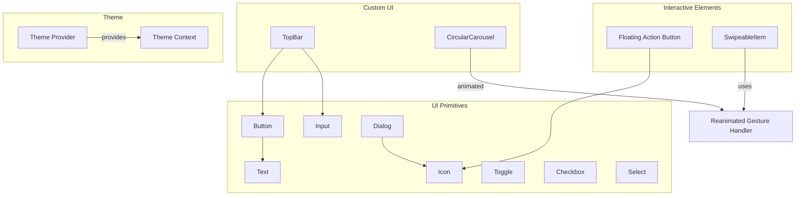

**Diagram sources**
- [button.tsx:1-109](file://src/components/ui/button.tsx#L1-L109)
- [text.tsx:1-90](file://src/components/ui/text.tsx#L1-L90)
- [icon.tsx:1-56](file://src/components/ui/icon.tsx#L1-L56)
- [input.tsx:1-36](file://src/components/ui/input.tsx#L1-L36)
- [dialog.tsx:1-143](file://src/components/ui/dialog.tsx#L1-L143)
- [toggle.tsx:1-76](file://src/components/ui/toggle.tsx#L1-L76)
- [checkbox.tsx:1-49](file://src/components/ui/checkbox.tsx#L1-L49)
- [select.tsx:1-254](file://src/components/ui/select.tsx#L1-L254)
- [fab.tsx:1-93](file://src/components/ui/fab.tsx#L1-L93)
- [SwipeableItem.tsx:1-39](file://src/components/swipeable/SwipeableItem.tsx#L1-L39)
- [circular-carousel/index.tsx:1-192](file://src/components/molecules/circular-carousel/index.tsx#L1-L192)
- [top-bar/index.tsx:1-159](file://src/components/top-bar/index.tsx#L1-L159)
- [context.tsx](file://src/context/themes/context.tsx)
- [provider.tsx](file://src/context/themes/provider.tsx)
- [types.ts](file://src/context/themes/types.ts)

**Section sources**
- [button.tsx:1-109](file://src/components/ui/button.tsx#L1-L109)
- [input.tsx:1-36](file://src/components/ui/input.tsx#L1-L36)
- [dialog.tsx:1-143](file://src/components/ui/dialog.tsx#L1-L143)
- [fab.tsx:1-93](file://src/components/ui/fab.tsx#L1-L93)
- [SwipeableItem.tsx:1-39](file://src/components/swipeable/SwipeableItem.tsx#L1-L39)
- [circular-carousel/index.tsx:1-192](file://src/components/molecules/circular-carousel/index.tsx#L1-L192)
- [top-bar/index.tsx:1-159](file://src/components/top-bar/index.tsx#L1-L159)
- [icon.tsx:1-56](file://src/components/ui/icon.tsx#L1-L56)
- [text.tsx:1-90](file://src/components/ui/text.tsx#L1-L90)
- [toggle.tsx:1-76](file://src/components/ui/toggle.tsx#L1-L76)
- [checkbox.tsx:1-49](file://src/components/ui/checkbox.tsx#L1-L49)
- [select.tsx:1-254](file://src/components/ui/select.tsx#L1-L254)
- [context.tsx](file://src/context/themes/context.tsx)
- [provider.tsx](file://src/context/themes/provider.tsx)
- [types.ts](file://src/context/themes/types.ts)
- [tailwind.config.js](file://tailwind.config.js)
- [global.css](file://src/css/global.css)

## Core Components
This section documents the primitive UI components that form the foundation of the library.

- Button
  - Variants: default, destructive, outline, secondary, ghost, link
  - Sizes: default, sm, lg, icon
  - Behavior: platform-aware focus/ring, hover on web, press animations, text class propagation via TextClassContext
  - Props: extends Pressable with variant, size, and className
  - Accessibility: role="button", integrates with screen readers
  - Customization: className, variant, size; text variant derived from buttonTextVariants

- Input
  - Behavior: platform-aware focus ring, selection highlight, aria-invalid support, placeholder styling
  - Props: TextInput with optional placeholderClassName and editable state handling
  - Customization: className, placeholderClassName, editable

- Dialog
  - Composition: Root, Portal, Overlay, Content, Close, Header/Footer, Title/Description
  - Animations: FadeIn/FadeOut via reanimated; FullWindowOverlay on iOS
  - Accessibility: Close button with screen reader text, portal host support
  - Props: overlay/content accept portalHost; overlay applies asChild conditionally

- Toggle
  - Variants: default, outline
  - Sizes: default, sm, lg
  - Behavior: pressed state, hover/focus rings on web, indicator text class propagation
  - Props: extends TogglePrimitive.Root with variant, size, and className

- Checkbox
  - Behavior: hitSlop defaults, indicator with IconCheck, platform-specific stroke widths
  - Props: extended with checkedClassName, indicatorClassName, iconClassName

- Select
  - Composition: Root, Trigger, Value, Content, Portal, Viewport, Item, Label, Separator, Scroll buttons
  - Animations: FadeIn/FadeOut; FullWindowOverlay on iOS
  - Platform differences: native vs web rendering, scroll buttons, portal host
  - Props: size, position, portalHost, disabled states

- Icon
  - Behavior: cssInterop to apply Nativewind className to Tabler icons
  - Props: as (Tabler icon), className, size

- Text
  - Variants: default, h1–h4, p, blockquote, code, lead, large, small, muted
  - Accessibility: role and aria-level mapping for headings on web
  - Behavior: TextClassContext for inherited text classes

**Section sources**
- [button.tsx:1-109](file://src/components/ui/button.tsx#L1-L109)
- [input.tsx:1-36](file://src/components/ui/input.tsx#L1-L36)
- [dialog.tsx:1-143](file://src/components/ui/dialog.tsx#L1-L143)
- [toggle.tsx:1-76](file://src/components/ui/toggle.tsx#L1-L76)
- [checkbox.tsx:1-49](file://src/components/ui/checkbox.tsx#L1-L49)
- [select.tsx:1-254](file://src/components/ui/select.tsx#L1-L254)
- [icon.tsx:1-56](file://src/components/ui/icon.tsx#L1-L56)
- [text.tsx:1-90](file://src/components/ui/text.tsx#L1-L90)

## Architecture Overview
The UI library leverages RN Primitives for accessible base components, Nativewind/Tailwind for styling, and Reanimated for animations. Theme-awareness is provided via a dedicated theme context and provider. Icons are unified through a wrapper that supports Nativewind classes.

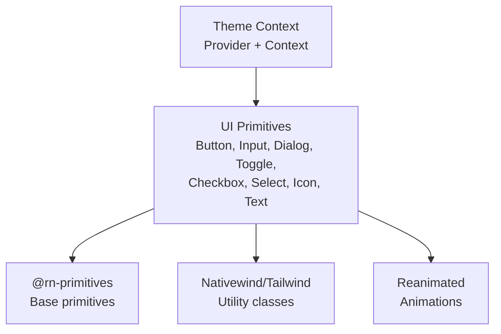

**Diagram sources**
- [button.tsx:1-109](file://src/components/ui/button.tsx#L1-L109)
- [dialog.tsx:1-143](file://src/components/ui/dialog.tsx#L1-L143)
- [select.tsx:1-254](file://src/components/ui/select.tsx#L1-L254)
- [provider.tsx](file://src/context/themes/provider.tsx)
- [context.tsx](file://src/context/themes/context.tsx)

## Detailed Component Analysis

### Button
- Composition pattern: Uses TextClassContext to propagate text utility classes; combines cva variants with platform-specific focus/ring behavior.
- Prop interfaces: variant, size, className; inherits Pressable props.
- Customization: className overrides, variant/size combinations; text variant controlled by buttonTextVariants.
- Accessibility: role="button"; integrates with focus-visible and hover states.

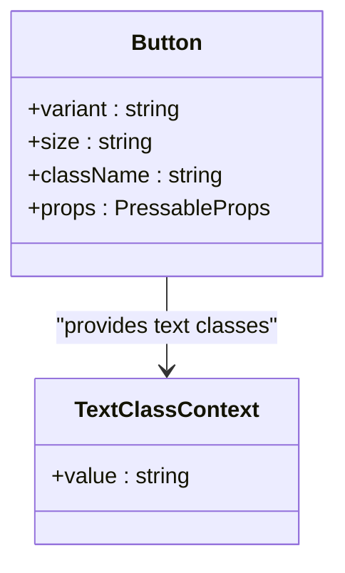

**Diagram sources**
- [button.tsx:91-109](file://src/components/ui/button.tsx#L91-L109)

**Section sources**
- [button.tsx:1-109](file://src/components/ui/button.tsx#L1-L109)

### Input
- Composition pattern: TextInput wrapper with platform-aware focus ring and placeholder styling.
- Prop interfaces: TextInputProps plus placeholderClassName; editable state handled with opacity and pointer events on web.
- Customization: className, placeholderClassName, editable.

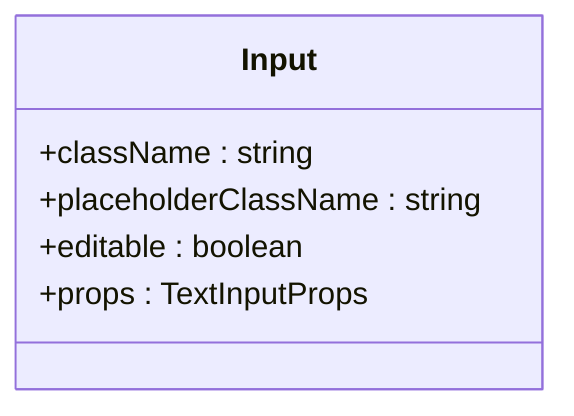

**Diagram sources**
- [input.tsx:5-36](file://src/components/ui/input.tsx#L5-L36)

**Section sources**
- [input.tsx:1-36](file://src/components/ui/input.tsx#L1-L36)

### Dialog
- Composition pattern: Portal-based overlay with animated transitions; FullWindowOverlay used on iOS.
- Prop interfaces: DialogOverlay accepts portalHost; DialogContent composes Close with accessible label.
- Accessibility: Close button includes screen reader text; overlay applies asChild on non-web platforms.

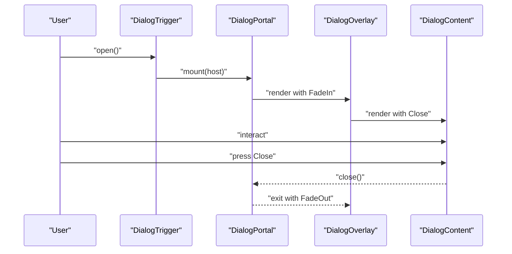

**Diagram sources**
- [dialog.tsx:11-90](file://src/components/ui/dialog.tsx#L11-L90)

**Section sources**
- [dialog.tsx:1-143](file://src/components/ui/dialog.tsx#L1-L143)

### Toggle
- Composition pattern: TogglePrimitive.Root with cva variants and text class propagation.
- Prop interfaces: variant, size, pressed state; className overrides supported.
- Customization: variant/size combinations; pressed state affects background and text color.

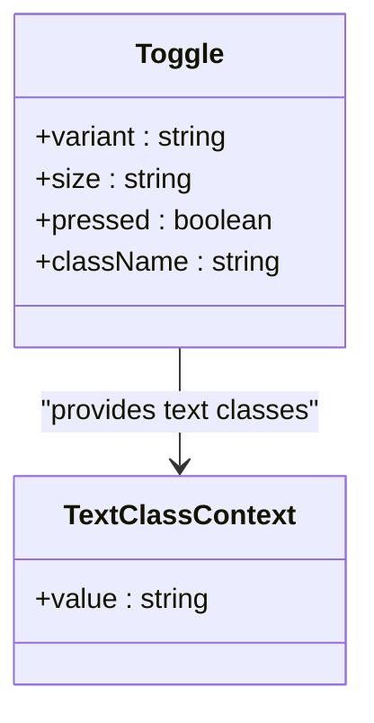

**Diagram sources**
- [toggle.tsx:40-76](file://src/components/ui/toggle.tsx#L40-L76)

**Section sources**
- [toggle.tsx:1-76](file://src/components/ui/toggle.tsx#L1-L76)

### Checkbox
- Composition pattern: CheckboxPrimitive.Root with Indicator containing IconCheck.
- Prop interfaces: extended with checkedClassName, indicatorClassName, iconClassName; default hitSlop applied.
- Customization: checked/disabled states; indicator styling via className props.

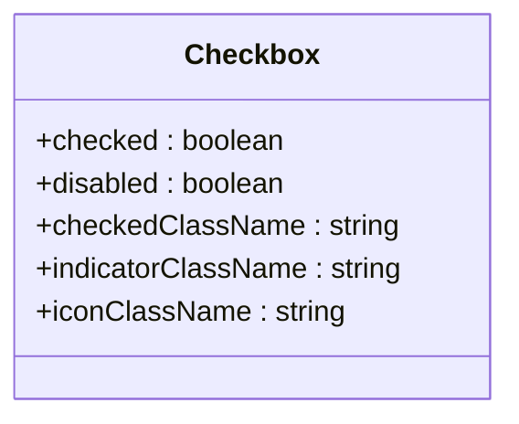

**Diagram sources**
- [checkbox.tsx:9-49](file://src/components/ui/checkbox.tsx#L9-L49)

**Section sources**
- [checkbox.tsx:1-49](file://src/components/ui/checkbox.tsx#L1-L49)

### Select
- Composition pattern: Root, Trigger, Value, Content, Portal, Viewport, Item, Label, Separator, Scroll buttons; FullWindowOverlay on iOS.
- Prop interfaces: size, position, portalHost; platform-specific rendering for web/native.
- Accessibility: ItemIndicator, ItemText, viewport sizing; scroll buttons conditionally rendered on web.

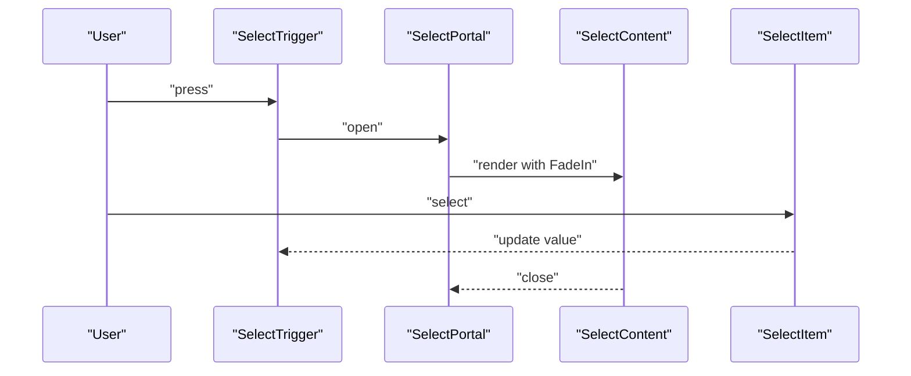

**Diagram sources**
- [select.tsx:14-133](file://src/components/ui/select.tsx#L14-L133)

**Section sources**
- [select.tsx:1-254](file://src/components/ui/select.tsx#L1-L254)

### Floating Action Button (FAB)
- Composition pattern: Animated.View with spring/timing animations for press states; optional label; integrated with Icon.
- Prop interfaces: icon (Tabler icon), label, className, buttonClassName, iconClassName, labelClassName; forwards Pressable props.
- Animation: scale and opacity changes on pressIn/pressOut; immediate onPress execution followed by spring animation.

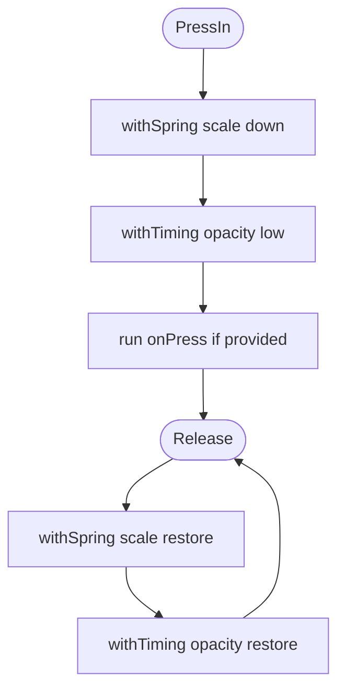

**Diagram sources**
- [fab.tsx:47-62](file://src/components/ui/fab.tsx#L47-L62)

**Section sources**
- [fab.tsx:1-93](file://src/components/ui/fab.tsx#L1-L93)

### Swipeable Item
- Composition pattern: ReanimatedSwipeable wrapper with gesture guards and window-aware hitSlop; exposes imperative close method.
- Prop interfaces: onOpen/onClose callbacks, className, children; omits internal handler props.
- Types: SwipeableItemRef, UseSwipeableItemOptions, UseSwipeableItemReturn, SwipeableItemProps.

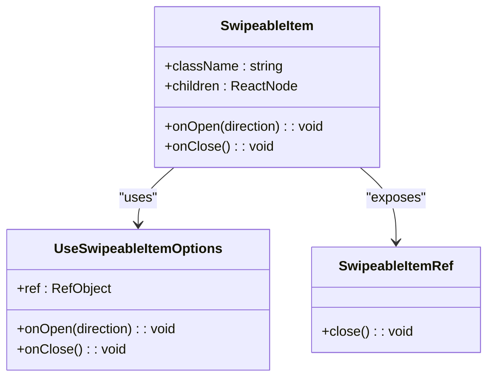

**Diagram sources**
- [SwipeableItem.tsx:10-39](file://src/components/swipeable/SwipeableItem.tsx#L10-L39)
- [swipeable/types.ts:6-39](file://src/components/swipeable/types.ts#L6-L39)

**Section sources**
- [SwipeableItem.tsx:1-39](file://src/components/swipeable/SwipeableItem.tsx#L1-L39)
- [swipeable/types.ts:1-39](file://src/components/swipeable/types.ts#L1-L39)

### Circular Carousel
- Composition pattern: Animated.FlatList with shared value for scroll position; per-item interpolation for opacity, scale, rotateZ, and blur intensity.
- Prop interfaces: data, renderItem, spacing, itemWidth, horizontalSpacing, onIndexChange; computed paddings and paging enabled.
- Animation: interpolate scrollX across input ranges; AnimatedBlurView updates intensity reactively.

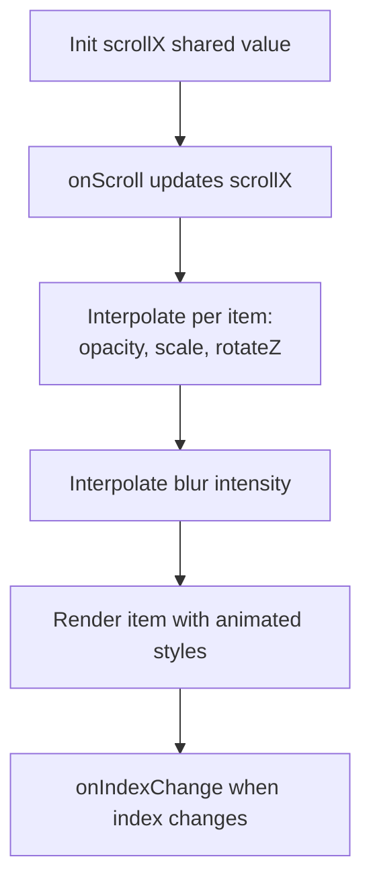

**Diagram sources**
- [circular-carousel/index.tsx:112-166](file://src/components/molecules/circular-carousel/index.tsx#L112-L166)

**Section sources**
- [circular-carousel/index.tsx:1-192](file://src/components/molecules/circular-carousel/index.tsx#L1-L192)
- [circular-carousel/types.ts:1-23](file://src/components/molecules/circular-carousel/types.ts#L1-L23)

### Top Bar
- Composition pattern: Animated.View for title/search bar transitions; integrates Button, Input, Icon; handles hardware back press when search is active.
- Prop interfaces: title, showBack/onBack, showSearch/onSearchChange/searchQuery/searchPlaceholder, rightAction, className.
- Animation: useSharedValue for opacity; withTiming and withDelay for smooth transitions.

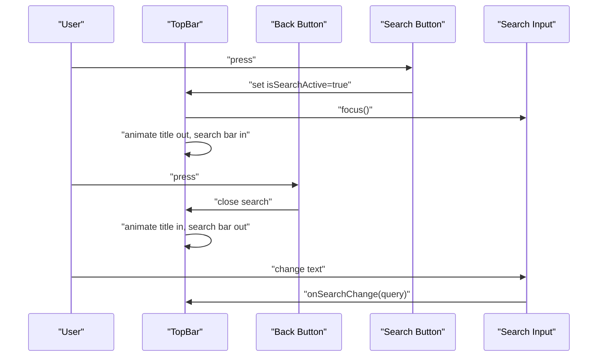

**Diagram sources**
- [top-bar/index.tsx:27-159](file://src/components/top-bar/index.tsx#L27-L159)

**Section sources**
- [top-bar/index.tsx:1-159](file://src/components/top-bar/index.tsx#L1-L159)

## Dependency Analysis
- RN Primitives: Base components for Dialog, Select, Toggle, Checkbox are imported from @rn-primitives.
- Reanimated: Used for animations in Dialog, Select, FAB, SwipeableItem, and CircularCarousel.
- Reanimated Gesture Handler: Used for swipe gestures in SwipeableItem.
- Expo Blur: Used in CircularCarousel for animated blur overlays.
- Nativewind: Provides cssInterop for Icon and utility class application across components.
- Theme Context: Provider supplies theme context; components consume via context.

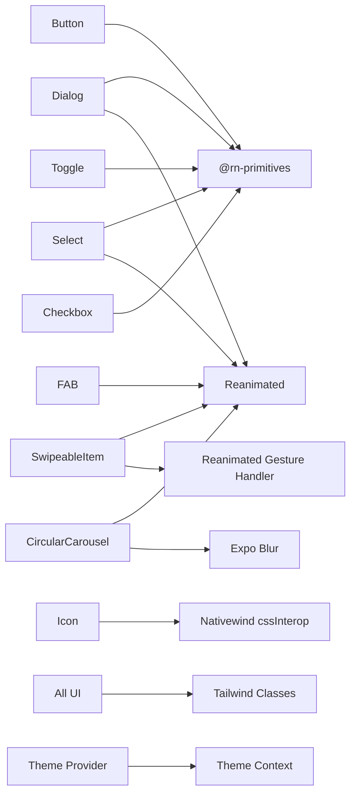

**Diagram sources**
- [button.tsx:1-109](file://src/components/ui/button.tsx#L1-L109)
- [dialog.tsx:1-143](file://src/components/ui/dialog.tsx#L1-L143)
- [select.tsx:1-254](file://src/components/ui/select.tsx#L1-L254)
- [toggle.tsx:1-76](file://src/components/ui/toggle.tsx#L1-L76)
- [checkbox.tsx:1-49](file://src/components/ui/checkbox.tsx#L1-L49)
- [fab.tsx:1-93](file://src/components/ui/fab.tsx#L1-L93)
- [SwipeableItem.tsx:1-39](file://src/components/swipeable/SwipeableItem.tsx#L1-L39)
- [circular-carousel/index.tsx:1-192](file://src/components/molecules/circular-carousel/index.tsx#L1-L192)
- [icon.tsx:1-56](file://src/components/ui/icon.tsx#L1-L56)
- [provider.tsx](file://src/context/themes/provider.tsx)
- [context.tsx](file://src/context/themes/context.tsx)

**Section sources**
- [button.tsx:1-109](file://src/components/ui/button.tsx#L1-L109)
- [dialog.tsx:1-143](file://src/components/ui/dialog.tsx#L1-L143)
- [select.tsx:1-254](file://src/components/ui/select.tsx#L1-L254)
- [toggle.tsx:1-76](file://src/components/ui/toggle.tsx#L1-L76)
- [checkbox.tsx:1-49](file://src/components/ui/checkbox.tsx#L1-L49)
- [fab.tsx:1-93](file://src/components/ui/fab.tsx#L1-L93)
- [SwipeableItem.tsx:1-39](file://src/components/swipeable/SwipeableItem.tsx#L1-L39)
- [circular-carousel/index.tsx:1-192](file://src/components/molecules/circular-carousel/index.tsx#L1-L192)
- [icon.tsx:1-56](file://src/components/ui/icon.tsx#L1-L56)
- [provider.tsx](file://src/context/themes/provider.tsx)
- [context.tsx](file://src/context/themes/context.tsx)

## Performance Considerations
- Prefer Reanimated for animations to keep UI responsive (used in Dialog, Select, FAB, SwipeableItem, CircularCarousel).
- Use FlatList with paging and snapToInterval in CircularCarousel to optimize rendering.
- Avoid unnecessary re-renders by passing memoized callbacks and using imperative refs where appropriate (e.g., SwipeableItem close).
- Keep className concatenation minimal; leverage cva variants to reduce runtime branching.
- Use platform-specific optimizations (e.g., FullWindowOverlay on iOS) to avoid layout thrash.

## Accessibility Features
- Buttons and Inputs include focus-visible rings and aria-invalid states on web.
- Dialog Close button includes screen reader text for “Close”.
- Text component maps heading variants to roles and aria-level attributes on web.
- Select items expose ItemText and ItemIndicator for assistive technologies.
- Toggle and Checkbox provide pressed and disabled states with appropriate visual feedback.

**Section sources**
- [button.tsx:9-12](file://src/components/ui/button.tsx#L9-L12)
- [input.tsx:17-24](file://src/components/ui/input.tsx#L17-L24)
- [dialog.tsx:80-85](file://src/components/ui/dialog.tsx#L80-L85)
- [text.tsx:49-63](file://src/components/ui/text.tsx#L49-L63)
- [select.tsx:147-171](file://src/components/ui/select.tsx#L147-L171)
- [toggle.tsx:40-68](file://src/components/ui/toggle.tsx#L40-L68)
- [checkbox.tsx:9-49](file://src/components/ui/checkbox.tsx#L9-L49)

## Responsive Design and Cross-Platform Compatibility
- Platform-specific behavior:
  - Web: focus-visible rings, hover states, aria-* attributes, scroll buttons in Select, pointer events adjustments.
  - Native: hitSlop defaults, overflow handling, FullWindowOverlay on iOS, native ScrollView for Select.
- Adaptive sizes: variants and sizes adjust heights and paddings across breakpoints.
- Window-aware gestures: SwipeableItem computes hitSlop based on device width.

**Section sources**
- [button.tsx:9-12](file://src/components/ui/button.tsx#L9-L12)
- [input.tsx:17-24](file://src/components/ui/input.tsx#L17-L24)
- [select.tsx:70-71](file://src/components/ui/select.tsx#L70-L71)
- [select.tsx:233-238](file://src/components/ui/select.tsx#L233-L238)
- [SwipeableItem.tsx:14-17](file://src/components/swipeable/SwipeableItem.tsx#L14-L17)

## Styling System Integration
- Tailwind CSS and Nativewind: Utility classes applied via cn and cssInterop; variants generated with class-variance-authority (cva).
- Theme-aware components: Theme provider supplies context consumed by components; global CSS ensures consistent base styles.
- Icon styling: Icon component wraps Tabler icons and applies Nativewind classes via cssInterop.

**Section sources**
- [button.tsx:6-54](file://src/components/ui/button.tsx#L6-L54)
- [input.tsx:10-26](file://src/components/ui/input.tsx#L10-L26)
- [dialog.tsx:32-48](file://src/components/ui/dialog.tsx#L32-L48)
- [select.tsx:54-109](file://src/components/ui/select.tsx#L54-L109)
- [toggle.tsx:9-38](file://src/components/ui/toggle.tsx#L9-L38)
- [checkbox.tsx:23-44](file://src/components/ui/checkbox.tsx#L23-L44)
- [icon.tsx:13-22](file://src/components/ui/icon.tsx#L13-L22)
- [provider.tsx](file://src/context/themes/provider.tsx)
- [context.tsx](file://src/context/themes/context.tsx)
- [tailwind.config.js](file://tailwind.config.js)
- [global.css](file://src/css/global.css)

## Usage Examples and Integration Patterns
- Composing UI elements:
  - Use Button with variant/size to match design tokens; pair with Icon for compound actions.
  - Wrap content in Dialog using Portal and Overlay; add DialogHeader/DialogFooter for structured layouts.
  - Build forms with Input, Checkbox, Toggle, Select; apply placeholderClassName and aria-invalid states.
- Interactive patterns:
  - Integrate FAB with onPress handlers; optionally include label for clarity.
  - Wrap list rows with SwipeableItem to reveal left/right actions; expose imperative close via ref.
  - Use CircularCarousel for hero-like content; listen to onIndexChange for analytics or state updates.
  - Construct TopBar with showBack/showSearch flags; wire onBack and onSearchChange for navigation and filtering.
- Theming:
  - Wrap app with Theme Provider to enable theme-aware variants and colors across components.

[No sources needed since this section provides general guidance]

## Troubleshooting Guide
- Dialog not closing or backdrop not clickable:
  - Ensure Portal host is set and Overlay applies asChild appropriately; verify FullWindowOverlay usage on iOS.
- Select options not visible on web:
  - Confirm portalHost is configured; check viewport sizing and scroll buttons presence.
- Swipeable gestures conflicting:
  - Verify panGuard and hitSlop calculations; ensure simultaneousWithExternalGesture is set.
- FAB press animations not firing:
  - Confirm onPress executes before spring animations; check shared values and animatedStyle bindings.
- Icon not styled:
  - Ensure Icon is used with cssInterop and className is applied; verify size/color props.

**Section sources**
- [dialog.tsx:19-49](file://src/components/ui/dialog.tsx#L19-L49)
- [select.tsx:82-133](file://src/components/ui/select.tsx#L82-L133)
- [SwipeableItem.tsx:16-32](file://src/components/swipeable/SwipeableItem.tsx#L16-L32)
- [fab.tsx:47-62](file://src/components/ui/fab.tsx#L47-L62)
- [icon.tsx:13-22](file://src/components/ui/icon.tsx#L13-L22)

## Conclusion
The PowerLists UI component library provides a cohesive set of primitives and custom elements designed for cross-platform mobile apps with strong accessibility and responsive behavior. By leveraging RN Primitives, Nativewind, and Reanimated, components are consistent, theme-aware, and performant. The documented patterns, prop interfaces, and integration guidelines enable teams to build scalable UIs aligned with the application’s design system.