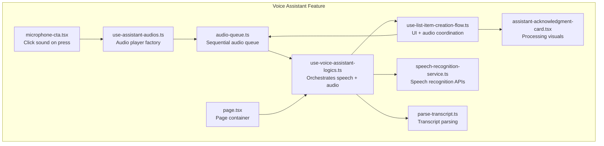
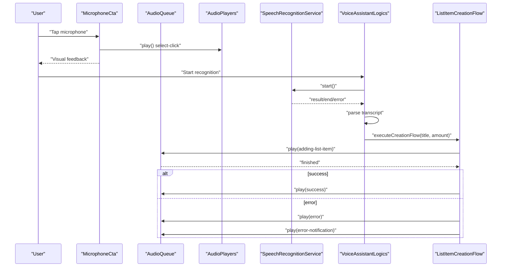
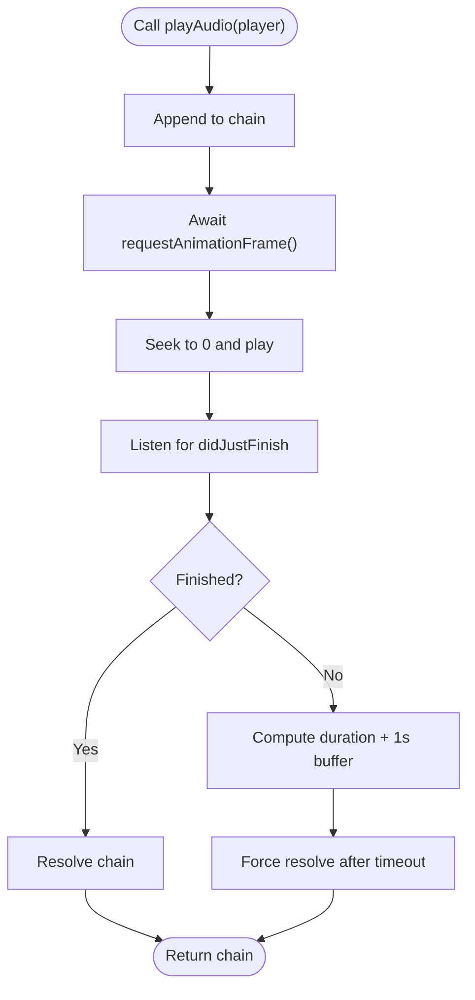
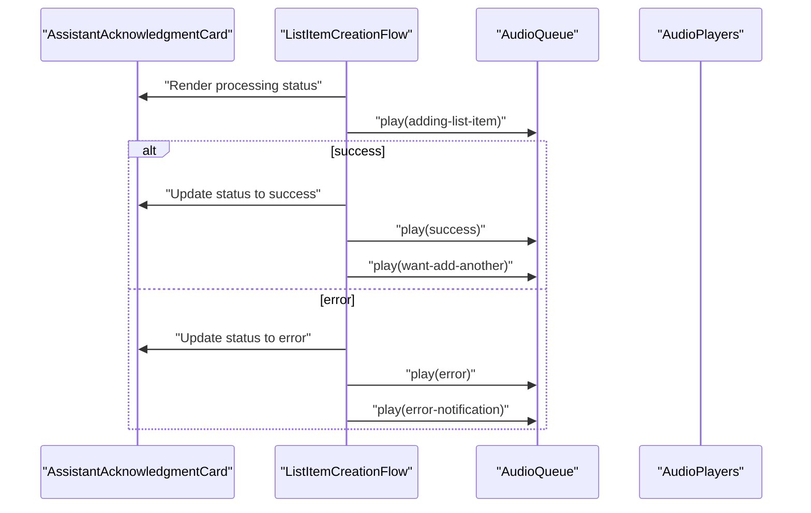
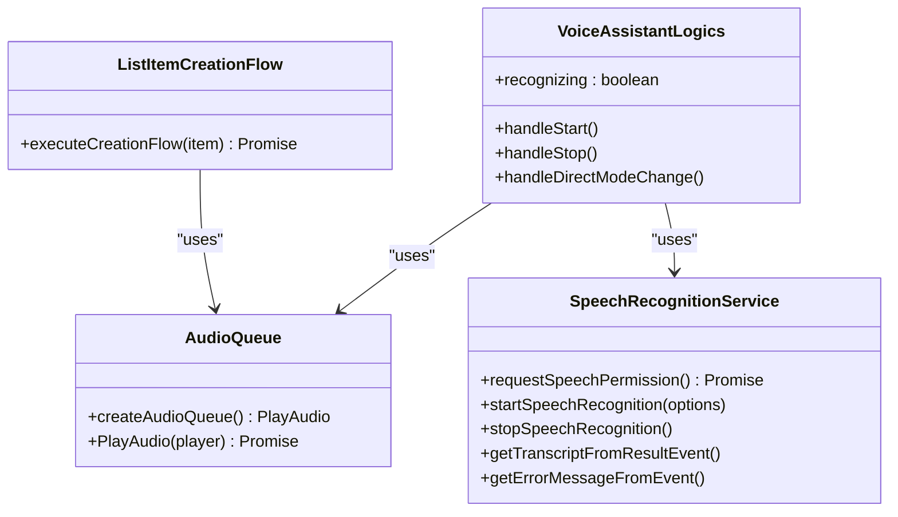
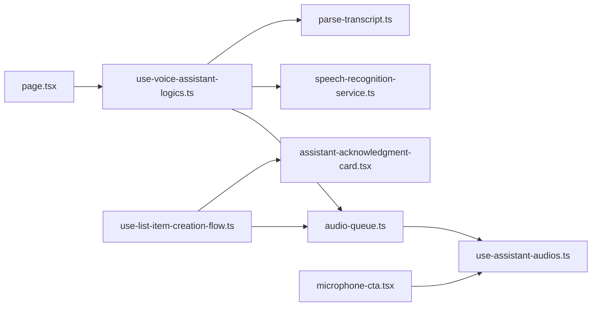

# Audio Feedback System

<cite>
**Referenced Files in This Document**
- [audio-queue.ts](file://src/features/voice-assistant/services/audio-queue.ts)
- [use-assistant-audios.ts](file://src/features/voice-assistant/hooks/use-assistant-audios.ts)
- [use-voice-assistant-logics.ts](file://src/features/voice-assistant/hooks/use-voice-assistant-logics.ts)
- [use-list-item-creation-flow.ts](file://src/features/voice-assistant/hooks/use-list-item-creation-flow.ts)
- [speech-recognition-service.ts](file://src/features/voice-assistant/services/speech-recognition-service.ts)
- [parse-transcript.ts](file://src/features/voice-assistant/utils/parse-transcript.ts)
- [assistant-acknowledgment-card.tsx](file://src/features/voice-assistant/components/assistant-acknowledgment-card.tsx)
- [microphone-cta.tsx](file://src/features/voice-assistant/components/microphone-cta.tsx)
- [page.tsx](file://src/features/voice-assistant/page.tsx)
</cite>

## Table of Contents
1. [Introduction](#introduction)
2. [Project Structure](#project-structure)
3. [Core Components](#core-components)
4. [Architecture Overview](#architecture-overview)
5. [Detailed Component Analysis](#detailed-component-analysis)
6. [Dependency Analysis](#dependency-analysis)
7. [Performance Considerations](#performance-considerations)
8. [Troubleshooting Guide](#troubleshooting-guide)
9. [Conclusion](#conclusion)

## Introduction
This document describes the audio feedback and synthesis system used by the voice assistant feature. It covers the audio queue implementation, sound effect management, speech synthesis integration, playback coordination, queue prioritization, concurrent audio handling, acknowledgment sounds, confirmation tones, error feedback audio, resource management, volume control, platform-specific considerations, accessibility features, background audio interruption handling, and performance optimizations for smooth audio playback.

## Project Structure
The audio system is centered around a voice assistant feature with modular components:
- Audio queue service for sequential playback
- Hook-based audio player management
- Voice assistant logics orchestrating speech recognition and audio playback
- List item creation flow coordinating UI updates and audio cues
- Transcript parsing utilities for extracting item titles and quantities
- UI components emitting click sounds and visual feedback

**Diagram sources**
- [use-assistant-audios.ts:1-36](file://src/features/voice-assistant/hooks/use-assistant-audios.ts#L1-L36)
- [audio-queue.ts:1-60](file://src/features/voice-assistant/services/audio-queue.ts#L1-L60)
- [use-voice-assistant-logics.ts:1-213](file://src/features/voice-assistant/hooks/use-voice-assistant-logics.ts#L1-L213)
- [use-list-item-creation-flow.ts:1-96](file://src/features/voice-assistant/hooks/use-list-item-creation-flow.ts#L1-L96)
- [speech-recognition-service.ts:1-54](file://src/features/voice-assistant/services/speech-recognition-service.ts#L1-L54)
- [parse-transcript.ts:1-225](file://src/features/voice-assistant/utils/parse-transcript.ts#L1-L225)
- [assistant-acknowledgment-card.tsx:1-94](file://src/features/voice-assistant/components/assistant-acknowledgment-card.tsx#L1-L94)
- [microphone-cta.tsx:1-97](file://src/features/voice-assistant/components/microphone-cta.tsx#L1-L97)
- [page.tsx:1-60](file://src/features/voice-assistant/page.tsx#L1-L60)

**Section sources**
- [use-assistant-audios.ts:1-36](file://src/features/voice-assistant/hooks/use-assistant-audios.ts#L1-L36)
- [audio-queue.ts:1-60](file://src/features/voice-assistant/services/audio-queue.ts#L1-L60)
- [use-voice-assistant-logics.ts:1-213](file://src/features/voice-assistant/hooks/use-voice-assistant-logics.ts#L1-L213)
- [use-list-item-creation-flow.ts:1-96](file://src/features/voice-assistant/hooks/use-list-item-creation-flow.ts#L1-L96)
- [speech-recognition-service.ts:1-54](file://src/features/voice-assistant/services/speech-recognition-service.ts#L1-L54)
- [parse-transcript.ts:1-225](file://src/features/voice-assistant/utils/parse-transcript.ts#L1-L225)
- [assistant-acknowledgment-card.tsx:1-94](file://src/features/voice-assistant/components/assistant-acknowledgment-card.tsx#L1-L94)
- [microphone-cta.tsx:1-97](file://src/features/voice-assistant/components/microphone-cta.tsx#L1-L97)
- [page.tsx:1-60](file://src/features/voice-assistant/page.tsx#L1-L60)

## Core Components
- Audio queue service: Provides a sequential audio playback mechanism ensuring no overlaps and allowing UI state changes to render before playback starts.
- Audio player factory: Creates reusable AudioPlayer instances for each sound effect used by the assistant.
- Voice assistant logics: Coordinates speech recognition events, manages chat messages, triggers audio playback via the queue, and handles errors.
- List item creation flow: Orchestrates item creation steps, updates acknowledgment UI, and triggers appropriate success/error audio cues.
- Speech recognition service: Wraps platform speech recognition APIs with permission requests, start/stop controls, and error translation.
- Transcript parser: Extracts item titles and quantities from Portuguese transcripts.
- UI components: Emit click sounds on user actions and provide visual feedback during processing.

**Section sources**
- [audio-queue.ts:1-60](file://src/features/voice-assistant/services/audio-queue.ts#L1-L60)
- [use-assistant-audios.ts:1-36](file://src/features/voice-assistant/hooks/use-assistant-audios.ts#L1-L36)
- [use-voice-assistant-logics.ts:1-213](file://src/features/voice-assistant/hooks/use-voice-assistant-logics.ts#L1-L213)
- [use-list-item-creation-flow.ts:1-96](file://src/features/voice-assistant/hooks/use-list-item-creation-flow.ts#L1-L96)
- [speech-recognition-service.ts:1-54](file://src/features/voice-assistant/services/speech-recognition-service.ts#L1-L54)
- [parse-transcript.ts:1-225](file://src/features/voice-assistant/utils/parse-transcript.ts#L1-L225)
- [assistant-acknowledgment-card.tsx:1-94](file://src/features/voice-assistant/components/assistant-acknowledgment-card.tsx#L1-L94)
- [microphone-cta.tsx:1-97](file://src/features/voice-assistant/components/microphone-cta.tsx#L1-L97)

## Architecture Overview
The audio system integrates speech recognition with audio playback through a queue. The flow begins with user interaction (e.g., pressing the microphone), which triggers a click sound and starts speech recognition. When a final transcript is received, the system parses the item and quantity, updates the UI, and plays appropriate audio cues via the sequential queue.

**Diagram sources**
- [microphone-cta.tsx:24-36](file://src/features/voice-assistant/components/microphone-cta.tsx#L24-L36)
- [audio-queue.ts:44-59](file://src/features/voice-assistant/services/audio-queue.ts#L44-L59)
- [use-assistant-audios.ts:3-21](file://src/features/voice-assistant/hooks/use-assistant-audios.ts#L3-L21)
- [speech-recognition-service.ts:24-33](file://src/features/voice-assistant/services/speech-recognition-service.ts#L24-L33)
- [use-voice-assistant-logics.ts:78-99](file://src/features/voice-assistant/hooks/use-voice-assistant-logics.ts#L78-L99)
- [use-list-item-creation-flow.ts:27-92](file://src/features/voice-assistant/hooks/use-list-item-creation-flow.ts#L27-L92)

## Detailed Component Analysis

### Audio Queue Implementation
The audio queue enforces sequential playback by chaining promises and awaiting a single animation frame before starting each sound. It listens for playback completion events and includes a fallback timeout based on the player’s duration to prevent hangs.

Key behaviors:
- Ensures no overlapping audio
- Waits for UI to render before playing
- Uses a listener for completion and a timeout fallback
- Tracks subsequent play attempts for diagnostics

**Diagram sources**
- [audio-queue.ts:8-34](file://src/features/voice-assistant/services/audio-queue.ts#L8-L34)
- [audio-queue.ts:44-59](file://src/features/voice-assistant/services/audio-queue.ts#L44-L59)

**Section sources**
- [audio-queue.ts:1-60](file://src/features/voice-assistant/services/audio-queue.ts#L1-L60)

### Sound Effect Management
The audio player factory creates reusable players for:
- Start recording click
- Assistant courtesy greeting
- First/new list item prompts
- Adding list item feedback
- Success confirmation
- Error feedback
- Error notification

These are injected into the voice assistant logics and creation flow to trigger appropriate sounds during state transitions.

**Section sources**
- [use-assistant-audios.ts:1-36](file://src/features/voice-assistant/hooks/use-assistant-audios.ts#L1-L36)

### Speech Recognition Integration
The speech recognition service wraps platform APIs:
- Requests permissions
- Starts/stops recognition with default options
- Translates result and error events into user-facing messages
- Provides helpers to extract transcripts and error messages

**Section sources**
- [speech-recognition-service.ts:1-54](file://src/features/voice-assistant/services/speech-recognition-service.ts#L1-L54)

### Acknowledgment and Feedback Audio Coordination
The creation flow coordinates UI acknowledgment cards with audio cues:
- Adds a processing acknowledgment message and plays the “adding item” sound
- On success, updates status to success and plays the success tone
- On failure, updates status to error, plays the error sound, and emits an error notification

**Diagram sources**
- [assistant-acknowledgment-card.tsx:23-60](file://src/features/voice-assistant/components/assistant-acknowledgment-card.tsx#L23-L60)
- [use-list-item-creation-flow.ts:27-92](file://src/features/voice-assistant/hooks/use-list-item-creation-flow.ts#L27-L92)
- [use-assistant-audios.ts:8-21](file://src/features/voice-assistant/hooks/use-assistant-audios.ts#L8-L21)

**Section sources**
- [use-list-item-creation-flow.ts:1-96](file://src/features/voice-assistant/hooks/use-list-item-creation-flow.ts#L1-L96)
- [assistant-acknowledgment-card.tsx:1-94](file://src/features/voice-assistant/components/assistant-acknowledgment-card.tsx#L1-L94)

### Playback Coordination and Queue Prioritization
Playback is coordinated through:
- A single sequential queue shared across the assistant lifecycle
- UI-render-before-play pattern using animation frames
- Event-driven completion handling with a safe fallback timeout
- Error logging for diagnosing queue failures

**Diagram sources**
- [audio-queue.ts:44-59](file://src/features/voice-assistant/services/audio-queue.ts#L44-L59)
- [use-voice-assistant-logics.ts:19-48](file://src/features/voice-assistant/hooks/use-voice-assistant-logics.ts#L19-L48)
- [use-list-item-creation-flow.ts:22-26](file://src/features/voice-assistant/hooks/use-list-item-creation-flow.ts#L22-L26)
- [speech-recognition-service.ts:19-53](file://src/features/voice-assistant/services/speech-recognition-service.ts#L19-L53)

**Section sources**
- [use-voice-assistant-logics.ts:1-213](file://src/features/voice-assistant/hooks/use-voice-assistant-logics.ts#L1-L213)
- [audio-queue.ts:1-60](file://src/features/voice-assistant/services/audio-queue.ts#L1-L60)

### Concurrent Audio Handling
Concurrent audio is prevented by:
- A single sequential chain per session
- Animation frame delay to ensure UI renders before playback
- Completion listener plus timeout fallback to avoid deadlocks

Implications:
- No overlapping sounds
- Predictable timing aligned with UI updates
- Robustness against platform-specific playback inconsistencies

**Section sources**
- [audio-queue.ts:36-59](file://src/features/voice-assistant/services/audio-queue.ts#L36-L59)

### Examples of Audio Resource Management
- Audio resources are bundled via asset requires and managed by the audio player factory hook
- Players are created once and reused across interactions
- Duration-based fallback prevents indefinite waits if listeners fail

**Section sources**
- [use-assistant-audios.ts:3-21](file://src/features/voice-assistant/hooks/use-assistant-audios.ts#L3-L21)
- [audio-queue.ts:25-34](file://src/features/voice-assistant/services/audio-queue.ts#L25-L34)

### Volume Control and Platform-Specific Considerations
- Volume control is handled by the underlying audio player and platform audio subsystems
- Platform-specific behaviors (e.g., background audio interruption) are managed by the platform APIs and the audio queue’s robust completion detection

**Section sources**
- [use-assistant-audios.ts:3-21](file://src/features/voice-assistant/hooks/use-assistant-audios.ts#L3-L21)
- [audio-queue.ts:25-34](file://src/features/voice-assistant/services/audio-queue.ts#L25-L34)

### Accessibility Features
- Microphone CTA exposes accessibility labels for screen readers
- Visual animations indicate recording state and progress
- Clear audio cues accompany state changes (processing, success, error)

**Section sources**
- [microphone-cta.tsx:77-80](file://src/features/voice-assistant/components/microphone-cta.tsx#L77-L80)
- [assistant-acknowledgment-card.tsx:48-60](file://src/features/voice-assistant/components/assistant-acknowledgment-card.tsx#L48-L60)

## Dependency Analysis
The voice assistant module composes several dependencies:
- Audio queue depends on the audio player abstraction
- Voice assistant logics depend on speech recognition service and audio queue
- Creation flow depends on the queue and UI acknowledgment component
- UI components depend on the audio player factory

**Diagram sources**
- [audio-queue.ts:1-60](file://src/features/voice-assistant/services/audio-queue.ts#L1-L60)
- [use-assistant-audios.ts:1-36](file://src/features/voice-assistant/hooks/use-assistant-audios.ts#L1-L36)
- [use-voice-assistant-logics.ts:1-213](file://src/features/voice-assistant/hooks/use-voice-assistant-logics.ts#L1-L213)
- [speech-recognition-service.ts:1-54](file://src/features/voice-assistant/services/speech-recognition-service.ts#L1-L54)
- [parse-transcript.ts:1-225](file://src/features/voice-assistant/utils/parse-transcript.ts#L1-L225)
- [use-list-item-creation-flow.ts:1-96](file://src/features/voice-assistant/hooks/use-list-item-creation-flow.ts#L1-L96)
- [assistant-acknowledgment-card.tsx:1-94](file://src/features/voice-assistant/components/assistant-acknowledgment-card.tsx#L1-L94)
- [microphone-cta.tsx:1-97](file://src/features/voice-assistant/components/microphone-cta.tsx#L1-L97)
- [page.tsx:1-60](file://src/features/voice-assistant/page.tsx#L1-L60)

**Section sources**
- [use-voice-assistant-logics.ts:1-213](file://src/features/voice-assistant/hooks/use-voice-assistant-logics.ts#L1-L213)
- [use-list-item-creation-flow.ts:1-96](file://src/features/voice-assistant/hooks/use-list-item-creation-flow.ts#L1-L96)
- [audio-queue.ts:1-60](file://src/features/voice-assistant/services/audio-queue.ts#L1-L60)

## Performance Considerations
- Sequential queue prevents CPU and memory spikes from overlapping audio
- Animation frame delay ensures UI readiness before playback reduces perceived latency
- Duration-based fallback avoids blocking indefinitely on platform playback issues
- Reusing audio players avoids repeated initialization overhead

[No sources needed since this section provides general guidance]

## Troubleshooting Guide
Common issues and resolutions:
- No audio plays: Verify permissions were granted and speech recognition started successfully
- Overlapping sounds: Confirm the sequential queue is used consistently
- Hangs during playback: The queue includes a timeout fallback; inspect logs for queue errors
- UI not reflecting state: Ensure animation frame delay precedes play calls

**Section sources**
- [speech-recognition-service.ts:19-33](file://src/features/voice-assistant/services/speech-recognition-service.ts#L19-L33)
- [audio-queue.ts:48-59](file://src/features/voice-assistant/services/audio-queue.ts#L48-L59)
- [use-voice-assistant-logics.ts:101-111](file://src/features/voice-assistant/hooks/use-voice-assistant-logics.ts#L101-L111)

## Conclusion
The audio feedback system combines a robust sequential audio queue with a modular audio player factory and speech recognition integration. It ensures smooth, predictable audio playback synchronized with UI updates, while providing clear feedback for processing, success, and error states. The design emphasizes reliability through completion listeners and timeouts, accessibility via labels and animations, and performance via reuse and sequential coordination.