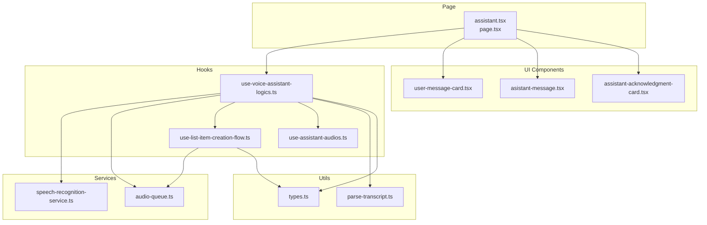
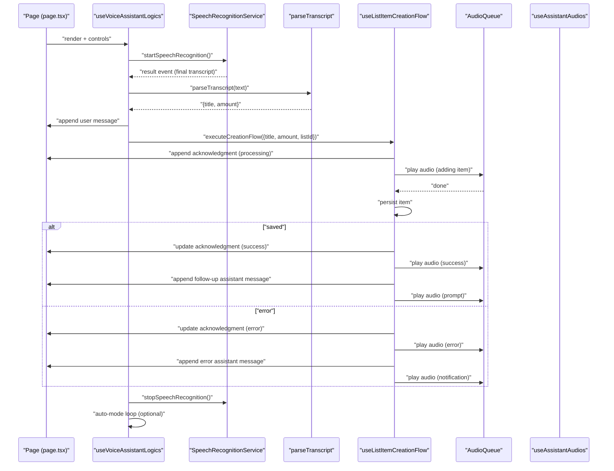
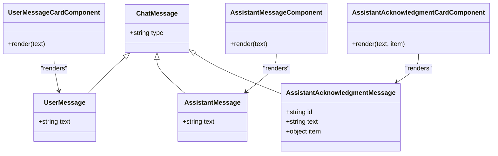
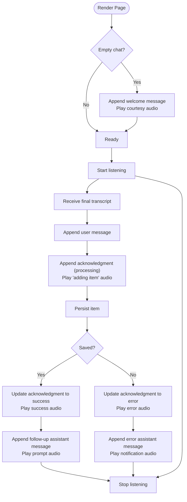
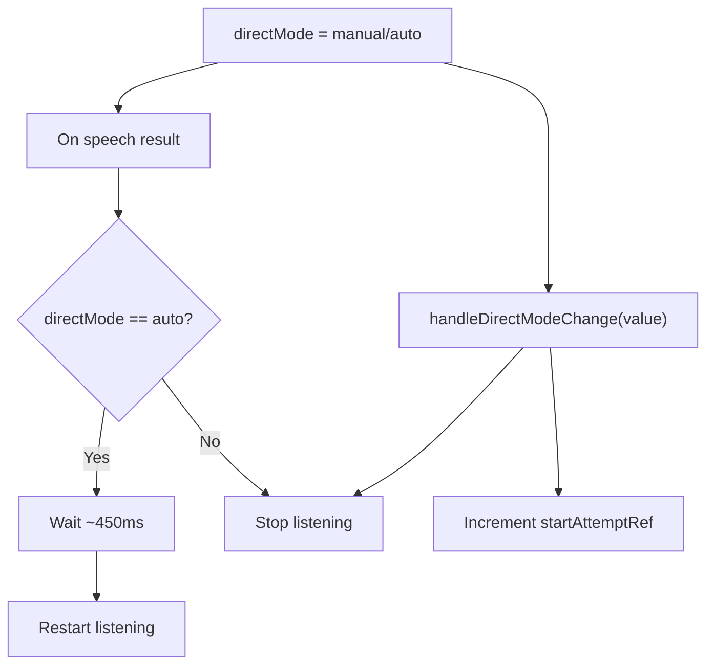
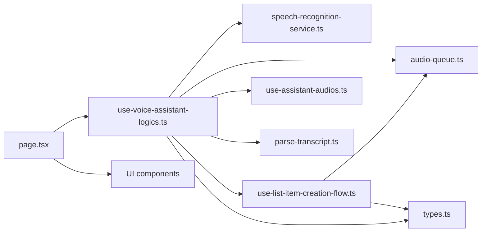

# Conversation Flow Management

<cite>
**Referenced Files in This Document**
- [assistant.tsx](file://src/app/(authenticated)/assistant.tsx)
- [page.tsx](file://src/features/voice-assistant/page.tsx)
- [use-voice-assistant-logics.ts](file://src/features/voice-assistant/hooks/use-voice-assistant-logics.ts)
- [use-list-item-creation-flow.ts](file://src/features/voice-assistant/hooks/use-list-item-creation-flow.ts)
- [speech-recognition-service.ts](file://src/features/voice-assistant/services/speech-recognition-service.ts)
- [audio-queue.ts](file://src/features/voice-assistant/services/audio-queue.ts)
- [parse-transcript.ts](file://src/features/voice-assistant/utils/parse-transcript.ts)
- [types.ts](file://src/features/voice-assistant/types.ts)
- [asistant-message.tsx](file://src/features/voice-assistant/components/asistant-message.tsx)
- [assistant-acknowledgment-card.tsx](file://src/features/voice-assistant/components/assistant-acknowledgment-card.tsx)
- [user-message-card.tsx](file://src/features/voice-assistant/components/user-message-card.tsx)
- [use-assistant-audios.ts](file://src/features/voice-assistant/hooks/use-assistant-audios.ts)
</cite>

## Table of Contents
1. [Introduction](#introduction)
2. [Project Structure](#project-structure)
3. [Core Components](#core-components)
4. [Architecture Overview](#architecture-overview)
5. [Detailed Component Analysis](#detailed-component-analysis)
6. [Dependency Analysis](#dependency-analysis)
7. [Performance Considerations](#performance-considerations)
8. [Troubleshooting Guide](#troubleshooting-guide)
9. [Conclusion](#conclusion)
10. [Appendices](#appendices)

## Introduction
This document describes the conversation flow management system for the voice assistant feature. It explains how messages are represented and rendered, how conversation threads are maintained, how assistant responses and user messages are coordinated, and how direct mode and auto-looping are implemented. It also covers message parsing, audio feedback sequencing, and the lifecycle of conversation state during recording, processing, and UI updates.

## Project Structure
The voice assistant feature is organized around a dedicated page, a central logic hook, supporting services, UI components, and audio queues. The page renders a scrollable chat list and a footer with controls. The logic hook orchestrates speech events, maintains chat state, and coordinates item creation flow. Services encapsulate speech recognition and audio playback. UI components render distinct message types. An audio queue ensures non-overlapping audio feedback.

**Diagram sources**
- [assistant.tsx](file://src/app/(authenticated)/assistant.tsx#L1-L2)
- [page.tsx:1-60](file://src/features/voice-assistant/page.tsx#L1-L60)
- [use-voice-assistant-logics.ts:1-213](file://src/features/voice-assistant/hooks/use-voice-assistant-logics.ts#L1-L213)
- [use-list-item-creation-flow.ts:1-96](file://src/features/voice-assistant/hooks/use-list-item-creation-flow.ts#L1-L96)
- [speech-recognition-service.ts:1-54](file://src/features/voice-assistant/services/speech-recognition-service.ts#L1-L54)
- [audio-queue.ts:1-60](file://src/features/voice-assistant/services/audio-queue.ts#L1-L60)
- [user-message-card.tsx:1-12](file://src/features/voice-assistant/components/user-message-card.tsx#L1-L12)
- [asistant-message.tsx:1-19](file://src/features/voice-assistant/components/asistant-message.tsx#L1-L19)
- [assistant-acknowledgment-card.tsx:1-94](file://src/features/voice-assistant/components/assistant-acknowledgment-card.tsx#L1-L94)
- [types.ts:1-45](file://src/features/voice-assistant/types.ts#L1-L45)
- [parse-transcript.ts:1-225](file://src/features/voice-assistant/utils/parse-transcript.ts#L1-L225)

**Section sources**
- [assistant.tsx](file://src/app/(authenticated)/assistant.tsx#L1-L2)
- [page.tsx:1-60](file://src/features/voice-assistant/page.tsx#L1-L60)

## Core Components
- Chat message model and types define three message categories: user, assistant, and assistant acknowledgment with embedded item state.
- The page composes the chat list and footer controls, passing props to the logic hook.
- The logic hook manages recognition state, direct/auto mode, chat history, and starts/stops speech recognition.
- The item creation flow appends an acknowledgment message, plays audio, persists the item, updates status, and continues the conversation.
- Speech recognition service abstracts platform APIs and error mapping.
- Audio queue serializes audio playback to avoid overlaps and ensure UI renders before playing.
- Transcript parser extracts item titles and quantities from Portuguese speech.

**Section sources**
- [types.ts:1-45](file://src/features/voice-assistant/types.ts#L1-L45)
- [page.tsx:9-59](file://src/features/voice-assistant/page.tsx#L9-L59)
- [use-voice-assistant-logics.ts:19-213](file://src/features/voice-assistant/hooks/use-voice-assistant-logics.ts#L19-L213)
- [use-list-item-creation-flow.ts:22-96](file://src/features/voice-assistant/hooks/use-list-item-creation-flow.ts#L22-L96)
- [speech-recognition-service.ts:1-54](file://src/features/voice-assistant/services/speech-recognition-service.ts#L1-L54)
- [audio-queue.ts:42-60](file://src/features/voice-assistant/services/audio-queue.ts#L42-L60)
- [parse-transcript.ts:194-225](file://src/features/voice-assistant/utils/parse-transcript.ts#L194-L225)

## Architecture Overview
The conversation flow integrates UI rendering, speech recognition, message parsing, item persistence, and audio feedback. The page renders a virtualized list of messages and a footer with controls. The logic hook subscribes to speech recognition events, parses transcripts, and triggers the item creation flow. The flow updates the chat state with user messages, acknowledgment cards, and final assistant responses. Audio feedback is queued to prevent overlaps and ensure timing with UI updates.

**Diagram sources**
- [page.tsx:9-59](file://src/features/voice-assistant/page.tsx#L9-L59)
- [use-voice-assistant-logics.ts:78-99](file://src/features/voice-assistant/hooks/use-voice-assistant-logics.ts#L78-L99)
- [speech-recognition-service.ts:24-38](file://src/features/voice-assistant/services/speech-recognition-service.ts#L24-L38)
- [parse-transcript.ts:194-225](file://src/features/voice-assistant/utils/parse-transcript.ts#L194-L225)
- [use-list-item-creation-flow.ts:27-92](file://src/features/voice-assistant/hooks/use-list-item-creation-flow.ts#L27-L92)
- [audio-queue.ts:44-59](file://src/features/voice-assistant/services/audio-queue.ts#L44-L59)
- [use-assistant-audios.ts:3-36](file://src/features/voice-assistant/hooks/use-assistant-audios.ts#L3-L36)

## Detailed Component Analysis

### Message State Model and Rendering
- Message types:
  - UserMessage: plain text from the user.
  - AssistantMessage: plain text from the assistant.
  - AssistantAcknowledgmentMessage: includes an item block with status processing/success/error.
- UI components:
  - AssistantMessage: displays assistant text with a robot icon.
  - UserMessageCard: displays user text in a bordered bubble.
  - AssistantAcknowledgmentCard: shows item details with animated status icon and reanimated spinner for processing.
- Chat rendering:
  - The page uses a virtualized list keyed by index and maintains scroll at end. Each item renders the appropriate component based on message type.

**Diagram sources**
- [types.ts:3-24](file://src/features/voice-assistant/types.ts#L3-L24)
- [asistant-message.tsx:6-18](file://src/features/voice-assistant/components/asistant-message.tsx#L6-L18)
- [user-message-card.tsx:5-11](file://src/features/voice-assistant/components/user-message-card.tsx#L5-L11)
- [assistant-acknowledgment-card.tsx:23-93](file://src/features/voice-assistant/components/assistant-acknowledgment-card.tsx#L23-L93)

**Section sources**
- [types.ts:1-45](file://src/features/voice-assistant/types.ts#L1-L45)
- [asistant-message.tsx:1-19](file://src/features/voice-assistant/components/asistant-message.tsx#L1-L19)
- [user-message-card.tsx:1-12](file://src/features/voice-assistant/components/user-message-card.tsx#L1-L12)
- [assistant-acknowledgment-card.tsx:1-94](file://src/features/voice-assistant/components/assistant-acknowledgment-card.tsx#L1-L94)
- [page.tsx:32-47](file://src/features/voice-assistant/page.tsx#L32-L47)

### Conversation Threading and History Maintenance
- Initial state:
  - On first render, if the chat is empty, a welcome assistant message is appended and played via the audio queue.
- Thread updates:
  - On speech result, a user message is appended immediately.
  - The item creation flow appends an acknowledgment message with status processing, then updates it to success or error after persistence.
  - On success, a follow-up assistant prompt is appended; on error, an error assistant message is appended.
- Persistence:
  - The flow calls an action to persist the item with title, amount, and listId.
- Cleanup:
  - Speech recognition is stopped on user stop, mode change, and component unmount.

**Diagram sources**
- [use-voice-assistant-logics.ts:54-67](file://src/features/voice-assistant/hooks/use-voice-assistant-logics.ts#L54-L67)
- [use-list-item-creation-flow.ts:27-92](file://src/features/voice-assistant/hooks/use-list-item-creation-flow.ts#L27-L92)
- [audio-queue.ts:44-59](file://src/features/voice-assistant/services/audio-queue.ts#L44-L59)

**Section sources**
- [use-voice-assistant-logics.ts:54-67](file://src/features/voice-assistant/hooks/use-voice-assistant-logics.ts#L54-L67)
- [use-list-item-creation-flow.ts:27-92](file://src/features/voice-assistant/hooks/use-list-item-creation-flow.ts#L27-L92)

### Assistant Responses and User Message Display
- Assistant responses:
  - Welcome message on first load.
  - Follow-up prompts after successful item creation.
  - Error messages when persistence fails.
- User message display:
  - User messages are shown in a distinct bubble aligned to the right.
- Acknowledgment card:
  - Displays item title and amount with animated status icon and spinner while processing.

**Section sources**
- [use-voice-assistant-logics.ts:57-60](file://src/features/voice-assistant/hooks/use-voice-assistant-logics.ts#L57-L60)
- [use-list-item-creation-flow.ts:64-68](file://src/features/voice-assistant/hooks/use-list-item-creation-flow.ts#L64-L68)
- [assistant-acknowledgment-card.tsx:23-93](file://src/features/voice-assistant/components/assistant-acknowledgment-card.tsx#L23-L93)
- [user-message-card.tsx:5-11](file://src/features/voice-assistant/components/user-message-card.tsx#L5-L11)

### Direct Mode and Auto Looping
- Modes:
  - manual: user initiates each turn.
  - auto: after a successful result, the system restarts listening automatically after a short delay.
- State:
  - directModeRef tracks the current mode to prevent stale auto-starts.
  - startAttemptRef prevents race conditions when switching modes.
- Behavior:
  - On result, if in auto mode, the system restarts listening after a brief delay.
  - Switching modes stops listening and increments the start attempt to cancel pending auto-starts.

**Diagram sources**
- [use-voice-assistant-logics.ts:174-193](file://src/features/voice-assistant/hooks/use-voice-assistant-logics.ts#L174-L193)
- [use-voice-assistant-logics.ts:141-163](file://src/features/voice-assistant/hooks/use-voice-assistant-logics.ts#L141-L163)

**Section sources**
- [use-voice-assistant-logics.ts:22-25](file://src/features/voice-assistant/hooks/use-voice-assistant-logics.ts#L22-L25)
- [use-voice-assistant-logics.ts:174-193](file://src/features/voice-assistant/hooks/use-voice-assistant-logics.ts#L174-L193)

### Message Parsing and Multi-Turn Interactions
- Parsing rules:
  - Extract quantity as either a digit or a Portuguese numeric word sequence.
  - Quantity can appear anywhere; defaults to 1 if none found.
  - Everything else becomes the item title.
- Examples of patterns:
  - "dois arroz" → amount=2, title="arroz"
  - "10 massa de tomate" → amount=10, title="massa de tomate"
  - "vinte e um pão de forma" → amount=21, title="pão de forma"
  - "arroz" → amount=1, title="arroz"
- Multi-turn:
  - After success, a follow-up assistant prompt invites another item.
  - After error, an error message invites retry.

**Section sources**
- [parse-transcript.ts:194-225](file://src/features/voice-assistant/utils/parse-transcript.ts#L194-L225)
- [use-list-item-creation-flow.ts:64-68](file://src/features/voice-assistant/hooks/use-list-item-creation-flow.ts#L64-L68)
- [use-list-item-creation-flow.ts:80-89](file://src/features/voice-assistant/hooks/use-list-item-creation-flow.ts#L80-L89)

### Conversation State Persistence and Queuing Mechanisms
- Persistence:
  - The item creation flow calls an action to persist the item with title, amount, listId, and default metadata.
- Audio queue:
  - Ensures audio playback completes before starting the next, preventing overlaps.
  - Waits for a render frame before playing to align audio with UI state changes.
  - Includes a fallback timeout based on audio duration plus a buffer.

**Section sources**
- [use-list-item-creation-flow.ts:43-50](file://src/features/voice-assistant/hooks/use-list-item-creation-flow.ts#L43-L50)
- [audio-queue.ts:8-34](file://src/features/voice-assistant/services/audio-queue.ts#L8-L34)
- [audio-queue.ts:44-59](file://src/features/voice-assistant/services/audio-queue.ts#L44-L59)

## Dependency Analysis
The system exhibits clear separation of concerns:
- Page depends on the logic hook and UI components.
- Logic hook depends on speech recognition service, audio queue, item creation flow, and audio players.
- Item creation flow depends on persistence action and audio queue.
- Speech recognition service abstracts platform APIs.
- Audio queue is a reusable utility.
- Types define shared contracts across modules.

**Diagram sources**
- [page.tsx:9-59](file://src/features/voice-assistant/page.tsx#L9-L59)
- [use-voice-assistant-logics.ts:1-213](file://src/features/voice-assistant/hooks/use-voice-assistant-logics.ts#L1-L213)
- [speech-recognition-service.ts:1-54](file://src/features/voice-assistant/services/speech-recognition-service.ts#L1-L54)
- [audio-queue.ts:1-60](file://src/features/voice-assistant/services/audio-queue.ts#L1-L60)
- [use-list-item-creation-flow.ts:1-96](file://src/features/voice-assistant/hooks/use-list-item-creation-flow.ts#L1-L96)
- [parse-transcript.ts:1-225](file://src/features/voice-assistant/utils/parse-transcript.ts#L1-L225)
- [types.ts:1-45](file://src/features/voice-assistant/types.ts#L1-L45)
- [use-assistant-audios.ts:1-36](file://src/features/voice-assistant/hooks/use-assistant-audios.ts#L1-L36)

**Section sources**
- [use-voice-assistant-logics.ts:1-213](file://src/features/voice-assistant/hooks/use-voice-assistant-logics.ts#L1-L213)
- [use-list-item-creation-flow.ts:1-96](file://src/features/voice-assistant/hooks/use-list-item-creation-flow.ts#L1-L96)
- [speech-recognition-service.ts:1-54](file://src/features/voice-assistant/services/speech-recognition-service.ts#L1-L54)
- [audio-queue.ts:1-60](file://src/features/voice-assistant/services/audio-queue.ts#L1-L60)
- [parse-transcript.ts:1-225](file://src/features/voice-assistant/utils/parse-transcript.ts#L1-L225)
- [types.ts:1-45](file://src/features/voice-assistant/types.ts#L1-L45)
- [use-assistant-audios.ts:1-36](file://src/features/voice-assistant/hooks/use-assistant-audios.ts#L1-L36)

## Performance Considerations
- Virtualized list:
  - The chat list uses an estimated item size and maintains scroll at end, reducing layout thrash and improving scrolling performance for long histories.
- Audio queue:
  - Serializes playback and waits for a render frame before playing to minimize jank and ensure UI updates are visible before audio cues.
- Speech recognition:
  - Continuous listening with interim results improves responsiveness; final transcripts trigger state updates and persistence.
- Auto mode loop:
  - A short delay avoids rapid restarts and reduces CPU usage when idle.

[No sources needed since this section provides general guidance]

## Troubleshooting Guide
- Permission errors:
  - The system requests microphone permissions and surfaces user-friendly messages on denial or failure.
- Speech recognition errors:
  - Errors are mapped to localized messages and surfaced via toast notifications.
- Auto mode race conditions:
  - startAttemptRef prevents stale auto-starts when the user switches modes mid-attempt.
- Cleanup:
  - Speech recognition is stopped on user stop, mode change, and component unmount to prevent background activity.

**Section sources**
- [use-voice-assistant-logics.ts:113-139](file://src/features/voice-assistant/hooks/use-voice-assistant-logics.ts#L113-L139)
- [speech-recognition-service.ts:40-53](file://src/features/voice-assistant/services/speech-recognition-service.ts#L40-L53)
- [use-voice-assistant-logics.ts:174-178](file://src/features/voice-assistant/hooks/use-voice-assistant-logics.ts#L174-L178)
- [use-voice-assistant-logics.ts:196-200](file://src/features/voice-assistant/hooks/use-voice-assistant-logics.ts#L196-L200)

## Conclusion
The conversation flow management system cleanly separates UI, speech, parsing, persistence, and audio feedback. It supports both manual and auto modes, maintains a coherent conversation thread, and provides responsive audio cues synchronized with UI updates. The design enables extensibility for richer assistant behaviors and robustness against common runtime issues.

[No sources needed since this section summarizes without analyzing specific files]

## Appendices
- Example conversation patterns:
  - Manual mode: user speaks, system appends user message, acknowledgment, success/failure, and assistant follow-up.
  - Auto mode: after a successful item, the system restarts listening automatically, enabling continuous dictation.

[No sources needed since this section provides general guidance]