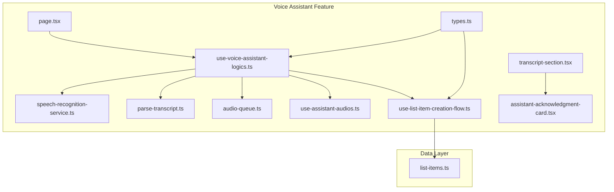
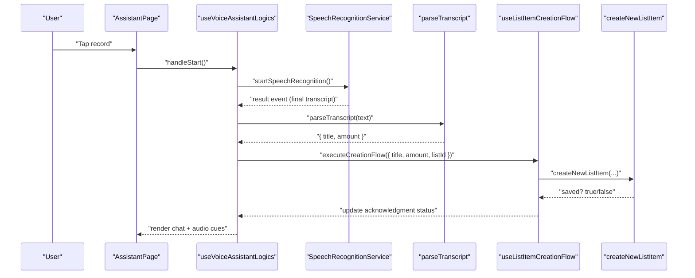
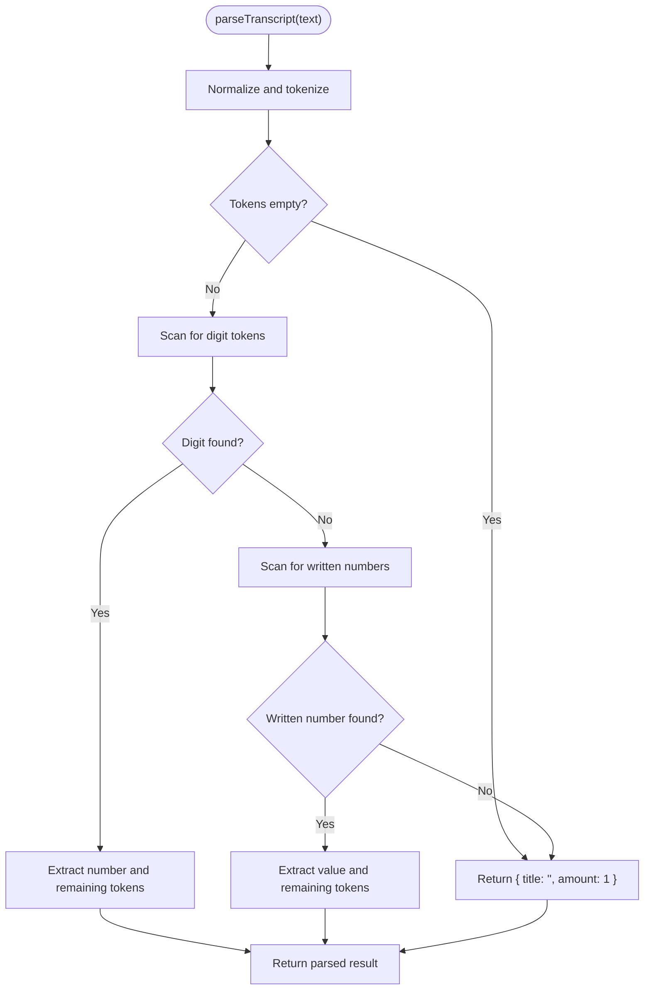
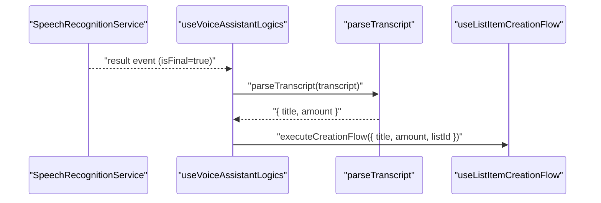
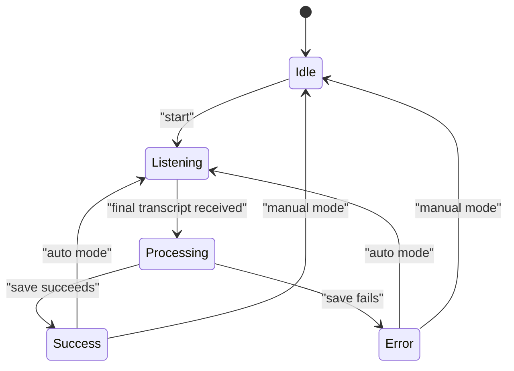
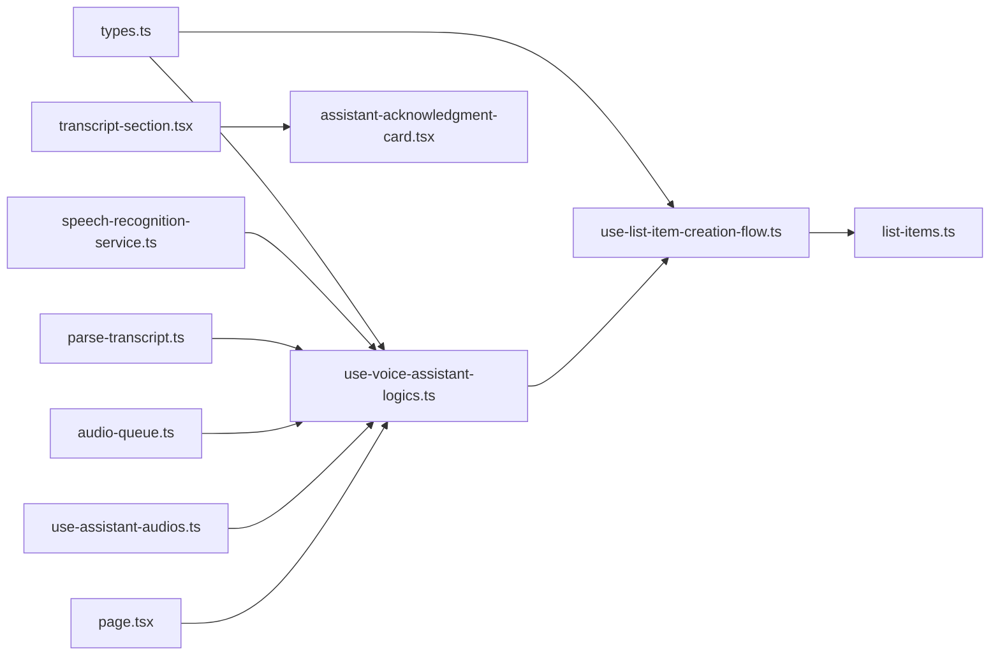

# Natural Language Processing

<cite>
**Referenced Files in This Document**
- [parse-transcript.ts](file://src/features/voice-assistant/utils/parse-transcript.ts)
- [speech-recognition-service.ts](file://src/features/voice-assistant/services/speech-recognition-service.ts)
- [use-voice-assistant-logics.ts](file://src/features/voice-assistant/hooks/use-voice-assistant-logics.ts)
- [use-list-item-creation-flow.ts](file://src/features/voice-assistant/hooks/use-list-item-creation-flow.ts)
- [audio-queue.ts](file://src/features/voice-assistant/services/audio-queue.ts)
- [use-assistant-audios.ts](file://src/features/voice-assistant/hooks/use-assistant-audios.ts)
- [page.tsx](file://src/features/voice-assistant/page.tsx)
- [transcript-section.tsx](file://src/features/voice-assistant/components/transcript-section.tsx)
- [assistant-acknowledgment-card.tsx](file://src/features/voice-assistant/components/assistant-acknowledgment-card.tsx)
- [types.ts](file://src/features/voice-assistant/types.ts)
- [list-items.ts](file://src/data/actions/list-items.ts)
- [parse-transcript.property.test.ts](file://src/features/voice-assistant/utils/__tests__/parse-transcript.property.test.ts)
- [speech-recognition-service.property.test.ts](file://src/features/voice-assistant/__tests__/speech-recognition-service.property.test.ts)
</cite>

## Table of Contents
1. [Introduction](#introduction)
2. [Project Structure](#project-structure)
3. [Core Components](#core-components)
4. [Architecture Overview](#architecture-overview)
5. [Detailed Component Analysis](#detailed-component-analysis)
6. [Dependency Analysis](#dependency-analysis)
7. [Performance Considerations](#performance-considerations)
8. [Troubleshooting Guide](#troubleshooting-guide)
9. [Conclusion](#conclusion)

## Introduction
This document explains the natural language processing capabilities implemented for voice-driven list creation in the application. It covers the transcript parsing algorithm for extracting item titles and quantities from Portuguese speech, the intent recognition pattern for list item creation, and the command extraction logic. It also documents supported voice command patterns, the parsing service implementation, command validation, error handling for unrecognized speech, examples of voice command variations, context-aware processing, multi-step command interpretation, edge cases, and fallback mechanisms.

## Project Structure
The voice assistant feature is organized around a clear separation of concerns:
- Services: Speech recognition and audio playback orchestration
- Hooks: Business logic for voice assistant lifecycle and item creation flow
- Utilities: Transcript parsing and normalization
- Components: UI rendering for chat messages and acknowledgment cards
- Types: Shared TypeScript interfaces for events and messages
- Data Actions: Backend integration for list item persistence

**Diagram sources**
- [speech-recognition-service.ts:1-54](file://src/features/voice-assistant/services/speech-recognition-service.ts#L1-L54)
- [parse-transcript.ts:194-225](file://src/features/voice-assistant/utils/parse-transcript.ts#L194-L225)
- [audio-queue.ts:44-60](file://src/features/voice-assistant/services/audio-queue.ts#L44-L60)
- [use-assistant-audios.ts:3-36](file://src/features/voice-assistant/hooks/use-assistant-audios.ts#L3-L36)
- [use-voice-assistant-logics.ts:19-213](file://src/features/voice-assistant/hooks/use-voice-assistant-logics.ts#L19-L213)
- [use-list-item-creation-flow.ts:22-96](file://src/features/voice-assistant/hooks/use-list-item-creation-flow.ts#L22-L96)
- [page.tsx:9-60](file://src/features/voice-assistant/page.tsx#L9-L60)
- [transcript-section.tsx:10-21](file://src/features/voice-assistant/components/transcript-section.tsx#L10-L21)
- [assistant-acknowledgment-card.tsx:23-94](file://src/features/voice-assistant/components/assistant-acknowledgment-card.tsx#L23-L94)
- [types.ts:1-45](file://src/features/voice-assistant/types.ts#L1-L45)
- [list-items.ts:53-104](file://src/data/actions/list-items.ts#L53-L104)

**Section sources**
- [page.tsx:9-60](file://src/features/voice-assistant/page.tsx#L9-L60)
- [types.ts:1-45](file://src/features/voice-assistant/types.ts#L1-L45)

## Core Components
- Transcript Parser: Converts Portuguese speech into structured item data (title and amount), supporting numeric tokens and written numbers.
- Speech Recognition Service: Manages permissions, starts/stops recognition, extracts final transcripts, and maps errors to user-friendly messages.
- Voice Assistant Logics: Orchestrates the end-to-end flow from speech input to item creation, including UI state updates and audio feedback.
- List Item Creation Flow: Executes the multi-step process of acknowledging, persisting, and confirming item creation.
- Audio Queue and Audios: Ensures sequential, non-overlapping audio playback with fallbacks and animations.
- UI Components: Render chat messages, acknowledgment cards, and dynamic status indicators.

**Section sources**
- [parse-transcript.ts:194-225](file://src/features/voice-assistant/utils/parse-transcript.ts#L194-L225)
- [speech-recognition-service.ts:19-54](file://src/features/voice-assistant/services/speech-recognition-service.ts#L19-L54)
- [use-voice-assistant-logics.ts:19-213](file://src/features/voice-assistant/hooks/use-voice-assistant-logics.ts#L19-L213)
- [use-list-item-creation-flow.ts:22-96](file://src/features/voice-assistant/hooks/use-list-item-creation-flow.ts#L22-L96)
- [audio-queue.ts:44-60](file://src/features/voice-assistant/services/audio-queue.ts#L44-L60)
- [use-assistant-audios.ts:3-36](file://src/features/voice-assistant/hooks/use-assistant-audios.ts#L3-L36)
- [transcript-section.tsx:10-21](file://src/features/voice-assistant/components/transcript-section.tsx#L10-L21)
- [assistant-acknowledgment-card.tsx:23-94](file://src/features/voice-assistant/components/assistant-acknowledgment-card.tsx#L23-L94)

## Architecture Overview
The voice assistant follows a reactive, event-driven architecture:
- Speech events trigger transcript extraction and parsing
- Parsing yields a normalized item command (title, amount)
- The creation flow acknowledges, persists, and confirms the action
- Audio feedback and UI updates communicate status to the user

**Diagram sources**
- [use-voice-assistant-logics.ts:78-99](file://src/features/voice-assistant/hooks/use-voice-assistant-logics.ts#L78-L99)
- [speech-recognition-service.ts:35-38](file://src/features/voice-assistant/services/speech-recognition-service.ts#L35-L38)
- [parse-transcript.ts:194-225](file://src/features/voice-assistant/utils/parse-transcript.ts#L194-L225)
- [use-list-item-creation-flow.ts:27-92](file://src/features/voice-assistant/hooks/use-list-item-creation-flow.ts#L27-L92)
- [list-items.ts:53-104](file://src/data/actions/list-items.ts#L53-L104)

## Detailed Component Analysis

### Transcript Parsing Algorithm
The parser converts Portuguese speech into a structured item command:
- Tokenization: Lowercase, trim, split by whitespace, filter empty tokens
- Numeric detection: Pure digits are extracted first
- Written number detection: Greedy consumption of Portuguese numeric sequences (units, teens, tens, hundreds, thousands)
- Default behavior: If no number is found, amount defaults to 1; the remainder becomes the title

**Diagram sources**
- [parse-transcript.ts:194-225](file://src/features/voice-assistant/utils/parse-transcript.ts#L194-L225)
- [parse-transcript.ts:100-176](file://src/features/voice-assistant/utils/parse-transcript.ts#L100-L176)

Key behaviors validated by tests:
- Supports numeric and written numbers in various positions
- Handles compound numbers (e.g., tens + units, hundreds + tens + units)
- Defaults to amount 1 when no number is present

**Section sources**
- [parse-transcript.ts:194-225](file://src/features/voice-assistant/utils/parse-transcript.ts#L194-L225)
- [parse-transcript.property.test.ts:3-22](file://src/features/voice-assistant/utils/__tests__/parse-transcript.property.test.ts#L3-L22)

### Intent Recognition Pattern
Intent is recognized as "add list item" when:
- Final transcript is available (interim results ignored)
- Parsed title is non-empty
- Amount is valid (number or default 1)

The system stops recognition upon receiving a final transcript, ensuring deterministic command boundaries.

**Section sources**
- [speech-recognition-service.ts:35-38](file://src/features/voice-assistant/services/speech-recognition-service.ts#L35-L38)
- [use-voice-assistant-logics.ts:78-99](file://src/features/voice-assistant/hooks/use-voice-assistant-logics.ts#L78-L99)

### Command Extraction Logic
Command extraction combines:
- Speech-to-text final result
- Parsing into { title, amount }
- Validation and normalization
- Immediate UI feedback and persistence

**Diagram sources**
- [speech-recognition-service.ts:35-38](file://src/features/voice-assistant/services/speech-recognition-service.ts#L35-L38)
- [use-voice-assistant-logics.ts:84-94](file://src/features/voice-assistant/hooks/use-voice-assistant-logics.ts#L84-L94)
- [parse-transcript.ts:194-225](file://src/features/voice-assistant/utils/parse-transcript.ts#L194-L225)
- [use-list-item-creation-flow.ts:27-92](file://src/features/voice-assistant/hooks/use-list-item-creation-flow.ts#L27-L92)

### Supported Voice Commands
Supported patterns for adding items to a list:
- Numeric quantity followed by item: "10 arroz"
- Quantity embedded in the middle: "arroz dois"
- Written quantity: "vinte e um pão de forma"
- Quantity at the end: "manteiga cinco"
- Item-only (defaults to amount 1): "arroz"

Edge cases handled:
- Empty input defaults to amount 1
- Compound written numbers (e.g., "duzentos e cinquenta")

Validation and tests confirm these patterns.

**Section sources**
- [parse-transcript.property.test.ts:3-22](file://src/features/voice-assistant/utils/__tests__/parse-transcript.property.test.ts#L3-L22)
- [parse-transcript.ts:194-225](file://src/features/voice-assistant/utils/parse-transcript.ts#L194-L225)

### Parsing Service Implementation
Responsibilities:
- Permission request and enforcement
- Start/stop recognition with default options (Portuguese locale, interim results, continuous)
- Extract final transcript from result events
- Map platform-specific error codes to user-friendly messages

Integration points:
- Event listeners for start/end/result/error
- Stop recognition before parsing to avoid overlapping commands

**Section sources**
- [speech-recognition-service.ts:19-54](file://src/features/voice-assistant/services/speech-recognition-service.ts#L19-L54)
- [use-voice-assistant-logics.ts:69-111](file://src/features/voice-assistant/hooks/use-voice-assistant-logics.ts#L69-L111)

### Command Validation and Error Handling
Validation:
- Non-empty title required before proceeding
- Amount must be a valid number (parsed or defaulted)

Error handling:
- Unmapped errors fall back to a generic message
- Toast notifications surface errors to the user
- Recognition state resets on error and stop

Fallback mechanisms:
- Default amount 1 when no number is detected
- Immediate stop on final transcript to prevent misinterpretation
- Graceful audio queue with timeouts and error logging

**Section sources**
- [use-voice-assistant-logics.ts:84-111](file://src/features/voice-assistant/hooks/use-voice-assistant-logics.ts#L84-L111)
- [speech-recognition-service.ts:40-53](file://src/features/voice-assistant/services/speech-recognition-service.ts#L40-L53)
- [audio-queue.ts:8-34](file://src/features/voice-assistant/services/audio-queue.ts#L8-L34)

### Context-Aware Processing and Multi-Step Interpretation
Context awareness:
- Initial greeting and follow-up prompts guide the user
- Direct mode auto-restarts recognition after successful completion
- Chat history maintains context for acknowledgment cards

Multi-step interpretation:
1. Acknowledge receipt and begin processing
2. Persist item via data actions
3. Update acknowledgment status to success or error
4. Provide follow-up prompt for additional items

**Diagram sources**
- [use-voice-assistant-logics.ts:141-193](file://src/features/voice-assistant/hooks/use-voice-assistant-logics.ts#L141-L193)
- [use-list-item-creation-flow.ts:27-92](file://src/features/voice-assistant/hooks/use-list-item-creation-flow.ts#L27-L92)

### UI Integration and Feedback
- Chat rendering differentiates user messages, assistant messages, and acknowledgment cards
- Acknowledgment cards animate status transitions (processing, success, error)
- Audio queue ensures sequential, non-overlapping audio feedback

**Section sources**
- [transcript-section.tsx:10-21](file://src/features/voice-assistant/components/transcript-section.tsx#L10-L21)
- [assistant-acknowledgment-card.tsx:23-94](file://src/features/voice-assistant/components/assistant-acknowledgment-card.tsx#L23-L94)
- [audio-queue.ts:44-60](file://src/features/voice-assistant/services/audio-queue.ts#L44-L60)

## Dependency Analysis
The voice assistant feature exhibits low coupling and high cohesion:
- Hooks depend on services and utilities but remain UI-agnostic
- Data actions encapsulate persistence logic
- Types define shared contracts across modules

**Diagram sources**
- [types.ts:1-45](file://src/features/voice-assistant/types.ts#L1-L45)
- [use-voice-assistant-logics.ts:19-213](file://src/features/voice-assistant/hooks/use-voice-assistant-logics.ts#L19-L213)
- [speech-recognition-service.ts:19-54](file://src/features/voice-assistant/services/speech-recognition-service.ts#L19-L54)
- [parse-transcript.ts:194-225](file://src/features/voice-assistant/utils/parse-transcript.ts#L194-L225)
- [use-list-item-creation-flow.ts:22-96](file://src/features/voice-assistant/hooks/use-list-item-creation-flow.ts#L22-L96)
- [list-items.ts:53-104](file://src/data/actions/list-items.ts#L53-L104)
- [audio-queue.ts:44-60](file://src/features/voice-assistant/services/audio-queue.ts#L44-L60)
- [use-assistant-audios.ts:3-36](file://src/features/voice-assistant/hooks/use-assistant-audios.ts#L3-L36)
- [page.tsx:9-60](file://src/features/voice-assistant/page.tsx#L9-L60)
- [transcript-section.tsx:10-21](file://src/features/voice-assistant/components/transcript-section.tsx#L10-L21)
- [assistant-acknowledgment-card.tsx:23-94](file://src/features/voice-assistant/components/assistant-acknowledgment-card.tsx#L23-L94)

**Section sources**
- [use-voice-assistant-logics.ts:19-213](file://src/features/voice-assistant/hooks/use-voice-assistant-logics.ts#L19-L213)
- [use-list-item-creation-flow.ts:22-96](file://src/features/voice-assistant/hooks/use-list-item-creation-flow.ts#L22-L96)
- [list-items.ts:53-104](file://src/data/actions/list-items.ts#L53-L104)

## Performance Considerations
- Event-driven parsing prevents unnecessary computations until final results arrive
- Audio queue defers playback until UI state changes render, reducing jank
- Fallback timeouts ensure audio completion even if status callbacks are missed
- Greedy numeric parsing minimizes backtracking by scanning tokens once per position

[No sources needed since this section provides general guidance]

## Troubleshooting Guide
Common issues and resolutions:
- Microphone permission denied: Request permission again; UI displays a warning and blocks further attempts until granted
- No speech detected: Prompt user to speak louder or closer to the device; error message suggests retry
- Network failure during recognition: Inform user and suggest retrying later
- Unrecognized speech patterns: Parser defaults to amount 1; encourage clearer phrasing (e.g., "10 arroz" or "vinte e um pão de forma")
- Overlapping audio: Audio queue ensures sequential playback; check for repeated triggers causing queue buildup

**Section sources**
- [speech-recognition-service.ts:10-17](file://src/features/voice-assistant/services/speech-recognition-service.ts#L10-L17)
- [speech-recognition-service.ts:40-53](file://src/features/voice-assistant/services/speech-recognition-service.ts#L40-L53)
- [use-voice-assistant-logics.ts:113-139](file://src/features/voice-assistant/hooks/use-voice-assistant-logics.ts#L113-L139)
- [audio-queue.ts:8-34](file://src/features/voice-assistant/services/audio-queue.ts#L8-L34)

## Conclusion
The voice assistant feature delivers robust, context-aware natural language processing for list item creation. The transcript parser handles numeric and written quantities in Portuguese, while the speech recognition service and UI components provide a seamless, feedback-rich experience. The multi-step creation flow, combined with audio cues and acknowledgment cards, ensures clarity and reliability. Edge cases are addressed through default behaviors, strict validation, and resilient error handling.