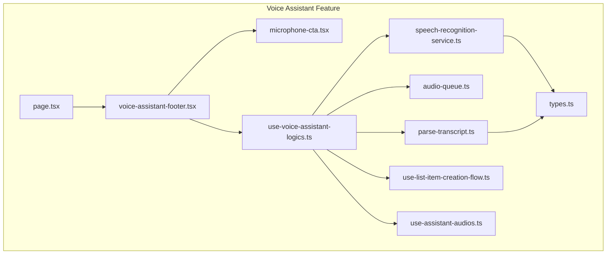
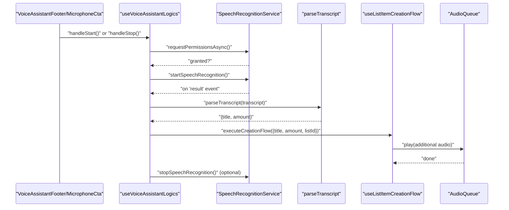
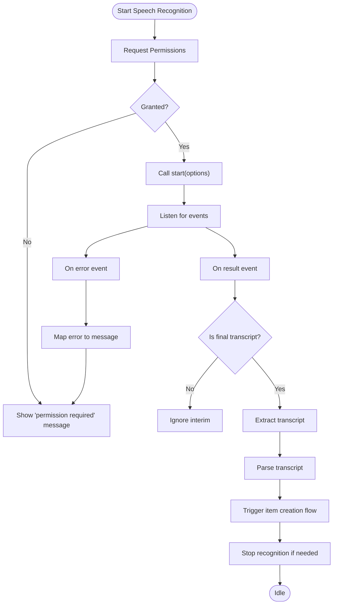
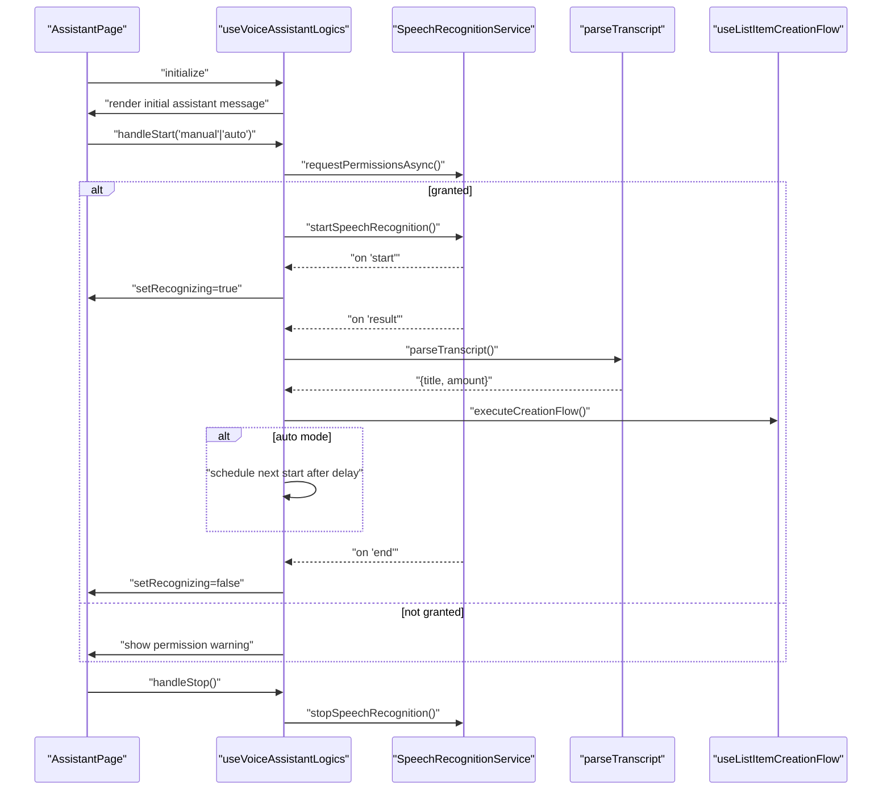
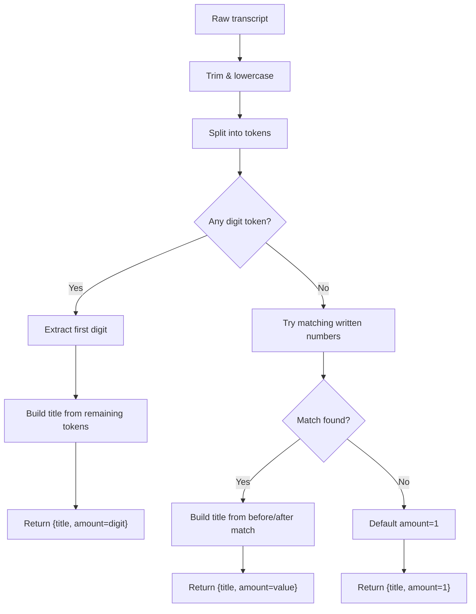
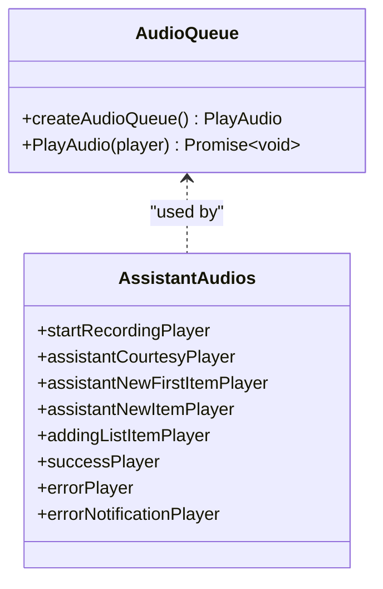
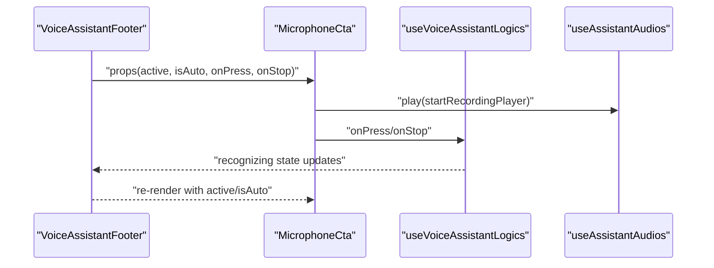
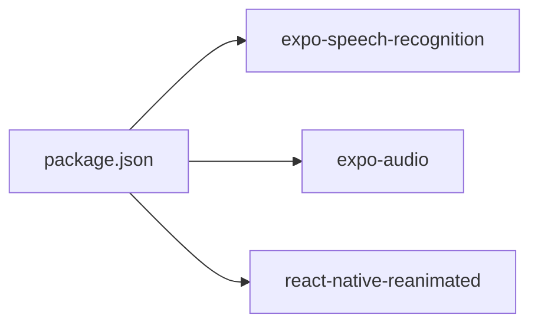
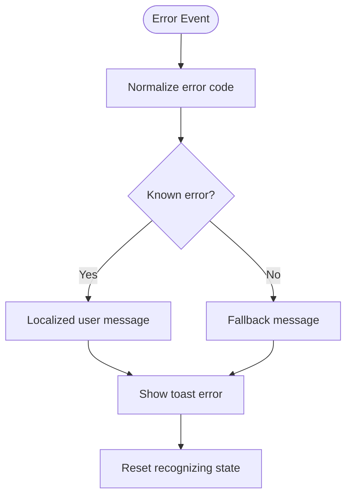

# Speech Recognition Integration

<cite>
**Referenced Files in This Document**
- [speech-recognition-service.ts](file://src/features/voice-assistant/services/speech-recognition-service.ts)
- [use-voice-assistant-logics.ts](file://src/features/voice-assistant/hooks/use-voice-assistant-logics.ts)
- [microphone-cta.tsx](file://src/features/voice-assistant/components/microphone-cta.tsx)
- [voice-assistant-footer.tsx](file://src/features/voice-assistant/components/voice-assistant-footer.tsx)
- [page.tsx](file://src/features/voice-assistant/page.tsx)
- [types.ts](file://src/features/voice-assistant/types.ts)
- [audio-queue.ts](file://src/features/voice-assistant/services/audio-queue.ts)
- [parse-transcript.ts](file://src/features/voice-assistant/utils/parse-transcript.ts)
- [use-assistant-audios.ts](file://src/features/voice-assistant/hooks/use-assistant-audios.ts)
- [use-list-item-creation-flow.ts](file://src/features/voice-assistant/hooks/use-list-item-creation-flow.ts)
- [speech-recognition-service.property.test.ts](file://src/features/voice-assistant/__tests__/speech-recognition-service.property.test.ts)
- [parse-transcript.property.test.ts](file://src/features/voice-assistant/utils/__tests__/parse-transcript.property.test.ts)
- [package.json](file://package.json)
</cite>

## Table of Contents
1. [Introduction](#introduction)
2. [Project Structure](#project-structure)
3. [Core Components](#core-components)
4. [Architecture Overview](#architecture-overview)
5. [Detailed Component Analysis](#detailed-component-analysis)
6. [Dependency Analysis](#dependency-analysis)
7. [Performance Considerations](#performance-considerations)
8. [Troubleshooting Guide](#troubleshooting-guide)
9. [Conclusion](#conclusion)

## Introduction
This document explains the speech recognition integration used by the voice assistant feature. It covers the Expo Speech Recognition API implementation, microphone activation and deactivation logic, real-time audio processing, permission handling, platform-specific considerations, and how speech data flows into the natural language processing pipeline to drive list item creation. It also documents continuous listening modes, error handling for microphone access failures, and integration with the main voice assistant logic.

## Project Structure
The speech recognition feature is organized under the voice assistant feature module. Key areas:
- Services: speech recognition wrapper and audio queue
- Hooks: orchestration of speech events, permissions, and UI state
- Components: microphone CTA, footer controls, and chat rendering
- Utilities: transcript parsing for item titles and quantities
- Types: shared event and message types
- Tests: property-based tests for service and parser behavior

**Diagram sources**
- [page.tsx:1-60](file://src/features/voice-assistant/page.tsx#L1-L60)
- [voice-assistant-footer.tsx:1-75](file://src/features/voice-assistant/components/voice-assistant-footer.tsx#L1-L75)
- [microphone-cta.tsx:1-97](file://src/features/voice-assistant/components/microphone-cta.tsx#L1-L97)
- [use-voice-assistant-logics.ts:1-213](file://src/features/voice-assistant/hooks/use-voice-assistant-logics.ts#L1-L213)
- [speech-recognition-service.ts:1-54](file://src/features/voice-assistant/services/speech-recognition-service.ts#L1-L54)
- [audio-queue.ts:1-60](file://src/features/voice-assistant/services/audio-queue.ts#L1-L60)
- [parse-transcript.ts:1-225](file://src/features/voice-assistant/utils/parse-transcript.ts#L1-L225)
- [use-assistant-audios.ts:1-36](file://src/features/voice-assistant/hooks/use-assistant-audios.ts#L1-L36)
- [use-list-item-creation-flow.ts:1-96](file://src/features/voice-assistant/hooks/use-list-item-creation-flow.ts#L1-L96)
- [types.ts:1-45](file://src/features/voice-assistant/types.ts#L1-L45)

**Section sources**
- [page.tsx:1-60](file://src/features/voice-assistant/page.tsx#L1-L60)
- [voice-assistant-footer.tsx:1-75](file://src/features/voice-assistant/components/voice-assistant-footer.tsx#L1-L75)
- [microphone-cta.tsx:1-97](file://src/features/voice-assistant/components/microphone-cta.tsx#L1-L97)
- [use-voice-assistant-logics.ts:1-213](file://src/features/voice-assistant/hooks/use-voice-assistant-logics.ts#L1-L213)
- [speech-recognition-service.ts:1-54](file://src/features/voice-assistant/services/speech-recognition-service.ts#L1-L54)
- [audio-queue.ts:1-60](file://src/features/voice-assistant/services/audio-queue.ts#L1-L60)
- [parse-transcript.ts:1-225](file://src/features/voice-assistant/utils/parse-transcript.ts#L1-L225)
- [use-assistant-audios.ts:1-36](file://src/features/voice-assistant/hooks/use-assistant-audios.ts#L1-L36)
- [use-list-item-creation-flow.ts:1-96](file://src/features/voice-assistant/hooks/use-list-item-creation-flow.ts#L1-L96)
- [types.ts:1-45](file://src/features/voice-assistant/types.ts#L1-L45)

## Core Components
- Speech Recognition Service: wraps Expo Speech Recognition API with default options, permission requests, start/stop control, transcript extraction, and error mapping.
- Voice Assistant Logics Hook: manages UI state, listens to speech recognition events, orchestrates item creation flow, and handles continuous/manual modes.
- Transcript Parser: converts Portuguese speech transcripts into structured item data (title and amount).
- Audio Queue: serializes audio playback to avoid overlaps and ensure UI feedback timing.
- Assistant Audios Hook: provides audio players for assistant feedback and actions.
- UI Components: microphone call-to-action with animations and footer controls for manual/auto modes.

Key responsibilities:
- Initialize and stop speech recognition safely
- Extract final transcripts and trigger item creation
- Manage continuous vs manual listening modes
- Provide robust error handling and user feedback
- Integrate with the list item creation pipeline

**Section sources**
- [speech-recognition-service.ts:1-54](file://src/features/voice-assistant/services/speech-recognition-service.ts#L1-L54)
- [use-voice-assistant-logics.ts:1-213](file://src/features/voice-assistant/hooks/use-voice-assistant-logics.ts#L1-L213)
- [parse-transcript.ts:1-225](file://src/features/voice-assistant/utils/parse-transcript.ts#L1-L225)
- [audio-queue.ts:1-60](file://src/features/voice-assistant/services/audio-queue.ts#L1-L60)
- [use-assistant-audios.ts:1-36](file://src/features/voice-assistant/hooks/use-assistant-audios.ts#L1-L36)
- [microphone-cta.tsx:1-97](file://src/features/voice-assistant/components/microphone-cta.tsx#L1-L97)
- [voice-assistant-footer.tsx:1-75](file://src/features/voice-assistant/components/voice-assistant-footer.tsx#L1-L75)

## Architecture Overview
The system integrates Expo Speech Recognition with React hooks and UI components. Speech events are handled via a dedicated hook that updates state, triggers audio feedback, parses transcripts, and invokes the item creation flow. The audio queue ensures sequential playback of assistant sounds. The UI exposes manual and automatic listening modes.

**Diagram sources**
- [use-voice-assistant-logics.ts:69-111](file://src/features/voice-assistant/hooks/use-voice-assistant-logics.ts#L69-L111)
- [speech-recognition-service.ts:19-33](file://src/features/voice-assistant/services/speech-recognition-service.ts#L19-L33)
- [parse-transcript.ts:194-224](file://src/features/voice-assistant/utils/parse-transcript.ts#L194-L224)
- [use-list-item-creation-flow.ts:27-92](file://src/features/voice-assistant/hooks/use-list-item-creation-flow.ts#L27-L92)
- [audio-queue.ts:44-59](file://src/features/voice-assistant/services/audio-queue.ts#L44-L59)

## Detailed Component Analysis

### Speech Recognition Service
Implements the Expo Speech Recognition API wrapper:
- Default options: Portuguese language, interim results enabled, continuous mode enabled
- Permission request: returns a boolean indicating whether permission was granted
- Start/stop: initiates or halts recognition with merged options
- Transcript extraction: returns only final transcripts
- Error mapping: maps known error codes to localized messages

**Diagram sources**
- [speech-recognition-service.ts:4-38](file://src/features/voice-assistant/services/speech-recognition-service.ts#L4-L38)
- [use-voice-assistant-logics.ts:78-99](file://src/features/voice-assistant/hooks/use-voice-assistant-logics.ts#L78-L99)

**Section sources**
- [speech-recognition-service.ts:1-54](file://src/features/voice-assistant/services/speech-recognition-service.ts#L1-L54)
- [speech-recognition-service.property.test.ts:19-64](file://src/features/voice-assistant/__tests__/speech-recognition-service.property.test.ts#L19-L64)

### Voice Assistant Logics Hook
Manages the end-to-end voice assistant flow:
- Tracks recognition state, error messages, and direct mode (manual/auto)
- Subscribes to speech recognition events: start, end, result, error
- Validates permissions before starting recognition
- Parses transcripts and triggers item creation
- Supports continuous auto-mode with a short delay between runs
- Ensures recognition is stopped on unmount and mode changes

**Diagram sources**
- [use-voice-assistant-logics.ts:54-111](file://src/features/voice-assistant/hooks/use-voice-assistant-logics.ts#L54-L111)
- [use-voice-assistant-logics.ts:141-193](file://src/features/voice-assistant/hooks/use-voice-assistant-logics.ts#L141-L193)
- [page.tsx:12-22](file://src/features/voice-assistant/page.tsx#L12-L22)

**Section sources**
- [use-voice-assistant-logics.ts:1-213](file://src/features/voice-assistant/hooks/use-voice-assistant-logics.ts#L1-L213)
- [page.tsx:1-60](file://src/features/voice-assistant/page.tsx#L1-L60)

### Transcript Parsing Utility
Parses Portuguese speech into structured item data:
- Recognizes numeric words and combinations (e.g., "vinte e um")
- Supports "mil" (thousands) and compound forms with "e"
- Defaults to amount 1 when none is found
- Produces a normalized title by removing the detected amount

**Diagram sources**
- [parse-transcript.ts:194-224](file://src/features/voice-assistant/utils/parse-transcript.ts#L194-L224)

**Section sources**
- [parse-transcript.ts:1-225](file://src/features/voice-assistant/utils/parse-transcript.ts#L1-L225)
- [parse-transcript.property.test.ts:1-22](file://src/features/voice-assistant/utils/__tests__/parse-transcript.property.test.ts#L1-L22)

### Audio Queue and Assistant Audios
- Audio Queue: serializes audio playback, ensuring no overlaps and reliable completion detection
- Assistant Audios: provides audio players for various assistant feedback sounds

**Diagram sources**
- [audio-queue.ts:44-59](file://src/features/voice-assistant/services/audio-queue.ts#L44-L59)
- [use-assistant-audios.ts:3-33](file://src/features/voice-assistant/hooks/use-assistant-audios.ts#L3-L33)

**Section sources**
- [audio-queue.ts:1-60](file://src/features/voice-assistant/services/audio-queue.ts#L1-L60)
- [use-assistant-audios.ts:1-36](file://src/features/voice-assistant/hooks/use-assistant-audios.ts#L1-L36)

### UI Components: Microphone CTA and Footer
- Microphone CTA: animated button that toggles recording state, plays a sound cue, and reflects active/auto states
- Voice Assistant Footer: displays mode selection (manual/auto), status text, and the microphone CTA

**Diagram sources**
- [voice-assistant-footer.tsx:34-71](file://src/features/voice-assistant/components/voice-assistant-footer.tsx#L34-L71)
- [microphone-cta.tsx:24-36](file://src/features/voice-assistant/components/microphone-cta.tsx#L24-L36)
- [use-voice-assistant-logics.ts:141-178](file://src/features/voice-assistant/hooks/use-voice-assistant-logics.ts#L141-L178)

**Section sources**
- [voice-assistant-footer.tsx:1-75](file://src/features/voice-assistant/components/voice-assistant-footer.tsx#L1-L75)
- [microphone-cta.tsx:1-97](file://src/features/voice-assistant/components/microphone-cta.tsx#L1-L97)

## Dependency Analysis
External dependencies relevant to speech recognition:
- expo-speech-recognition: provides the Speech Recognition API and event subscriptions
- expo-audio: provides audio players and playback status listeners
- react-native-reanimated: animates the microphone CTA visuals

**Diagram sources**
- [package.json:60-74](file://package.json#L60-L74)

**Section sources**
- [package.json:1-118](file://package.json#L1-L118)

## Performance Considerations
- Continuous listening: enabled by default to minimize latency between utterances; ensure to stop recognition when not needed to save resources
- Event filtering: only process final transcripts to reduce redundant processing
- Auto mode scheduling: a short delay prevents overlapping sessions and reduces CPU usage
- Audio serialization: the audio queue avoids overlapping sounds and ensures reliable completion callbacks
- Cleanup: recognition is stopped on unmount and mode changes to prevent leaks

[No sources needed since this section provides general guidance]

## Troubleshooting Guide
Common issues and resolutions:
- Microphone permission denied: the hook requests permissions and surfaces a warning; guide the user to grant permission in device settings
- Network errors during recognition: mapped to a user-friendly message; retry after checking connectivity
- No speech detected: surfaced as a transient message; encourage clearer speech or re-prompts
- Unhandled errors: unknown error codes fall back to a generic message; log and report for diagnostics

**Diagram sources**
- [speech-recognition-service.ts:40-53](file://src/features/voice-assistant/services/speech-recognition-service.ts#L40-L53)
- [use-voice-assistant-logics.ts:101-111](file://src/features/voice-assistant/hooks/use-voice-assistant-logics.ts#L101-L111)

**Section sources**
- [speech-recognition-service.ts:10-17](file://src/features/voice-assistant/services/speech-recognition-service.ts#L10-L17)
- [speech-recognition-service.ts:40-53](file://src/features/voice-assistant/services/speech-recognition-service.ts#L40-L53)
- [use-voice-assistant-logics.ts:101-111](file://src/features/voice-assistant/hooks/use-voice-assistant-logics.ts#L101-L111)

## Conclusion
The speech recognition integration leverages Expo Speech Recognition to deliver a responsive voice assistant. It supports continuous listening with robust permission handling, clear error messaging, and seamless integration with the item creation pipeline. The UI provides intuitive controls for manual and automatic modes, while audio feedback and animations improve user experience. The modular design keeps speech logic cohesive and testable, enabling future enhancements such as multi-language support or extended NLP parsing.