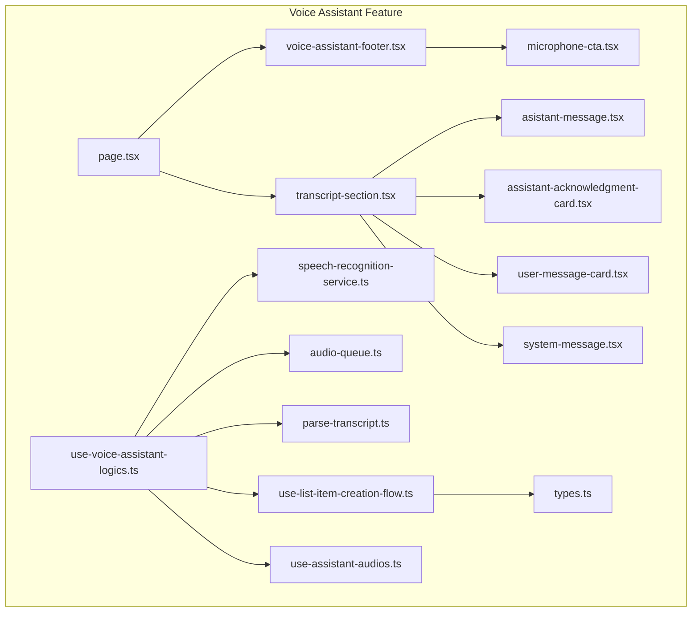
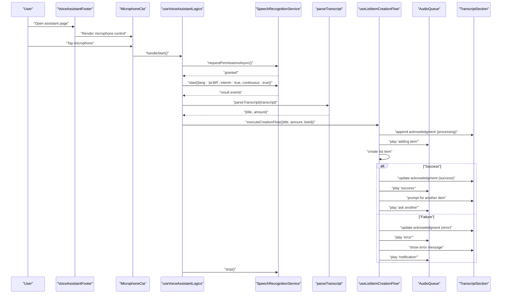
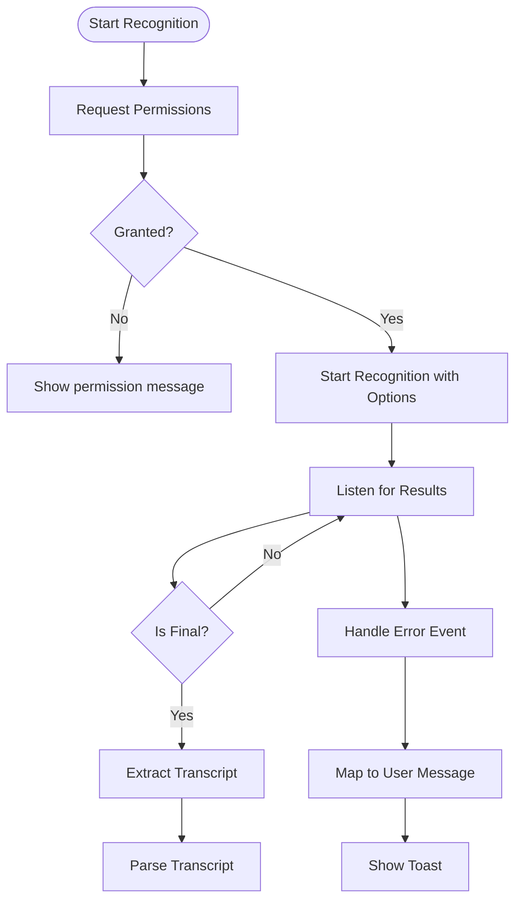
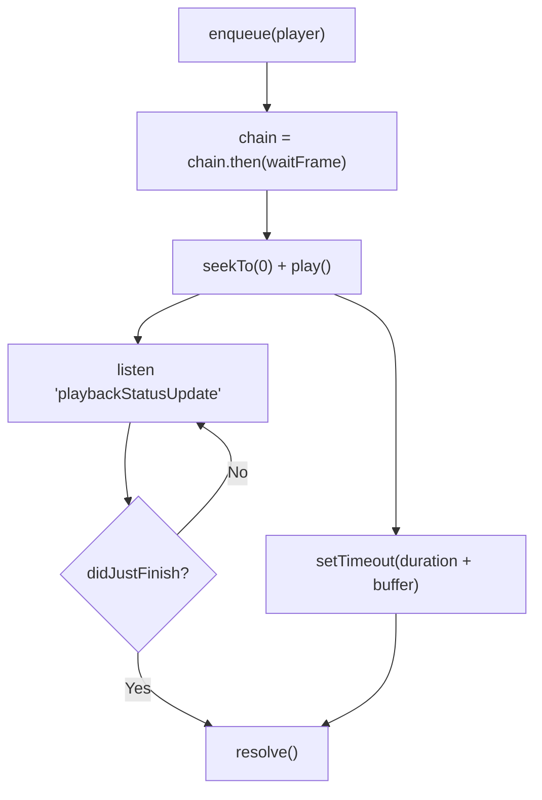
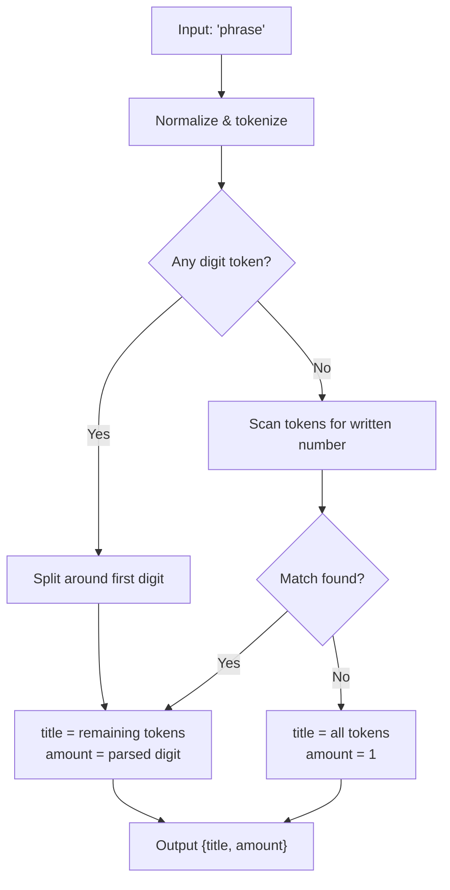
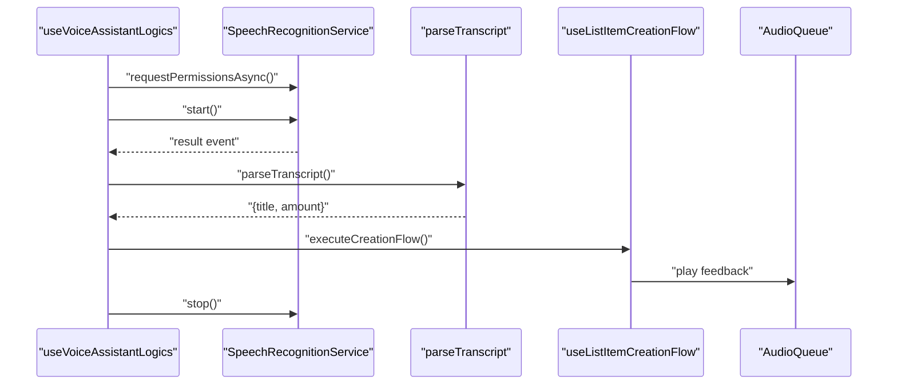
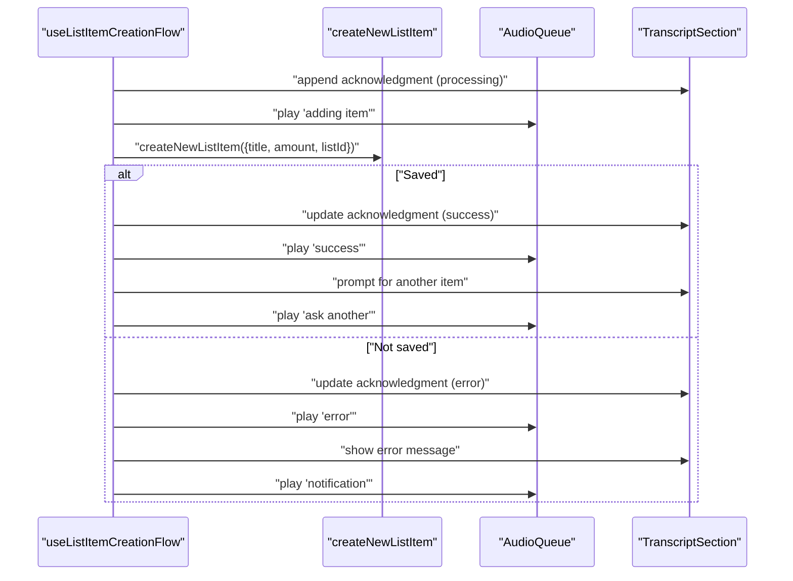
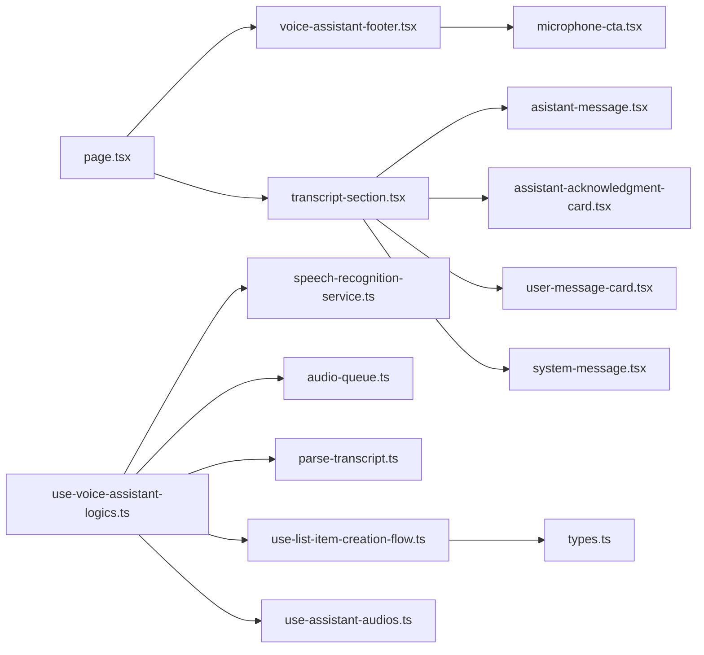

# Voice Assistant System

<cite>
**Referenced Files in This Document**
- [page.tsx](file://src/features/voice-assistant/page.tsx)
- [speech-recognition-service.ts](file://src/features/voice-assistant/services/speech-recognition-service.ts)
- [audio-queue.ts](file://src/features/voice-assistant/services/audio-queue.ts)
- [parse-transcript.ts](file://src/features/voice-assistant/utils/parse-transcript.ts)
- [use-voice-assistant-logics.ts](file://src/features/voice-assistant/hooks/use-voice-assistant-logics.ts)
- [use-assistant-audios.ts](file://src/features/voice-assistant/hooks/use-assistant-audios.ts)
- [use-list-item-creation-flow.ts](file://src/features/voice-assistant/hooks/use-list-item-creation-flow.ts)
- [microphone-cta.tsx](file://src/features/voice-assistant/components/microphone-cta.tsx)
- [voice-assistant-footer.tsx](file://src/features/voice-assistant/components/voice-assistant-footer.tsx)
- [transcript-section.tsx](file://src/features/voice-assistant/components/transcript-section.tsx)
- [assistant-acknowledgment-card.tsx](file://src/features/voice-assistant/components/assistant-acknowledgment-card.tsx)
- [asistant-message.tsx](file://src/features/voice-assistant/components/asistant-message.tsx)
- [user-message-card.tsx](file://src/features/voice-assistant/components/user-message-card.tsx)
- [system-message.tsx](file://src/features/voice-assistant/components/system-message.tsx)
- [types.ts](file://src/features/voice-assistant/types.ts)
</cite>

## Table of Contents
1. [Introduction](#introduction)
2. [Project Structure](#project-structure)
3. [Core Components](#core-components)
4. [Architecture Overview](#architecture-overview)
5. [Detailed Component Analysis](#detailed-component-analysis)
6. [Dependency Analysis](#dependency-analysis)
7. [Performance Considerations](#performance-considerations)
8. [Troubleshooting Guide](#troubleshooting-guide)
9. [Conclusion](#conclusion)
10. [Appendices](#appendices)

## Introduction
This document describes the PowerLists voice assistant system, focusing on voice command processing via the Expo Speech Recognition API, natural language understanding for list item creation, conversation flow management, audio feedback, and speech synthesis integration. It explains how microphone activation, audio queue management, and real-time transcript processing work together to enable hands-free list creation and item management. The guide also covers supported voice commands, error handling for speech recognition failures, and accessibility considerations for voice-enabled features.

## Project Structure
The voice assistant feature is organized under a dedicated namespace with clear separation of concerns:
- Page and layout orchestration
- Services for speech recognition and audio playback
- Utilities for transcript parsing
- Hooks for business logic and audio resources
- UI components for microphone control, transcripts, and feedback

**Diagram sources**
- [page.tsx:1-60](file://src/features/voice-assistant/page.tsx#L1-L60)
- [voice-assistant-footer.tsx:1-75](file://src/features/voice-assistant/components/voice-assistant-footer.tsx#L1-L75)
- [microphone-cta.tsx:1-97](file://src/features/voice-assistant/components/microphone-cta.tsx#L1-L97)
- [transcript-section.tsx:1-21](file://src/features/voice-assistant/components/transcript-section.tsx#L1-L21)
- [assistant-acknowledgment-card.tsx:1-94](file://src/features/voice-assistant/components/assistant-acknowledgment-card.tsx#L1-L94)
- [asistant-message.tsx:1-19](file://src/features/voice-assistant/components/asistant-message.tsx#L1-L19)
- [user-message-card.tsx:1-12](file://src/features/voice-assistant/components/user-message-card.tsx#L1-L12)
- [system-message.tsx:1-11](file://src/features/voice-assistant/components/system-message.tsx#L1-L11)
- [speech-recognition-service.ts:1-54](file://src/features/voice-assistant/services/speech-recognition-service.ts#L1-L54)
- [audio-queue.ts:1-60](file://src/features/voice-assistant/services/audio-queue.ts#L1-L60)
- [parse-transcript.ts:1-225](file://src/features/voice-assistant/utils/parse-transcript.ts#L1-L225)
- [use-voice-assistant-logics.ts:1-213](file://src/features/voice-assistant/hooks/use-voice-assistant-logics.ts#L1-L213)
- [use-assistant-audios.ts:1-36](file://src/features/voice-assistant/hooks/use-assistant-audios.ts#L1-L36)
- [use-list-item-creation-flow.ts:1-96](file://src/features/voice-assistant/hooks/use-list-item-creation-flow.ts#L1-L96)
- [types.ts:1-45](file://src/features/voice-assistant/types.ts#L1-L45)

**Section sources**
- [page.tsx:1-60](file://src/features/voice-assistant/page.tsx#L1-L60)
- [types.ts:1-45](file://src/features/voice-assistant/types.ts#L1-L45)

## Core Components
- Speech Recognition Service: Wraps Expo Speech Recognition API with permission requests, start/stop controls, interim and continuous recognition, and error-to-user-message mapping.
- Audio Queue: Ensures sequential, non-overlapping audio playback with UI rendering guarantees and fallback timing.
- Transcript Parser: Extracts item titles and quantities from Portuguese voice input, supporting numeric and written numbers.
- Voice Assistant Logics Hook: Orchestrates microphone lifecycle, real-time transcript processing, intent parsing, and action execution; manages conversation state and audio feedback.
- List Item Creation Flow Hook: Implements the end-to-end flow for creating list items, updating acknowledgment cards, and playing appropriate audio cues.
- Audio Resources Hook: Provides reusable audio players for assistant feedback and system notifications.
- UI Components: Microphone call-to-action with animations, footer controls, transcript rendering, and acknowledgment cards with status indicators.

**Section sources**
- [speech-recognition-service.ts:1-54](file://src/features/voice-assistant/services/speech-recognition-service.ts#L1-L54)
- [audio-queue.ts:1-60](file://src/features/voice-assistant/services/audio-queue.ts#L1-L60)
- [parse-transcript.ts:1-225](file://src/features/voice-assistant/utils/parse-transcript.ts#L1-L225)
- [use-voice-assistant-logics.ts:1-213](file://src/features/voice-assistant/hooks/use-voice-assistant-logics.ts#L1-L213)
- [use-list-item-creation-flow.ts:1-96](file://src/features/voice-assistant/hooks/use-list-item-creation-flow.ts#L1-L96)
- [use-assistant-audios.ts:1-36](file://src/features/voice-assistant/hooks/use-assistant-audios.ts#L1-L36)
- [microphone-cta.tsx:1-97](file://src/features/voice-assistant/components/microphone-cta.tsx#L1-L97)
- [voice-assistant-footer.tsx:1-75](file://src/features/voice-assistant/components/voice-assistant-footer.tsx#L1-L75)
- [transcript-section.tsx:1-21](file://src/features/voice-assistant/components/transcript-section.tsx#L1-L21)
- [assistant-acknowledgment-card.tsx:1-94](file://src/features/voice-assistant/components/assistant-acknowledgment-card.tsx#L1-L94)

## Architecture Overview
The voice assistant integrates three primary subsystems:
- Speech Input Pipeline: Permission request → start recognition → interim/continuous results → final transcript extraction → intent parsing → action execution.
- Conversation Management: Maintains a chat-like history with distinct message types and dynamic acknowledgment cards reflecting item creation status.
- Audio Feedback Pipeline: Queued audio playback synchronized with UI updates and user actions.

**Diagram sources**
- [use-voice-assistant-logics.ts:69-111](file://src/features/voice-assistant/hooks/use-voice-assistant-logics.ts#L69-L111)
- [speech-recognition-service.ts:19-33](file://src/features/voice-assistant/services/speech-recognition-service.ts#L19-L33)
- [parse-transcript.ts:194-224](file://src/features/voice-assistant/utils/parse-transcript.ts#L194-L224)
- [use-list-item-creation-flow.ts:27-92](file://src/features/voice-assistant/hooks/use-list-item-creation-flow.ts#L27-L92)
- [audio-queue.ts:44-59](file://src/features/voice-assistant/services/audio-queue.ts#L44-L59)
- [transcript-section.tsx:10-20](file://src/features/voice-assistant/components/transcript-section.tsx#L10-L20)

## Detailed Component Analysis

### Speech Recognition Service
- Responsibilities:
  - Request permissions for speech recognition.
  - Start/stop speech recognition with configured options (language, interim results, continuous).
  - Extract final transcripts from result events.
  - Map error events to user-friendly messages.
- Key behaviors:
  - Default configuration sets Brazilian Portuguese language, interim results enabled, and continuous recognition.
  - Error mapping supports common speech recognition errors and falls back to the event message if unknown.

**Diagram sources**
- [speech-recognition-service.ts:19-53](file://src/features/voice-assistant/services/speech-recognition-service.ts#L19-L53)
- [use-voice-assistant-logics.ts:69-111](file://src/features/voice-assistant/hooks/use-voice-assistant-logics.ts#L69-L111)

**Section sources**
- [speech-recognition-service.ts:1-54](file://src/features/voice-assistant/services/speech-recognition-service.ts#L1-L54)
- [use-voice-assistant-logics.ts:69-111](file://src/features/voice-assistant/hooks/use-voice-assistant-logics.ts#L69-L111)

### Audio Queue Management
- Responsibilities:
  - Ensure sequential audio playback without overlaps.
  - Wait for audio completion using playback status listeners.
  - Provide a fallback mechanism based on duration plus buffer.
  - Add a small animation frame delay to allow UI state changes to render before playback.
- Behavior:
  - Chains each play call after the previous completes.
  - Logs and tracks consecutive failures to avoid silent cascading errors.

**Diagram sources**
- [audio-queue.ts:8-34](file://src/features/voice-assistant/services/audio-queue.ts#L8-L34)

**Section sources**
- [audio-queue.ts:1-60](file://src/features/voice-assistant/services/audio-queue.ts#L1-L60)

### Transcript Parsing and Intent Recognition
- Purpose:
  - Convert spoken Portuguese phrases into structured intent with an item title and quantity.
- Algorithm highlights:
  - Tokenization and normalization.
  - Numeric token detection (digits).
  - Written-number matching with support for compound forms (e.g., hundreds, tens, teens, and "and" connectors).
  - Default quantity of 1 when none is found.
- Supported patterns:
  - Pure digit quantity followed by item title.
  - Written quantity anywhere in the phrase.
  - Quantity at the beginning, middle, or end of the phrase.
  - Defaults to 1 when no quantity is present.

**Diagram sources**
- [parse-transcript.ts:194-224](file://src/features/voice-assistant/utils/parse-transcript.ts#L194-L224)
- [parse-transcript.ts:100-176](file://src/features/voice-assistant/utils/parse-transcript.ts#L100-L176)

**Section sources**
- [parse-transcript.ts:1-225](file://src/features/voice-assistant/utils/parse-transcript.ts#L1-L225)

### Voice Assistant Logics Hook
- Responsibilities:
  - Manage recognition lifecycle (start/stop), error state, and direct/manual mode.
  - Initialize conversation with a welcome message and play greeting audio.
  - Subscribe to speech recognition events and process transcripts.
  - Trigger item creation flow and auto-restart in automatic mode.
  - Provide safe cleanup on unmount.
- Key integrations:
  - Uses the speech recognition service for permissions and events.
  - Uses the audio queue for synchronized audio playback.
  - Delegates item creation to the creation flow hook.
  - Renders acknowledgment cards and user/assistant messages.

**Diagram sources**
- [use-voice-assistant-logics.ts:69-111](file://src/features/voice-assistant/hooks/use-voice-assistant-logics.ts#L69-L111)
- [use-list-item-creation-flow.ts:27-92](file://src/features/voice-assistant/hooks/use-list-item-creation-flow.ts#L27-L92)
- [audio-queue.ts:44-59](file://src/features/voice-assistant/services/audio-queue.ts#L44-L59)

**Section sources**
- [use-voice-assistant-logics.ts:1-213](file://src/features/voice-assistant/hooks/use-voice-assistant-logics.ts#L1-L213)

### List Item Creation Flow Hook
- Responsibilities:
  - Append an acknowledgment card with processing status and play a "adding item" audio cue.
  - Attempt to create the list item via backend action.
  - Update acknowledgment status to success or error and play appropriate audio.
  - Prompt the user to add another item upon success.
- Data model:
  - Acknowledgment message includes a unique ID, item metadata, and status.
  - Status transitions occur atomically by matching the acknowledgment ID.

**Diagram sources**
- [use-list-item-creation-flow.ts:27-92](file://src/features/voice-assistant/hooks/use-list-item-creation-flow.ts#L27-L92)

**Section sources**
- [use-list-item-creation-flow.ts:1-96](file://src/features/voice-assistant/hooks/use-list-item-creation-flow.ts#L1-L96)

### Audio Resources Hook
- Responsibilities:
  - Provide reusable audio players for assistant feedback and system notifications.
  - Players include greeting, first/new item prompts, adding item, success, error, and error notification sounds.
- Integration:
  - Used by the voice assistant logics and creation flow to deliver synchronous audio feedback aligned with UI updates.

**Section sources**
- [use-assistant-audios.ts:1-36](file://src/features/voice-assistant/hooks/use-assistant-audios.ts#L1-L36)

### UI Components
- Microphone Call-to-Action:
  - Animated ring effect when recording or in automatic mode.
  - Accessibility labels for screen readers.
  - Plays a click sound on activation.
- Voice Assistant Footer:
  - Mode selector (manual/auto).
  - Dynamic footer text indicating current state.
  - Microphone control centered prominently.
- Transcript Rendering:
  - Assistant messages, user messages, and acknowledgment cards.
  - Animated status icons and spinners for processing states.
- System Messages:
  - Error and warning bubbles for system-level notifications.

**Section sources**
- [microphone-cta.tsx:1-97](file://src/features/voice-assistant/components/microphone-cta.tsx#L1-L97)
- [voice-assistant-footer.tsx:1-75](file://src/features/voice-assistant/components/voice-assistant-footer.tsx#L1-L75)
- [transcript-section.tsx:1-21](file://src/features/voice-assistant/components/transcript-section.tsx#L1-L21)
- [assistant-acknowledgment-card.tsx:1-94](file://src/features/voice-assistant/components/assistant-acknowledgment-card.tsx#L1-L94)
- [asistant-message.tsx:1-19](file://src/features/voice-assistant/components/asistant-message.tsx#L1-L19)
- [user-message-card.tsx:1-12](file://src/features/voice-assistant/components/user-message-card.tsx#L1-L12)
- [system-message.tsx:1-11](file://src/features/voice-assistant/components/system-message.tsx#L1-L11)

## Dependency Analysis
The voice assistant feature exhibits strong cohesion within its domain and minimal coupling to external systems:
- Internal dependencies:
  - The page depends on the logics hook and footer component.
  - The logics hook depends on the speech recognition service, audio queue, transcript parser, creation flow, and audio resources.
  - The creation flow depends on the backend action and audio queue.
- External dependencies:
  - Expo Speech Recognition module for speech input.
  - Expo Audio for audio playback and queueing.
  - React Native Reanimated for UI animations.

**Diagram sources**
- [page.tsx:1-60](file://src/features/voice-assistant/page.tsx#L1-L60)
- [voice-assistant-footer.tsx:1-75](file://src/features/voice-assistant/components/voice-assistant-footer.tsx#L1-L75)
- [microphone-cta.tsx:1-97](file://src/features/voice-assistant/components/microphone-cta.tsx#L1-L97)
- [transcript-section.tsx:1-21](file://src/features/voice-assistant/components/transcript-section.tsx#L1-L21)
- [assistant-acknowledgment-card.tsx:1-94](file://src/features/voice-assistant/components/assistant-acknowledgment-card.tsx#L1-L94)
- [asistant-message.tsx:1-19](file://src/features/voice-assistant/components/asistant-message.tsx#L1-L19)
- [user-message-card.tsx:1-12](file://src/features/voice-assistant/components/user-message-card.tsx#L1-L12)
- [system-message.tsx:1-11](file://src/features/voice-assistant/components/system-message.tsx#L1-L11)
- [use-voice-assistant-logics.ts:1-213](file://src/features/voice-assistant/hooks/use-voice-assistant-logics.ts#L1-L213)
- [speech-recognition-service.ts:1-54](file://src/features/voice-assistant/services/speech-recognition-service.ts#L1-L54)
- [audio-queue.ts:1-60](file://src/features/voice-assistant/services/audio-queue.ts#L1-L60)
- [parse-transcript.ts:1-225](file://src/features/voice-assistant/utils/parse-transcript.ts#L1-L225)
- [use-list-item-creation-flow.ts:1-96](file://src/features/voice-assistant/hooks/use-list-item-creation-flow.ts#L1-L96)
- [use-assistant-audios.ts:1-36](file://src/features/voice-assistant/hooks/use-assistant-audios.ts#L1-L36)
- [types.ts:1-45](file://src/features/voice-assistant/types.ts#L1-L45)

**Section sources**
- [use-voice-assistant-logics.ts:1-213](file://src/features/voice-assistant/hooks/use-voice-assistant-logics.ts#L1-L213)
- [use-list-item-creation-flow.ts:1-96](file://src/features/voice-assistant/hooks/use-list-item-creation-flow.ts#L1-L96)

## Performance Considerations
- Real-time processing:
  - Interim results reduce latency; final transcripts trigger parsing and action execution.
  - Continuous recognition keeps the pipeline responsive but requires careful stop conditions to avoid resource contention.
- Audio synchronization:
  - Animation frame delay before play ensures UI state changes render before audio playback begins.
  - Fallback timers prevent hanging when playback status is unavailable.
- Memory and re-renders:
  - Stable references for audio players and callbacks minimize unnecessary re-renders.
  - Direct mode auto-restart uses a short debounce to prevent rapid restart loops.

[No sources needed since this section provides general guidance]

## Troubleshooting Guide
Common issues and resolutions:
- Microphone permission denied:
  - The system requests permissions and displays a warning message if denied. Users should grant permission in device settings.
- No speech detected:
  - The system maps "no-speech" errors to a friendly retry message. Ensure ambient noise levels and microphone accessibility.
- Network errors during recognition:
  - Network-related errors are surfaced with a user-friendly message; retry after checking connectivity.
- Unexpected errors:
  - Unknown errors fall back to a generic message; the system logs the event for diagnostics.
- Automatic mode restart loop:
  - The hook prevents restarts when direct mode switches mid-attempt; ensure mode changes are intentional.

**Section sources**
- [speech-recognition-service.ts:10-17](file://src/features/voice-assistant/services/speech-recognition-service.ts#L10-L17)
- [speech-recognition-service.ts:40-53](file://src/features/voice-assistant/services/speech-recognition-service.ts#L40-L53)
- [use-voice-assistant-logics.ts:113-139](file://src/features/voice-assistant/hooks/use-voice-assistant-logics.ts#L113-L139)
- [use-voice-assistant-logics.ts:101-111](file://src/features/voice-assistant/hooks/use-voice-assistant-logics.ts#L101-L111)

## Conclusion
The PowerLists voice assistant integrates Expo Speech Recognition with a robust conversation flow and audio feedback system. It parses Portuguese voice input to extract item titles and quantities, manages microphone activation and real-time transcript processing, and executes list item creation with clear acknowledgment and audio cues. The modular design ensures maintainability, while the audio queue and animation-driven UI provide a smooth user experience.

[No sources needed since this section summarizes without analyzing specific files]

## Appendices

### Supported Voice Commands and Patterns
- Quantity formats:
  - Numeric: "two rice" → amount 2
  - Written: "dez massa de tomate" → amount 10
  - Mixed: "vinte e um pão de forma" → amount 21
- Position flexibility:
  - "10 milk" or "milk 10" or "milk ten"
- Defaults:
  - "rice" → amount 1

**Section sources**
- [parse-transcript.ts:187-192](file://src/features/voice-assistant/utils/parse-transcript.ts#L187-L192)
- [parse-transcript.ts:194-224](file://src/features/voice-assistant/utils/parse-transcript.ts#L194-L224)

### Accessibility Considerations
- Screen reader labels:
  - Microphone control includes explicit accessibility labels for start/stop states.
- Visual and auditory feedback:
  - Animated status indicators and audio cues reinforce state changes.
- Keyboard navigation:
  - Buttons are focusable and operable via keyboard and assistive technologies.

**Section sources**
- [microphone-cta.tsx:77-80](file://src/features/voice-assistant/components/microphone-cta.tsx#L77-L80)
- [voice-assistant-footer.tsx:52-62](file://src/features/voice-assistant/components/voice-assistant-footer.tsx#L52-L62)