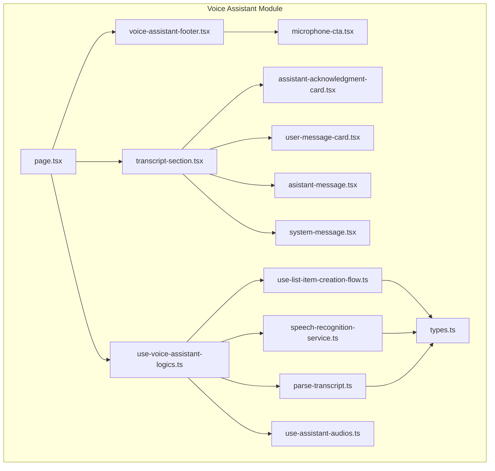
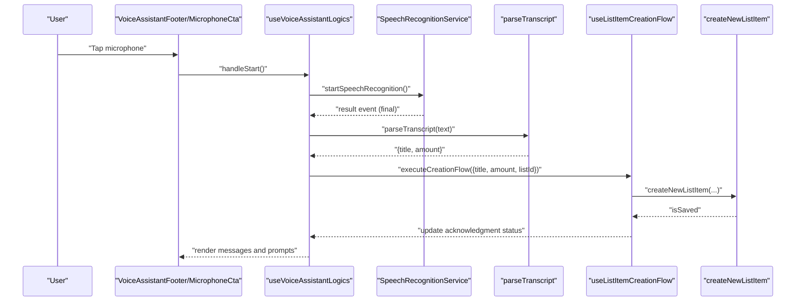
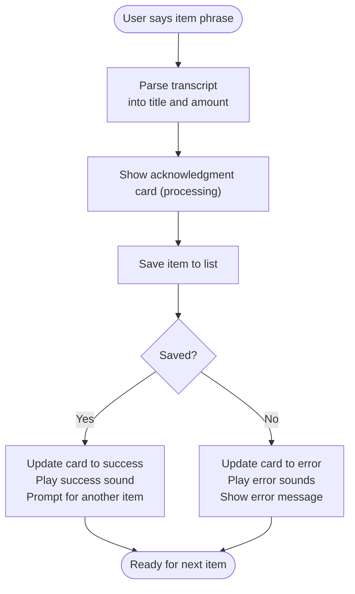
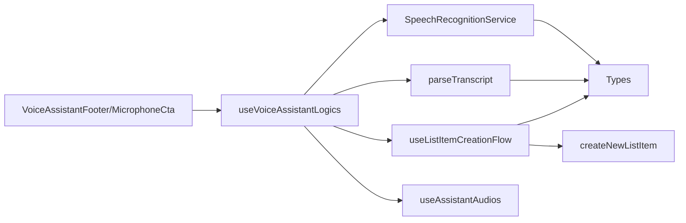

# Voice Command Reference

<cite>
**Referenced Files in This Document**
- [index.ts](file://src/features/voice-assistant/index.ts)
- [page.tsx](file://src/features/voice-assistant/page.tsx)
- [types.ts](file://src/features/voice-assistant/types.ts)
- [speech-recognition-service.ts](file://src/features/voice-assistant/services/speech-recognition-service.ts)
- [parse-transcript.ts](file://src/features/voice-assistant/utils/parse-transcript.ts)
- [use-voice-assistant-logics.ts](file://src/features/voice-assistant/hooks/use-voice-assistant-logics.ts)
- [use-assistant-audios.ts](file://src/features/voice-assistant/hooks/use-assistant-audios.ts)
- [use-list-item-creation-flow.ts](file://src/features/voice-assistant/hooks/use-list-item-creation-flow.ts)
- [voice-assistant-footer.tsx](file://src/features/voice-assistant/components/voice-assistant-footer.tsx)
- [microphone-cta.tsx](file://src/features/voice-assistant/components/microphone-cta.tsx)
- [assistant-acknowledgment-card.tsx](file://src/features/voice-assistant/components/assistant-acknowledgment-card.tsx)
- [transcript-section.tsx](file://src/features/voice-assistant/components/transcript-section.tsx)
- [user-message-card.tsx](file://src/features/voice-assistant/components/user-message-card.tsx)
- [asistant-message.tsx](file://src/features/voice-assistant/components/asistant-message.tsx)
- [system-message.tsx](file://src/features/voice-assistant/components/system-message.tsx)
</cite>

## Table of Contents
1. [Introduction](#introduction)
2. [Project Structure](#project-structure)
3. [Core Components](#core-components)
4. [Architecture Overview](#architecture-overview)
5. [Detailed Component Analysis](#detailed-component-analysis)
6. [Dependency Analysis](#dependency-analysis)
7. [Performance Considerations](#performance-considerations)
8. [Troubleshooting Guide](#troubleshooting-guide)
9. [Conclusion](#conclusion)
10. [Appendices](#appendices)

## Introduction
This document provides a comprehensive voice command reference for the voice assistant integrated into the application. It focuses on supported voice commands for list creation and item management, explains parsing rules for multi-word phrases, and documents interaction patterns including manual and automatic modes. It also covers error handling, pronunciation tips, regional accent considerations, and customization options.

## Project Structure
The voice assistant feature is organized under a dedicated module with clear separation of concerns:
- Page and UI components for the assistant interface
- Hooks orchestrating speech events, audio feedback, and item creation flow
- Services for speech recognition and transcript parsing
- Types defining message and speech event contracts

**Diagram sources**
- [page.tsx:1-60](file://src/features/voice-assistant/page.tsx#L1-L60)
- [voice-assistant-footer.tsx:1-75](file://src/features/voice-assistant/components/voice-assistant-footer.tsx#L1-L75)
- [microphone-cta.tsx:1-97](file://src/features/voice-assistant/components/microphone-cta.tsx#L1-L97)
- [assistant-acknowledgment-card.tsx:1-94](file://src/features/voice-assistant/components/assistant-acknowledgment-card.tsx#L1-L94)
- [transcript-section.tsx:1-21](file://src/features/voice-assistant/components/transcript-section.tsx#L1-L21)
- [user-message-card.tsx:1-12](file://src/features/voice-assistant/components/user-message-card.tsx#L1-L12)
- [asistant-message.tsx:1-19](file://src/features/voice-assistant/components/asistant-message.tsx#L1-L19)
- [system-message.tsx:1-11](file://src/features/voice-assistant/components/system-message.tsx#L1-L11)
- [use-voice-assistant-logics.ts:1-213](file://src/features/voice-assistant/hooks/use-voice-assistant-logics.ts#L1-L213)
- [use-assistant-audios.ts:1-36](file://src/features/voice-assistant/hooks/use-assistant-audios.ts#L1-L36)
- [use-list-item-creation-flow.ts:1-96](file://src/features/voice-assistant/hooks/use-list-item-creation-flow.ts#L1-L96)
- [speech-recognition-service.ts:1-54](file://src/features/voice-assistant/services/speech-recognition-service.ts#L1-L54)
- [parse-transcript.ts:1-225](file://src/features/voice-assistant/utils/parse-transcript.ts#L1-L225)
- [types.ts:1-45](file://src/features/voice-assistant/types.ts#L1-L45)

**Section sources**
- [index.ts:1-6](file://src/features/voice-assistant/index.ts#L1-L6)
- [page.tsx:1-60](file://src/features/voice-assistant/page.tsx#L1-L60)

## Core Components
- Speech recognition service: Initializes and controls speech recognition with language, interim results, and continuous mode. Provides permission requests and error mapping.
- Transcript parser: Extracts item titles and quantities from Portuguese speech, supporting numeric words and digits.
- Voice assistant logics: Orchestrates speech lifecycle, chat messages, audio feedback, and the item creation flow.
- Item creation flow: Manages acknowledgment cards, persistence, and follow-up prompts.
- UI components: Footer with manual/auto mode toggles and microphone CTA; message rendering for user, assistant, and acknowledgment states.

Key capabilities:
- List creation via voice: “Add two eggs” or “Ten rice”
- Multi-word titles: “One loaf of bread”
- Automatic follow-up: After successful addition, assistant prompts for another item.
- Error handling: Toasts and assistant messages for microphone permissions, network, and speech detection issues.

**Section sources**
- [speech-recognition-service.ts:1-54](file://src/features/voice-assistant/services/speech-recognition-service.ts#L1-L54)
- [parse-transcript.ts:194-224](file://src/features/voice-assistant/utils/parse-transcript.ts#L194-L224)
- [use-voice-assistant-logics.ts:69-111](file://src/features/voice-assistant/hooks/use-voice-assistant-logics.ts#L69-L111)
- [use-list-item-creation-flow.ts:27-92](file://src/features/voice-assistant/hooks/use-list-item-creation-flow.ts#L27-L92)
- [voice-assistant-footer.tsx:34-74](file://src/features/voice-assistant/components/voice-assistant-footer.tsx#L34-L74)

## Architecture Overview
The voice assistant follows a reactive flow:
- User activates recording (manual or auto).
- Speech recognition emits interim and final transcripts.
- Final transcript is parsed into a title and amount.
- An acknowledgment card appears while the item is being saved.
- On success, a follow-up prompt is shown; on failure, an error message and notification are presented.

**Diagram sources**
- [use-voice-assistant-logics.ts:78-99](file://src/features/voice-assistant/hooks/use-voice-assistant-logics.ts#L78-L99)
- [speech-recognition-service.ts:24-33](file://src/features/voice-assistant/services/speech-recognition-service.ts#L24-L33)
- [parse-transcript.ts:194-224](file://src/features/voice-assistant/utils/parse-transcript.ts#L194-L224)
- [use-list-item-creation-flow.ts:27-92](file://src/features/voice-assistant/hooks/use-list-item-creation-flow.ts#L27-L92)

## Detailed Component Analysis

### Speech Recognition and Permissions
- Language and options: Defaults to Portuguese (Brazilian) with interim and continuous results enabled.
- Permission handling: Requests microphone access and surfaces user-friendly messages when denied.
- Error mapping: Maps platform-specific errors to localized messages for user guidance.

Best practices:
- Ensure microphone permissions are granted before starting recognition.
- Keep ambient noise low for better accuracy.

**Section sources**
- [speech-recognition-service.ts:4-8](file://src/features/voice-assistant/services/speech-recognition-service.ts#L4-L8)
- [speech-recognition-service.ts:19-22](file://src/features/voice-assistant/services/speech-recognition-service.ts#L19-L22)
- [speech-recognition-service.ts:10-17](file://src/features/voice-assistant/services/speech-recognition-service.ts#L10-L17)
- [use-voice-assistant-logics.ts:113-139](file://src/features/voice-assistant/hooks/use-voice-assistant-logics.ts#L113-L139)

### Transcript Parsing and Quantity Extraction
Parsing rules:
- Supports numeric words (written numbers) and digits.
- Quantity can appear anywhere in the phrase.
- If no quantity is found, defaults to 1.
- Everything else becomes the item title.

Examples of supported forms:
- “Two rice” → amount: 2, title: “rice”
- “10 tomato sauce” → amount: 10, title: “tomato sauce”
- “Bread one” → amount: 1, title: “bread”
- “Twenty-one bread roll” → amount: 21, title: “bread roll”
- “Eggs” → amount: 1, title: “eggs”

Multi-word titles:
- “One loaf of bread” is parsed as amount: 1, title: “loaf of bread”.

Regional accent considerations:
- The parser supports common Brazilian Portuguese numeric words and connectors (“and” is handled implicitly by the grammar).
- For best results, speak clearly and at a moderate pace.

Validation and edge cases:
- Empty input defaults to amount: 1 and empty title.
- Digits are recognized even if mixed with numeric words.

**Section sources**
- [parse-transcript.ts:194-224](file://src/features/voice-assistant/utils/parse-transcript.ts#L194-L224)
- [parse-transcript.ts:100-176](file://src/features/voice-assistant/utils/parse-transcript.ts#L100-L176)

### Interaction Modes: Manual vs Automatic
- Manual mode: User taps the microphone to start and stop recording.
- Automatic mode: After each successful recognition, the system restarts recording automatically after a short delay.

User guidance:
- First item: “Touch the microphone or activate automatic mode!”
- Subsequent items: “Touch the microphone to continue speaking!”

Automatic mode behavior:
- On activation, the system waits briefly before restarting to avoid overlapping audio.

**Section sources**
- [voice-assistant-footer.tsx:15-32](file://src/features/voice-assistant/components/voice-assistant-footer.tsx#L15-L32)
- [use-voice-assistant-logics.ts:174-193](file://src/features/voice-assistant/hooks/use-voice-assistant-logics.ts#L174-L193)

### Item Creation Flow and Feedback
Flow stages:
1. User speaks an item phrase.
2. Assistant acknowledges with an acknowledgment card showing processing state.
3. System attempts to save the item.
4. On success: update acknowledgment to success, play success sound, and prompt for another item.
5. On failure: update acknowledgment to error, play error sounds, and show an error message.

**Diagram sources**
- [use-list-item-creation-flow.ts:27-92](file://src/features/voice-assistant/hooks/use-list-item-creation-flow.ts#L27-L92)
- [assistant-acknowledgment-card.tsx:23-93](file://src/features/voice-assistant/components/assistant-acknowledgment-card.tsx#L23-L93)

**Section sources**
- [use-list-item-creation-flow.ts:27-92](file://src/features/voice-assistant/hooks/use-list-item-creation-flow.ts#L27-L92)
- [assistant-acknowledgment-card.tsx:23-93](file://src/features/voice-assistant/components/assistant-acknowledgment-card.tsx#L23-L93)

### Message Rendering and User Guidance
- Assistant messages: Initial greeting and follow-up prompts.
- User messages: Echo of the recognized transcript.
- System messages: Error notifications for critical issues.
- Acknowledgment cards: Visual feedback with animated icons indicating processing, success, or error.

**Section sources**
- [use-voice-assistant-logics.ts:56-67](file://src/features/voice-assistant/hooks/use-voice-assistant-logics.ts#L56-L67)
- [transcript-section.tsx:10-20](file://src/features/voice-assistant/components/transcript-section.tsx#L10-L20)
- [asistant-message.tsx:6-18](file://src/features/voice-assistant/components/asistant-message.tsx#L6-L18)
- [user-message-card.tsx:5-11](file://src/features/voice-assistant/components/user-message-card.tsx#L5-L11)
- [system-message.tsx:4-10](file://src/features/voice-assistant/components/system-message.tsx#L4-L10)

## Dependency Analysis
The voice assistant integrates several modules:
- UI components depend on message types and rendering logic.
- Logics depend on speech recognition service, audio queue, and item creation flow.
- Item creation flow depends on data actions and audio players.

**Diagram sources**
- [use-voice-assistant-logics.ts:12-17](file://src/features/voice-assistant/hooks/use-voice-assistant-logics.ts#L12-L17)
- [speech-recognition-service.ts:1-2](file://src/features/voice-assistant/services/speech-recognition-service.ts#L1-L2)
- [parse-transcript.ts:1-1](file://src/features/voice-assistant/utils/parse-transcript.ts#L1-L1)
- [use-list-item-creation-flow.ts:1-6](file://src/features/voice-assistant/hooks/use-list-item-creation-flow.ts#L1-L6)
- [use-assistant-audios.ts:1-1](file://src/features/voice-assistant/hooks/use-assistant-audios.ts#L1-L1)
- [types.ts:1-45](file://src/features/voice-assistant/types.ts#L1-L45)

**Section sources**
- [use-voice-assistant-logics.ts:12-17](file://src/features/voice-assistant/hooks/use-voice-assistant-logics.ts#L12-L17)
- [use-list-item-creation-flow.ts:1-6](file://src/features/voice-assistant/hooks/use-list-item-creation-flow.ts#L1-L6)

## Performance Considerations
- Continuous recognition with interim results improves responsiveness but may increase CPU usage. Disable interim results if performance is constrained.
- Automatic mode introduces a short delay to prevent overlapping audio; tune the delay if needed.
- Audio queues and animations are lightweight; keep media assets small to reduce latency.

## Troubleshooting Guide
Common issues and resolutions:
- Microphone permission denied: Request permission again; the system displays a warning and prevents starting recognition.
- No speech detected: Speak louder or closer to the device; ensure ambient noise is minimal.
- Network error during recognition: Retry after reconnecting to the internet.
- Transcripts not recognized: Re-record with clearer pronunciation; avoid slang or very fast speech.

Error surfaces:
- Toast notifications with localized messages for speech recognition failures.
- Assistant messages guiding the user to retry or adjust settings.

**Section sources**
- [speech-recognition-service.ts:40-53](file://src/features/voice-assistant/services/speech-recognition-service.ts#L40-L53)
- [use-voice-assistant-logics.ts:101-111](file://src/features/voice-assistant/hooks/use-voice-assistant-logics.ts#L101-L111)

## Conclusion
The voice assistant enables hands-free list creation and item management through clear, natural-language commands. By leveraging numeric word parsing and dual interaction modes, it offers flexibility and reliability. Following the guidance in this document will help users achieve optimal voice interaction outcomes.

## Appendices

### Voice Command Categories and Examples
- List creation
  - “Add two eggs”
  - “Ten rice”
  - “One loaf of bread”
  - “Twenty-one bread roll”
  - “Eggs”
- Quantity variations
  - Numeric words: “dois”, “vinte e um”, “cem”
  - Digits: “2”, “21”, “100”
- Multi-word titles
  - “One loaf of bread”
  - “Tomato sauce”
- Interaction prompts
  - “Touch the microphone or activate automatic mode!”
  - “Touch the microphone to continue speaking!”

Pronunciation tips:
- Speak slowly and clearly.
- Emphasize the quantity first for better parsing.
- Use standard Brazilian Portuguese vocabulary.

Command chaining:
- Automatic mode allows continuous recording after each successful item addition.
- Manual mode requires tapping the microphone to start each new command.

Customization options:
- Language: Change default language in speech recognition options.
- Interim results: Toggle for responsiveness vs battery usage.
- Audio feedback: Replace audio assets in the audio player hooks.

**Section sources**
- [speech-recognition-service.ts:4-8](file://src/features/voice-assistant/services/speech-recognition-service.ts#L4-L8)
- [parse-transcript.ts:194-224](file://src/features/voice-assistant/utils/parse-transcript.ts#L194-L224)
- [voice-assistant-footer.tsx:24-31](file://src/features/voice-assistant/components/voice-assistant-footer.tsx#L24-L31)
- [use-voice-assistant-logics.ts:174-193](file://src/features/voice-assistant/hooks/use-voice-assistant-logics.ts#L174-L193)